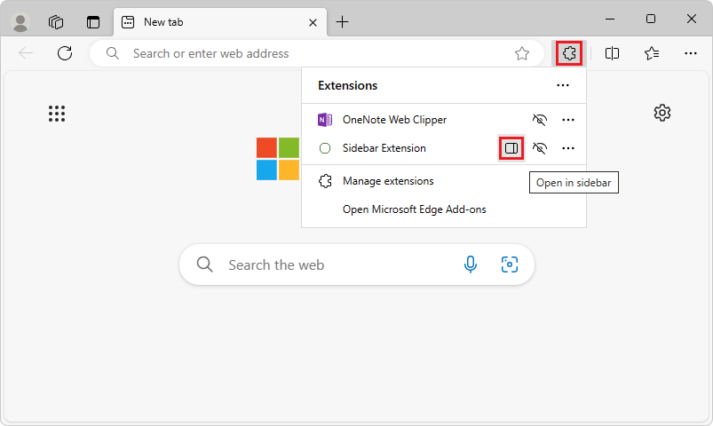

# Add an extension to the sidebar

The Microsoft Edge Add-ons API provides an API to enable your extension as sidebar extension. You can use this API to convert your extension to sidebar and your extension will have the access to Microsoft Edge Sidebar. You can use this *Sidebar* API by giving permissions in your `manifest.json` file.

With Sidebar API feature for extensions, developers can enhance the browsing experience by enabling users to view additional information alongside the main content of a webpage.

The sidebar refers to a persistent column located on the side of the browser, which coexists with the primary content. By enabling side-by-side browsing, users can reduce the need to constantly switch between tabs, resulting in a more productive browsing experience.


<!-- ------------------------------ -->
#### Availability

* It is available for the Edge 115 versions or later.
* Extensions in Manifest V3 (MV3) can access the API.


<!-- ------------------------------ -->
#### Terminology

| Term | Definition |
|---|---|
| Sidebar API | Name of feature that can be utilised by the extension developer in their extensions. |
| `sidepanel` | Name of the API and permission to enable any extension as a Sidebar extension, as derived from Chromium. |


<!-- ====================================================================== -->
## Features of Sidebar API

* The sidebar has access to all the Microsoft Edge Extension APIs.
* The sidebar remains open while navigating between tabs.
* The sidebar is available on specific sites.

Use this article to enable the sidebar for your new or existing extension.

For complete details of how to create an extension, see:
* [Create an extension tutorial, part 1](../getting-started/part1-simple-extension.md)
* [Create an extension tutorial, part 2](../getting-started/part2-content-scripts.md)


<!-- ====================================================================== -->
## Origin

As with other extension resources, the sidebar page commits to a trusted extension context on its origin (`extension://<id>`).  The sidebar has the same API access as other trusted extension contexts.

All the existing extensions APIs are available for sidebar extensions, so you can leverage all current capabilities of the extensibility framework in your sidebar-enabled extension.

To add a sidebar to your extension, follow the steps below.


<!-- ====================================================================== -->
## Step 1: Modify the manifest file

Every extension for Microsoft Edge has a JSON-formatted manifest file, named `manifest.json`.  The manifest file is the blueprint of your extension.


<!-- ------------------------------ -->
#### Permissions and supported API

Use the `side_panel` API field to set the side panel option in your extension.  Include the `sidePanel` permission in the extension manifest file:

`manifest.json`:
```json
{
  ...
  "side_panel": {
    "default_path": "sidebar.html"
  },
  "permissions": [
    "sidePanel"
  ]
   ...
}
```


<!-- ====================================================================== -->
## Step 2: Adding functionality to the sidebar


<!-- ------------------------------ -->
#### Example 1: Default sidebar on every site

A sidebar can be set as the default, to show the same extension throughout all the open browser tabs.  Default values persist across browser sessions.

`manifest.json`:

<!-- todo: GLOBAL: side panel, or sidebar?  if "side panel", need to introduce and define term 'side panel' at top of article contrasted with / related with "sidebar" -->

```json
{
  "name": "My sidebar extension",
  ...
  "side_panel": {
    "default_path": "sidebar.html"
  }
  ...
}
```

`sidebar.html`:

```html
<!DOCTYPE html>
<html>
  <head>
    <title>My Side Panel</title>
  </head>
  <body>
    <h1>Sidebar extension for all sites</h1>
    <p>This sidebar is enabled on all sites</p>
  </body>
</html>
```


<!-- ------------------------------ -->
#### Example 2: Switching to a different sidebar

Users can switch to a different sidebar when they switch tabs.

The following example sets a welcome sidebar on `runtime.OnInstalled()`, when the user navigates to a different tab, it replaces the welcome page sidebar with the main sidebar.

`service-worker.js`:

```js
const welcomePage = 'sidepanels/welcome-sp.html';
const mainPage = 'sidepanels/main-sp.html';

chrome.runtime.onInstalled.addListener(() => {
  chrome.sidePanel.setOptions({ path: welcomePage });
});

chrome.tabs.onActivated.addListener(async ({ tabId }) => {
  const { path } = await chrome.sidePanel.getOptions({ tabId });
  if (path === welcomePage) {
    chrome.sidePanel.setOptions({ path: mainPage });
  }
});
```


<!-- ------------------------------ -->
#### Example 3: Enabling sidebar on a specific site

An extension can use`sidepanel.setOptions()` to enable a sidebar on a specific site. This can be a particular website a user is using and would want the same extension to open in the sidebar, once this website is opened.

`service-worker.js`:

```js
const BING_ORIGIN = 'https://www.bing.com';

chrome.tabs.onUpdated.addListener(async (tabId, info, tab) => {
  if (!tab.url) return;
  const url = new URL(tab.url);
  // Enables the side panel on bing.com
  if (url.origin === BING_ORIGIN) {
    await chrome.sidePanel.setOptions({
      tabId,
      path: 'sidepanel.html',
      enabled: true
    });
  } else {
    // Disables the side panel on all other sites
    await chrome.sidePanel.setOptions({
      tabId,
      enabled: false
    });
  }
});
```

When a user switches to a tab where the sidebar is not enabled, the sidebar will be hidden.


<!-- ------------------------------ -->
#### Example 4: Enabling the action icon to open the sidebar

By declaring the `action` key in the manifest, you can allow users to open the side panel when they click on the action toolbar icon with `sidePanel.setPanelBehavior()`.

`manifest.json`:

```json
{
  "name": "My sidebar extension",
  ...
   "action": {
    "default_title": "Click to open panel"
  },
  ...
}
```

`service-worker.js`:

```js
const BING_ORIGIN = 'https://www.bing.com';

// Allows users to open the side panel by clicking on the action toolbar icon
chrome.sidePanel
  .setPanelBehavior({ openPanelOnActionClick: true })
  .catch((error) => console.error(error));
...
```


<!-- ====================================================================== -->
## Sidebar user experience


<!-- ------------------------------ -->
#### Sidebar icon next to the extension's name

* The sidebar icon is displayed next to the extension name in the hub in the toolbar:


<!-- todo: put real content in png -->

* On the Microsoft Edge Add-Ons store page, there's a dialog on the extension product page, highlighting the sidebar feature.
<!-- todo: show that "dialog", is it actually a dialog? -->


<!-- ------------------------------ -->
#### Opening a extension in the sidebar

To open an extension in the sidebar, the user can do either of the following:

* Click the sidebar icon in the hub in the toolbar.

* Right-click the extension's shortcut in the toolbar.


<!-- ====================================================================== -->
## Properties for sidebars


<!-- ------------------------------ -->
#### Panel behavior

| Property | Description |
|---|---|
| `openPanelOnActionClick` | Whether clicking the extension's icon toggles showing the extension's entry in the sidebar.  The default value is `false`. |


<!-- ------------------------------ -->
#### Panel options

| Property | Description |
|---|---|
| `tabId` | If specified, the sidebar options only apply to the tab that has this ID.  If not specified, these options set the default behavior enabled.  Whether the sidebar is enabled.  The default value is `true`. |
| `path` | The path to the side panel HTML file to use.  This needs to be a local resource within the extension package. |

<!--todo: row 1 col 2: maybe delete "Whether the sidebar is enabled.  The default value is `true`." -->


<!-- ------------------------------ -->
#### SidePanel
<!-- todo: improve heading -->

| Property | Description |
|---|---|
| `default_path` | The developer-specified path for sidebar display. |


<!-- ====================================================================== -->
## See also

* [Supported APIs for Microsoft Edge extensions](../developer-guide/api-support.md)
* [Declare API permissions in extension manifests](../developer-guide/declare-permissions.md)
* [Manifest file format for extensions](../getting-started/manifest-format.md)
