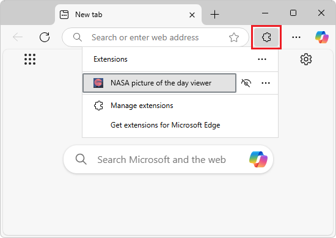

# Sideload an extension to install and test it locally

To test an extension quickly and safely, sideload the extension in your own copy of Microsoft Edge, which means locally installing the extension.  You can then run and test your extension without having to upload the extension to the Microsoft Edge Add-ins website (the _store_) and then install the extension from there.

<!-- ====================================================================== -->
## Locally installing and running an extension

To sideload an extension into Microsoft Edge, so that it's locally installed in your browser for testing:

1. In Microsoft Edge, click the **Extensions** () button, next to the Address bar, if this icon is displayed.  Or, select **Settings and more** (...) > **Extensions**.  The **Extensions** pop-up opens:

   

1. Click **Manage extensions**.  The **Extensions** management page opens in a new tab:

   

1. Turn on the **Developer mode** toggle.

1. When installing your extension for the first time, click the **Load unpacked** () button.  The **Select the extension directory** dialog opens.

1. Select the directory that contains the extension's source files, such as `manifest.json`, and then click the **Select Folder** button.

   Example path for [Sample: Display an image in a pop-up](./part1-simple-extension.md):

   `C:\Users\myUsername\GitHub\MicrosoftEdge-Extensions\Extension samples\extension-getting-started-part1\part1\`

   Example path for [Sample: Insert an image in the webpage](./part2-content-scripts.md):

   `C:\Users\myUsername\GitHub\MicrosoftEdge-Extensions\Extension samples\extension-getting-started-part2\extension-getting-started-part2\`

   The extension is installed in your browser, similar to extensions that are installed from the store:

   

1. To run the extension, first open a webpage, if the extension requires that a webpage is open.  For example, go to a webpage, such as [Microsoft.com](https://www.microsoft.com), in a new window or tab.

1. In the upper right of Microsoft Edge, click the **Extensions** () button.  Or, select **Settings and more** (...) > **Extensions**.

   The **Extensions** pop-up opens:

   

1. Click the extension's icon or name.  The extension opens, and the extension's icon is added next to the Address bar and Extensions () icon:

   

<!-- ====================================================================== -->
## Locally updating an extension

To update an extension that's been installed locally (sideloaded) in your browser:

1. Make any required changes to the extension.

1. Go to `edge://extensions`.

1. Click the **Reload** button for the sideloaded extension.  The updated extension is reloaded.

<!-- ====================================================================== -->
## Locally removing an extension

To remove an extension that's been installed locally (sideloaded) in your browser:

1. Go to `edge://extensions`.

1. On the extension, click **Remove**.

<!-- ====================================================================== -->
## See also
<!-- all links in article -->

* [Sample: Display an image in a pop-up](./part1-simple-extension.md)
* [Sample: Insert an image in the webpage](./part2-content-scripts.md)
