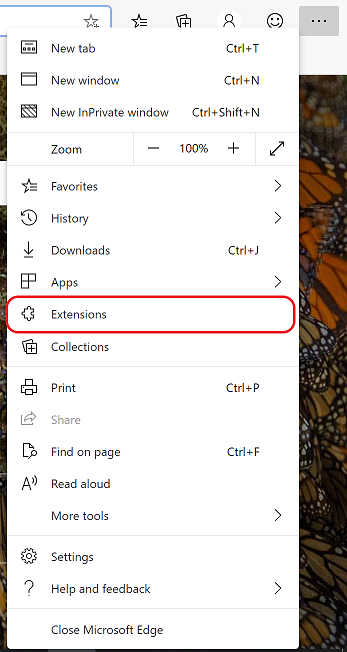
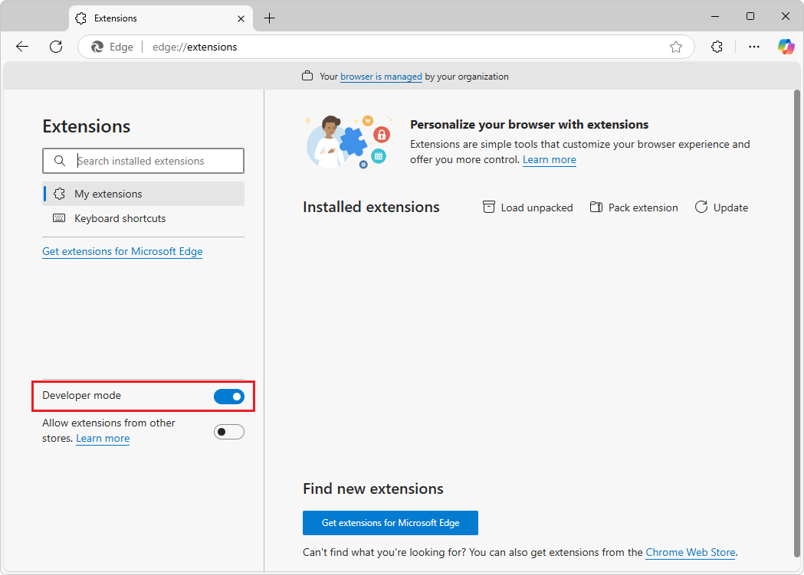
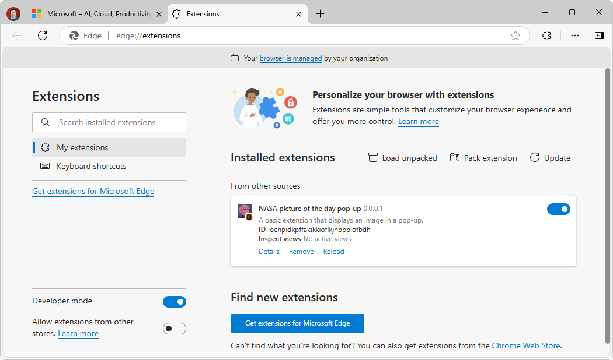

# Sideload an extension

During development, you can use Microsoft Edge browser to run and debug your extension safely.  By sideloading your extension locally in your browser, you can run and test your extension without changing any settings. This helps you test new extensions safely.

To sideload an extension into Microsoft Edge:

1. In Microsoft Edge, select **Settings and more** (...) > **Extensions**.

   

   The **Extensions** pop-up box opens.

1. Click **Manage extensions**.  The **Extensions** page (`edge://extensions`) opens in a new tab.

1. Turn on the **Developer mode** toggle:

   

1. When installing your extension for the first time, click the **Load unpacked** button.  The **Select the extension directory** dialog opens.

1. Select the directory that contains your extension source files, and then click the **Select Folder** button.  Your extension is installed in your browser, similar to extensions that are installed from the store:

   

<!-- ====================================================================== -->
## Updating an extension

To update a sideloaded extension:

1. Make any required changes to the extension.

1. Go to `edge://extensions`.

1. Click the **Reload** button for the sideloaded extension.  The updated extension is reloaded.

<!-- ====================================================================== -->
## Removing an extension

To remove the extension from your browser:

1. Go to `edge://extensions`.

1. On the extension, click **Remove**.
