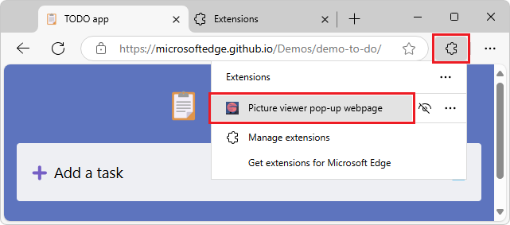

# Sideload an extension to install and test it locally

To test an extension quickly and safely, sideload the extension in your own copy of Microsoft Edge, which means locally installing the extension.  You can then run and test your extension without changing any settings.<!-- todo: what sort of settings are meant?  what is the contrasted approach? -->

<!-- ====================================================================== -->
## Locally installing and running an extension

To sideload an extension into Microsoft Edge, so that it's locally installed in your browser for testing:

1. In the upper right of Microsoft Edge, click the **Extensions** () button.  Or, select **Settings and more** (...) > **Extensions**:

   

   The **Extensions** pop-up opens.

1. Click **Manage extensions**.  The **Extensions** page (`edge://extensions`) opens in a new tab.

1. Turn on the **Developer mode** toggle:

   

1. When installing your extension for the first time, click the **Load unpacked** button.  The **Select the extension directory** dialog opens.

1. Select the directory that contains your extension source files, and then click the **Select Folder** button.  For example, select the directory for the "NASA picture of the day viewer" demo from [Create an extension tutorial, part 1](./part1-simple-extension.md).

   Your extension is installed in your browser, similar to extensions that are installed from the store:

   

1. To run the extension, in the upper right of Microsoft Edge, click the **Extensions** () button.  Or, select **Settings and more** (...) > **Extensions**.

   The **Extensions** pop-up opens:

   

1. Select the extension.  The extension opens:

   

<!-- ====================================================================== -->
## Locally updating an extension

To update an extension that's been installed locally (sideloaded) in your browser:

1. Make any required changes to the extension.

1. Go to `edge://extensions`.

1. Click the **Reload** button for the sideloaded extension.  The updated extension is reloaded.

<!-- ====================================================================== -->
## Locally removing an extension

To remove an extension that's been installed locally (sideloaded) in your browser:

1. Go to `edge://extensions`.

1. On the extension, click **Remove**.

<!-- ====================================================================== -->
## See also
<!-- all links in article -->

* [Create an extension tutorial, part 1](./part1-simple-extension.md)
