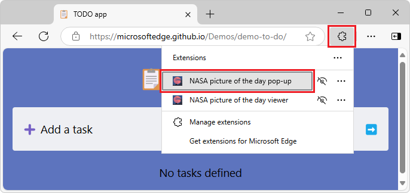

# Tutorial part 1: Create a simple extension

In this tutorial, you create a simple static extension, without JavaScript, that displays the `stars.jpeg` image in a small webpage in a pop-up in any Microsoft Edge tab:


You create this simple extension by doing the following:
1. Create a manifest.json file.
1. Add icons for launching the extension.
1. Open a default pop-up dialog.
1. Install and test the extension.

If you want to immediately install and run the completed extension that you will build in this tutorial, or view its finished code, either:
* Clone the [MicrosoftEdge-Extensions](https://github.com/microsoft/MicrosoftEdge-Extensions) repo to your local drive.  Use the directory `/extension-getting-started-part1/`.
* Download the source code from the [/part1/](https://github.com/microsoft/MicrosoftEdge-Extensions/tree/main/Extension%20samples/extension-getting-started-part1/part1) folder of the MicrosoftEdge-Extensions repo.

Then you can install and run the finished extension that's in the repo, per [Sideload an extension to install and test it locally](extension-sideloading.md).


<!-- ====================================================================== -->
## Step 1: Create a manifest.json file

Every extension package must have a `manifest.json` file at the root.  The manifest provides details of your extension, the extension package version, the extension name and description, and so on.

All the coding steps in this tutorial have already been done in the Part 1 demo in the [MicrosoftEdge-Extensions](https://github.com/microsoft/MicrosoftEdge-Extensions) repo.  We recommending first cloning the repo and installing and running the Part 1 demo, before (or instead of) starting with an empty directory and then manually creating directories, creating files, and pasting code into the files.

This step has already been done in [manifest.json](https://github.com/microsoft/MicrosoftEdge-Extensions/blob/main/Extension%20samples/extension-getting-started-part1/part1/manifest.json) in the MicrosoftEdge-Extensions repo.  If you want to manually create the Part 1 extension by starting with an empty directory:

*   In a directory on your machine, using an editor, such as Visual Studio Code, create a `manifest.json` file that contains the following lines:

    ```json
    {
        "name": "NASA picture of the day pop-up",
        "version": "0.0.0.1",
        "manifest_version": 3,
        "description": "A basic extension that displays an image in a pop-up.",
    }
    ```


<!-- ====================================================================== -->
## Step 2: Add icons for launching the extension

This step has already been done in the Part 1 demo in the [MicrosoftEdge-Extensions](https://github.com/microsoft/MicrosoftEdge-Extensions) repo.  If you want to manually create the Part 1 extension, continue with the following steps.

1.  Create an `icons` directory in your project, in the same directory as the manifest file, to store the icon image files.  The icons are used as the background image for the button that the user clicks to launch the extension:

    

    For icons:
    *   We recommend using `PNG` format, but you can also use `BMP`, `GIF`, `ICO` or `JPEG` formats.
    *   We recommend using images that are 128 x 128 px, which are resized by the browser if necessary.
    
1.  Make sure the directories of your project are similar to the following structure:

    ```shell
    └── part1
        ├── manifest.json
        └── icons
            ├── nasapod16x16.png
            ├── nasapod32x32.png
            ├── nasapod48x48.png
            └── nasapod128x128.png
    ```
    
1.  Obtain the `.png` files from the repo:
    * `nasapod16x16.png`
    * `nasapod32x32.png`
    * `nasapod48x48.png`
    * `nasapod128x128.png`

    For example, individually download the files from the [/icons/](https://github.com/microsoft/MicrosoftEdge-Extensions/tree/main/Extension%20samples/extension-getting-started-part1/part1/icons) folder of the MicrosoftEdge-Extensions repo and place them in your `/icons/` directory.

1.  List the icons in the `manifest.json` file, as follows:

    ```json
    {
        "name": "NASA picture of the day pop-up",
        "version": "0.0.0.1",
        "manifest_version": 3,
        "description": "A basic extension that displays an image in a pop-up.",
        "icons": {
            "16": "icons/nasapod16x16.png",
            "32": "icons/nasapod32x32.png",
            "48": "icons/nasapod48x48.png",
            "128": "icons/nasapod128x128.png"
        }
    }
    ```
    

<!-- ====================================================================== -->
## Step 3: Open a default pop-up dialog

This step has already been done in [popup.html](https://github.com/microsoft/MicrosoftEdge-Extensions/blob/main/Extension%20samples/extension-getting-started-part1/part1/popup/popup.html) in the MicrosoftEdge-Extensions repo.  If you want to manually create the Part 1 extension, continue with the following steps.

Create a `HTML` file to run when the user launches your extension.  When the user clicks the icon to launch the extension, this file will be displayed as a modal dialog.

1.  Create the HTML file named `popup.html` in a directory named `popup`.  

1.  Add the following code to `popup.html`, to display the stars image:

    ```html
    <html lang="en">
        <head>
            <meta charset="UTF-8" />
            <title>NASA picture of the day</title>
        </head>
        <body>
            <div>
                
            </div>
        </body>
    </html>
    ```
    
1.  Add the file `stars.jpeg` in the `images` folder.  For example, download [stars.jpeg](https://github.com/microsoft/MicrosoftEdge-Extensions/blob/main/Extension%20samples/extension-getting-started-part1/part1/images/stars.jpeg) from the MicrosoftEdge-Extensions repo.

1.  Make sure the directories of your project are similar to the following structure:

    ```shell
    └── part1
        ├── manifest.json
        ├── icons
        │   ├── nasapod16x16.png
        │   ├── nasapod32x32.png
        │   ├── nasapod48x48.png
        │   └── nasapod128x128.png
        ├── images
        │   └── stars.jpeg
        └── popup
            └── popup.html
    ```
    
1.  Register the pop-up in `manifest.json` under `action`, as follows:

    ```json
    {
        "name": "NASA picture of the day pop-up",
        "version": "0.0.0.1",
        "manifest_version": 3,
        "description": "A basic extension that displays an image in a pop-up.",
        "icons": {
            "16": "icons/nasapod16x16.png",
            "32": "icons/nasapod32x32.png",
            "48": "icons/nasapod48x48.png",
            "128": "icons/nasapod128x128.png"
        },
        "action": {
            "default_popup": "popup/popup.html"
        }
    }
    ```
    
That's everything you need to develop a simple extension.  


<!-- ====================================================================== -->
## Step 4: Install and test the extension

Install and run the extension; see [Sideload an extension to install and test it locally](extension-sideloading.md).  The extension displays `popup.html`, containing `stars.jpeg`, in a pop-up:


You can open this Part 1 demo extension in any tab, including an empty tab or the Manage Extensions tab.

After running and testing the extension, you can continue on to [Tutorial part 2: Add JavaScript to the extension](./part2-content-scripts.md).


<!-- ====================================================================== -->
## See also
<!-- all links in article -->

* [Sideload an extension to install and test it locally](extension-sideloading.md)
* [Tutorial part 2: Add JavaScript to the extension](./part2-content-scripts.md)

GitHub:
* [MicrosoftEdge-Extensions](https://github.com/microsoft/MicrosoftEdge-Extensions) repo.
   * [/part1/](https://github.com/microsoft/MicrosoftEdge-Extensions/tree/main/Extension%20samples/extension-getting-started-part1/part1) - source code of the Part 1 sample.
