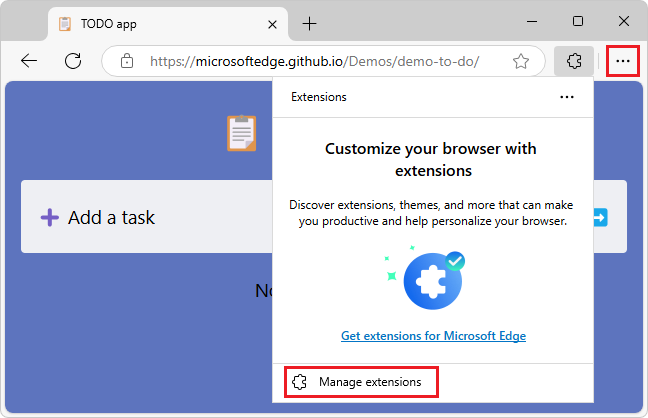

# Sample: Display an image in a pop-up

This sample is a simple static extension, without JavaScript, that displays the `stars.jpeg` image in a small webpage in a pop-up in any Microsoft Edge tab:


<!-- ====================================================================== -->
## Clone the MicrosoftEdge-Extensions repo

You can use various tools to clone a GitHub repo.  You can download a selected directory, or clone the entire repo.  These instructions use GitHub Desktop to clone the repo and switch to a working branch.

To clone the `MicrosoftEdge-Extensions` repo to your local drive:

1. If not done already, install GitHub desktop: go to [https://github.com/apps/desktop](https://github.com/apps/desktop), and then click the **Download now** button.

1. Go to [MicrosoftEdge-Extensions](https://github.com/microsoft/MicrosoftEdge-Extensions).

1. Click the **Code** button, and then select **Open with GitHub Desktop**.

   A dialog opens, saying **This site is trying to open GitHubDesktop.exe.**

1. Click the **Open** button.

   GitHub Desktop opens, with the **MicrosoftEdge-Extensions** repo selected in the upper left dropdown list.

1. In GitHub Desktop, click the **Branch** menu, and then click **New branch**.

   The **Create a branch** dialog opens.

1. In the **Name** text box, enter a branch name, such as **ext-sample-1**, and then click the **Create branch** button.

   In the upper middle and lower left of GitHub Desktop, the current branch is shown, such as **ext-sample-1**.

You are now free to modify the code in your working branch, without altering the code that's in the "main" branch of the repo.

<!-- See also: -->
<!-- * [Step 2: Create a branch](https://docs.github.com/en/get-started/start-your-journey/hello-world#step-2-create-a-branch) in _Hello World_. -->


<!-- ====================================================================== -->
## Install the sample locally

Instead of installing the sample from the Store, you'll install the sample locally, so that you can possibly modify it and quickly test the changes.  Installing locally is sometimes called _sideloading_ an extension.

1. In Microsoft Edge, click the **Extensions** () button, next to the Address bar, if this icon is displayed.  Or, select **Settings and more** (...) > **Extensions**.  The **Extensions** pop-up opens:

   

1. Click **Manage extensions**.  The **Extensions** management page opens in a new tab:

   

1. Turn on the **Developer mode** toggle.

1. When installing your extension for the first time, click the **Load unpacked** () button.  The **Select the extension directory** dialog opens.

1. Select the directory that contains the extension's source files, such as `manifest.json`, and then click the **Select Folder** button.

   Example path:

   `C:\Users\myUsername\GitHub\MicrosoftEdge-Extensions\Extension samples\extension-getting-started-part1\part1\`

   The extension is installed in the browser, similar to an extension that's installed from the store:

   


<!-- ====================================================================== -->
## Run the sample

1. In the upper right of Microsoft Edge, click the **Extensions** () button.  Or, select **Settings and more** (...) > **Extensions**.

   The **Extensions** pop-up opens:

   

1. Click the extension's icon or name (**NASA picture of the day pop-up**).

   The extension opens, and the extension's icon is added next to the Address bar and Extensions () icon.  The extension displays `popup.html`, containing `stars.jpeg`, in a pop-up:

   

   You can open this particular sample extension in any tab, including an empty tab or the **Manage Extensions** tab.

See also:
* [Sideload an extension to install and test it locally](./extension-sideloading.md)

In the following sections, you study the sample.  After that, to develop your own Microsoft Edge extension, you can copy and modify the sample's directory, and install and test the resulting extension.


<!-- ====================================================================== -->
## Files and directories

The sample has the following directory structure:

Example path for the sample:
`C:\Users\myAlias\GitHub\MicrosoftEdge-Extensions\Extension samples\extension-getting-started-part1\part1\`

Directories and files:

```shell
/icons/
   nasapod16x16.png
   nasapod32x32.png
   nasapod48x48.png
   nasapod128x128.png
/images/
   stars.jpeg
/popup/
   popup.html
manifest.json
```

* The `/icons/` directory contains versions of a `.png` file that's used to represent the extension near the browser's Address bar.
* The `/images/` directory contains `stars.jpeg`, which is displayed in the extension's pop-up.
* The `/popup/` directory contains `popup.html`, which defines the webpage content that's displayed in the extension's pop-up.
* `manifest.json` contains basic information about the extension.


<!-- ====================================================================== -->
## The manifest file (`manifest.json`)

Every extension package must have a `manifest.json` file at the root.  The manifest provides details of your extension, the extension package version, and the extension name and description.

`manifest.json` contains the following lines:

```json
{
  "name": "NASA picture of the day pop-up",
  "version": "0.0.0.1",
  "manifest_version": 3,
  "description": "A basic extension that displays an image in a pop-up.",
  "icons": {
      "16": "icons/nasapod16x16.png",
      "32": "icons/nasapod32x32.png",
      "48": "icons/nasapod48x48.png",
      "128": "icons/nasapod128x128.png"
  },
  "action": {
      "default_popup": "popup/popup.html"
  }
}
```


<!-- ====================================================================== -->
## Icons for launching the extension

The `/icons/` directory is in the same directory as the manifest file, to store the icon image files.  The icons are used as the background image for the button that you click to launch the extension:


Recommendations for icons:
* Use `PNG` format, but you can also use `BMP`, `GIF`, `ICO` or `JPEG` formats.
* If you provide a single icon file, use 128 x 128 px, which can be resized by the browser if necessary.


<!-- ====================================================================== -->
## The default pop-up dialog (`popup.html`)

`popup.html` in the `popup` directory runs when you launch the extension.  When you click the icon to launch the extension, this file is displayed as a modal dialog.

`popup.html` contains the following code, to display a title and the stars image:

```html
<html lang="en">
    <head>
        <meta charset="UTF-8" />
        <title>NASA picture of the day</title>
    </head>
    <body>
        <div>
            
        </div>
    </body>
</html>
```

The popup (`popup.html`) is registered as the default popup in `manifest.json` under `action`:

```json
{
    ...
    "action": {
        "default_popup": "popup/popup.html"
    }
}
```


<!-- ====================================================================== -->
## Next steps

To develop your own Microsoft Edge extension, you can copy and modify the sample's directory, and install and test the resulting extension.

After running and testing the extension, you can continue on to [Sample: Insert an image in the webpage](./part2-content-scripts.md).


<!-- ====================================================================== -->
## See also
<!-- all links in article -->

* [Sideload an extension to install and test it locally](./extension-sideloading.md)
* [Sample: Insert an image in the webpage](./part2-content-scripts.md)

GitHub:
* [MicrosoftEdge-Extensions](https://github.com/microsoft/MicrosoftEdge-Extensions) repo.
   * [/part1/](https://github.com/microsoft/MicrosoftEdge-Extensions/tree/main/Extension%20samples/extension-getting-started-part1/part1) - source code of the Part 1 sample.
