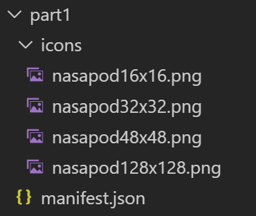

# Build A Simple Extension That Pops Up NASA Picture Of The Day  

[Completed Extension Package Source for This Part](extension-source/extension-getting-started-part1.zip)  

## Overview  

In part 1, the goal is to build a very simple Edge Chromium Extension starting with an empty directory.  The goal for this Extension is to do the following:  

*   Create icons for the Extension that are able to be used in multiple places and in different sizes  
*   Create a simple `manifest.json` file  
*   Display a launch icon that when clicked displays a popup window containing the NASA picture of the day  

## The manifest file basics  

Every Extension package must have a `manifest.json` file at the root.  You should think of this as the blueprint for the Extension.  It tells the browser engine what version of the Extension API the Extension expects, the name and description of the Extension, and lots of other details, many of which are discussed in this multi-part Extension Getting Started Guide.  

Below is the simple  `manifest.json`  

```json
{
    "name": "NASA Picture of the day viewer",
    "version": "0.0.0.1",
    "manifest_version": 2,
    "description": "A Chromium Extension to show the NASA Picture of the Day."
}
```  

## Extension icons setup  

Next thing is to add some icons to `manifest.json` file \(and create a new `/icons` directory with the icons files\).  These icons are used for the background image of the button the user clicks to launch the extension \(if there is one\), and other places that are appropriate.  

`PNG` is the recommended format, but you may also use `BMP`, `GIF`, `ICO` and `JPEG`.  It is recommended to always have at least a 128x128 pixels size icon and the browser automatically resizes it as necessary.  

Your directory structure should look like this.  

  

<!--  
```
.
│   _manifest.json  
│
└───icons
│   │   nasapod16x16.png
│   │   nasapod32x32.png  
│   │   nasapod48x48.png  
│   │   nasapod128x128.png  
```  -->  

and your updated `manifest.json` file is as follows.  

```json
{
    "name": "NASA Picture of the day viewer",
    "version": "0.0.0.1",
    "manifest_version": 2,
    "description": "A chromium extension to show the NASA Picture of the Day.",
    "icons": {
        "16": "icons/nasapod16x16.png",
        "32": "icons/nasapod32x32.png",
        "48": "icons/nasapod48x48.png",
        "128": "icons/nasapod128x128.png"
    }
}
```  

> [!NOTE]
> The icon `png` files listed above are available in the zip download mentioned at the top of this page.  

## Adding a default pop-up dialog  

Now, create an `HTML` file that is automatically run when the user clicks on the extension icon as shown here.  

  

The HTML file is named `popup/popup.html`.  Clicking on the Extension icon launches `popup/popup.html` as modal dialog that stays up until you click outside the dialog.  

For this, register the file as a default pop-up in the `manifest.json` under `browser_action` as follows.  

```json
{
    "name": "NASA Picture of the day viewer",
    "version": "0.0.0.1",
    "manifest_version": 2,
    "description": "A chromium Extension to show the NASA Picture of the Day.",
    "icons": {
        "16": "icons/nasapod16x16.png",
        "32": "icons/nasapod32x32.png",
        "48": "icons/nasapod48x48.png",
        "128": "icons/nasapod128x128.png"
    },
    "browser_action": {
        "default_popup": "popup/popup.html"
    }
}
```  

In the `popup` directory , let us add the file `popup.html` and let us have it render the stars image.  Here is the `popup.html` file.  

```html
<html lang="en">
    <head>
        <meta charset="UTF-8" />
        <title>NASA Picture of the Day</title>
    </head>
    <body>
        <div>
            
        </div>
    </body>
</html>
```  

 Also, add an image file `images/stars.jpeg` that is referenced in the `popup.html` file.  

The directory structure for the example Extension is this.  

  

<!--  
```
.
│   _manifest.json  
│
└───icons
│   │   nasapod16x16.png
│   │   nasapod32x32.png  
│   │   nasapod48x48.png  
│   │   nasapod128x128.png    
│   
└───popup
|   │   popup.html
|     
└───images
    │   stars.jpeg 
```  -->  

> [!NOTE]
> The `images/stars.jpeg` file listed above is available in the zip download mentioned at the top of this page.  

That is everything you need to build a working Extension.  All that is left to is test it.  

The next section explains how to load the Extension \(sometimes called side loading\) into the Microsoft Edge \(Chromium\) browser to test it.  

## Run your Extension locally in your browser while developing it \(side-loading\)  

The Microsoft Edge \(Chromium\) browser provides a safe and simple way for you to run as well as debug your Extensions while you are developing them.  

The process is quite simple.  All you need to do is click on the three dots at the top of your browser.  Next, choose `Extensions` from the context menu as shown below.  

  

When you are on the **Extensions** page as shown below, enable the **Developer mode** by enabling the toggle at the bottom left of the page as shown below.  

  

## Installing and updating side-loaded Extensions  

The first time you want to install your Extension, you choose the `Load Unpacked` option as shown below.  This prompts you for a directory where you have your Extension assets file by file.  This installs the Extension as if you had downloaded it from a store.  

  

After you install your Extension, you may update it by clicking on the `Reload` button under your Extension listing.  

To remove the Extension from your browser, click on the `Remove` button on the bottom of the Extension listing.  

## Debugging Extensions  

Debugging Extensions is quite easy and supports all of the features in Edge Chromium DevTools.  Those details however are not covered in this getting started guide but are very important to successfully build Extensions.  

<!-- image links -->  

<!-- links -->  
