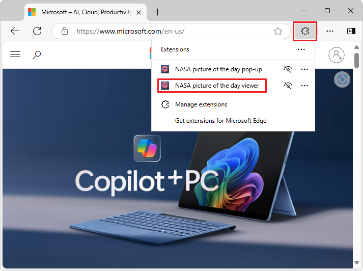
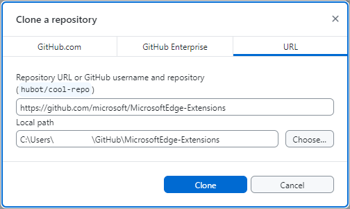
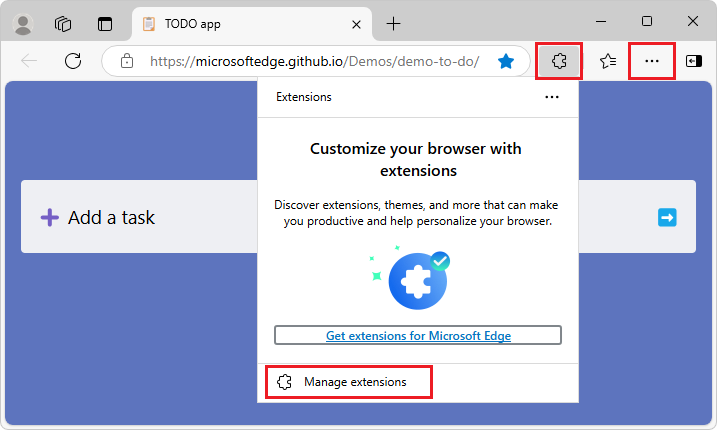
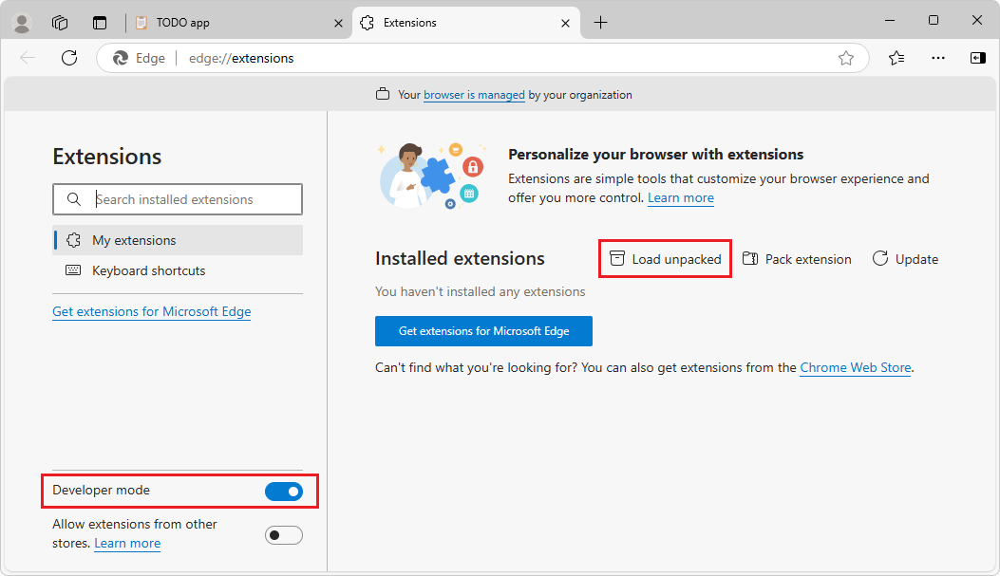
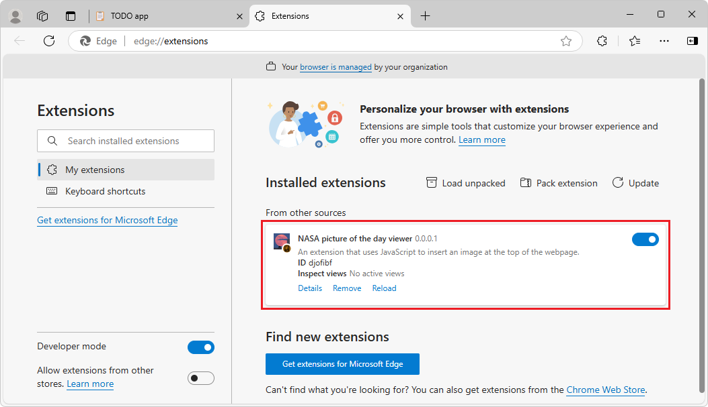

# Sample: Insert an image in the webpage

This sample uses JavaScript code to insert the `stars.jpeg` image at the top of the current webpage, inside the `<body>` element.  The extension's pop-up contains a title and an HTML button that's labelled **Display**.  When you click the **Display** button, the extension's JavaScript code sends a message from the extension icon's pop-up, and dynamically inserts JavaScript that runs in the browser tab.

This sample demonstrates the following extension features:

*  Injecting JavaScript libraries into an extension.
*  Exposing extension assets to browser tabs.
*  Including content webpages in existing browser tabs.
*  Having content webpages listen for messages from pop-ups and respond.


<!-- ====================================================================== -->
## Preview of the sample

You'll open the Part 2 extension from the **Extensions** () button after installing the extension via the **Manage Extensions** tab:



The extension displays a small HTML page in a pop-up, containing a title, instructions, and a **Display** button:


When you click the **Display** button, JavaScript code temporarily inserts `stars.jpeg` at the top of the current webpage, pushing down the content of the webpage to below the image.  The injected content sets the image element to display the static image `stars.jpeg` in the top of the current webpage:


When you click the image, the injected JavaScript removes the image from the DOM tree and webpage.

Obtain, install, and run the sample as follows.


<!-- ====================================================================== -->
## Clone the MicrosoftEdge-Extensions repo

<!-- main copy of this section is in part1-simple-extension.md#Clone the MicrosoftEdge-Extensions repo >  -->
You can use various tools to clone a GitHub repo.  You can download a selected directory, or clone the entire repo.  These instructions use GitHub Desktop to clone the repo and switch to a working branch.

To clone the `MicrosoftEdge-Extensions` repo to your local drive:

1. If not done already, install GitHub desktop: go to [https://github.com/apps/desktop](https://github.com/apps/desktop), and then click the **Download now** button.

1. Go to [MicrosoftEdge-Extensions](https://github.com/microsoft/MicrosoftEdge-Extensions).

1. Click the **Code** button, and then select **Open with GitHub Desktop**.

   A dialog opens, saying **This site is trying to open GitHubDesktop.exe.**

1. Click the **Open** button.

   GitHub Desktop opens, with the **MicrosoftEdge-Extensions** repo selected in the upper left dropdown list.

   Or, in GitHub Desktop, the **Clone a repository** dialog opens: 

   

1. Specify the local drive path to place the cloned repo directory into; for example: `C:\Users\accountname\GitHub\`.

1. Click the **Clone** button.


   **Create working branch:**

1. In GitHub Desktop, make sure that in the upper left of GitHub desktop, **Current repository** is **MicrosoftEdge-Extensions**.

   In the **Current branch** drop-down list, it says **main**.

1. In the **Current branch** drop-down list, click the **Branches** tab, and then click the **New branch** button.

   The **Create a branch** dialog opens.

1. In the **Name** text box, enter a branch name, such as **ext-sample-2**, and then click the **Create branch** button.

   In the upper middle and lower left of GitHub Desktop, the current branch is shown, such as **ext-sample-2**.

You are now free to modify the code in your working branch, without altering the code that's in the "main" branch of the repo.  Later you might want to switch back to the "main" branch, or create a different branch based off the "main" branch.

<!--
See also:
* [Step 2: Create a branch](https://docs.github.com/en/get-started/start-your-journey/hello-world#step-2-create-a-branch) in _Hello World_ in GitHub Docs.
-->


<!-- ====================================================================== -->
## Install the sample locally

Instead of installing the sample from the Store, you'll install the sample locally, so that you can possibly modify it and quickly test the changes.  Installing locally is sometimes called _sideloading_ an extension.

1. In Microsoft Edge, click the **Extensions** () button, next to the Address bar, if this icon is displayed.  Or, select **Settings and more** (...) >  **Extensions**.  The **Extensions** pop-up opens:

   

1. Click **Manage extensions**.  The **Extensions** management page opens in a new tab:

   

1. Turn on the **Developer mode** toggle.

1. When installing the sample extension for the first time, click the **Load unpacked** () button.  The **Select the extension directory** dialog opens.

1. Select the directory that contains the extension's source files, such as `manifest.json`.

   Example path:

   `C:\Users\localAccount\GitHub\MicrosoftEdge-Extensions\Extension samples\extension-getting-started-part2\extension-getting-started-part2`

1. Click the **Select Folder** button.

   The **Select the extension directory** dialog closes.

   The extension is installed in the browser, similar to an extension that's installed from the store:

   


<!-- ====================================================================== -->
## Run the sample

1. Go to a webpage, such as [TODO app](https://microsoftedge.github.io/Demos/demo-to-do/)<!-- https://github.com/MicrosoftEdge/Demos/tree/main/demo-to-do -->, in a new window or tab.  The tab must not be empty, and must not be the Manage Extensions page, because this sample inserts content into the current webpage.

1. In Microsoft Edge to the right of the Address bar, if this icon is displayed, click the **Extensions** () button.  Or, select **Settings and more** (...) > **Extensions**.

   The **Extensions** pop-up opens:

   

1. Click the extension's icon or name (**NASA picture of the day viewer**).

   The extension opens, and the extension's icon is added next to the Address bar and **Extensions** () icon.

   A pop-up opens, containing a small HTML page with a title, instructions, and a **Display** button:

   

1. Click the **Display** button.  `stars.jpeg` is inserted into the top of the current webpage in the current tab, pushing the webpage's content down below the image:

   

1. Click the `stars.jpeg` image that's filling the top of the webpage.  That image element is removed from the DOM tree and webpage, and the current webpage is restored, shifting its content back up to the top of the tab.

The extension sends a message from the extension icon's pop-up, and dynamically inserts JavaScript running as content in the browser tab.  The injected content sets the image element to display `stars.jpeg` in the top of the current webpage, and then removes the image when you click the image.

See also:
* [Sideload an extension to install and test it locally](./extension-sideloading.md)


<!-- ====================================================================== -->
## Study the sample

In the following sections, you study the sample.  After that, to develop your own Microsoft Edge extension, you can copy and modify the sample's directory, and install and test the resulting extension.


<!-- ====================================================================== -->
## Files and directories

The sample has the following directory structure and files.

Example path for the sample:
`C:\Users\localAccount\GitHub\MicrosoftEdge-Extensions\Extension samples\extension-getting-started-part2\extension-getting-started-part2`

Directories and files in the `\extension-getting-started-part2\` directory:

```shell
/content-scripts/
   content.js
/icons/
   nasapod16x16.png
   nasapod32x32.png
   nasapod48x48.png
   nasapod128x128.png
/images/
   stars.jpeg
/lib/
   jquery.min.js
/popup/
   popup.html
   popup.js
manifest.json
```

* The `/content-scripts/` directory contains `content.js`, which is the injected script that's injected into the current webpage.
* The `/icons/` directory contains versions of a `.png` file that's used to represent the extension near the browser's Address bar.
* The `/images/` directory contains `stars.jpeg`, which is displayed in the extension's pop-up.
* The `/lib/` directory contains `jquery.min.js`, which is a predefined, minified file, a minified version of jQuery, used in content scripts that you're injecting.
* The `/popup/` directory contains `popup.html`, which defines the webpage content that's displayed in the extension's pop-up.
* `manifest.json` contains basic information about the extension.


<!-- ====================================================================== -->
## Strategy to update the webpage to insert the image at the top (`stars.jpeg`)

This sample includes a content script that's injected into the webpage that's loaded in the current browser tab.

1. When you run the extension sample, the initial popup HTML page is displayed (`popup.html`), showing a title, instructions, and the **Display** button.

1. When you click the **Display** button, the JavaScript (`popup.js`) for the initial popup page sends a message to the content script (`content.js`) that's running on the tab page.  The message specifies which image file should be displayed.

1. The content script (`content.js`) running on the tab page receives the message, and displays the specified image file (`stars.jpeg`).


<!-- ====================================================================== -->
## The initial popup webpage (`popup.html`)

`popup.html` is specified in the manifest file as the webpage to display in the extension's initial popup.  The manifest file contains the key field `"default_popup": "popup/popup.html"`.  This sample's `popup.html` file is a small webpage that contains a title, instructions, and a **Display** button.

`/popup/popup.html`:<!-- (complete listing) -->

```html
<!DOCTYPE html>
<html>
    <head>
        <meta charset="utf-8" />
        <style>
            body {
                width: 500px;
            }
            button {
                background-color: #336dab;
                border: none;
                color: white;
                padding: 15px 32px;
                text-align: center;
                font-size: 16px;
            }
        </style>
    </head>
    <body>
        <h1>Display the NASA picture of the day</h1>
        <h2>(click the image to remove it from the webpage)</h2>
        <button id="sendmessageid">Display</button>
        <script src="popup.js"></script>
    </body>
</html>
```

The **Display** button is added by the above code.


<!-- ====================================================================== -->
## JavaScript (`popup.js`) for the initial pop-up page, to send a message to the injected JavaScript

`popup.js` sends a message to the content script (`content.js`) that's temporarily injected into the browser tab.  To do that, `popup.js` adds an `onclick` event to the pop-up webpage's **Display** button, which has the ID `sendmessageid`:

`/popup/popup.js` (portion):

```javascript
const sendMessageId = document.getElementById("sendmessageid");
if (sendMessageId) {
  sendMessageId.onclick = function() {
    // do something
  };
}
```

In the following `popup.js` code, the sample uses `chrome.tabs.query` to find the current browser tab, and then uses `chrome.tabs.sendMessage` to send a message to that tab.

In that message, you must include the URL to the image you want to display.  Make sure that you send a unique ID to assign to the inserted image.

To send a unique ID to assign to the inserted image, a couple different approaches are possible:
*  Approach 1: Let the content insertion JavaScript generate that image ID.  We won't use that approach here, for reasons explained below.
*  Approach 2: Generate that unique ID here in `popup.js`, and then pass that ID to the not-yet-created content script.  We'll use this approach.

The sample also passes in the current tab ID, which is described later in this article:

`/popup/popup.js` (complete):

```javascript
const sendMessageId = document.getElementById("sendmessageid");
if (sendMessageId) {
    sendMessageId.onclick = function() {
        chrome.tabs.query({ active: true, currentWindow: true }, function(tabs) {
            chrome.tabs.sendMessage(
                tabs[0].id,
                {
                    url: chrome.runtime.getURL("images/stars.jpeg"),
                    imageDivId: `${guidGenerator()}`,
                    tabId: tabs[0].id
                },
                function(response) {
                    window.close();
                }
            );
            function guidGenerator() {
                const S4 = function () {
                    return (((1 + Math.random()) * 0x10000) | 0).toString(16).substring(1);
                };
                return (S4() + S4() + "-" + S4() + "-" + S4() + "-" + S4() + "-" + S4() + S4() + S4());
            }
        });
    };
}
```


<!-- ====================================================================== -->
## The content script message listener (`content.js`)

Here's the `content-scripts\content.js` file that gets injected into every browser tab page based on the `content-scripts` section in `manifest.json`:

```javascript
chrome.runtime.onMessage.addListener(function(request, sender, sendResponse) {
    $("body").prepend(
        ` `
    );
    $("head").prepend(
        `<style>
          .slide-image {
              height: auto;
              width: 100vw;
          }
        </style>`
    );
    $(`#${request.imageDivId}`).click(function() {
        $(`#${request.imageDivId}`).remove(`#${request.imageDivId}`);
    });
    sendResponse({ fromcontent: "This message is from content.js" });
});
```

This code registers a `listener` by using the `chrome.runtime.onMessage.addListener` Extension API method.  This listener waits for messages like the one you sent from the `popup.js` described earlier with the `chrome.tabs.sendMessage` Extension API method.

The first parameter of the `addListener` method is a function whose first parameter, request, is the details of the message being passed in.  Remember, from `popup.js`, when you used the `sendMessage` method, those attributes of the first parameter are `url` and `imageDivId`.

When an event is processed by the listener, the function that is the first parameter is run.  The first parameter of that function is an object that has attributes as assigned by `sendMessage`.  That function simply processes the three jQuery script lines.

*   The first script line appends an `img` element right below the `body` of the browser tab that has the `slide-image` class assigned as well as the `imageDivId` as the ID of that image element.

*   The second script line dynamically inserts into the DOM header a **\<style\>** section that's assigned as a `slide-image` class to the `img` element.

*   The third script line adds a `click` event that covers the entire image allowing the user to select anywhere on the image and that image is removed from the page (along with it is event listener).


<!-- ====================================================================== -->
## How `stars.jpeg` is made available from any browser tab

To make `images/stars.jpeg` available from any browser tab:
* `popup.js` (above) uses the `chrome.runtime.getURL` API.
* The manifest (below) specifies that `web_accessible_resources` of type `.jpeg` match all URLs.

The sample injects the image by using the `src` attribute of the `img` element into the content page.  The content page is running on a unique thread that isn't the same as the thread running the extension.  The static image file must be exposed as a web asset, for it to work correctly.

Another entry is added in the `manifest.json` file to declare that the image is available to all browser tabs:

`/manifest.json` (portion):

```json
"web_accessible_resources": [
    {
      "resources": ["images/*.jpeg"],
      "matches": ["<all_urls>"]
    }
  ]
```

The code in the `popup.js` file sends a message to the content page that's embedded in the current active tab page.


<!-- ====================================================================== -->
## How resources are listed in the manifest (`manifest.json`)

The sample creates and inject the content page that's embedded on the current active tab page.  `manifest.json` includes the `content-scripts` and `web_accessible_resources`, as follows:

`/manifest.json` (complete):

```json
{
    "name": "NASA picture of the day viewer",
    "version": "0.0.0.1",
    "manifest_version": 3,
    "description": "An extension that uses JavaScript to insert an image at the top of the webpage.",
    "icons": {
        "16": "icons/nasapod16x16.png",
        "32": "icons/nasapod32x32.png",
        "48": "icons/nasapod48x48.png",
        "128": "icons/nasapod128x128.png"
    },
    "action": {
        "default_popup": "popup/popup.html"
    },
    "content_scripts": [
        {
            "matches": [
              "<all_urls>"
            ],
            "js": ["lib/jquery.min.js","content-scripts/content.js"]
        }
    ],
    "web_accessible_resources": [
        {
            "resources": ["images/*.jpeg"],
            "matches": ["<all_urls>"]
        }
    ]
}
```


<!-- ------------------------------ -->
#### The manifest's `content_scripts` section injects JavaScript into all browser tabs

In the `content_scripts` key section of the manifest file, the `matches` attribute is set to `<all_urls>`, which means that `.js` (or `.css`) files that are specified in the `content_scripts` key section are injected into all browser tab pages when each tab is loaded.  The allowed files types that can be injected are JavaScript (`.js`) and CSS (`.css`).

In this sample, the following files are specified:
* `content-scripts/content.js`
* `lib/jquery.min.js`


<!-- ------------------------------ -->
#### How jQuery support is added (`jquery.min.js`)

`jquery.min.js` is a predefined, minified file to support jQuery expressions starting with `$` in `content.js`.

In injected content scripts, it's common to use jQuery (`$`).  This sample includes a minified version of jQuery, residing in the extension package as `lib\jquery.min.js`.

The content script (`content.js`) runs in its own sandbox, which means that the jQuery that's injected into `content.js` isn't shared with the current webpage.


<!-- ------------------------------ -->
#### Understanding the thread

Each tab page (and extension) runs in its own thread.

Even if the browser tab contains a webpage that runs JavaScript code, the `content.js` script that's injected in that browser tab by the extension doesn't have access to that JavaScript code.  The injected content script only has access to the DOM of the webpage.


<!-- ====================================================================== -->
## Next steps

To develop your own Microsoft Edge extension, you can copy and modify the sample's directory, and install and test the resulting extension.


<!-- ====================================================================== -->
## See also
<!-- all links in article -->

* [Sample: Display an image in a pop-up](./part1-simple-extension.md)
* [Sideload an extension to install and test it locally](extension-sideloading.md)

GitHub:
* [MicrosoftEdge-Extensions](https://github.com/microsoft/MicrosoftEdge-Extensions) repo.
   * [/extension-getting-started-part2/](https://github.com/microsoft/MicrosoftEdge-Extensions/tree/main/Extension%20samples/extension-getting-started-part2/extension-getting-started-part2) - source code of the Part 2 sample.
