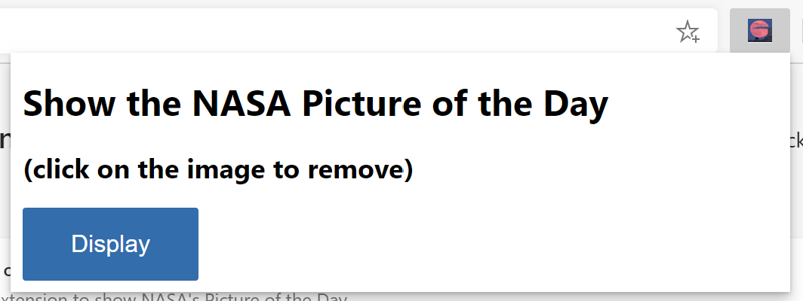
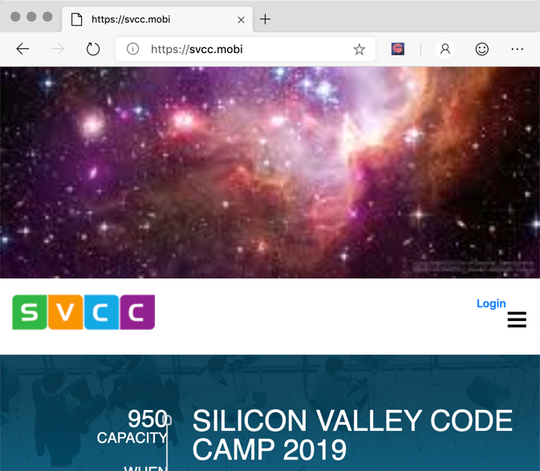

# Dynamically Insert NASA Picture Below The Page Body Tag Using Content Scripts  
  
[Completed Extension Package Source for This Part](extension-source/extension-getting-started-part2.zip)  

## Overview  

In this part 2, you learn to update our pop up menu to not show the static stars image you had before, but to replace that image with a title and a standard HTML button.  That button, when clicked, passes that stars image, which is embedded in the Extension, to the content page.  That image, is inserted into the active browser tab.  

*   Extension technologies covered in this part  
    *   Injecting JavaScript libraries into Extension  
    *   Exposing Extension assets to browser tabs  
    *   Including content pages in existing browser tabs  
    *   Having content pages listen for messages from pop-ups and respond  

## Remove the image from the pop-up and replace it with a button  

First, update our `popup.html` file with some straight forward markup that displays a title and a button.  You program that button shortly, but for now, just include a reference to an empty JavaScript file `popup.js`.  Here is update HTML.  

```html
<html>
    <head>
        <meta charset="utf-8" />
        <style>
            body {
                width: 500px;
            }
            button {
                background-color: #336dab;
                border: none;
                color: white;
                padding: 15px 32px;
                text-align: center;
                font-size: 16px;
            }
        </style>
    </head>
    <body>
        <h1>Show the NASA Picture of the Day</h1>
        <h2>(click on the image to remove)</h2>
        <button id="sendmessageid">Display</button>
        <script src="popup.js"></script>
    </body>
</html>
```  

After updating our Extension and clicking on the Extension launch icon, the have the following pop-up includes a display button.  

  

## Updated strategy to display image at the top of the browser tab  

After adding the button, the next task is to make it bring up the `images/stars.jpeg` image file at the top of the active tab page.  

Remember, each tab page has a unique own thread and the Extension has a separate thread.  So, you must first create a content script and inject that content script into the tab page.  Once you do that, you must send a message from our pop-up to that content script running on the tab page telling that content script what image to show, and how to show it.  

## Creating the pop-up JavaScript to send a message  

First, create `popup/popup.js` and add code to send a message to our not yet created content script that you must momentarily create and inject into our browser tab.  To do that, the following code adds an onclick event to our pop-up display button.  

```javascript
const sendMessageId = document.getElementById("sendmessageid");
if (sendMessageId) {
  sendMessageId.onclick = function() {
    // do something
  };
}
```  

In the onclick event, what you must do is find the current browser tab \(if there is only one open it is that one\).  Then, once you find that tab, use the `chrome.tabs.sendmessage` Extension API call to send a message to that tab.  

In that message you must include the URL to the image you want to display, and you want to send a unique ID that should be assigned to that inserted image.  You may choose to let the content insertion JavaScript generate that, but for reasons that become apparent later, generate that unique ID here in `popup.js` and pass it to the not-yet-created content script.  

Here is our updated `popup/popup.js` file.  Also, pass in the current tab ID which you should need in a later section but for now, is not be used.  

```javascript
const sendMessageId = document.getElementById("sendmessageid");
if (sendMessageId) {
    sendMessageId.onclick = function() {
        chrome.tabs.query({ active: true, currentWindow: true }, function(tabs) {
            chrome.tabs.sendMessage(
                tabs[0].id,
                {
                    url: chrome.extension.getURL("images/stars.jpeg"),
                    imageDivId: `${guidGenerator()}`,
                    tabId: tabs[0].id
                },
                function(response) {
                    window.close();
                }
            );
            function guidGenerator() {
                const S4 = function () {
                    return (((1 + Math.random()) * 0x10000) | 0).toString(16).substring(1);
                };
                return (S4() + S4() + "-" + S4() + "-" + S4() + "-" + S4() + "-" + S4() + S4() + S4());
            }
        });
    };
}
```  

## Making our `stars.jpeg` available from any browser tab  

You are probably wondering why, when you pass the `images/stars.jpeg` must you call the chrome Extension API `chrome.extension.getURL` instead of just passing in the relative URL without the extra prefix like in the previous section.  By the way, that extra prefix, returned by `getUrl` with the image attached looks something like this.  

`extension://inigobacliaghocjiapeaaoemkjifjhp/images/stars.jpeg`  

The reason is that you are injecting this image using the `src` attribute of the `img` element into the content page.  The content page is running on a unique thread that is not the same as the thread running the Extension.  For this to work you must expose the static image file as a web asset.  

To do that, you must add another entry in the `manifest.json` file.  You must declare the image to be accessible from any browser tab.  That entry is as follows \(you should see it in the full `manifest.json` file below when you add the content script declaration coming up\).  

```json
"web_accessible_resources": [
    "images/*.jpeg"
]
```  

You have now written the code in our `popup.js` file to send a message to the content page that is embedded on the current active tab page, but you have not created and injected that content page.  Do that now.  

## Updating our `manifest.json` for content and web access  

The updated `manifest.json` that includes the `content-scripts` and `web_accessible_resources` is as follows.  

```json
{
    "name": "NASA Picture of the day viewer",
    "version": "0.0.0.1",
    "manifest_version": 2,
    "description": "A Chromium Extension to show the NASA Picture of the Day.",
    "icons": {
        "16": "icons/nasapod16x16.png",
        "32": "icons/nasapod32x32.png",
        "48": "icons/nasapod48x48.png",
        "128": "icons/nasapod128x128.png"
    },
    "browser_action": {
        "default_popup": "popup/popup.html"
    },
    "content_scripts": [
        {
            "matches": [
              "<all_urls>"
            ],
            "js": ["lib/jquery.min.js","content-scripts/content.js"]
        }
    ],
    "web_accessible_resources": [
        "images/*.jpeg"
    ]
}
```  

The section you added is `content_scripts`.  The attribute `matches` set to `<all_urls>` means that all the files mention in this **content_scripts** section is injected into all browser tab pages when each are loaded.  The allowable types of files that are able to be injected here are javascript and css.  You also added `libjquery.min.js`.  You are able to include that from the download mentioned at the top of this section.  

## Adding jQuery and understanding the associated thread  

In the content scripts you are injecting, plan on using jQuery \(`$`\).  You added a minified version of jQuery and put it in our Extension package as `lib\jquery.min.js`.  These content scripts run in their own sandbox of sorts, which means that the jQuery injected into the `popup.js` page does not share with the content.  

Keep in mind that even if the browser tab has JavaScript running on it on the loaded web page, any content injected does not have access to that.  That injected JavaScript just has access to the actual DOM loaded in that browser tab.  

## Adding the content script message listener  

Here is that `content-scripts\content.js` file that gets injected into every browser tab page based on our `manifest.json` `content-scripts` section.  

```javascript
chrome.runtime.onMessage.addListener(function(request, sender, sendResponse) {
    $("body").prepend(
        ` `
    );
    $("head").prepend(
        `<style>
          .slide-image {
              height: auto;
              width: 100vw;
          }
        </style>`
    );
    $(`#${request.imageDivId}`).click(function() {
        $(`#${request.imageDivId}`).remove(`#${request.imageDivId}`);
    });
    sendResponse({ fromcontent: "This message is from content.js" });
});
```  

Notice that all the above JavaScript does is to register a `listener` using the `chrome.runtime.onMessage.addListener` Extension API method.  This listener waits for messages like the one you sent from the `popup.js` described earlier with the `chrome.tabs.sendMessage` API Extension call.  

The first parameter of the `addListener` method is a function whose first parameter, request, is the details of the message being passed in.  Remember, from `popup.js`, when you called `sendMessage`, those attributes of the first parameter are `url` and `imageDivId`.  

When an event is processed by this listener, the function that is the first parameter is run.  The first parameter of that function is an object that has attributes as assigned by `sendMessage`.  That function simply processes the three jQuery script lines.  

*   The first dynamically inserts into the DOM header a **\<style\>** section that you must assign as a class `slide-image` to our `img` element.  

*   The second, appends an `img` element right below the `body` of our browser tab that has the class `slide-image` assigned as well as the `imageDivId` as the ID of that image element.  

*   The third adds a click event that covers the entire image allowing the user to click any place on the image and that image is be removed from the page \(along with it is event listener\).  

## Adding functionality to remove the displayed image when clicked  

Now, when you browse to any page and click on our Extension icon, the pop-up menu is displayed as follows:  

  

When you click on the `Display` button, you get what is below.  If you click anywhere on the `stars.jpeg` image, that image element is removed and tab pages collapses back to what was originally displayed.  

  

You have now created an Extension that successfully sends a message from the Extension icon pop-up, to the dynamically inserted JavaScript running as content on the browser tab.  That injected content set the image element to display our static stars jpeg.  

<!-- image links -->  

<!-- links -->  
