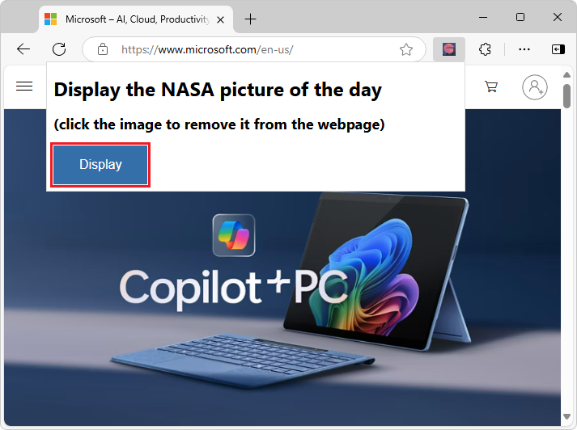
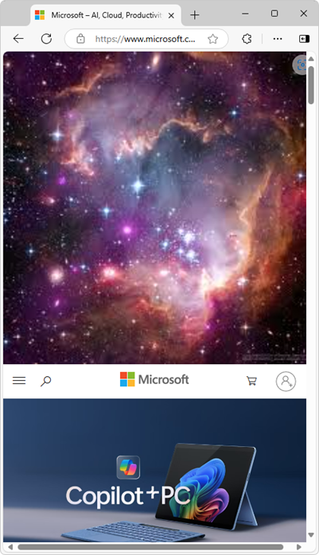

# Create an extension tutorial, part 2

To see the completed extension package source for this part of the tutorial, go to [MicrosoftEdge-Extensions repo > extension-getting-started-part2](https://github.com/microsoft/MicrosoftEdge-Extensions/tree/main/Extension%20samples/extension-getting-started-part2/extension-getting-started-part2).  

The source code has been updated from Manifest V2 to Manifest V3.

This tutorial covers the following extension technologies:
*   Injecting JavaScript libraries into an extension.
*   Exposing extension assets to browser tabs.
*   Including content pages in existing browser tabs.
*   Having content pages listen for messages from pop-ups and respond.

You'll learn to update your pop-up menu to replace your static stars image with a title and a standard HTML button.  That button, when selected, passes that image of stars to the content page.  This image is now embedded in the extension and inserted into the active browser tab. Here are the steps.

These steps require that you complete the steps for initial extension package steps. For the tutorial, go to [MicrosoftEdge-Extensions repo > extension-getting-started-part1](/microsoft-edge/extensions-chromium/getting-started/part1-simple-extension?tabs=v3).  

## Step 1: Update pop-up.html to include a button

In the popup folder where you created the `popup.html` file [from the initial part of the tutorial](/microsoft-edge/extensions-chromium/getting-started/part1-simple-extension?tabs=v3), you'll add tagging that displays a title with a button.  You'll later program that button in a different step, but for now include a reference to an empty JavaScript file `popup.js`.   

Below is a sample updated HTML file:

```html
<html>
    <head>
        <meta charset="utf-8" />
        <style>
            body {
                width: 500px;
            }
            button {
                background-color: #336dab;
                border: none;
                color: white;
                padding: 15px 32px;
                text-align: center;
                font-size: 16px;
            }
        </style>
    </head>
    <body>
        <h1>Display the NASA picture of the day</h1>
        <h2>(select the image to remove)</h2>
        <button id="sendmessageid">Display</button>
        <script src="popup.js"></script>
    </body>
</html>
```

After updating and opening the extension, a pop-up opens with a display button.



<!--![popup.html display after selecting the Extension icon] -->

## Step 2: Update popup.html to display image at the top of the browser tab

After adding the button, the next task is to make it bring up the `images/stars.jpeg` image file at the top of the active tab page.

Each tab page (and extension) runs in its own thread. Create a content script that is injected into the tab page.  Then, send a message from your pop-up to that content script running on the tab page. The content script will receive the message, which describes which image should be displayed.


<!-- ====================================================================== -->
## Step 3: Create the pop-up JavaScript to send a message

Create the `popup/popup.js` file and add code to send a message to your not-yet-created content script that you must momentarily create and inject into your browser tab.  To do that, the following code adds an `onclick` event to your pop-up **Display** button:

```javascript
const sendMessageId = document.getElementById("sendmessageid");
if (sendMessageId) {
  sendMessageId.onclick = function() {
    // do something
  };
}
```

In the `onclick` event, find the current browser tab.  Then, use the `chrome.tabs.sendmessage` Extension API to send a message to that tab.

In that message, you must include the URL to the image you want to display.  Make sure that you send a unique ID to assign to the inserted image.

To send a unique ID to assign to the inserted image, a couple different approaches are possible:
*  Approach 1: Let the content insertion JavaScript generate that image ID.  We won't use that approach here, for reasons that become apparent later.
*  Approach 2: Generate that unique ID here in `popup.js`, and then pass that ID to the not-yet-created content script.  We'll use this approach.

The following code outlines the updated code in `popup/popup.js`.  You also pass in the current tab ID, which is used later in this article:

#### [Manifest V3](#tab/v3)

```javascript
const sendMessageId = document.getElementById("sendmessageid");
if (sendMessageId) {
    sendMessageId.onclick = function() {
        chrome.tabs.query({ active: true, currentWindow: true }, function(tabs) {
            chrome.tabs.sendMessage(
                tabs[0].id,
                {
                    url: chrome.runtime.getURL("images/stars.jpeg"),
                    imageDivId: `${guidGenerator()}`,
                    tabId: tabs[0].id
                },
                function(response) {
                    window.close();
                }
            );
            function guidGenerator() {
                const S4 = function () {
                    return (((1 + Math.random()) * 0x10000) | 0).toString(16).substring(1);
                };
                return (S4() + S4() + "-" + S4() + "-" + S4() + "-" + S4() + "-" + S4() + S4() + S4());
            }
        });
    };
}
```

#### [Manifest V2](#tab/v2)

```javascript
const sendMessageId = document.getElementById("sendmessageid");
if (sendMessageId) {
    sendMessageId.onclick = function() {
        chrome.tabs.query({ active: true, currentWindow: true }, function(tabs) {
            chrome.tabs.sendMessage(
                tabs[0].id,
                {
                    url: chrome.extension.getURL("images/stars.jpeg"),
                    imageDivId: `${guidGenerator()}`,
                    tabId: tabs[0].id
                },
                function(response) {
                    window.close();
                }
            );
            function guidGenerator() {
                const S4 = function () {
                    return (((1 + Math.random()) * 0x10000) | 0).toString(16).substring(1);
                };
                return (S4() + S4() + "-" + S4() + "-" + S4() + "-" + S4() + "-" + S4() + S4() + S4());
            }
        });
    };
}
```

---

<!-- ====================================================================== -->
## Step 4: Make your `stars.jpeg` available from any browser tab

To make `images/stars.jpeg` available from any browser tab, you must use the `chrome.runtime.getURL` API.

Note: If you are using Manifest V2, then instead use `chrome.extension.getURL`.  That extra prefix is returned by `getURL` with the image attached, and looks something like the following: ```httpextension://inigobacliaghocjiapeaaoemkjifjhp/images/stars.jpeg```

The reason is that you're injecting the image using the `src` attribute of the `img` element into the content page.  The content page is running on a unique thread that isn't the same as the thread running the Extension.  You must expose the static image file as a web asset for it to work correctly.

Add another entry in the `manifest.json` file to declare that the image is available to all browser tabs.  That entry is as follows (you should see it in the full `manifest.json` file below when you add the content script declaration coming up):

#### [Manifest V3](#tab/v3)

```json
"web_accessible_resources": [
    {
      "resources": ["images/*.jpeg"],
      "matches": ["<all_urls>"]
    }
  ]
```

#### [Manifest V2](#tab/v2)

```json
"web_accessible_resources": [
    "images/*.jpeg"
]
```

---
You've now written the code in your `popup.js` file to send a message to the content page that is embedded on the current active tab page, but you haven't created and injected that content page.  Do that now.


<!-- ====================================================================== -->
## Step 5: Update your `manifest.json` for new content and web access

The updated `manifest.json` that includes the `content-scripts` and `web_accessible_resources` is as follows:

#### [Manifest V3](#tab/v3)

```json
{
    "name": "NASA picture of the day viewer",
    "version": "0.0.0.1",
    "manifest_version": 3,
    "description": "An extension to display the NASA picture of the day.",
    "icons": {
        "16": "icons/nasapod16x16.png",
        "32": "icons/nasapod32x32.png",
        "48": "icons/nasapod48x48.png",
        "128": "icons/nasapod128x128.png"
    },
    "action": {
        "default_popup": "popup/popup.html"
    },
    "content_scripts": [
        {
            "matches": [
              "<all_urls>"
            ],
            "js": ["lib/jquery.min.js","content-scripts/content.js"]
        }
    ],
    "web_accessible_resources": [
        {
            "resources": ["images/*.jpeg"],
            "matches": ["<all_urls>"]
        }
    ]
}
```

#### [Manifest V2](#tab/v2)

```json
{
    "name": "NASA picture of the day viewer",
    "version": "0.0.0.1",
    "manifest_version": 2,
    "description": "An extension to display the NASA picture of the day.",
    "icons": {
        "16": "icons/nasapod16x16.png",
        "32": "icons/nasapod32x32.png",
        "48": "icons/nasapod48x48.png",
        "128": "icons/nasapod128x128.png"
    },
    "browser_action": {
        "default_popup": "popup/popup.html"
    },
    "content_scripts": [
        {
            "matches": [
              "<all_urls>"
            ],
            "js": ["lib/jquery.min.js","content-scripts/content.js"]
        }
    ],
    "web_accessible_resources": [
        "images/*.jpeg"
    ]
}
```

---

The `matches` attribute is set to `<all_urls>`, which means that all files in `content_scripts` are injected into all browser tab pages when each tab is loaded.  The allowed files types that can be injected are JavaScript and CSS.  You also added `lib\jquery.min.js`.  You can include that from the download mentioned at the top of the section.

#### Add jQuery

In the content scripts that you're injecting, plan on using jQuery (`$`).  You added a minified version of jQuery and put it in your Extension package as `lib\jquery.min.js`.  These content scripts run in individual sandboxes, which means that the jQuery injected into the `popup.js` page isn't shared with the content.

#### Understanding the Thread

Keep in mind that even if the browser tab has JavaScript running on it on the loaded web page, any content that's injected doesn't have access to that JavaScript.  The injected JavaScript only has access to the actual DOM that's loaded in that browser tab.


<!-- ====================================================================== -->
## Step 6: Add the content script message listener

Here is that `content-scripts\content.js` file that gets injected into every browser tab page based on your `manifest.json` `content-scripts` section:

```javascript
chrome.runtime.onMessage.addListener(function(request, sender, sendResponse) {
    $("body").prepend(
        ` `
    );
    $("head").prepend(
        `<style>
          .slide-image {
              height: auto;
              width: 100vw;
          }
        </style>`
    );
    $(`#${request.imageDivId}`).click(function() {
        $(`#${request.imageDivId}`).remove(`#${request.imageDivId}`);
    });
    sendResponse({ fromcontent: "This message is from content.js" });
});
```

Notice that all the above JavaScript does is to register a `listener` using the `chrome.runtime.onMessage.addListener` Extension API method.  This listener waits for messages like the one you sent from the `popup.js` described earlier with the `chrome.tabs.sendMessage` Extension API method.

The first parameter of the `addListener` method is a function whose first parameter, request, is the details of the message being passed in.  Remember, from `popup.js`, when you used the `sendMessage` method, those attributes of the first parameter are `url` and `imageDivId`.

When an event is processed by the listener, the function that is the first parameter is run.  The first parameter of that function is an object that has attributes as assigned by `sendMessage`.  That function simply processes the three jQuery script lines.

*   The first script line appends an `img` element right below the `body` of your browser tab that has the `slide-image` class assigned as well as the `imageDivId` as the ID of that image element.

*   The second script line dynamically inserts into the DOM header a **\<style\>** section that you must assign as a `slide-image` class to your `img` element.

*   The third script line adds a `click` event that covers the entire image allowing the user to select anywhere on the image and that image is removed from the page (along with it is event listener).

8. Add functionality to remove the displayed image when selected

Now, when you browse to any page and select your **Extension** icon, the pop-up menu is displayed as follows:


When you select the `Display` button, you get what is below.  If you select anywhere on the `stars.jpeg` image, that image element is removed and tab pages collapses<!--todo: check "tab pages collapses"--> back to what was originally displayed:



Congratulations!  You've created an Extension that successfully sends a message from the extension icon pop-up, and dynamically inserted JavaScript running as content on the browser tab.  The injected content sets the image element to display your static stars `.jpeg` file.
