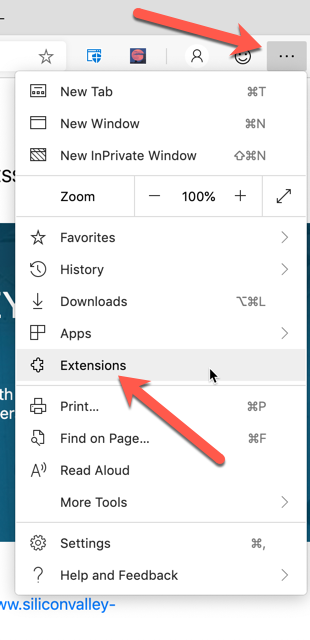
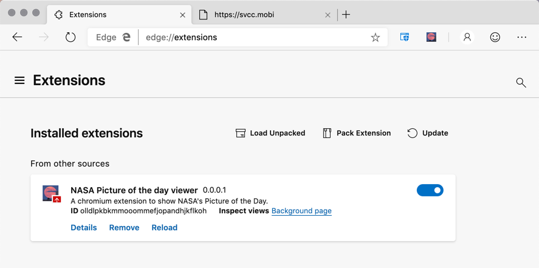

# Run your extension locally in your browser while developing it (side-loading)

The Microsoft Edge Chromium browser provides a safe and simple way for you to run as well as debug your extensions while you are developing them.  Once developed, you'll want to submit them to the public extensions so everyone can install and use them.

## Launching the extensions menu

The process is quite simple.  All you need to do is click on the three dots at the top of your browser. Next, choose "Extensions" from the context menu as shown below.

When you are in the "Extensions" menu as shown below, you click on one of the three menus listed across the top as shown below.

## Installing and updating side-loaded extensions

The first time you want to install your extension, you choose the option "Load Unpacked".  This prompts you for a directory where you have your extension assets file by file. That installs the extension as if you had downloaded it from a store.  

Once you've installed your extension, you can update it by clicking on the "Reload" button under your extension listing.

Removing your extension is easy also. You click on the "Remove" button on the bottom right to do that.

## Debugging extensions

Debugging extensions is quite easy and supports all of the features in Edge Chromium DevTools. Those details however are not covered in this getting started guide but are very important to successfully build extensions.
