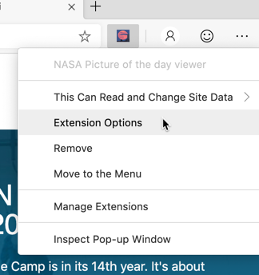

# Add an options page and NASA API key as well cache use to `LocalStorage`

* Extension technologies covered in this part 4.
  * Adding an options page to set extension configuration values
  * Using the extension API Storage for saving extension specific data
  * Setting extension permissions for security
  * Using browser `LocalStorage` for Caching API requests
  
[Completed Extension Package Source for This Part](extension-source/extension-getting-started-part4.zip)

## Overview

In this part 4 we will extend this NASA picture of the day extension to retrieve from the NASA API, the current picture.  Currently, we are only showing the same static `stars.jpeg` that we statically stored in the extension itself.

Because the NASA API requires a key to access it, we will add a text input field to the custom extension configuration screen, also known, in extension terms, as an options page. We will also add aa checkbox that configures the app to use the static `stars.jpeg` file or all the NASA API to get a picture of the day.

Finally, in our content page `JavaScript` that we injected into our currently executing tab, we will asynchronously read that configuration from the extension storage API and use it to retrieve a URL from NASA, as well as Cache that URL for an hour to avoid calling the NASA API repeatedly.

## Building an options page for our extension

The extensions API makes it easy to build an options page that you can use to load and save custom configuration information from your custom extension. All we have to do is update the manifest to include a reference to an html that is our options page and add a custom permission so we can use the `chrome.storage` extension api then of course build that html and JavaScript that renders a form with the associated logic to retrieve, display and save the configuration information.

The changes to the `manifest.json` file include the `options_ui` entry set to `options/options.html` and creating a permissions entry with one permission, `storage`.

```JSON
{
  "name": "NASA Picture of the day viewer",
  "version": "0.0.0.1",
  "manifest_version": 2,
  "description": "A chromium extension to show NASA's Picture of the Day.",
  "icons": {
    "16": "icons/nasapod16x16.png",
    "32": "icons/nasapod32x32.png",
    "48": "icons/nasapod48x48.png",
    "128": "icons/nasapod128x128.png"
  },
  "browser_action": {
    "default_popup": "popup/popup.html"
  },
  "content_scripts": [
    {
      "matches": [
        "<all_urls>"
      ],
      "js": ["lib/jquery.min.js","content-scripts/content.js"]
    }
  ],
  "web_accessible_resources": [
    "images/*.jpeg"
  ],
  "permissions": [ "storage"],
  "options_ui": {
    "page": "options/options.html",
    "open_in_tab": false
  }
}
```

In our new `options` directory, we now have two files.  `options.html` is the first and it's basic html that includes two input fields, one checkbox and one text input field. It also includes a button to click to save those values.

```HTML
<html>
  <head>
    <title>Nasa Picture of the Day Options</title>
    <style>
      html {
        margin: 12px 0 0 55px;
        min-width: 500px;
        width: 500px;
        max-height: 600px;
        height: 600px;
      }
    </style>
  </head>
  <body>
    <label>
      <input type="checkbox" id="useNasaApi" />
      Use NASA picture of the day API (not sample local data)
    </label>
    <br />
    <label>
      <br/>
      <span>NASA picture of the day API key (DEMO_KEY is very limited, apply for your own at https://api.nasa.gov/</span>
      <br/>
      <input type="text" id="nasaApiKey" />
    </label>
    <hr />
    <button id="save">Save</button>
    <div id="status"></div>

    <script src="options.js"></script>
  </body>
</html>
```

The `options.js` does all the work.  When it first runs, it calls the function `restore_options` which in turn, uses the `chrome.storage.sync.get` extension api method to retrieve the two values of our configuration parameters assuming they've been previously saved. If values have not been previously saved, the `sync.get` method uses it's first parameter as the defaults.

Notice that this call is asynchronous which means that when it completes, the second parameter of both the get and set, are callbacks which get executed when the functions return their results.

```JS
function save_options() {
  const nasaApiKey = document.getElementById("nasaApiKey").value;
  const useNasaApi = document.getElementById("useNasaApi").checked;
  chrome.storage.sync.set(
    {
      nasaApiKey: nasaApiKey,
      useNasaApi: useNasaApi
    },
    function() {
      const status = document.getElementById("status");
      status.textContent = "Options saved.";
      setTimeout(function() {
        status.textContent = "";
      }, 750);
    }
  );
}
function restore_options() {
  chrome.storage.sync.get(
    {
      nasaApiKey: "DEMO_KEY",
      useNasaApi: false
    },
    function(items) {
      document.getElementById("nasaApiKey").value = items.nasaApiKey;
      document.getElementById("useNasaApi").checked =
        items.useNasaApi;
    }
  );
}
window.onload = function() {
  restore_options();
};
const elementSave = document.getElementById("save");
if (elementSave) {
  elementSave.addEventListener("click", save_options);
}
```

To activate this options panel, the extensions `API` automatically add a launch menu in the context (or the right mouse button) of the extensions launch button as is shown here.



When launched, with minimal styling, the extension options menu shows the following.


## Updating our content page to asynchronously retrieve configuration data from extension storage

Instead of directly setting the image elements URL that is injected into the body of the currently executing tab, we first want to get from the `chrome.storage` extension api, the configuration values saved from the options dialog.  

Based on those values we will either display our static `stars.jpeg` file from our extension itself, or we will call the NASA API and use the picture of the day URL returned from that online web service to display the image.

In the below JavaScript, we are not yet calling the NASA API, but instead just outputting to the current tab page the configuration parameters we retrieved from `chrome.storage`.  Notice that we update the content HTML only after the storage api asynchronously returns.

New `content.js` follows.

```JAVASCRIPT
chrome.runtime.onMessage.addListener(function(request, sender, sendResponse) {
  $("head").prepend(
    `<style>
       .slide-image {
          height: auto;
          width: 100vw;
        }
      </style> `
  );
  chrome.storage.sync.get(["useNasaApi", "nasaApiKey"], result => {
    $("body").prepend(
      `
        
        <ul>
          <li>useNasaApi:${result.useNasaApi}</li>
          <li>nasaApiKey:${result.nasaApiKey}</li>
        </ul>
      `
    );
    $(`#${request.imageDivId}`).click(function() {
      $(`#${request.imageDivId}`).remove(`#${request.imageDivId}`);
    });
    sendResponse({ fromcontent: "This message is from content.js" });
  });
  return true; // forces sendMessage to wait for sendMessage before exiting
});
```

>[!NOTE]
>Near the bottom of the `JavaScript`, notice the `return true;`. This is subtle but very important. Returning true from this listener function will cause the caller (`chrome.tabs.sendMessage`) to wait for this return. Otherwise, since in our popup where we send a message and then close the window, the popup will have closed before this function returns and cause the extension to generate an error.

## Asynchronously calling the NASA API to get the picture of the day

Now we need to add the logic to our `content.js` to both retrieve data from the NASA API as well as handle the case where the user configuration tells us to use the static `stars.jpeg` instead.  Since `jQuery` is asynchronous and we are using that to make our ajax call to get the NASA API picture URL, we need to add some code to make sure that only after `jQuery.ajax` completion does the `HTML` get updated. Below is the full `content.js` that does that for us.

```JAVASCRIPT
chrome.runtime.onMessage.addListener(function(request, sender, sendResponse) {
  $("head").prepend(
    `<style>
       .slide-image {
          height: auto;
          width: 100vw;
        }
      </style> `
  );
  chrome.storage.sync.get(["useNasaApi", "nasaApiKey"], result => {
    if (result.useNasaApi && result.useNasaApi === true) {
      const url = `https://api.nasa.gov/planetary/apod?api_key=${
        result && result.nasaApiKey ? result.nasaApiKey : "DEMO_KEY"
      }`;
      $.ajax({
        url,
        type: "GET",
        datatype: "json",
        success: function (data) {
          if (data && data.url) {
            updateHtml(data.url);
          } else {
            alert(`api call failed to ${url}`);
          }
        },
        error: function (jqXHR) {
          const errorMessage =
            jqXHR && jqXHR.responseText
              ? JSON.parse(jqXHR.responseText).error.message
              : "error calling NASA API";
          alert(errorMessage);
        }
      });
    } else {
      updateHtml(request.url);
    }
    function updateHtml(imageUrl) {
      $("body").prepend(
        ``
      );
      $(`#${request.imageDivId}`).click(function() {
        $(`#${request.imageDivId}`).remove(`#${request.imageDivId}`);
      });
      sendResponse({ fromcontent: "This message is from content.js" });
    }
  });
  return true; // forces sendMessage to wait for sendMessage before exiting
});
```

## Cache the data retrieved from the NASA API with browser LocalStorage

In our extension, every time the extension's launch icon is pressed, a call is made to the NASA API to get the latest URL location of the picture of the day.  Since that picture is only updated once a day, we really don't need to call it every time a picture is requested.

To solve this, we cache the data object returned from the NASA API in browser `LocalStorage`. The logic below that is now in our `content.js` checks the date the last time the data was downloaded. If the data was from more than 60 minutes ago, the `JavaScript` makes a fresh call and updates the browser LocalStorage with the latest data.

Below is the updated `content.js`.

```JAVASCRIPT
chrome.runtime.onMessage.addListener(function(request, sender, sendResponse) {
  $("head").prepend(
    `<style>
       .slide-image {
          height: auto;
          width: 100vw;
        }
      </style> `
  );
  chrome.storage.sync.get(["useNasaApi", "nasaApiKey"], result => {
    if (result.useNasaApi && result.useNasaApi === true) {
      const NASA_POD_LOCALSTORAGE_KEY = "NASA_POD_LOCALSTORAGE_KEY";
      const dataObjectString = window.localStorage.getItem(
        NASA_POD_LOCALSTORAGE_KEY
      );
      const dataObject = dataObjectString ? JSON.parse(dataObjectString) : {};
      if (
        dataObject &&
        dataObject.localStorageSetDate &&
        needToUpdateNasaPod(dataObject.localStorageSetDate, 60)
      ) {
        const url = `https://api.nasa.gov/planetary/apod?api_key=${
          result && result.nasaApiKey ? result.nasaApiKey : "DEMO_KEY"
        }`;
        $.ajax({
          url,
          type: "GET",
          datatype: "json",
          success: function(data) {
            if (data && data.url) {
              data.localStorageSetDate = new Date().getTime();
              window.localStorage.setItem(
                NASA_POD_LOCALSTORAGE_KEY,
                JSON.stringify(data)
              );
              updateHtml(data.url);
              sendResponse({ fromcontent: "content updated from API" });
            } else {
              alert(`api call failed to ${url}`);
              sendResponse({ fromcontent: "API update failed" });
            }
          },
          error: function(jqXHR) {
            const errorMessage =
              jqXHR && jqXHR.responseText
                ? JSON.parse(jqXHR.responseText).error.message
                : "error calling NASA API";
            alert(errorMessage);
            sendResponse({ fromcontent: `API update failed: ${errorMessage}` });
          }
        });
      } else {
        // found in cache
        updateHtml(dataObject.url);
        sendResponse({ fromcontent: "content update from cache" });
      }
      function needToUpdateNasaPod(nasaLastGetDate, minutesToCheckBack) {
        const currentDateTime = new Date().getTime();
        const lastCheckDateTime = new Date(nasaLastGetDate).getTime();
        const minutesSinceLastCheck =
          (currentDateTime - lastCheckDateTime) / (1000 * 60);
        return minutesSinceLastCheck > minutesToCheckBack;
      }
    } else {
      updateHtml(request.url);
      sendResponse({ fromcontent: "content update from static image" });
    }
    function updateHtml(imageUrl) {
      $("body").prepend(
        ``
      );
      $(`#${request.imageDivId}`).click(function() {
        $(`#${request.imageDivId}`).remove(`#${request.imageDivId}`);
      });
    }
  });
  return true; // forces sendMessage to wait for sendMessage before exiting
});
```

When we launch our extension, the most it will check the NASA API for updated data is once an hour.  Since calls to the NASA API are rate limited this is an example of where this kind of cache is not only important but necessary.

>[!NOTE]
>Take note that when we use the `chrome.storage` API calls, the execution is asynchronous which means that the next line of JavaScript called after that executes immediately, before the `get` or `set` methods are completed.  To work with the returned values, we must pass a second parameter to the `chrome.storage` calls which is the callback method that gets the results passed into it as a parameter.  The browser `LocalStorage` methods `setItem` and `getItem` are synchronous meaning that they don't return until they complete their set or get operations.
