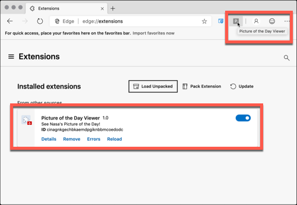
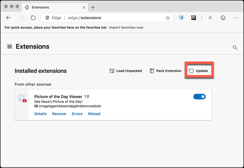
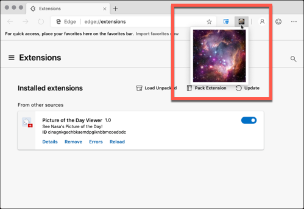
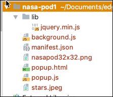

# Getting Started Building an Edge/Chromium Extensions

This "Getting Started" guide is designed as a brief review for those who have build Edge/Chromium extensions before as well as a beginners guide for those who have never built an Edge/Chromium extension (referred to as extensions going forward). It assumes the reader has at least basic JavaScript skills and understands how to create basic HTML pages.

## What is a Edge/Chromium Extension?

An extension can be thought of as a package of web programming assets including typically standard HTML, CSS and JavaScript files that are packaged together and served, by the users web browser.  The extension itself, can do practically everything a local or remote web server can do.  Extensions can be launched from special icons on the browser bar, then can both be started from events on existing pages, the listen for user actions and then modify existing pages, as well as a host of other capabilities.

Best practices for building Edge/Chromium extensions are to make extensions with a single purpose in mind. Though they have capability to deliver a full web experience full of menus and options, they should be single minded and single focussed.  Common examples are timers, new email checkers, picture viewers, and many others. They can have their own authentication, or they can share authentication with the existing Edge/Chromium broswer.

Extensions are packaged as a compressed bundle of files, web assets that is, that must include a single manifest.json file which describes how the extension starts when it is first loaded.   Extensions can be downloaded and signed from an app store, as well as also can be loaded directly from a users local computer. Extensions are designed to be immediately available when they are installed, and optionally, automatically update as the extension author releases new versions.

## Build your first Edge/Chromium Extension

### The Required manifest.json file

To build an extension simply create an empty directory and place a single file in it named `manifest.json`.  This file includes the name of the extension, which is what will display when the user hovers over the extension launch icon, a version, this is the version the extension author (us) uses keep track of what version is running and a manifest_version. This manifest_version has to do with what level of features are available to this extension as well as some crypto information for how the extension is packaged and installed from an app store to your local browser.

```json
{
  "name": "Picture of the Day Viewer",
  "version": "1.0",
  "description": "See Nasa's Picture of the Day!",
  "manifest_version": 3
}
```

### Installing the Simple Extension In Edge/Chromium

Then, running the Edge/Chromium browser we can install our new extenion named "Picture of the Day Viewer".  To install the extension from our local computer, we first need to bring up the extensions manager.  Either by typing `edge://extensions` in the URL, or choosing the right menu, then choosing the `Extensions` choice. On that menu, select the `Load Unpacked` link, navigate to the empty directory, and the extension will be loaded.


Browsing over the extension that has been automatically loaded on toolbar, top right, the tooltip shows the extension name. You can also see the extension is loaded and listed under installed extensions.  If multiple extensions were unstalled, they would all be listed here, as well as a separate section for those extensions installed from the app store and not locally as we did here.



The extension created here is what's known as a Browser Action. Browser Actions appear as an icon in the toolbar area.  Clicking on the icon, executes the extension, however, we've not given the extension anything to do yet.

### Extending the Extension to Pop Up an Image When Launched

To give this new extension minimal functionality, the `manifest.json` file is updated to include a `browser_action` section.  To this section, a `default_icon` is added which is a png file is copied to the directory that hold the manifest, and also a reference to `popup.html` which is the html file that will be launched when extension icon is pressed.

```json 
{
     "name": "Picture of the Day Viewer",
     "version": "1.0",
     "description": "See Nasa's Picture of the Day!",
     "manifest_version": 3,
     "browser_action": {
       "default_icon": "nasapod32x32.png",
       "default_popup": "popup.html"
     }
   }
```

In the `popup.html` is very simple HTML markup that displays an image (that image, `stars.jpeg` is copied also into our folder with the manifest.json file.

```html
<html lang="en">
     <head>
       <meta charset="UTF-8" />
       <title>NASA Picture of the Day</title>
     </head>
     <body>
       
     </body>
   </html>
```

To update the plugin that we installed previosly (and have updated with the new `browser_action`), we navigate again to the extensions manager and press the button marked `update`.




The new extension is loaded and the icon is now a picture of a planet instead of the default, which was just the letter **P** before.  Clicking on the icon, pops up the `star.jpeg` image file that was referenced from the `popup.html`.





With one `manifest.json` and 3 other files, a very simple Browser Action extension has been created. It has a custom icon for launching and when that launch icon is clicked, a single static image pops up that is included in the extension distribution (that is the package that the extension gets distributed in).


## Adding jQuery, Ajax and LocalStorage To The Edge/Chromium Extension

### jQuery and Ajax to Popup.html

After seeing this same picture day after day, this extension will get very boring.  NASA has a free service that will give us a URL to a new picture every day, hence the name **Picture of the Day**.

Because extensions are just HTML and JavaScript among other things, everything that works on a web page works in an extension and that includes **jQuery**.  Just like adding jQuery to any HTML file, it's to the `popup.html` file with a script tag in the header.  We plan on creating a parallel JavaScript file to be referenced also by `popup.html` so we add a reference to `popup.js` which will be created next.

```html
<html lang="en">
  <head>
    <meta charset="UTF-8" />
    <title>NASA Picture of the Day</title>
    <script src="lib/jquery.min.js"></script>
    <script src="popup.js"></script>
  </head>
  <body>
    
  </body>
</html>
```

We also add the physical file to our project in our directory under a lib folder to keep those separate from the files we create ourselves.

In the `popup.js` file, we do a single ajax call to the [NASA API](https://api.nasa.gov/api.html#apod) that gives us the picture of the day. The idea is we make an async request to `.AJAX`, then on completion we replace the `src` tag of the only `img` element on the page with our picture of the day URL downloaded from NASA.

```JAVASCRIPT 
$(document).ready(function() {
  $.ajax({
    url: "https://api.nasa.gov/planetary/apod?api_key=DEMO_KEY",
    type: "GET",
    datatype: "json",
    success: function(data) {
      window.localStorage.setItem("apodData", JSON.stringify(data));
      $("img").attr("src", data.url);
    },
    error: function(jqXHR, textStatus, errorThrown) {
      console.log("ajax failed");
    }
  });
});
```


### LocalStorage Added For Tracking Picture

Because NASA limits the number of downloads per IP, it is important to call the Ajax all is infrequently as possible.  Now, each time the Edge/Chromium extension activation button is pressed, another Ajax call is generated. That can be rectified by storing the results of the Ajax return in localstorage and then, before calling it the next time, check and see if the values for the picture of the day have been returned already.

In the jQuery Ajax success event, `localStorage` is called and a single storage key is updated with the url of the picture of the day for later retrieval. Since this also includes the current day, later, the JavaScript can check to see if the day changed and if the LocalStorage exists but is the wrong day, a new picture will be be retrieved.

The point here is, that our `popup.html` is just plain old HTML and JavaScipt running in a browser. Just like any other web page, it can access remote URL's with Ajax and localStorage with the window object. The code straight forward that does this.

```JAVASCRIPT
$(document).ready(function() {
  var localStorageKey = "NASA_POD";
  var needNewData = true;

  var jsonStringPod = window.localStorage.getItem(localStorageKey);
  if (jsonStringPod) {
    var podData = JSON.parse(jsonStringPod);
    var todayIsoDate = new Date().toISOString().slice(0, 10);
    if (podData.date === todayIsoDate) {
      needNewData = false;
      $("img").attr("src", podData.url);
    }
  }
  if (needNewData) {
    $.ajax({
      url: "https://api.nasa.gov/planetary/apod?api_key=DEMO_KEY",
      type: "GET",
      datatype: "json",
      success: function(data) {
        window.localStorage.setItem(localStorageKey, JSON.stringify(data));
        $("img").attr("src", data.url);
      },
      error: function(jqXHR, textStatus, errorThrown) {
        console.log("ajax failed");
      }
    });
  }
});
```

Now, the extenstion has been written that when activated, shows the current NASA picture of the day.  When it it's called for the first time, it stores the picture URL in localStorage so that subsequent times, no Ajax call is necessary.  The extension also checks if a new day has happened (by calling the system date function), and if it has, a new Ajax call is made, and a new picture of the day URL is retrieved and cached again.


## Using The Extensions API to Annotate the Launch Icon

So far, all the code written for this extension is running in the launched popup HTML page.  That's useful, but not a very extendable architecture.  Edge/Chromium extensions support a loading a background JavaScript that is essentially the event handler for everything about the extension.  It handles all the lifecycle events that are associated with the extension. That includes what happens when the extension is first loaded, what happens everytime a new browser window is created that has reference to the extension as well as processing events of all the tabs in the browser.

The idea of this background script is that it's simply events that fire, do the work and finish. Most of the time, the expectation is that the background script lies dormant. 

One other nice feature is that not only, can this background script register for general purpose notifications, it can also participate in timer events.  This will be shown here when a timer event for 10 minutes is set, such that every 10 minutes our Edge/Chromium extension will check to see if there is a new picture of the day, and if so, the background script will run a static method that will take up upcoming, that will annotate the activation icon to let the browser user know they've not seen the latest picture of the day.

### Adding a Background Script to the Manifest.json

The most often used name for a background script is `background.js`. That's what is used in this project and for the extension to know about it, that script must be included in the `manifest.json` file. Notice that the `scripts` attribute is an array. In addition to background.js, jquery is also included.  Generated in the background is an `HTML` file that includes both of these JavaScript files so that `background.js` can call methods in `jquery.min.js`.  Below is our new `manifest.json`.

```JSON
{
  "name": "Picture of the Day Viewer",
  "version": "1.0",
  "description": "See Nasa's Picture of the Day!",
  "manifest_version": 3,
  "background": {
    "scripts": ["lib/jquery.min.js","background.js"]
  },
  "browser_action": {
    "default_icon": "nasapod32x32.png",
    "default_popup": "popup.html"
  }
}
```

### Annotating the Launch Icon using Extension Static Class Methods

It would be nice if when there is a Picture of the Day image that as not been seen yet available, that the launch icon would be annotated with the letter _N_ for new. That can be done by updating the background script to include some code that checks to see if a change of the URL is needed, and if so, update the badge icon.

This is a good time to introduce the chrome name space and many of the methods that are available just to running extensions.  All these static methods are available from the `chrome` namespace and are broken down into multiple sections. The specific namespace we want is `chrome.browserAction` and the method we want to call is `setBadgeText`.  The first parameter is the value we want to set to overlay the Extensions launch icon, and the second parameter is the callback function that is executed when that completes.


> [!NOTE] 
> Pay special attention to calls in the `chrome` namespace that have callbacks. These are async calls which means that if you need the returned value, you will need to wait for the callback before proceeding.

The updated background script now has calls to the `chrome.browserAction` namespace to set the text overlaying the launch icon to "N" when a new picture of the day is available.

```JAVASCRIPT
$(document).ready(function() {
  var localStorageKey = "NASA_POD";
  var needNewData = true;
  var jsonStringPod = window.localStorage.getItem(localStorageKey);
  if (jsonStringPod) {
    var podData = JSON.parse(jsonStringPod);
    var todayIsoDate = new Date().toISOString().slice(0, 10);
    if (podData.date === todayIsoDate) {
      needNewData = false;
      $("img").attr("src", podData.url);
    }
  }
  chrome.browserAction.setBadgeText({ text: "" }); // always clear new flag
  if (needNewData) {
    $.ajax({
      url: "https://api.nasa.gov/planetary/apod?api_key=DEMO_KEY",
      type: "GET",
      datatype: "json",
      success: function(data) {
        window.localStorage.setItem(localStorageKey, JSON.stringify(data));
        $("img").attr("src", data.url);
      },
      error: function(jqXHR, textStatus, errorThrown) {
        console.log("ajax failed");
      }
    });
  }
});
```

For this to work completely, it is necessary to also update the `popup.js` such that whenever an image is displayed, the badge text is also cleared.

```JAVASCRIPT
$(document).ready(function() {
  chrome.browserAction.setBadgeText({ text: "" }); 
  var localStorageKey = "NASA_POD";
  //...
});
```


## Re-organizing For Better Code Reuse and Performance

So far, we have a very flat structure for our Edge/Chromium Extension.  All of our JavaScript is either `popup.js` or `background.js`.  Even though we have a very small trivial extension, there has already been code duplication required that should be unnecessary. In the background script, when a browser tab is opened, a check is made to see if an badge annotation for new should be set on the Extension activation icon.  Then, also, in the `popup.js` code, a similar check is made because it is necessary to know whether localStorage has been used yet.  This duplicate code can be eliminated with a better organization and interaction of the background script and the popup script. In addition, it would be helpful to have a common place to put utility methods as well as another JavaScript to store system wide constants.




The suggested organization for this is to add additional JavaScript files to your Extension container and reference them in your `manifest.json`.  All your front end scripts like `popup.js` as well as new backend scripts you may create can reference the common `background.js` script using the method:

```JAVASCRIPT
var bgpage = chrome.extension.getBackgroundPage();
```

When this is included in `popup.js` a common function can be created that is used in both this file as well as `background.js`.


## Adding a Timer To Poll For Picture of the Day Changes

asdfl;jasfl;kjaslf;asf

## Debugging The Extension Using Edge/Chromium DevTools

asdfk sad;dsjlfsafksadf a


