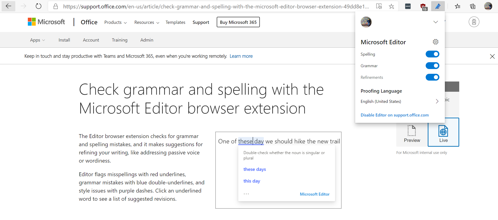
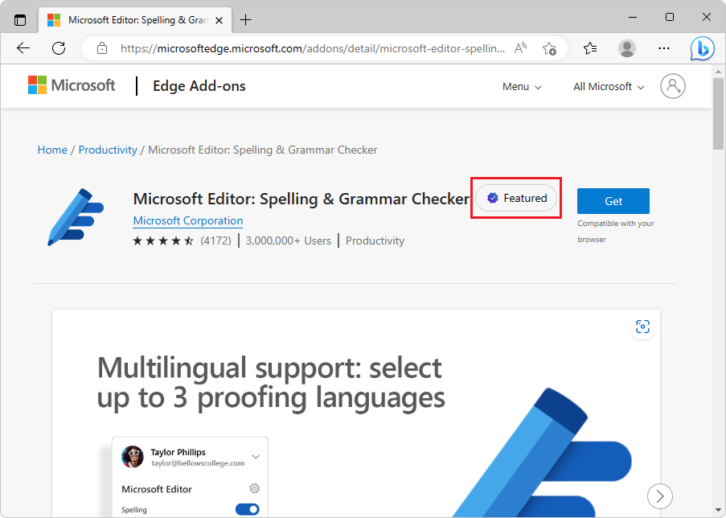

# Overview of Microsoft Edge extensions

A Microsoft Edge *extension* is a small app that developers use to add or modify features of Microsoft Edge to improve a user's browsing experience.  An extension provides a niche experience or function that is important to a target audience.

You can create a Microsoft Edge extension if you have an idea or product that is based upon either a specific web browser, or improvements to features of specific webpages.  Examples of *companion experiences* include ad blockers and password managers.

An extension should include at least the following features:

*   An app manifest JSON file that contains basic platform information.
*   A JavaScript file that defines the function.
*   HTML and CSS files that define the user interface.

To work directly with a specific part of the browser, such as a window or tab, you must send API requests, and must often reference the browser by name.

<!-- ====================================================================== -->
## Basic guidance

Great places to begin your extension development tutorials and documentation research are sites hosted by the browser organizations.  Some of the popular browsers to build extensions for include Microsoft Edge, Safari, Firefox, Chrome, Opera, and Brave. 

The following table isn't exhaustive or definitive; it's just a starting point for your research.

| Web browser | Chromium-based? | Extension development webpage |
|:--- |:--- |:--- |
| Safari | No | [Safari App Extensions](https://developer.apple.com/documentation/safariservices/safari_app_extensions) |
| Firefox | No | [Browser Extensions](https://developer.mozilla.org/docs/Mozilla/Add-ons/WebExtensions) |
| Chrome | Yes | [API Reference](https://developer.chrome.com/extensions) |
| Opera | Yes | [Extensions Documentation](https://dev.opera.com/extensions) |
| Brave | Yes | Uses [Chrome Web Store](https://chrome.google.com/webstore/category/extensions) |
| Microsoft Edge | Yes | [Microsoft Edge Add-ons Developer](https://developer.microsoft.com/microsoft-edge/extensions) |

> [!IMPORTANT]
> Many of the tutorials on these sites use browser-specific APIs that might not match the browser for the app you are developing.  In most cases, a Chromium extension works as-is in different Chromium browsers and the APIs work as expected.  Some less-common APIs might be browser-specific.  Links to the tutorials are in the [See also](#see-also) section, below.

<!-- ====================================================================== -->
## Why Chromium?

If your goal is to publish your extension in the extensions store for each browser, your extension must be modified for each version to target and run in each distinct browser environment.  For example, [Safari extensions](https://developer.apple.com/documentation/safariservices/safari_app_extensions) can use both web and native code to communicate with counterpart native applications.  The last four browsers in the previous table use the same code package and minimize the need to maintain parallel versions.  These browsers are based on the [Chromium open-source project](https://www.chromium.org/Home).

Benefits of creating a Chromium extension include writing the fewest lines of code.  It also targets the maximum number of extension stores and ultimately the maximum number of users who can find and acquire your extension.

The following content focuses mostly on Chromium extensions.

<!-- ====================================================================== -->
## Browser compatibility and extension testing

Occasionally, API parity doesn't exist between Chromium browsers.  For example, there are differences in the identity and payment APIs.  To make sure your extension meets customer expectations, review API status through the following official browser documentation:

*   [Chrome APIs](https://developer.chrome.com/extensions/api_index)
*   [Extension APIs supported in Opera](https://dev.opera.com/extensions/apis)
*   [Port Chrome extension to Microsoft Edge](developer-guide/port-chrome-extension.md)

The APIs that you require define the changes that you must make to address the differences between each browser.  You might need to create slightly different code packages with small differences for each store.

To test your extension in different environments before you submit the extension to a browser store, side-load the extension into your browser while you develop it.

<!-- ====================================================================== -->
## Publish your extension to browser stores

You can submit and seek browser extensions in the following browser stores.

*   [Firefox Browser Add-ons](https://addons.mozilla.org/firefox/extensions)
*   [Chrome Web Store](https://chrome.google.com/webstore/category/extensions)
*   [Opera addons](https://addons.opera.com/extensions)
*   [Microsoft Edge Add-ons](https://microsoftedge.microsoft.com/addons/category/Edge-Extensions)

Some stores allow you to download listed extensions from other browsers.  However, cross-browser access isn't guaranteed by browser stores.  To make sure your users find your extension in different browsers, you should maintain a listing on each browser extension store.

Users might need to install your extension in different browsers. In this scenario, you can migrate existing Chromium extensions from one browser to another.

#### Migrate an existing extension to Microsoft Edge

If you've already developed an extension for another Chromium-based browser, you can submit it to the [Microsoft Edge Add-ons website](https://microsoftedge.microsoft.com/addons/Microsoft-Edge-Extensions-Home). You don't need to rewrite your extension or verify that it works in Microsoft Edge.  However, when you migrate an existing Chromium extension to other Chromium browsers, make certain the same APIs or alternatives are available for your target browser.

For more information on porting your Chrome extension to Microsoft Edge, see [Port Chrome extensions to Microsoft Edge](developer-guide/port-chrome-extension.md). After you port your extension to the target browser, the next step is to publish it.

#### Publish to the Microsoft Edge Add-ons website

To start publishing your extension to Microsoft Edge, you must [register for a developer account](https://developer.microsoft.com/registration) with a Microsoft account (MSA) email account to submit your extension listing to the store.  The email address of a Microsoft account (MSA) includes `@outlook.com`, `@live.com`, or `@hotmail.com`.  When you choose an email address to register, consider whether you must transfer or share ownership of the Microsoft Edge extension with other people in your organization.  After registration is complete, you can create a new extension submission to the store.

To submit your extension to the store, you need to provide the following items:

*   An archive (`.zip`) file that contains your code files.
*   All required visual assets, which include a logo and small promotional tile.
*   Optional promotional media, such as screenshots, promotional tiles, and a video URL.
*   Information that describes your extension such as the name, short description, and a privacy policy link.

> [!NOTE]
> Different stores might have different submission requirements.  The above list summarizes the [requirements](publish/publish-extension.md) to publish an extension for Microsoft Edge.

After you've successfully submitted your extension, your extension undergoes a review process and either passes or fails the certification process.  Owners are notified of the outcome and given next steps as required.  If you submit an extension update to the store, it begins a new review process.

<!-- ====================================================================== -->
## The Featured badge

A **Featured** badge in the [Microsoft Edge Add-ons website](https://microsoftedge.microsoft.com/addons/Microsoft-Edge-Extensions-Home) indicates that the extension has been determined to follow Microsoft's recommended best practices related to security, privacy, transparency, and user experience.

When you hover on a **Featured** badge, the tooltip reads: **This extension follows all of Microsoft's recommended practices and has been verified**.

<!-- todo: uncomment after Featured badge appears:
For example, the [Microsoft Editor: Spelling & Grammar Checker](https://microsoftedge.microsoft.com/addons/detail/microsoft-editor-spellin/hokifickgkhplphjiodbggjmoafhignh) extension has a **Featured** badge at the Microsoft Edge Add-ons website.
-->

The Microsoft Edge Add-ons team reviews each extension for adherence to [Best Practices for extensions](./developer-guide/best-practices.md) before granting the extension a **Featured** badge.  Badged extensions are curated solely for the purpose of providing Microsoft Edge users with secure browsing tools and high-quality experiences.  Developers cannot pay to receive a **Featured** badge for an extension.

To help protect your browser settings, extensions that don't comply with Edge Add-Ons Store best practices are not badged.

Just because an extension doesn't have a **Featured** badge, doesn't mean the extension is unsafe. It simply means that the extension doesn't meet Microsoft's security and quality standards to be badged as **Featured**.

<!-- ====================================================================== -->
## See also

*  [Extension concepts and architecture](getting-started/index.md)
*  [Manage Microsoft Edge extensions in the enterprise](/deployedge/microsoft-edge-manage-extensions)

External links:
*  [Port a Google Chrome extension](https://extensionworkshop.com/documentation/develop/porting-a-google-chrome-extension)
*  [Build a Safari App extension](https://developer.apple.com/documentation/safariservices/safari_app_extensions/building_a_safari_app_extension)
*  [Your first extension (Firefox)](https://developer.mozilla.org/docs/Mozilla/Add-ons/WebExtensions/Your_first_WebExtension)
*  [Extensions > Get started](https://developer.chrome.com/docs/extensions/get-started/)
*  [Get started (Opera)](https://dev.opera.com/extensions/getting-started)

Extensions for Visual Studio Code rather than for Microsoft Edge:
*  [Microsoft Edge DevTools extension for Visual Studio Code](../visual-studio-code/microsoft-edge-devtools-extension.md)
*  [webhint extension for Visual Studio Code](../visual-studio-code/webhint.md)
