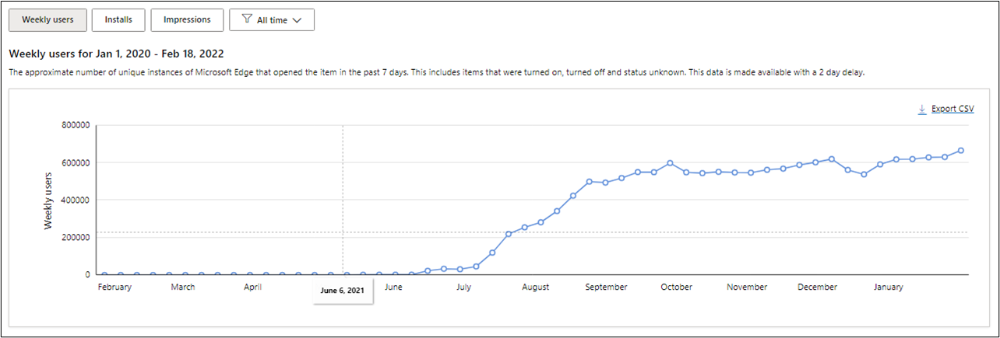
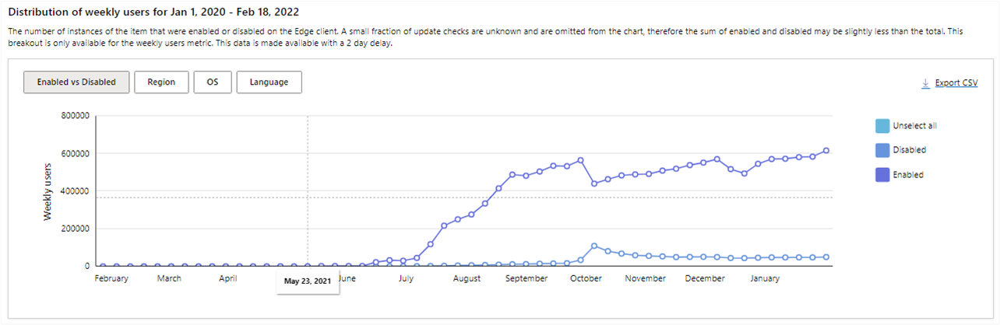
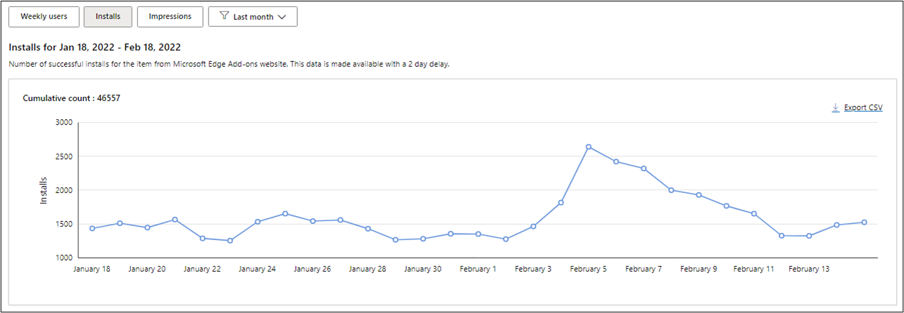
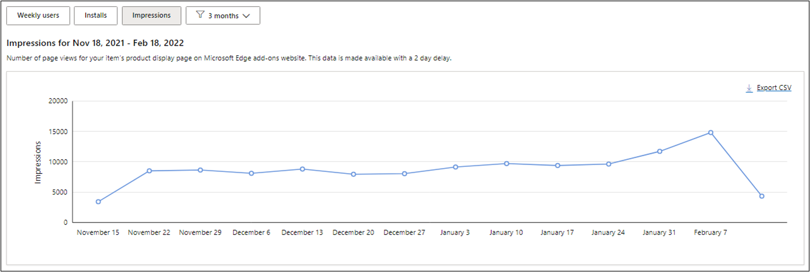
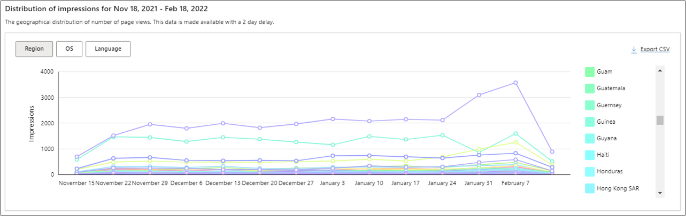
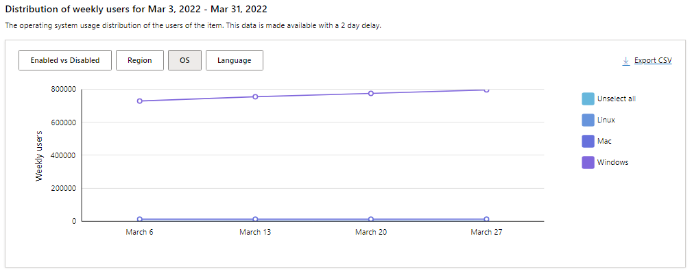
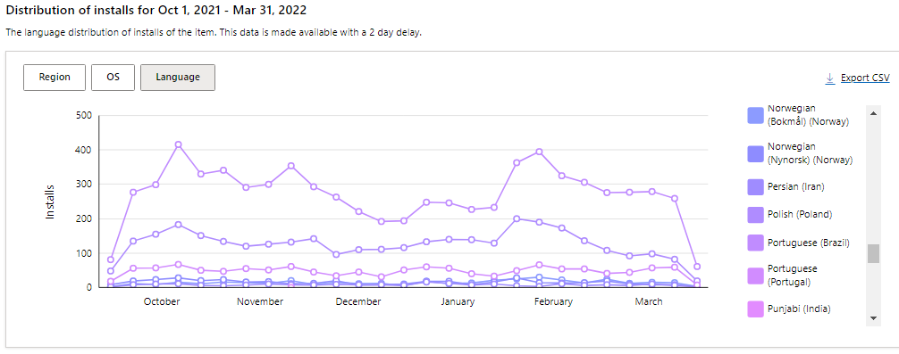

# View Microsoft Edge extensions analytics dashboard

Microsoft announced the launch of the Extensions Analytics Dashboard on September 8, 2021. For more information, see the [Track your add-on's performance: extension analytics now available on Partner center](https://techcommunity.microsoft.com/t5/articles/track-your-add-on-s-performance-extension-analytics-now/m-p/2733351) blog post.

You can view extension metrics from your [Partner Center dashboard](https://partner.microsoft.com/dashboard/microsoftedge/overview) and evaluate an extension's performance from [Microsoft Edge Add-ons](https://microsoftedge.microsoft.com/addons/Microsoft-Edge-Extensions-Home).

For example, you can identify regions in which the number of installations for your extension has increased in the past three months. You can also export this report as a CSV file.

Follow these steps to view your extension's analytics dashboard:  

1. Go to your Partner Center account and select an extension.

1. From the left panel, click **Extension overview** > **Analytics** to view your extension metrics.

<!-- ====================================================================== -->
## Analytics dashboard metrics

From the analytics dashboard you can view metrics for the **Last month**, **3 months**, **6 months**, or **All time** (the period since your extension has been published to the Microsoft Edge Add-ons store).

<!-- ------------------------------ -->
#### Weekly users

The **Weekly users** metric tracks the number of users that have your extension turned on, turned off and status unknown on Microsoft Edge over the past seven days.

The following screenshot shows the **Weekly users** from the date the extension was published until the day the report was run on February 18.

<!-- ------------------------------ -->
#### Enabled vs Disabled

The **Enabled vs Disabled** report shows the number of instances of the extension that are enabled or disabled per user.

The following screenshot shows the **Weekly users** who have enabled and disabled the extension over the same period. You can choose from **Select all** / **Unselect all**, **Disabled**, and **Enabled** views.

> [!div class="mx-imgBorder"]
> 

<!-- ------------------------------ -->
#### Installs

The **Installs** metric displays the total number of successful installs of your extensions per day from the Microsoft Edge Add-ons store.

The following screenshot shows daily successful installations for the last month.

<!-- ------------------------------ -->
#### Impressions

The **Impressions** metric captures the total number of page views and user visits to your extension product page on Microsoft Edge Add-ons store. The data points are based on weekly or daily totals depending on the selected time range.

The following screenshot shows **Impressions** for an extension page over a three month period.

<!-- ====================================================================== -->
## Refine by Region, OS, and Language

You can further refine views of your extension's Weekly users, Installs, and Impressions by Region, OS, and Language.

<!-- ------------------------------ -->
#### Region

The Region filter covers the geographical distribution of users for your extension, indicating the user base in each region.

The following screenshot shows total user visits.

<!-- ------------------------------ -->
#### OS

The OS (operating system) filter highlights the OS usage distribution of all the install requests for your extension.

The following screenshot shows Weekly Users by Operating System over 30 days.

> [!div class="mx-imgBorder"]
> 

<!-- ------------------------------ -->
#### Language

The Language filter shows the language distribution for users of your extension.

The following screenshot shows Installs per Language over a six month period.

> [!div class="mx-imgBorder"]
> 

The Analytics Dashboard helps you better understand and engage with your extension users. For information about other 
features launched on Partner Center, see [Released features for Microsoft Edge Add-ons - Microsoft Edge Development | Microsoft Docs](/microsoft-edge/extensions-chromium/whats-new/released-features).

Share your feedback, questions, and comments with the team on Twitter [@MSEdgeDev](https://twitter.com/msedgedev/) or via the [Microsoft Edge Insider forums on TechCommunity](https://techcommunity.microsoft.com/t5/articles/manifest-v3-changes-are-now-available-in-microsoft-edge/m-p/1780254).
