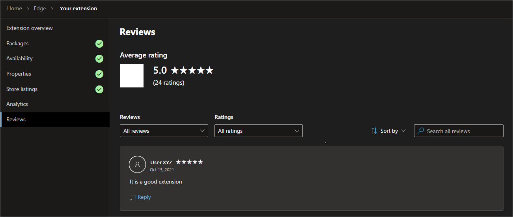

# Reply to user reviews about your Microsoft Edge extension

You can view and respond to user reviews that are posted on the Microsoft Edge Add-ons product page.  To view your extension's reviews and ratings and engage with the user who did the review, use the Partner Center dashboard.

To view your extension's **Reviews** page:

1. Go to your Partner Center account.

1. Select an extension, and then go to **Extension overview** > **Reviews**.

   Or, on the **Home** > **Edge** breadcrumb path, click the star rating of an extension on the **Overview** page.

 

<!-- ====================================================================== -->
## Features of the Reviews page

From the Reviews page, you have access to the following information and actions for an extension:

* View your extension's Average Rating.

* View the total number of ratings received for your extension.

* Reply to reviews.

* View the list of all reviews received for your extension and your responses.

* Edit your previous responses.

* Apply filters to the reviews based on the extension rating and response status.

<!-- ====================================================================== -->
## Reply to user reviews

To reply to a user review:

1. At Partner Center, go to the extension's **Review** page, as described earlier.

1. Pick the review you want to respond to and then click the **Reply** link.

A response must be between one and one thousand (1-1000) characters long.

When you post a reply using the Partner Center dashboard, your reply appears on your Microsoft Edge Add-ons product page within 15 to 20 minutes.

<!-- ====================================================================== -->
## See also

* [Microsoft Edge Add-ons | NEW Feature to manage user reviews on your extension](https://techcommunity.microsoft.com/t5/articles/microsoft-edge-add-ons-new-feature-to-manage-user-reviews-on/m-p/3372537) - blog post.

* [Released features for Microsoft Edge Add-ons](../whats-new/released-features.md) - recently released features at Partner Center.

Share your feedback, questions, and comments with the team on Twitter [@MSEdgeDev](https://twitter.com/msedgedev/) or via our [GitHub community's Discussion topic](https://github.com/microsoft/MicrosoftEdge-Extensions/discussions/18).
