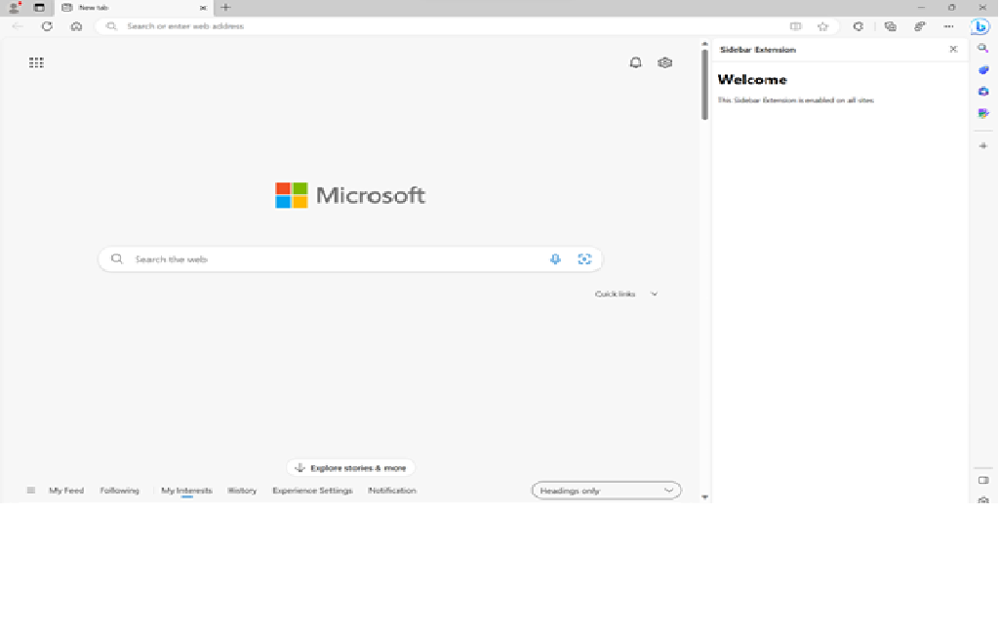

# Sidebar Feature

Microsoft Edge Add-Ons is now introducing a sidebar API feature for extensions that enables users to view more information alongside the main content of a webpage. 

The persistent column on the side of the browser which exists alongside the primary content is commonly termed as the _sidebar_. By enabling side-by-side browsing, the need to constantly switch tabs is reduced and the user will have a more productive browsing experience. 

The sidebar API enables developers to display their own UI on the web. Hence, developers can use the extensions content in the sidebar to complement the primary task of the user.




* [Create an extension tutorial, part 2](../getting-started/part2-content-scripts.md)

Already existing extensions can also enable sidebar in their code by using this article.

## Origin
As with other extension resources, the sidebar page will commit to a trusted extension context on its origin (`extension://<id>`); thus, it will have the same API access as other trusted extension contexts. 

All existing extensions API will be available for sidebar extensions, and they can leverage all current capabilities of the extensibility framework.

Below are the steps and process to use the sidebar feature for your extension.

## Step 1: Modify the manifest file

Every extension for Microsoft Edge has a JSON-formatted manifest file, named `manifest.json`. The manifest file is the blueprint of your extension.

### Permissions and supported API

A new supported API field, `side_panel`, should be included in the extension manifest file along with the permission `sidePanel`.

`manifest.json`:
```json
{
  ...
  "side_panel": {
    "default_path": "sidepanel.html"
  },
  "permissions": [
    "sidePanel"
  ]
   ...
}
```

## Step 2: Adding functionalities to the sidebar

#### Example 1: Default sidebar on every site 

A sidebar can be set as default to show the same extension throughout all the tabs opened in the browser window. Default values will persist across sessions. 

`manifest.json`:
```json
{
  "name": "My side panel extension",
  ...
  "side_panel": {
    "default_path": "sidepanel.html"
  }
  ...
}
```

`sidepanel.html`:
```html
<!DOCTYPE html>
<html>
  <head>
    <title>My Sidepanel</title>
  </head>
  <body>
    <h1>All sites sidepanel extension</h1>
    <p>This side panel is enabled on all sites</p>
  </body>
</html>
```

#### Example 2: Switching to a different sidebar

Users can switch to a different sidebar when they switch tabs.

The following example sets a welcome sidebar on `runtime.OnInstalled()`, when the user navigates to a different tab, it replaces the welcome page sidebar with the main sidebar.

`service-worker.js`:
```js
const welcomePage = 'sidepanels/welcome-sp.html';
const mainPage = 'sidepanels/main-sp.html';

chrome.runtime.onInstalled.addListener(() => {
  chrome.sidePanel.setOptions({ path: welcomePage });
});

chrome.tabs.onActivated.addListener(async ({ tabId }) => {
  const { path } = await chrome.sidePanel.getOptions({ tabId });
  if (path === welcomePage) {
    chrome.sidePanel.setOptions({ path: mainPage });
  }
});
```
#### Example 3: Enabling sidebar on a specific site

An extension can use`sidepanel.setOptions()` to enable a sidebar on a specific site. This can be a particular website a user is using and would want the same extension to open in the sidebar, once this website is opened.

`service-worker.js`:
```js
const GOOGLE_ORIGIN = 'https://www.google.com';

chrome.tabs.onUpdated.addListener(async (tabId, info, tab) => {
  if (!tab.url) return;
  const url = new URL(tab.url);
  // Enables the side panel on google.com
  if (url.origin === GOOGLE_ORIGIN) {
    await chrome.sidePanel.setOptions({
      tabId,
      path: 'sidepanel.html',
      enabled: true
    });
  } else {
    // Disables the side panel on all other sites
    await chrome.sidePanel.setOptions({
      tabId,
      enabled: false
    });
  }
});
```

When a user temporarily switches to a tab where the sidebar is not enabled, the sidebar will be hidden. 

#### Example 4: Enabling the action Icon to open the sidebar

By declaring the “action” key in the manifest, developers can allow users to open the side panel when they click on the action toolbar icon with `sidePanel.setPanelBehavior()`.

`manifest.json`:
```json
{
  "name": "My side panel extension",
  ...
   "action": {
    "default_title": "Click to open panel"
  },
  ...
}
```

`service-worker.js`:
```js
const GOOGLE_ORIGIN = 'https://www.google.com';

// Allows users to open the side panel by clicking on the action toolbar icon
chrome.sidePanel
  .setPanelBehavior({ openPanelOnActionClick: true })
  .catch((error) => console.error(error));
...
```

## Sidebar user experience

#### 1. Identifying Extensions with Sidebar 

-	The sidebar icon will be displayed next to the extension name in the hub in the toolbar.


-	On the Microsoft Edge Add-Ons store page, there will be a dialog on the extension product page, highlighting the sidebar feature.

#### 2. Opening extensions in the sidebar

-	The extension can be accessed in the sidebar by clicking the sidebar icon in the hub in the toolbar.
-	Extensions can also be opened in the sidebar by right-clicking an extension's shortcut in the toolbar.

## Properties of a sidebar

| Property | Description | Optional? |
|---|---|---|
| `openPanelOnActionClick` | Property shows if clicking the extension's icon will toggle showing the extension's entry in the side panel. Default value is `false`. |No|
| `enabled` |If the side panel should be enabled or not. Default value is `true`. |Yes|
| `path` |The path to the side panel HTML file to use. This needs to be a local resource within the extension package.|No|
| `default_path` |Developer specified path for side panel display.|No|

