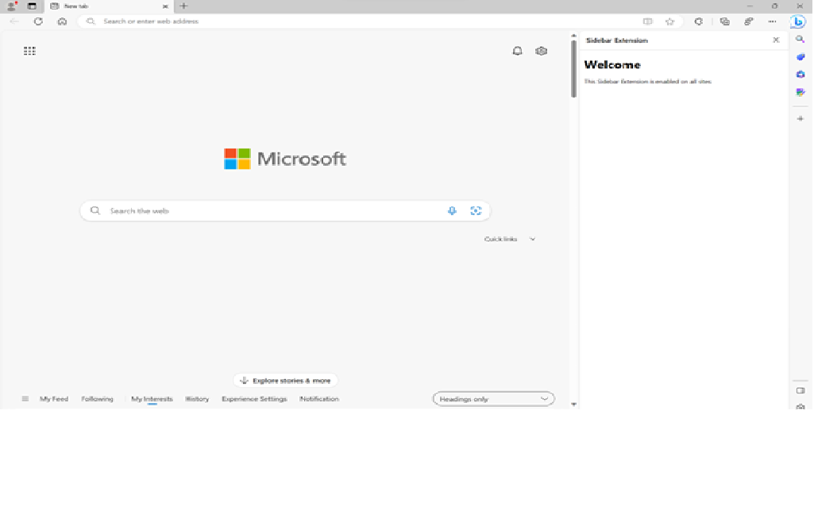
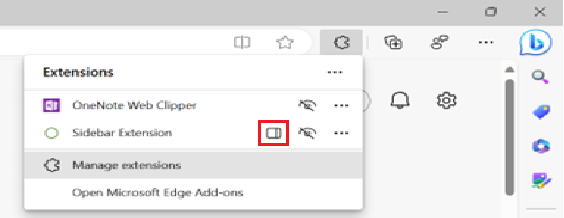

# Sidebar Feature

The sidebar feature of Microsoft Edge Add-Ons (extensions) enables users to view more information alongside the main content of a webpage. 

The _sidebar_ is a persistent column on the side of the browser, which exists alongside the primary content.  By enabling side-by-side browsing, the need to constantly switch tabs is reduced, and the user will have a more productive browsing experience. 

As a developer, the sidebar API enables you to display your own UI on the web.  You can use the extensions content in the sidebar to supplement the user's primary task.




<!-- ====================================================================== -->
## Features of Sidebar API

* The sidebar has access to all the Microsoft Edge Extension APIs.
* The sidebar remains open while navigating between tabs.
* The sidebar is available on specific sites.

Use this article to enable the sidebar for your new or existing extension.  

For complete details of how to create an extension, see:
* [Create an extension tutorial, part 1](../getting-started/part1-simple-extension.md)
* [Create an extension tutorial, part 2](../getting-started/part2-content-scripts.md)


<!-- ====================================================================== -->
## Origin

As with other extension resources, the sidebar page commits to a trusted extension context on its origin (`extension://<id>`), so the sidebar has the same API access as other trusted extension contexts.

All the existing extensions APIs are available for sidebar extensions, so you can leverage all current capabilities of the extensibility framework in your sidebar-enabled extension.

Below are the steps to add a sidebar to your extension.


<!-- ====================================================================== -->
## Step 1: Modify the manifest file

Every extension for Microsoft Edge has a JSON-formatted manifest file, named `manifest.json`. The manifest file is the blueprint of your extension.


<!-- ------------------------------ -->
#### Permissions and supported API

A new supported API field, `side_panel`, should be included in the extension manifest file along with the permission `sidePanel`.

`manifest.json`:
```json
{
  ...
  "side_panel": {
    "default_path": "sidepanel.html"
  },
  "permissions": [
    "sidePanel"
  ]
   ...
}
```

<!-- ====================================================================== -->
## Step 2: Adding functionalities to the sidebar


<!-- ------------------------------ -->
#### Example 1: Default sidebar on every site 

A sidebar can be set as default to show the same extension throughout all the tabs opened in the browser window. Default values will persist across sessions. 

`manifest.json`:

```json
{
  "name": "My side panel extension",
  ...
  "side_panel": {
    "default_path": "sidepanel.html"
  }
  ...
}
```

`sidepanel.html`:

```html
<!DOCTYPE html>
<html>
  <head>
    <title>My Sidepanel</title>
  </head>
  <body>
    <h1>All sites sidepanel extension</h1>
    <p>This side panel is enabled on all sites</p>
  </body>
</html>
```


<!-- ------------------------------ -->
#### Example 2: Switching to a different sidebar

Users can switch to a different sidebar when they switch tabs.

The following example sets a welcome sidebar on `runtime.OnInstalled()`, when the user navigates to a different tab, it replaces the welcome page sidebar with the main sidebar.

`service-worker.js`:

```js
const welcomePage = 'sidepanels/welcome-sp.html';
const mainPage = 'sidepanels/main-sp.html';

chrome.runtime.onInstalled.addListener(() => {
  chrome.sidePanel.setOptions({ path: welcomePage });
});

chrome.tabs.onActivated.addListener(async ({ tabId }) => {
  const { path } = await chrome.sidePanel.getOptions({ tabId });
  if (path === welcomePage) {
    chrome.sidePanel.setOptions({ path: mainPage });
  }
});
```


<!-- ------------------------------ -->
#### Example 3: Enabling sidebar on a specific site

An extension can use`sidepanel.setOptions()` to enable a sidebar on a specific site. This can be a particular website a user is using and would want the same extension to open in the sidebar, once this website is opened.

`service-worker.js`:

```js
const GOOGLE_ORIGIN = 'https://www.google.com';

chrome.tabs.onUpdated.addListener(async (tabId, info, tab) => {
  if (!tab.url) return;
  const url = new URL(tab.url);
  // Enables the side panel on google.com
  if (url.origin === GOOGLE_ORIGIN) {
    await chrome.sidePanel.setOptions({
      tabId,
      path: 'sidepanel.html',
      enabled: true
    });
  } else {
    // Disables the side panel on all other sites
    await chrome.sidePanel.setOptions({
      tabId,
      enabled: false
    });
  }
});
```

When a user temporarily switches to a tab where the sidebar is not enabled, the sidebar will be hidden. 


<!-- ------------------------------ -->
#### Example 4: Enabling the action Icon to open the sidebar

By declaring the “action” key in the manifest, developers can allow users to open the side panel when they click on the action toolbar icon with `sidePanel.setPanelBehavior()`.

`manifest.json`:

```json
{
  "name": "My side panel extension",
  ...
   "action": {
    "default_title": "Click to open panel"
  },
  ...
}
```

`service-worker.js`:

```js
const GOOGLE_ORIGIN = 'https://www.google.com';

// Allows users to open the side panel by clicking on the action toolbar icon
chrome.sidePanel
  .setPanelBehavior({ openPanelOnActionClick: true })
  .catch((error) => console.error(error));
...
```


<!-- ====================================================================== -->
## Sidebar user experience


<!-- ------------------------------ -->
#### 1. Identifying Extensions with Sidebar 

* The sidebar icon is displayed next to the extension name in the hub in the toolbar:


<!-- todo: put real content in png -->

* On the Microsoft Edge Add-Ons store page, there's a dialog on the extension product page, highlighting the sidebar feature.
<!-- todo: show that "dialog", is it actually a dialog? -->


<!-- ------------------------------ -->
#### 2. Opening extensions in the sidebar

Your extension can be accessed in the sidebar by clicking the sidebar icon in the hub in the toolbar.
<!-- todo: accessed from the sidebar, or loaded into the sidebar? -->

Extensions can also be opened in the sidebar by right-clicking an extension's shortcut in the toolbar.
<!-- todo: opened into the sidebar; loaded into the sidebar? -->


<!-- ====================================================================== -->
## Properties for sidebars

| Property | Description | Optional? |
|---|---|---|
| `openPanelOnActionClick` | Property shows if clicking the extension's icon will toggle showing the extension's entry in the side panel.  The default value is `false`. | No<!-- contradiction? given that there's a default value, that implies that this is optional --> |
| `enabled` | Whether the side panel <!--sidebar?--> should be enabled or not.  The default value is `true`. | Yes |
| `path` |The path to the side panel HTML file to use.  This needs to be a local resource within the extension package. | No |
| `default_path` | The developer-specified path for the side-panel <!--sidebar?--> display. | No |


<!-- ====================================================================== -->
## See also

* [Supported APIs for Microsoft Edge extensions](../developer-guide/api-support.md) - todo: add the `sidebar` API.
* [Declare API permissions in extension manifests](../developer-guide/declare-permissions.md) - todo: Add the `sidebar` permission.
* [Manifest file format for extensions](../getting-started/manifest-format.md) - todo: add manifest code.
* [Released features for Microsoft Edge Add-ons](../whats-new/released-features.md) - todo: add Sidebar.
* [Roadmap for Microsoft Edge Add-ons](../whats-new/roadmap.md) - todo: add new things that will be coming.
