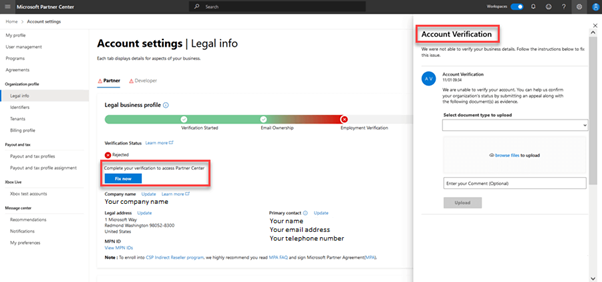

# Verify Microsoft Edge program information when you enrol in a new Partner Center program

When you enrol in the Microsoft Edge program on Partner Center to publish extensions or change legal details in your profile, Microsoft verifies the information that you provide. Information can include your company name, company address, and primary contact details. During this process, Microsoft may send email to your primary contact to request verification.

You can go to [Legal info](https://partner.microsoft.com/dashboard/account/v3/organization/legalinfo#developer) in Partner Center to monitor verification status for the Microsoft Edge Developer program.

When account verification is complete, you can use your Partner Center dashboard to publish your extension to the Microsoft Edge Add-ons website.

> [!NOTE]
> Verification usually takes 3-5 business days. If more than five days have passed, you can contact support for assistance.

<!-- ====================================================================== -->
## What is verified and what is required?

| Type of verification | What's verified | Suggestions |
|---|---|---|
| Email ownership | Email ownership verifies that the primary contact (primary email) address is valid.   • The primary contact email address must be a work account that is monitored and can send/receive email.   • Avoid using a personal email address not associated with the company domain, or a tenant user credential not associated with email. (For example, jsmith@testcompany.onmicrosoft.com or abc@gmail.com). | Be sure to flag email from Microsoft.com as a **safe** domain, and check junk email folders.     If you don't receive the email ownership verification email message within one business day, you can ask us to send the email again. On to your Partner Center account, go to **Home > Account settings**. On the **Account settings l My profile** page, select **Resend verification email**. |
| Employment | Employment verification confirms that your primary contact is an employee of the enrolling company and that the domain entered in the registration form belongs to the enrolling company   • The company’s public website has the same domain as entered in the registration form.   •	The contact has an active email address on an email domain owned by the company. |  For verification proof, you may submit a screenshot of the website showing name, address, contact information, and domain of the organization.     If employment verification is rejected, or if the domain of the registered email is not the same as the employer’s public domain, you must provide documentation ***confirming your email domain is under the ownership of your employer***.     • Assignment letter from an authorized representative of the organization.   • Domain ownership records, such as [whois](https://www.whois.com/whois).   • Domain purchase invoices or registry confirmation records. |
| Business | Business verification confirms that the enrolling company is a legitimate business entity and at the stated address. | Submit one of the following documents for business verification:   • Formation documents, such as articles of incorporation, partnership deed.   • Franchise or agency appointment letters.   • Government issued letter, license, business registration, or tax registration certificate.   • Lease or tenancy documents.   • Letter or statement from a financial institution or a utility company.   • Record on a Government registry website.The site/link must be displayed.   • Stock exchange filings or tax filing records.   • External company databases, such as Dun & Bradstreet (DUNS ID) or state registry.   • Receipt from the company's home country, municipality.     **Note:** Confirm that the company name and address in your [Legal business profile](https://partner.microsoft.com/dashboard/account/v3/organization/legalinfo#developer) have no spelling errors or abbreviations. They must match your formal company business registration records exactly. If appropriate, select the match found in external data sources: external company databases, such as Dun & Bradstreet (DUNS ID) or state registry.     Microsoft uses this documentation to verify that the company is authorized to do business under that name, and that it is located at the address provided. For further assistance, go to your profile page to upload additional proofs through the [interactive vetting experience](#checking-your-verification-status) |

<!-- ====================================================================== -->
## Checking your verification status

You can check verification status at Partner Center in **[Account Settings | Legal Info](https://partner.microsoft.com/dashboard/account/v3/organization/legalinfo#developer)**, where you can see:

1. One or more tabs such as **Partner**, **Developer**, or **Reseller**, depending on the programs in which your organization is enrolled.
1. Your verification status: **Pending**, **Accepted**, or **Rejected**, with a status icon.
1. The **Legal business profile** progress bar with an information icon you can select to get more information.

<!-- ====================================================================== -->
## Verification status

There are three possible results when you check your verification status:

•	**Accepted**: The information you submitted was verified, and you're notified of your acceptance into the program. No further action is required.

•	**Pending**: The verification process has started but isn’t complete. No action is required. You can monitor verification status at Account Settings | Legal Info. Verification usually takes 3-5 business days.

•	**Rejected**: The information you submitted couldn’t be verified. The reason and instructions for [how to appeal](#appealing-a-rejected-application) appear in the Account Verification pane.

<!-- ====================================================================== -->
## Appealing a rejected application

To appeal a rejected application:

1.	At **[Account Settings | Legal Info](https://partner.microsoft.com/dashboard/account/v3/organization/legalinfo#developer)**, select **Fix now**.
2.	In **Account Verification**, from **Select document type to upload**, select the type of document that you want to upload for verification.
3.	In **Enter your comment**, you can enter more information about your appeal.
4.	Select **Upload**.

The amount of time required to review an appeal varies. You can return to **[Account Settings | Legal Info](https://partner.microsoft.com/dashboard/account/v3/organization/legalinfo#developer)** to check verification status at any time. Verification status is **Pending** during the review.

<!-- ====================================================================== -->
> [!NOTE]
> Switching back to single account from an enterprise account is not possible. Refer to the documentations to make an informed decision.

<!-- ====================================================================== -->
## Next steps

To display your verification status, go to [Partner Center](https://partner.microsoft.com/dashboard/microsoftedge/public/login?ref=dd) and then select **Account settings**.  Continue to build, test, and prepare your submissions while you wait for the verification process to complete.

*  [Publish an extension](publish-extension.md)

*  [Extension concepts and architecture](../getting-started/index.md)

*  [Add users to the Microsoft Edge program](aad-account.md) - Adding additional users to your Microsoft Edge program and your Partner Center developer account.  To enable adding users, you associate your organization's Azure Active Directory account with your Microsoft account (MSA) on Partner Center.

