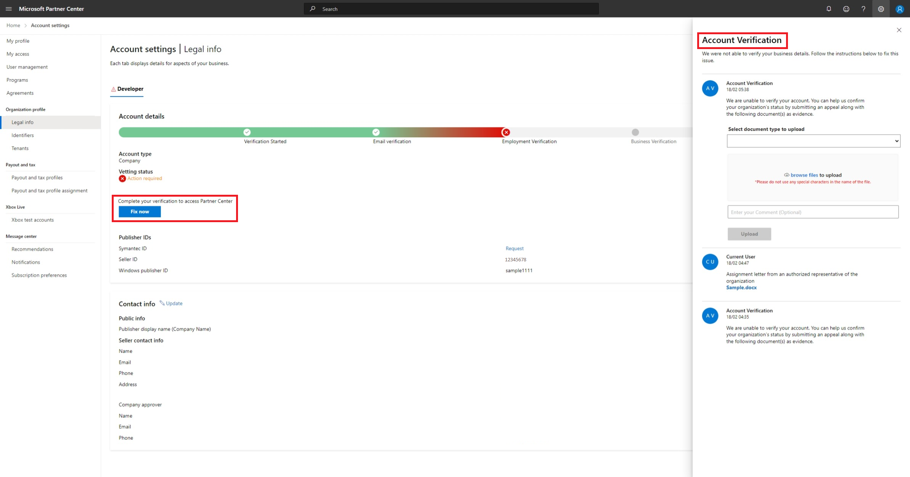

# Verify the company account information associated with your Microsoft Partner Center account

When you enroll in the Microsoft Edge program on Partner Center to publish extensions or change legal details in your profile, Microsoft verifies the information that you provide. This information can include your company name, company address, and primary contact details. During the verification process, Microsoft might send email to your primary contact to request confirmation of the information that was provided.

You can go to [Legal info](https://partner.microsoft.com/dashboard/account/v3/organization/legalinfo#developer) in Partner Center to monitor verification status for the Microsoft Edge Developer program.

When account verification is complete, you can use your Partner Center dashboard to publish your extension to the Microsoft Edge Add-ons website.

Verification usually takes three to five business days. If more than five days have passed, you can contact [Microsoft Edge Extensions support](/microsoft-edge/extensions-chromium/publish/contact-extensions-team/) for help.

<!-- ====================================================================== -->
## What is verified and what is required for a company account?

This section describes the types of verification, what is verified, and suggestions for meeting verification requirements.

#### Verify Email ownership

Email ownership verifies that the primary contact (primary email) address is valid.

* The primary contact email address must be a work account that is monitored and can send and receive email.
* Don't use a personal email address.  You must use an email address associated with a company domain, such as \<alias\>@contoso.com.
* Don't use a tenant user credential that's not associated with email, such as \<alias\>@contoso on microsoft.com.

##### Suggestions

Be sure to flag email from Microsoft.com as a **safe** domain, and check your junk email folders.

If you don't receive the email ownership verification email message within one business day, you can ask us to send the email again. On to your Partner Center account, go to **Home > Account settings**. On the **Account settings | My profile** page, select **Resend verification email**.

#### Verify Employment

Employment verification confirms that your primary contact is an employee of the enrolling company and that the domain entered in the registration form belongs to the enrolling company. The following information is used to verify employment:

* The company's public website has the same domain that was entered in the registration form.
* The contact has an active email address on an email domain owned by the company.

##### Suggestions

For verification proof, you can submit a screenshot of the website showing the name, address, contact information, and domain of the organization.

If employment verification is rejected, or if the domain of the registered email isn't the same as the employer's public domain, you must provide documentation ***confirming your email domain is under the ownership of your employer***, in the form of:

* Assignment letter from an authorized representative of the organization.
* Domain ownership records, such as [whois](https://www.whois.com/whois).
* Domain purchase invoices or registry confirmation records.

#### Verify Business

Business verification confirms that the enrolling company is a legitimate business entity and at the address in the application.

##### Suggestions

Submit one of the following documents for business verification:

* Formation documents, such as articles of incorporation, or partnership deed.
* Franchise or agency appointment letters.
* Government issued letter, license, business registration, or tax registration certificate.
* Lease or tenancy documents.
* Letter or statement from a financial institution or a utility company.
* Record on a Government registry website. The site/link must be displayed.
* Stock exchange filings or tax filing records.
* External company databases, such as Dun & Bradstreet (DUNS ID) or state registry.
* Receipt from the company's home country/region, municipality.

Confirm that the company name and address in your [Legal business profile](https://partner.microsoft.com/dashboard/account/v3/organization/legalinfo#developer) don't have spelling errors or abbreviations. They must match your formal company business registration records exactly. If appropriate, select the match found in external company databases, such as Dun & Bradstreet (DUNS ID) or state registry.

Microsoft uses these documents to verify that the company is authorized to do business under that name, and that it's located at the address that was provided. For further assistance, go to your profile page to upload more proofs through the interactive vetting experience. For more information, see [Checking your verification status](#checking-your-verification-status).

<!-- ====================================================================== -->
## Checking your verification status

You can check verification status at Partner Center in **[Account Settings | Legal Info](https://partner.microsoft.com/dashboard/account/v3/organization/legalinfo#developer)**, where you can see:

1. One or more tabs such as **Partner**, **Developer**, or **Reseller**, depending on the programs in which your organization is enrolled.
1. The **Developer** tab includes the **Account details** progress bar showing the stages of verification and any pending stages.
1. Your verification status: **Pending**, **Authorized/Accepted**, or **Action Required/Rejected**, with a status icon. For more information, see [Verification status](#verification-status).
1. The **Legal business profile** progress bar with an information icon you can select to get more information.
1. A **Fix now** button to start resolving verification issues.

<!-- ====================================================================== -->
## Verification status

There are three possible results when you check your verification status:

*   **Authorized/Accepted**: The information you submitted was verified, and you're notified of your acceptance into the program. No further action is required.

*   **Pending**: The verification process has started but isn't complete. If you've completed the email verification step, no further action is required on your part. Verification usually takes three to five business days. You can monitor verification status at **Account Settings | Legal Info**.

*   **Action Required/Rejected**: The information you submitted couldn't be verified. The reason, and instructions for how to appeal, appear in the **Account Verification** pane. See [Appealing a rejected application](#appealing-a-rejected-application) in the next section. 

<!-- ====================================================================== -->
## Appealing a rejected application

Use the following steps to appeal a rejected application:

1. At **[Account Settings | Legal Info](https://partner.microsoft.com/dashboard/account/v3/organization/legalinfo#developer)**, select **Fix now**.
1. In **Account Verification**, from **Select document type to upload**, select the type of document that you want to upload for verification.
1. In **Enter your comment**, you can enter more information about your appeal.
1. Select **Upload**.

The amount of time required to review an appeal varies. You can return to **[Account Settings | Legal Info](https://partner.microsoft.com/dashboard/account/v3/organization/legalinfo#developer)** to check verification status at any time. Verification status is **Pending** during the review.

> [!NOTE]
> Switching back to an individual account from an enterprise account isn't possible. Refer to the documentation to make an informed decision.

<!-- ====================================================================== -->
## Next steps

To view your verification status, go to [Partner Center](https://partner.microsoft.com/dashboard/microsoftedge/public/login?ref=dd) and then select **Account settings**.  You can keep building, testing, and preparing your submissions while you wait for the verification process to finish. Review the following extension documents:

*  [Extension concepts and architecture](../getting-started/index.md) - Gives an overview of extensions and basic publishing information.

*  [Publish an extension](publish-extension.md) - Provides detailed information and steps for publishing an extension.

*  [Add users to the Microsoft Edge program](aad-account.md) - Describes how to add more users to your Microsoft Edge program and your Partner Center developer account.  To enable adding users, you associate your organization's Microsoft Entra ID account with your Microsoft account (MSA) on Partner Center.

