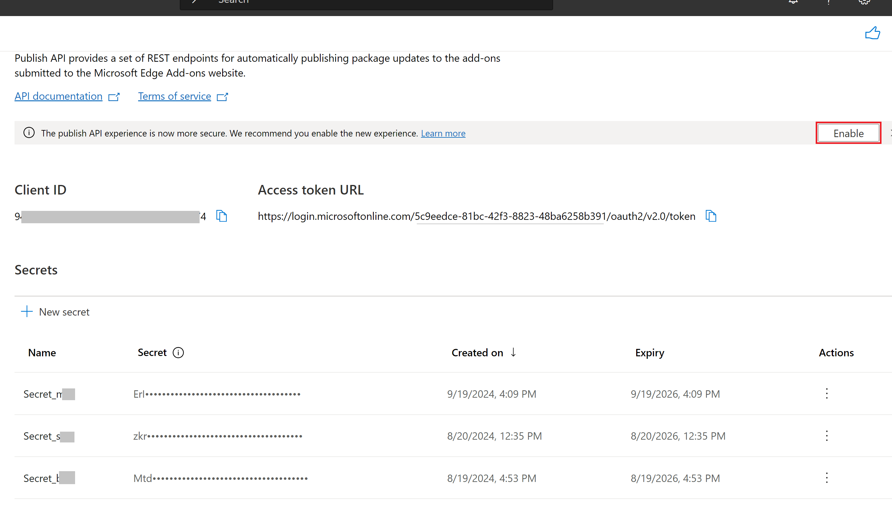
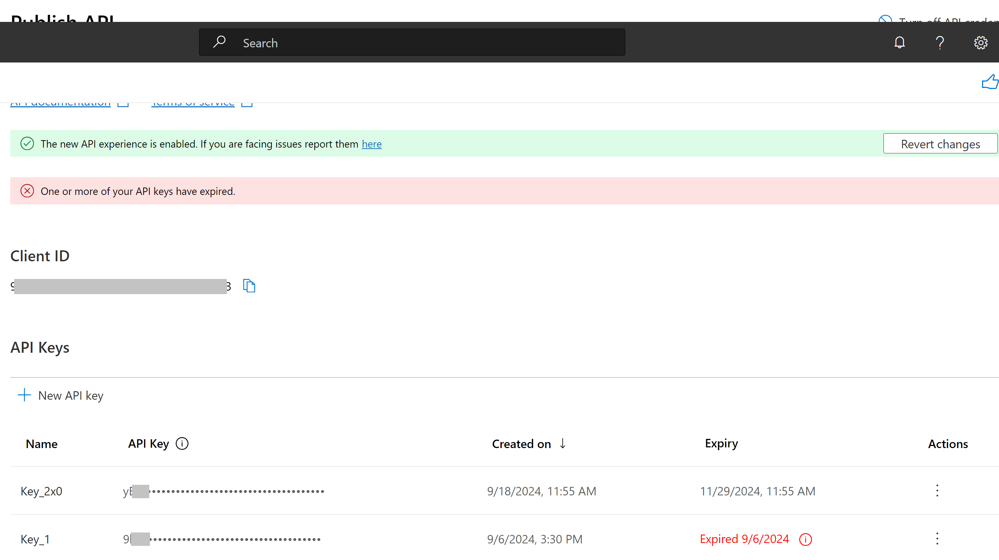

# Use the REST API to update an extension at Microsoft Edge Add-ons

Use this REST API to programmatically update an extension that's been published at [Microsoft Edge Add-ons](https://microsoftedge.microsoft.com/addons/), to automate the process of uploading and publishing new versions of your extension.  You can integrate these REST API endpoints directly into your continuous integration/continuous delivery (CI/CD) pipeline, to publish extension package updates at [Microsoft Edge Add-ons](https://microsoftedge.microsoft.com/addons/) without using Partner Center. 

This REST API exposes endpoints for:
* [Uploading a package to update an existing submission](#uploading-a-package-to-update-an-existing-submission)
* [Checking the status of a package upload](#checking-the-status-of-a-package-upload)
* [Publishing the submission](#publishing-the-submission)
* [Checking the publishing status](#checking-the-publishing-status)

These endpoints are described below.

To use this REST API, you first use the **Publish API** page at Partner Center to enable the API.

To initially publish a new extension, you use Partner Center.  To update the extension, either manually use Partner Center, or programmatically use this REST API.

To submit suggestions and feedback, enter an [Issue about the Add-ons API](https://github.com/MicrosoftDocs/edge-developer/issues/new?title=[Add-ons%20API]).


<!-- ------------------------------ -->
#### Versions of the Update REST API

As of September 6, 2024, both v1.1 and v1 of this Update REST API are supported.  Support for v1 will end on December 31, 2024.


<!-- ---------- -->
###### Components used

##### [v1.1](#tab/v1-1)

v1.1 uses an API key.  The UI in Partner Center provides API keys.

The REST endpoints use specific request headers for v1.1.

##### [v1](#tab/v1)

v1 requires sending an access token to the API endpoint.  You obtain the access token by sending a POST message to an access token URL.  The Partner Center UI shows the access token URL.

v1 uses Secrets.  The UI in Partner Center provides Secrets.

The REST endpoints use specific request headers for v1.

---


<!-- ---------------------------------- -->
#### Overview of using the Update REST API

To use the Update REST API:

##### [v1.1](#tab/v1-1)

1. At your [Partner Center developer dashboard](https://partner.microsoft.com/dashboard/microsoftedge/public/login?ref=dd), opt-in to the UI that uses API keys, by clicking the **Enable** button next to **enable the new experience**.  Details are in [Enable the Update REST API at Partner Center](#enable-the-update-rest-api-at-partner-center), below.

1. Write down the Client ID and the new API key.

1. Update your authentication workflows, if needed.

1. Re-configure any continuous integration/continuous delivery (CI/CD) pipelines that might be impacted by any changes to the API key, such as if you're changing from using v1 of this REST API, which uses access tokens instead of API keys.

1. When you use a REST endpoint, specify the ClientID and API key in the request header.  Details are in [Using the API endpoints](#using-the-api-endpoints), below.

##### [v1](#tab/v1)

1. At your [Partner Center developer dashboard](https://partner.microsoft.com/dashboard/microsoftedge/public/login?ref=dd), get an access token from the access token URL.  Details are in [Enable the Update REST API at Partner Center](#enable-the-update-rest-api-at-partner-center), below.

1. Generate your ClientID and secrets.  You can generate multiple client secrets for your Client ID.  For example, you can create multiple secrets for multiple projects.

1. Update your authentication workflows, if needed.

1. Re-configure any existing continuous integration/continuous delivery (CI/CD) pipelines that might be impacted by the changes to the access token URL.

1. Retrieve the access token.  Details are in [Retrieve the access token](#retrieve-the-access-token), below.

1. When you use a REST endpoint, specify the access token in the request header.  Details are in [Using the API endpoints](#using-the-api-endpoints), below.

---

Details are below.


<!-- ====================================================================== -->
## Terminology

| Term | Definition |
|---|---|
| _operation_ | A REST operation such as GET or POST. |
| _operation ID_ | The ID of a REST operation. |
| _package_ | The `.zip` package that contains the files for your Microsoft Edge Add-on. |
| _product_ | A Microsoft Edge extension or theme.  Also referred to as a Microsoft Edge _Add-on_. |
| _product ID_ | The product ID of the product whose draft needs to be published.  The product ID is a 128-bit GUID that is associated with a product at Partner Center.  For example: `d34f98f5-f9b7-42b1-bebb-98707202b21d`. |
| _submission_ | An update that is being submitted to an existing product at Partner Center.  Every update to a product is a submission, regardless of whether the status is `In Draft`, `In Review`, or `In the Store` (published). |


<!-- ====================================================================== -->
## Enable the Update REST API at Partner Center

To use the Microsoft Edge Add-ons API, you first need to enable the API for your project in the Microsoft Partner Center by creating API credentials, as follows:

##### [v1.1](#tab/v1-1)

1. At your [Partner Center developer dashboard](https://partner.microsoft.com/dashboard/microsoftedge/public/login?ref=dd), sign in to the account that you used to publish an add-on.

1. Under the **Microsoft Edge** program, select **Publish API**.

1. Next to the message "enable the new experience", click the **Enable** button:

   

   The above screenshot shows the v1 UI, including **Access token URL** and **Secrets**, prior to clicking the **Enable** button to switch to the v1.1 UI.

1. On the **Publish API** page, click the **Create API credentials** button.  This step may take a few minutes to finish.

   The Client ID and a new API key are automatically generated:

   

   The API credentials have now been created; you've enabled or renewed the API.  The following items are now displayed on the **Publish API** page:
   * Your **Client ID**.
   * **API Keys**.
      * The **Expiry** date for each API key.

1. Write down the following:
   * The **Client ID**.
   * The new **API key**.

   You'll use the Client ID and API key in the request header when using a REST endpoint.

##### [v1](#tab/v1)

1. At your [Partner Center developer dashboard](https://partner.microsoft.com/dashboard/microsoftedge/public/login?ref=dd), sign in to the account that you used to publish an add-on.

1. Under the **Microsoft Edge** program, select **Publish API**.

1. On the **Publish API** page, click the **Create API credentials** button.  This step may take a few minutes to finish.

   The API credentials have now been created; you've enabled or renewed the API.  The following items are now displayed on the **Publish API** page:
   * Your **Client ID**.
   * Your **Access token URL**.
   * **Client secrets**.
      * The **Expiry date** of each Secret.

   

1. Write down the following:
   * The **Client ID**.
   * The **Access token URL**.
   * The new **Client secret**.

   You'll use the Client ID, access token URL, and client secret to get an access token, per [Retrieve the access token](#retrieve-the-access-token), below .  You'll then use the access token in the request header when using a REST endpoint.

> [!IMPORTANT]
> Be sure to write down the client secret now, because it's only visible immediately after enabling or renewing the API (that is, after creating API credentials).  This particular secret isn't shown again.

You can generate multiple client secrets for your Client ID.  For example, you can create multiple secrets for multiple projects.


<!-- ---------------------------------- -->
#### Retrieve the access token

You obtain an access token by sending a POST message to an access token URL.  The Partner Center UI shows the access token URL, which is the same as in this article.  You then include the access token in the header when using an API endpoint, such as the endpoint for [Uploading a package to update an existing submission](#uploading-a-package-to-update-an-existing-submission), below.

<!-- 
After you've acquired the necessary authorization for your application, get access tokens for APIs.  To get a token (an OAuth token) by using the client credentials grant, send a POST request to the access token URL.  The tenant information is available in the access token URL that you received at Partner Center.
"acquired the necessary authorization" - not casual per corp style
"get access tokens" - plural or singular?  one token per endpoint?
"the client credentials grant" - unclear
"The tenant information" - meaning?  relevance?  which pieces of info, to use how?
"is available in the access token URL" - how is info available in the URL?  if accurate, specify which info in which part of url
-->

Description of the endpoint to use to get an access token:

```REST
Endpoint: https://login.microsoftonline.com/5c9eedce-81bc-42f3-8823-48ba6258b391/oauth2/v2.0/token
Type: POST
Header Parameters: Content-Type: application/x-www-form-urlencoded
```


<!-- ---------- -->
###### Sample request
<!-- to retrieve access token (v1 only) -->

For example, to get an access token, send a POST request to the access token URL, by entering a `curl` command at the command prompt, as follows:

```console
> curl \
-X POST \
-H "Content-Type: application/x-www-form-urlencoded" \
-d "client_id={$Client_ID}" \
-d "scope=https://api.addons.microsoftedge.microsoft.com/.default" \
-d "client_secret={$Client_Secret}" \
-d "grant_type=client_credentials" \
-v \
https://login.microsoftonline.com/5c9eedce-81bc-42f3-8823-48ba6258b391/oauth2/v2.0/token
```


<!-- ---------- -->
###### Sample response

An access token is returned to you, such as:

```json
{
  "token_type": "Bearer",
  "expires_in": 3599,
  "access_token": "eyJ0eXAiOiJKV1QiLCJhbGciOiJSUzI1NiIsIng1dCI6Ik1uQ19WWmNBVGZNNXBP..."
}
```

For more information, see [Get a token](/entra/identity-platform/v2-oauth2-client-creds-grant-flow#get-a-token) in _Microsoft identity platform and the OAuth 2.0 client credentials flow_.

---


<!-- ====================================================================== -->
## Using the API endpoints

The Update REST API exposes endpoints for:
* [Uploading a package to update an existing submission](#uploading-a-package-to-update-an-existing-submission)
* [Checking the status of a package upload](#checking-the-status-of-a-package-upload)
* [Publishing the submission](#publishing-the-submission)
* [Checking the publishing status](#checking-the-publishing-status)

These endpoints are introduced below.

To use this Microsoft Edge Add-ons Update REST API, you must have the following, per above:

##### [v1.1](#tab/v1-1)

An API key and a Client ID.

##### [v1](#tab/v1)

An access token.

---

The API is available at the endpoint root `https://api.addons.microsoftedge.microsoft.com`.

There aren't REST API endpoints for:
* Creating a new product.
* Updating a product's metadata, such as the description.

To create a new product or update a product's metadata, you must use Microsoft Partner Center.


<!-- ====================================================================== -->
## Uploading a package to update an existing submission
<!-- endpoint 1: POST /submissions/draft/package -->

Use this REST API endpoint to update the package for an add-on.  This API uploads a package to update an existing draft submission of an add-on product.

See also [Upload a package to update an existing submission](./addons-api-reference.md#upload-a-package-to-update-an-existing-submission) in _REST API Reference for updating an extension at Microsoft Edge Add-ons_.


<!-- ---------------------------------------------- -->
#### Endpoint description

##### [v1.1](#tab/v1-1)

```REST
Endpoint: /v1/products/$productID/submissions/draft/package
Type: POST
Header Parameters: Authorization: ApiKey $ApiKey; X-ClientID: $ClientID; Content-Type: application/zip
Body content: the package file to upload
```

##### [v1](#tab/v1)

```REST
Endpoint: /v1/products/$productID/submissions/draft/package
Type: POST
Header Parameters: Authorization: Bearer $TOKEN; Content-Type: application/zip
Body content: the package file to upload
```

---

`$productID` is the product ID of the Microsoft Edge Add-on that you want to update. 

To get the product ID:

1. Sign in to your [Partner Center developer dashboard](https://partner.microsoft.com/dashboard/microsoftedge/public/login?ref=dd).

1. Go to **Microsoft Edge** > **Overview**.

1. Select the extension for which you want the product ID.

   The **Extension overview** page opens.  The product ID is shown in the page.  (The product ID is also shown as the GUID in the URL in the Address bar, between `microsoftedge/` and `/packages`.)
 
1. In the **Extension identity** section (or from the Address bar), select and copy the **Product ID**.


<!-- ---------------------------------- -->
#### Sample request
<!-- for endpoint 1 -->

To upload a package to update an existing submission, use the `curl` command at a command prompt as follows:

##### [v1.1](#tab/v1-1)

```console
> curl \
-H "Authorization: ApiKey $ApiKey" \
-H "X-ClientID: $ClientID" \
-H "Content-Type: application/zip" \
-X POST \
-T $FILE_NAME \
-v \
https://api.addons.microsoftedge.microsoft.com/v1/products/$productID/submissions/draft/package
```

##### [v1](#tab/v1)

```console
> curl \
-H "Authorization: Bearer $TOKEN" \
-H "Content-Type: application/zip" \
-X POST \
-T $FILE_NAME \
-v \
https://api.addons.microsoftedge.microsoft.com/v1/products/$productID/submissions/draft/package
```

---

If the request succeeds and the update process begins, you receive a `202 Accepted` response status code with a `Location` header.  This location header contains the `operationID` that's required for checking the status of the update operation.


See also:
* [Upload a package to update an existing submission](./addons-api-reference.md#upload-a-package-to-update-an-existing-submission) in _REST API Reference for updating an extension at Microsoft Edge Add-ons_.


<!-- ====================================================================== -->
## Checking the status of a package upload
<!-- endpoint 2: GET submissions/draft/package/operations/$operationID -->

Use this API to check the status of package upload.

`$operationID` is the operation ID that's returned in the response header from [Uploading a package to update an existing submission](#uploading-a-package-to-update-an-existing-submission) or [Publishing the submission](#publishing-the-submission).

See also [Check the publishing status](./addons-api-reference.md#check-the-publishing-status) in _REST API Reference for updating an extension at Microsoft Edge Add-ons_.


<!-- ---------------------------------------------- -->
#### Endpoint description

##### [v1.1](#tab/v1-1)

```REST
Endpoint: /v1/products/$productID/submissions/draft/package/operations/$operationID
Type: GET
Header Parameters: Authorization: ApiKey $ApiKey; X-ClientID: $ClientID
```

##### [v1](#tab/v1)

```REST
Endpoint: /v1/products/$productID/submissions/draft/package/operations/$operationID
Type: GET
Header Parameters: Authorization: Bearer $TOKEN
```

---


<!-- ---------------------------------- -->
#### Sample request
<!-- for endpoint 2 -->

To check the status of a package upload, use the `curl` command at the command prompt as follows:

##### [v1.1](#tab/v1-1)

```console
> curl \
-H "Authorization: ApiKey $ApiKey" \
-H "X-ClientID: $ClientID" \
-X GET \
-v \
https://api.addons.microsoftedge.microsoft.com/v1/products/$productID/submissions/draft/package/operations/$operationID
```

##### [v1](#tab/v1)

```console
> curl \
-H "Authorization: Bearer $TOKEN" \
-X GET \
-v \
https://api.addons.microsoftedge.microsoft.com/v1/products/$productID/submissions/draft/package/operations/$operationID
```

---

See also:
* [Check the status of a package upload](./addons-api-reference.md#check-the-status-of-a-package-upload) in _REST API Reference for updating an extension at Microsoft Edge Add-ons_.


<!-- ====================================================================== -->
## Publishing the submission
<!-- endpoint 3: POST /submissions -->

Use this API to publish the current draft of the product at [Microsoft Edge Add-ons](https://microsoftedge.microsoft.com/addons/).

See also [Publish the product draft submission](./addons-api-reference.md#publish-the-product-draft-submission) in _REST API Reference for updating an extension at Microsoft Edge Add-ons_.


<!-- ---------------------------------------------- -->
#### Endpoint description

##### [v1.1](#tab/v1-1)

```REST
Endpoint: /v1/products/$productID/submissions
Type: POST
Header Parameters: Authorization: ApiKey $ApiKey; X-ClientID: $ClientID
Body content: Notes for certification, in JSON format
```

##### [v1](#tab/v1)

```REST
Endpoint: /v1/products/$productID/submissions
Type: POST
Header Parameters: Authorization: Bearer $TOKEN
Body content: Notes for certification, in JSON format
```

---


<!-- ---------------------------------- -->
#### Sample request
<!-- for endpoint 3 -->

To publish the submission, use the `curl` command at the command prompt as follows:

##### [v1.1](#tab/v1-1)

```console
> curl \
-H "Authorization: ApiKey $ApiKey" \
-H "X-ClientID: $ClientID" \
-X POST \
-d '{ "notes"="text value" }' \
-v \
https://api.addons.microsoftedge.microsoft.com/v1/products/$productID/submissions
```

##### [v1](#tab/v1)

```console
> curl \
-H "Authorization: Bearer $TOKEN" \
-X POST \
-d '{ "notes"="text value" }' \
-v \
https://api.addons.microsoftedge.microsoft.com/v1/products/$productID/submissions
```

---

If the request succeeds and the publishing process begins, you'll receive a `202 Accepted` response status code with a `Location` header.  This location header contains the `operationID` that's required for checking the status of the publish operation.

See also:
* [Publish the product draft submission](./addons-api-reference.md#publish-the-product-draft-submission) in _REST API Reference for updating an extension at Microsoft Edge Add-ons_.


<!-- ====================================================================== -->
## Checking the publishing status
<!-- endpoint 4: GET /submissions/operations/$operationID -->

Use this API to check the status of the publish operation.

`$operationID` is the operation ID that's returned in the response header from [Uploading a package to update an existing submission](#uploading-a-package-to-update-an-existing-submission) or [Publishing the submission](#publishing-the-submission).

See also [Check the publishing status](./addons-api-reference.md#check-the-publishing-status) in _REST API Reference for updating an extension at Microsoft Edge Add-ons_.


<!-- ---------------------------------------------- -->
#### Endpoint description

##### [v1.1](#tab/v1-1)

```REST
Endpoint: /v1/products/$productID/submissions/operations/$operationID
Type: GET
Header Parameters: Authorization: ApiKey $ApiKey; X-ClientID: $ClientID
```

##### [v1](#tab/v1)

```REST
Endpoint: /v1/products/$productID/submissions/operations/$operationID
Type: GET
Header Parameters: Authorization: Bearer $TOKEN
```

---


<!-- ---------------------------------- -->
#### Sample request
<!-- for endpoint 4 -->

To check the publishing status, use the `curl` command at the command prompt as follows:

##### [v1.1](#tab/v1-1)

```console
> curl \
-H "Authorization: ApiKey $ApiKey" \
-H "X-ClientID: $ClientID" \
-X GET \
-v \
https://api.addons.microsoftedge.microsoft.com/v1/products/$productID/submissions/operations/$operationID
```

##### [v1](#tab/v1)

```console
> curl \
-H "Authorization: Bearer $TOKEN" \
-X GET \
-v \
https://api.addons.microsoftedge.microsoft.com/v1/products/$productID/submissions/operations/$operationID
```

---

See also:
* [Check the publishing status](./addons-api-reference.md#check-the-publishing-status) in _REST API Reference for updating an extension at Microsoft Edge Add-ons_.


<!-- ====================================================================== -->
## See also
<!-- all links in article -->

* [REST API Reference for updating an extension at Microsoft Edge Add-ons](./addons-api-reference.md) - REST API for updating an extension.
* [Supported APIs for Microsoft Edge extensions](../../developer-guide/api-support.md) - JavaScript APIs for developing an extension.

GitHub:
* [Issues](https://github.com/MicrosoftDocs/edge-developer/issues/) in `edge-developer` repo for Microsoft Edge Developer docs.

Microsoft identity platform:
* [Microsoft identity platform and the OAuth 2.0 client credentials flow](/entra/identity-platform/v2-oauth2-client-creds-grant-flow)
