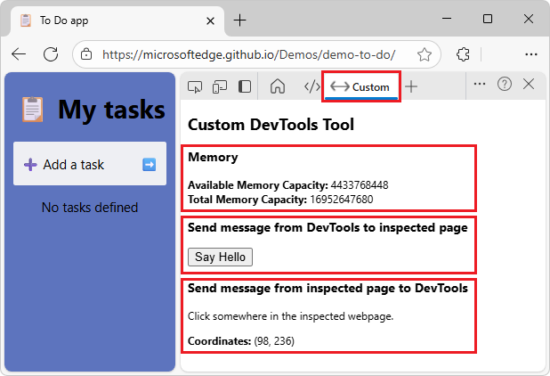
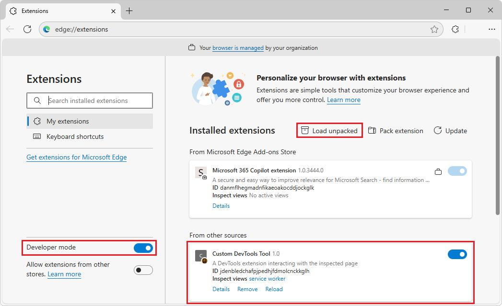
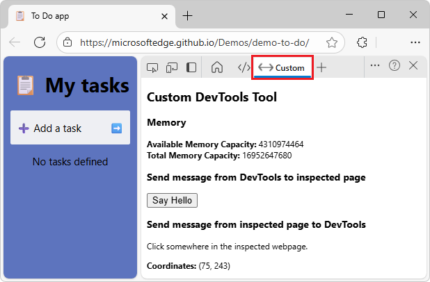
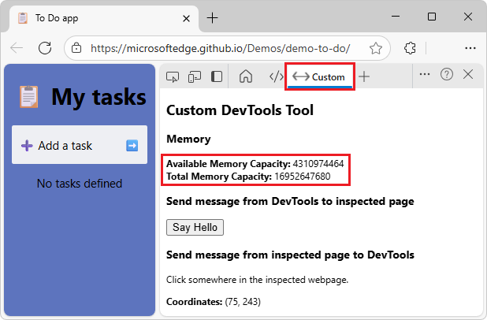
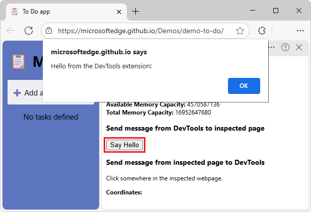
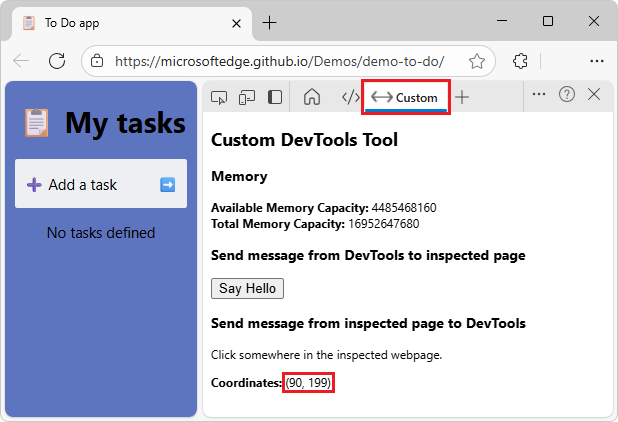
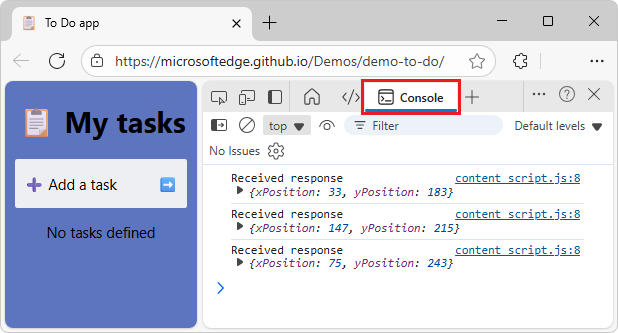
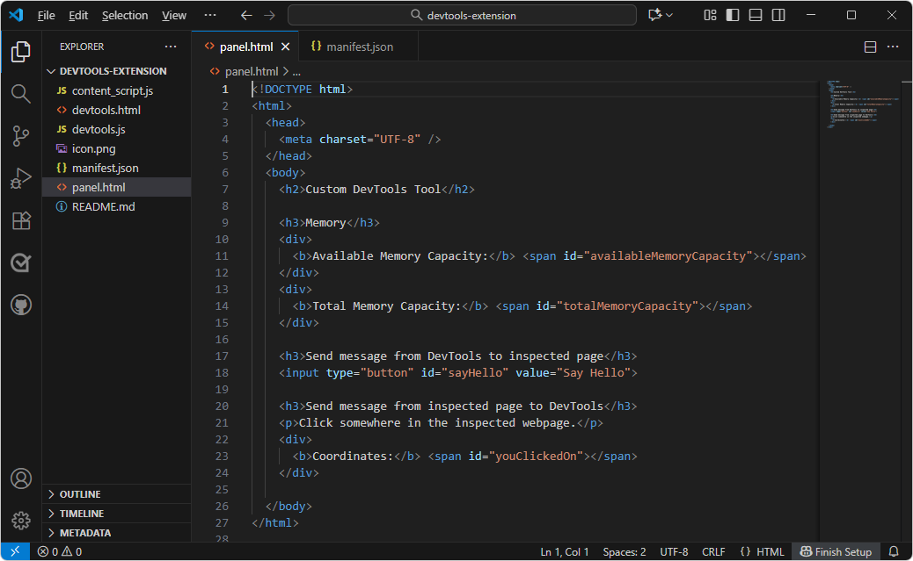
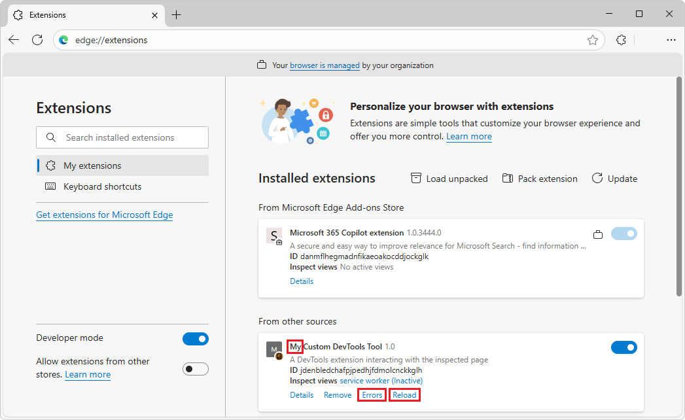
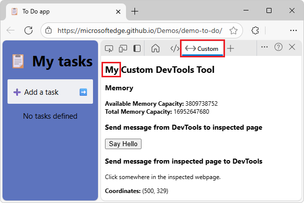

# Sample: Custom DevTools tool
<!-- https://learn.microsoft.com/microsoft-edge/extensions/developer-guide/devtools-extension-sample -->

The sample "Custom DevTools tool" is a Microsoft Edge extension that adds a **Custom** tool in Microsoft Edge DevTools, which has its own tab in the **Activity Bar**.


<!-- ====================================================================== -->
## Introduction

The Custom DevTools Tool adds a **Custom** tool tab and panel in DevTools within Microsoft Edge:



The **Custom** tool displays memory information, and sends messages between the inspected webpage and the panel in DevTools.

The **Custom** DevTools tool calls the DevTools API to display memory information.

The webpage under inspection, and the **Custom** DevTools tool, send messages to each other.

Use this article to download, install, and run the sample.  To learn more about the code in this sample, see [Add a custom tool in Microsoft Edge DevTools](./devtools-extension.md).


<!-- ====================================================================== -->
## Step 1: Download the sample

If not done yet, download the "main" branch of the Demos repo, or clone (or fork and clone) the repo.  Downloading the repo is simplest, and is described below.

Download the "main" branch of the Demos repo, as follows:

1. In Microsoft Edge, go to the [MicrosoftEdge / Demos](https://github.com/MicrosoftEdge/Demos) repo.

1. Click the down arrow in the **Code** button, and then select **Download ZIP**.

1. In Microsoft Edge, the **Downloads** dialog shows `Demos-main.zip`.  "-main" is added, meaning a static snapshot of the "main" branch of the repo.

1. Hover to the right of `Demos-main.zip`, and then click the **Show in folder**  button.

   File Explorer opens, displaying the **Downloads** folder.

1. Right-click `Demos-main.zip`, and then select **Extract all**.

   The **Extract Compressed (Zipped) Folders** dialog opens.

1. Click the **Extract** button.

   The **% complete** dialog opens, and then finishes.

1. Move the `Demos-main` folder to a GitHub repos location, such as `C:\Users\localAccount\GitHub`.


<!-- ====================================================================== -->
## Step 2: Install the extension to add the tool in DevTools

1. In Microsoft Edge, open a new window or tab.

1. Select **Settings and more** (), hover over **Extensions**, and then select **Manage extensions**.

   The **Extensions** tab and page opens (`edge://extensions`).

1. Turn on the **Developer mode** toggle.

1. Click  **Load unpacked**.

   The **Select the extension directory** dialog opens.

1. Navigate to the `/Demos-main/devtools-extension` folder, such as `C:\Users\localAccount\GitHub\Demos-main\devtools-extension\`, and then click the **Select Folder** button.<!-- actually used forked cloned /Demos/ dir, a working branch, which has latest version of sample -->

   The **Custom DevTools Tool** card is displayed:

   


<!-- ====================================================================== -->
## Step 3: Select the Custom tool in DevTools

1. In Microsoft Edge, go to a webpage, such as the [To Do app](https://microsoftedge.github.io/Demos/demo-to-do/), in a new window or tab.

   The **Custom** DevTools tool requires a webpage, not an empty tab.

1. Right-click the webpage, and then select **Inspect**.

   DevTools opens.

1. In the **Activity Bar** of DevTools, click the **Custom** () tool's tab.

   The **Custom** tool tab and panel are displayed:

   

   If the **Custom** () tool's tab isn't visible, do any of the following:

   * Click the **More tools** () button, and then select  **Custom**.

   * Make DevTools wider, and then click the **Custom** () tool's tab.

   The custom DevTools page has several sections:

   * Memory display information.

   * A button to send a message from DevTools to the inspected webpage, to make the page display a JavaScript `alert` dialog.

   * A **Coordinates** display area, to send a message from the inspected webpage to the DevTools **Console** and **Custom** tools.


<!-- ====================================================================== -->
## Step 4: View memory information by using an extension API call

* In the **Custom** tool, next to **Available Memory Capacity**, observe the once-per-second updating of the value:

   


<!-- ====================================================================== -->
## Step 5: Send message from DevTools to inspected page

1. In the **Custom** tool, click the **Say Hello** button.

   A JavaScript `alert` dialog opens, displaying the message: "Hello from the DevTools extension!"

   

   DevTools sends a message to the inspected webpage, causing JavaScript to display an alert.

1. Click the **OK** button.

   The dialog closes.


<!-- ====================================================================== -->
## Step 6: Send message from inspected page to DevTools

1. In the inspected webpage, click various spots.

   In the **Custom** tool, next to **Coordinates**, the coordinates are displayed and updated while you click around:

   

1. In DevTools, in the **Activity Bar**, select the **Console** () tool.

1. In the inspected webpage, click various spots.

   The clicked coordinates are displayed in the **Console**:

   


<!-- ====================================================================== -->
## Step 7: Modify the Custom tool

1. If not done already, install [Visual Studio Code](https://code.visualstudio.com).

1. Open Visual Studio Code.

1. Click the **File** menu, and then click **Open Folder**.

   The **Open Folder** dialog opens.

1. Navigate to the `/Demos-main/devtools-extension/` folder, such as `C:\Users\localAccount\GitHub\Demos-main\devtools-extension\`, and then click the **Select Folder** button.<!-- actually used forked cloned /Demos/ dir, a working branch, which has latest version of sample -->

   In the **Explorer** pane, the `/devtools-extension/` folder is displayed.

1. Click `panel.html`.

   `panel.html` is opened for editing:

   

1. Add "My" to the `<h2>` heading; change from:

   ```html
   <h2>Custom DevTools Tool</h2>
   ```

   to:  

   ```html
   <h2>My Custom DevTools Tool</h2>
   ```

1. Save `panel.html`.

1. In the **Explorer** pane, click `manifest.json`.

   `manifest.json` is opened for editing.

1. Add "My" to the `name`; change from:

   ```json
   "name": "Custom DevTools Tool",
   ```

   to:  

   ```json
   "name": "My Custom DevTools Tool",
   ```

1. Save `manifest.json`.


<!-- ====================================================================== -->
## Step 8: Reload the modified Custom tool

1. In Microsoft Edge, select **Settings and more** (), hover over **Extensions**, and then select **Manage extensions**.

   The **Extensions** tab and page opens (`edge://extensions`).

1. In the **Custom DevTools Tool** card, click the **Reload** link.

   The card now shows **My Custom DevTools Tool** as the name of the extension:

   


<!-- ====================================================================== -->
## Step 9: Use the modified Custom tool

1. Go to a webpage, such as the [To Do app](https://microsoftedge.github.io/Demos/demo-to-do/), in a new window or tab.

   The **Custom** DevTools tool requires a webpage, not an empty tab.

1. Right-click the webpage, and then select **Inspect**.

   DevTools opens.

1. In the **Activity Bar** of DevTools, click the **Custom** () tool's tab.

   The **Custom** tool is displayed, with the word **My** added to the heading in the panel:

   

   If the title still says **Custom DevTools Tool** instead of **My Custom DevTools Tool**, close and reopen DevTools.

   If the **Custom** () tool's tab isn't visible, do any of the following:

   * Click the **More tools** () button, and then select  **Custom**.

   * Make DevTools wider, and then click the **Custom** () tool's tab.

This is the end of the steps to use and modify the DevTools Extension sample.


<!-- ====================================================================== -->
## Troubleshooting

If the **Custom** tab isn't visible in DevTools, or it's outdated and doesn't show your latest code changes:

* Make DevTools wide, to show many tools in the **Activity Bar**.

* Close and reopen DevTools.

* Refresh or hard-refresh the inspected page.

* In Microsoft Edge, in the **Extensions** page, click **Reload** for the extension.

* If no icon is provided in such an extension, the tab when not selected is narrow and gray, on the right side of the **Activity Bar**.  Click the narrow gray tab.

* Go to a webpage, not an empty tab.  The code in the sample "Custom DevTools tool" requires a webpage.

When the **Activity Bar** is narrow, the Custom Devtools tool is added to the **More tools** menu on the **Activity Bar**.

The **Custom** tab doesn't have a **Remove from Activity Bar** command on the right-click menu.


<!-- ====================================================================== -->
## See also
<!-- todo: all links in article -->
