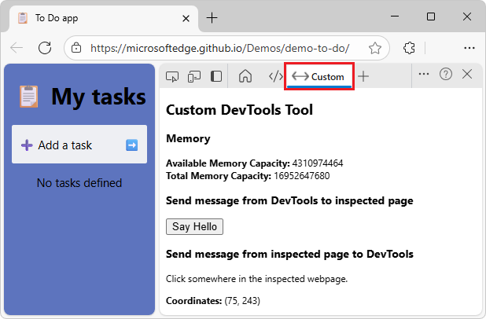

# Create a DevTools extension, adding a custom tool tab and panel
<!-- live: https://learn.microsoft.com/microsoft-edge/extensions/developer-guide/devtools-extension -->
<!-- equiv: https://developer.chrome.com/docs/extensions/how-to/devtools/extend-devtools#devtools_extension_examples -->

todo: strategy: first get familiar with the sample's code: purpose of the 8 files:
1. move all info about specific files to the Code article
2. arrange all info into a nice format in the Code article
3. design the Background article, after understand the code

To add a custom tool in Microsoft Edge DevTools, create a Microsoft Edge extension.

The DevTools Extension sample displays a custom tool in DevTools, including a **Custom** tab in the **Activity Bar** and a panel connected to the tab:

A basic extension for Microsoft Edge consists of a manifest file (`manifest.json`).

An extension that extends DevTools additionally includes a webpage file, `devtools.html`, that just loads `devtools.js`

A _panel_ is a tool page in Microsoft Edge DevTools, along with the tool's tab in the **Activity Bar**.

To create a basic DevTools extension with a sample panel; to create a new panel (tool tab) in DevTools, by adding `devtools.js` and `panel.html`.

That's in addition to the more basic files, which are:
* `devtools.html`
* `manifest.json`

See also:
* [Overview of DevTools](../../devtools/overview.md)<!-- long jump -->
* [Sample: Custom DevTools tool](../samples/custom-devtools-tool.md)
* [Code for Custom DevTools tool](../samples/custom-devtools-tool-code.md)

Loading and testing an Edge extension locally is sometimes called _sideloading_ an extension, as opposed to distributing an extension to users.

See also:
* [Sideload an extension to install and test it locally](../getting-started/extension-sideloading.md)

<!-- ====================================================================== -->
## Display memory information by calling extension APIs

Use extension APIs to display memory information in your DevTools panel.

`permissions` is in the manifest file, the panel interface, and the devtools script.

* `devtools.html`
* `devtools.js` - `permissions`
* `manifest.json` - `permissions`
* `panel.html`

<!-- ====================================================================== -->
## Interact between the webpage and DevTools

Code that interacts with the inspected webpage.  That code does the following:

1. Listen to click events that happen on the webpage and log them into the DevTools **Console** tool.

1. Display the mouse click position in the DevTools extension panel.

1. When the user clicks a button in the DevTools extension panel, display a greeting alert in the inspected webpage.

The DevTools tool (panel) that you created so far doesn't have direct access to the inspected webpage, and doesn't run until DevTools is opened.  For this you will use a content script and a background service worker.

* A _content script_ runs in the context of the inspected webpage.  In the same way that other scripts are loaded by the webpage, a content script has have access to the DOM and can change it.
* A _background service worker_ is a script that the browser runs in a separate thread.  This script has access to the Microsoft Edge extension APIs.

The DevTools page, inspected page, content script, and background service worker fit together in an extension:

Detect the user clicks on a webpage by using a content script.  The content script relays this info to the `devtools.js` file, where the data will be displayed in both the console and the DevTools extension panel.

<!-- ====================================================================== -->
## Troubleshooting
<!-- add to [Create a DevTools extension, adding a custom tool tab and panel](../developer-guide/devtools-extension.md) ? -->

If the **Custom** tab isn't visible in DevTools, or it's outdated and doesn't show your code changes:

* Make DevTools wide, to show many tools in the **Activity Bar**.

* Close and reopen DevTools.

* Refresh or hard-refresh the inspected page.

* In Microsoft Edge, in the **Extensions** page, click **Reload** for the extension.

* If no icon is provided in such an extension, the tab when not selected is narrow and gray, on the right side of the **Activity Bar**.  Click the narrow gray tab.

* Go to a webpage, not an empty tab.  The code in the **Custom** DevTools tool requires a webpage.

Custom Devtools tools are added to the **More tools** menu on the **Activity Bar** when the **Activity Bar** is narrow.  The tool's tab doesn't have a **Remove from Activity Bar** command on the right-click menu.

<!-- ====================================================================== -->
## See also
<!-- todo: all links in article -->

* [Samples for Microsoft Edge extensions](../samples.md)
* [Samples for Microsoft Edge extensions](../samples.md)<!-- link not in article -->
* [Manifest V3](https://developer.chrome.com/docs/extensions/mv3)
* [Extending DevTools](https://developer.chrome.com/docs/extensions/mv3/devtools/)
* [CDP API Reference](https://developer.chrome.com/docs/extensions/reference/)
* [Overview of DevTools](../../devtools/overview.md)
* [Sample: Picture viewer pop-up webpage](../getting-started/picture-viewer-popup-webpage.md)
* [Overview and timelines for migrating to Manifest V3](../developer-guide/manifest-v3.md)
* [Sideload an extension to install and test it locally](../getting-started/extension-sideloading.md)

Chrome docs:
* [Manifest reference](https://developer.chrome.com/docs/extensions/reference#manifest-reference)
* [Extend DevTools](https://developer.chrome.com/docs/extensions/how-to/devtools/extend-devtools)
* [Chrome Extensions Reference](https://developer.chrome.com/docs/extensions/reference/)
   * [chrome.devtools.panels](https://developer.chrome.com/docs/extensions/reference/api/devtools/panels)
      * [create()](https://developer.chrome.com/docs/extensions/reference/api/devtools/panels#method-create)
* [Content scripts](https://developer.chrome.com/docs/extensions/develop/concepts/content-scripts)

GitHub:
* [Download Demos-main.zip](https://codeload.github.com/MicrosoftEdge/Demos/zip/refs/heads/main)
* [/devtools-extension/](https://github.com/MicrosoftEdge/Demos/tree/main/devtools-extension/) - source code.

Tools:
* [Visual Studio Code](https://code.visualstudio.com)

<!-- https://developer.chrome.com/docs/extensions/reference/api/system/memory#method-getInfo -->
