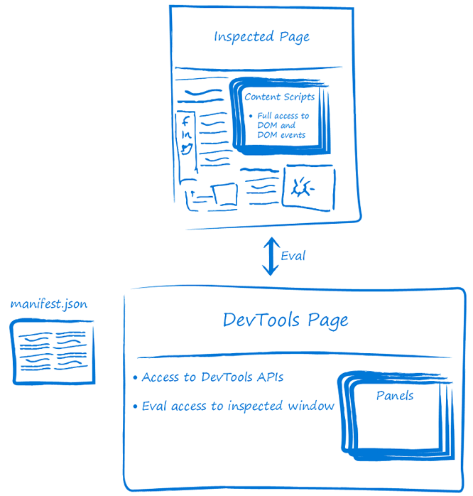

# Add a custom tool in Microsoft Edge DevTools
<!-- https://learn.microsoft.com/microsoft-edge/extensions/developer-guide/devtools-extension -->
<!-- upstream equiv: https://developer.chrome.com/docs/extensions/how-to/devtools/extend-devtools#devtools_extension_examples -->

This article describes the code of the Custom DevTools sample.  To first install and run the sample, see [Sample: Custom DevTools tool](./devtools-extension-sample.md).


<!-- ====================================================================== -->
## Introduction

Like a regular extension, a DevTools extension has a manifest file.  That's described in [Get started developing an extension](../getting-started/index.md), which presents a basic extension sample that you can start with.

An extension that extends DevTools additionally includes:
* A rendered HTML file to display in the tool's panel in DevTools.
* A non-rendered HTML file that's run when DevTools is opened, that just loads a DevTools .js file.

The present article explains the code in [Sample: Custom DevTools tool](./devtools-extension-sample.md).

To add a custom tool in Microsoft Edge DevTools, create a Microsoft Edge extension that adds a custom tool in Microsoft Edge DevTools, including a tool tab and panel.

This DevTools extension sample communicates between DevTools and the inspected webpage, and calls DevTools APIs.

The DevTools Extension sample displays a custom tool in DevTools, including a **Custom** tab in the **Activity Bar** and a panel that's connected to the tab:


A _panel_ is a tool page in Microsoft Edge DevTools, along with the tool's tab in the **Activity Bar**.

See also:
* [Sample: Picture viewer pop-up webpage](../samples/picture-viewer-popup-webpage.md)
* [Overview of DevTools](../../devtools/overview.md)<!-- long jump -->


<!-- ====================================================================== -->
## Overview of files

The DevTools extension sample has the following files:

| File | Description |
|---|---|
| `manifest.json` | Information about the extension: name, description, version, manifest version, and HTML page to show in DevTools. |
| `panel.html` | Webpage to display in the custom panel in DevTools. |
| `devtools.html` | A non-rendered HTML file that's run when DevTools is opened, to load the extension's JavaScript files. |
| `devtools.js` | Main logic for the custom DevTools page. |
| `service-worker.js` | A service worker that sets up event listeners for communications between the inspected page and DevTools. |
| `content_script.js` | Code which the custom DevTools tool injects in the inspected webpage.  Prints a message<!-- todo: what message? --> to the console when the script is injected in the page.  Adds a click event listener to the page that will send a message with mouse-click position in the inspected page. |
| `icon.png` | Icon to display on the tool's tab in the Activity bar of DevTools and in the **More tools** menu. |
| `README.md` | Basic information for developers about how to use the sample. |

<!-- keep rows together: devtools.html, then devtools.js -->

Details are below.


<!-- ====================================================================== -->
## Interact between the webpage and DevTools

Code<!-- todo: which file of sample? --> that interacts with the inspected webpage does the following:

1. Listens to click events that happen on the webpage and log them into the DevTools **Console** tool.

1. Displays the mouse-click coordinates in the Custom DevTools tool.

1. When the user clicks a button in the Custom DevTools tool, a greeting alert is displayed in the inspected webpage.

The Custom DevTools tool has direct access to the inspected webpage, and runs when DevTools is opened.  The sample uses a content script (`content_script.js`) and a background service worker (`service-worker.js`), as well as the main JS file, `devtools.js`:<!-- todo: why are the content script `content_script.js` and the service worker script and the main js file broken out this way? -->

* A _content script_ (such as `content_script.js`) runs in the context of the inspected webpage.  In the same way that other scripts are loaded by the webpage, a content script has access to the DOM and can change it.

* A _background service worker_ (such as `service-worker.js`) is a script that the browser runs in a separate thread.  This script has access to the Microsoft Edge extension APIs.


<!-- ====================================================================== -->
## Architecture

The DevTools page, inspected page, content script, and background service worker fit together in an extension:



The `content_script.js` detects where the user clicks on the inspected webpage:

```javascript
document.addEventListener("click", (event) => {
  chrome.runtime.sendMessage({
      click: true,
      xPosition: event.clientX + document.body.scrollLeft,
      yPosition: event.clientY + document.body.scrollTop
```

The content script relays this info to the `devtools.js` file, where the data is displayed in DevTools in the **Custom** tool and in the **Console** tool.

Detect the user clicks on a webpage by using a content script.  The content script relays this info to the `devtools.js` file, where the data is displayed in both the DevTools **Console** and the DevTools **Custom** tool that's a Microsoft Edge extension.


<!-- ====================================================================== -->
## Code for Custom DevTools tool

The Custom DevTools sample consists of the following files and code.  The code that interacts with the inspected webpage does the following:

* Displays memory information in the **Custom** DevTools tool.

* Displays the mouse-click position in the **Custom** DevTools tool, when the webpage is clicked.

* Displays a greeting alert in the inspected webpage, when the **Say Hello** button is clicked in the **Custom** DevTools tool.


<!-- ====================================================================== -->
## `manifest.json`

Information about the extension: name, description, version, manifest version, and HTML page to show in DevTools.

The manifest file contains key/value pairs.  The top-level keys are called _members_.

This file is required, for an extension.  The manifest contains the following information about the extension:

| Member | Description |
|----------|-------------|
| `name` | The name of the extension that will appear under `edge://extensions/`. |
| `description` | The description of the extension that will be displayed under the name of the extension. |
| `version` | The version of the extension that will appear next to the name of the extension. |
| `manifest_version` | Determines the set of features that the extension will be using, such as service workers or network request modification. The current version is version `3`. To learn more about this version and the differences with version `2`, see [Overview and timelines for migrating to Manifest V3](../developer-guide/manifest-v3.md). |
| `devtools_page` | The path to an HTML file that's run every time DevTools is opened, and loads the extension's JavaScript files.  This page isn't rendered in DevTools. |
| `content_scripts` | The JavaScript or CSS files to use when the user opens specified webpages.  See [Content scripts](https://developer.chrome.com/docs/extensions/develop/concepts/content-scripts) in the Chrome docs. |
| `background` | The JavaScript file that contains the extension's service worker, which acts as an event handler.  See [About extension service workers](https://developer.chrome.com/docs/extensions/develop/concepts/service-workers) in the Chrome docs. |
| `permissions` | The local device requires permissions to view its system memory capacity, since the script calls API for that. |

`manifest.json`:

```json
{
    "name": "Custom DevTools Tool",
    "description": "A DevTools extension interacting with the inspected page",
    "manifest_version": 3,
    "version": "1.0",
    "devtools_page": "devtools.html",
    "content_scripts": [{
        "matches": [
            "http://*/*",
            "https://*/*"
        ],
        "run_at": "document_idle",
        "js": [
            "content_script.js"
        ]
    }],
    "background": {
        "service_worker": "service-worker.js"
    },
    "permissions": [
        "system.memory"
    ]
}
```

The `permissions` manifest member in `manifest.json` defines which permissions the extension requires from the user.  Some permissions are needed to use certain extension APIs.  The `system-memory` permission is required, in order to use the extension APIs.  Specific APIs have associated permissions.

Keys within the `content_scripts` member:

| Key | Value |
|----------|-------|
| `matches` | Specifies which pages this content script will be injected into. |
| `run_at` | Indicates when the browser injects the script onto the page. |
| `js` | The javascript files to be injected. |

See also:
* [manifest.json](https://github.com/MicrosoftEdge/Demos/blob/main/devtools-extension/manifest.json) - source file in repo.
* [Extensions API reference](https://developer.chrome.com/docs/extensions/reference/)


<!-- ====================================================================== -->
## `panel.html`

Webpage to display in the custom panel in DevTools.

This file is required.  This is the webpage to display in the custom panel in DevTools.

`panel.html`:

```html
<!DOCTYPE html>
<html>
  <head>
    <meta charset="UTF-8" />
  </head>
  <body>
    <h2>Custom DevTools tool</h2>

    <h3>Memory</h3>
    <div>
      <b>Available Memory Capacity:</b> <span id="availableMemoryCapacity"></span>
    </div>
    <div>
      <b>Total Memory Capacity:</b> <span id="totalMemoryCapacity"></span>
    </div>

    <h3>Send message from DevTools to inspected page</h3>
    <input type="button" id="sayHello" value="Say hello to the inspected page">
    <h3>Send message from inspected page to DevTools</h3>
    <p>Click somewhere in the inspected webpage.</p>
    <div>
      <b>Coordinates:</b> <span id="youClickedOn"></span>
    </div>

  </body>
</html>
```

`panel.html` is referenced in the `chrome.devtools.panels.create` method call in `devtools.js`.  The `panel.html` webpage contains the user interface of the custom tool's panel.

The above elements demonstrate the interaction between the inspected page, the DevTools panel, and the background service worker.

When the user clicks the `sayHello` button in the DevTools extension, an alert is displayed in the inspected window.

When the user clicks anywhere in the inspected page, the mouse-click coordinates are displayed in the DevTools custom tool.

See also:
* [panel.html](https://github.com/MicrosoftEdge/Demos/blob/main/devtools-extension/panel.html) - source file in repo.


<!-- keep sections together: devtools.html, then devtools.js -->
<!-- ====================================================================== -->
## `devtools.html`

A non-rendered HTML file that's run when DevTools is opened, to load the extension's JavaScript files.

This is a non-rendered HTML file that's run when DevTools is opened, to load the extension's `devtools.js` file.  Such a file is required.

The file name `devtools.html` matches the `devtools_page` member in the manifest file:

A `<script>` element loads the main JavaScript file that's used directly by `panel.html`.  This `devtools.html` file isn't displayed in DevTools; only the `panel.html` file is displayed in DevTools.

`devtools.html`:

```html
<!DOCTYPE html>
<html>
  <head>
    <meta charset="UTF-8" />
  </head>
  <body>
    <script src="devtools.js"></script>
  </body>
</html>
```

In the manifest file (`manifest.json`), the `devtools_page` field specifies the above file (`devtools.html`).  `devtools.html`, above, contains a `<script>` element that loads `devtools.js`.

See also:
* [devtools.html](https://github.com/MicrosoftEdge/Demos/blob/main/devtools-extension/devtools.html) - source file in repo.


<!-- ====================================================================== -->
## `devtools.js`

`devtools.js` contains the main logic for the custom DevTools page.  `devtools.js` does the following:

1. Creates a new **Custom** tool tab and panel in DevTools.

1. When the tool is displayed (`panel.onShown` listener), the `availableMemoryCapacity` and `totalMemoryCapacity` elements are retrieved from the DOM.

1. Sets a timer to run code every second after the panel is shown.

1. When the timer fires, the `chrome.system.memory.getInfo` method is used to retrieve the available and total memory capacity of the device and these values are displayed in the corresponding DOM elements.

`devtools.js`:

```javascript
let availableMemoryCapacity;
let totalMemoryCapacity;
let youClickedOn;

chrome.devtools.panels.create("Custom", "icon.png", "panel.html", panel => {
    // Code invoked on panel creation.
    panel.onShown.addListener( (extPanelWindow) => {
        // Memory API.
        availableMemoryCapacity = extPanelWindow.document.querySelector('#availableMemoryCapacity');
        totalMemoryCapacity = extPanelWindow.document.querySelector('#totalMemoryCapacity');
        // 2-way message sending.
        let sayHello = extPanelWindow.document.querySelector('#sayHello');
        youClickedOn = extPanelWindow.document.querySelector('#youClickedOn');
        sayHello.addEventListener("click", () => {
            // show a greeting alert in the inspected page
            chrome.devtools.inspectedWindow.eval('alert("Hello from the DevTools extension!");');
        });
    });
});

// Update the Memory display.
setInterval(() => {
    chrome.system.memory.getInfo((data) => {
        if (availableMemoryCapacity) {
            availableMemoryCapacity.innerHTML = data.availableCapacity;
        }
        if (totalMemoryCapacity) {
            totalMemoryCapacity.innerHTML = data.capacity;
        }
    });
}, 1000);

// Send a message from the inspected page to DevTools.
chrome.runtime.onMessage.addListener((request, sender, sendResponse) => {
    // Messages from content scripts should have sender.tab set.
    if (sender.tab && request.click == true) {
        console.log('I am here!');
        if (youClickedOn) {
            youClickedOn.innerHTML = `(${request.xPosition}, ${request.yPosition})`;
        }
        sendResponse({
            xPosition: request.xPosition,
            yPosition: request.yPosition
        });
    }
});

// Create a connection to the background service worker.
const backgroundPageConnection = chrome.runtime.connect({
    name: "devtools-page"
});

// Relay the tab ID to the background service worker.
backgroundPageConnection.postMessage({
    name: 'init',
    tabId: chrome.devtools.inspectedWindow.tabId
});
```

The `create` method call in `devtools.js`:

```javascript
chrome.devtools.panels.create("Custom", "icon.png", "panel.html", panel => {
    // code invoked on panel creation
});
```

The `create` method has the following signature:

```javascript
chrome.devtools.panels.create(
    title: string, // Tool tab's label in Activity bar.
    iconPath: string, // Icon to display in tool's tab.
    pagePath: string, // Webpage to display in tool's panel.
    callback: function // Code to run when tool is opened.
)
```

`devtools.js` does the following:

1. Uses the `chrome.runtime.connect` method to create a connection to the background service worker.

1. Sends the inspected window `tabId` to the service worker by using the `backgroundPageConnection.postMessage` method.

1. Adds event listeners to the `sayHello` button and `youClickedOn` label that's defined in the `panel.html` file.

When the user clicks the `sayHello` button, the DevTools extension runs a code snippet of `alert("Hello from the DevTools Extension");` in the inspected window by invoking the `eval()` method of the inspected window `chrome.devtools.inspectedWindow`.

When the user clicks anywhere in the inspected window, the DevTools extension will receive a message, from the background service worker, with `request.click == true` and the mouse position information.

See also: 
* [devtools.js](https://github.com/MicrosoftEdge/Demos/blob/main/devtools-extension/devtools.js) - source file in repo.
* [Supported APIs for Microsoft Edge extensions](../developer-guide/api-support.md)
   * [chrome.devtools.panels](https://developer.chrome.com/docs/extensions/reference/api/devtools/panels)
      * [create()](https://developer.chrome.com/docs/extensions/reference/api/devtools/panels#method-create)


<!-- ====================================================================== -->
## `service-worker.js`

A background service worker that sets up event listeners for communications between the inspected page and DevTools.

A _background service worker_ is a script that the browser runs in a separate thread.  This script has access to the Microsoft Edge extension APIs.

`service-worker.js`:

```javascript
let id = null;
const connections = {};

chrome.runtime.onConnect.addListener(devToolsConnection => {
    // Assign the listener function to a variable so we can remove it later
    let devToolsListener = (message, sender, sendResponse) => {
        if (message.name == "init") {
            id = message.tabId;
            connections[id] = devToolsConnection;
            // Send a message back to DevTools
            connections[id].postMessage("Connected!");
        }
    };

    // Listen to messages sent from the DevTools page
    devToolsConnection.onMessage.addListener(devToolsListener);

    devToolsConnection.onDisconnect.addListener(() => {
        devToolsConnection.onMessage.removeListener(devToolsListener);
    });
});
```

The above code connects the background service worker with the DevTools page.  It listens to when the DevTools page connects, saves the connection, and sends a response back to the DevTools page.

This is useful when your background service worker is collecting data or performing tasks in the background that you want to be available in your DevTools extension.

See also:
* [service-worker.js](https://github.com/MicrosoftEdge/Demos/blob/main/devtools-extension/service-worker.js) - source file in repo.
* [Content scripts](https://developer.chrome.com/docs/extensions/mv3/content_scripts/) in the Chrome Extensions docs.


<!-- ====================================================================== -->
## `content_script.js`

Code which the custom DevTools tool injects in the inspected webpage.
Contains JavaScript that's injected into the inspected webpage (any webpage).

This file does the following:
* Prints a message<!-- todo: what message? --> to the DevTools **Console** when the page is clicked.
* Adds a click event listener to the inspected webpage, that sends a message containing the mouse-click position, by calling `chrome.runtime.sendMessage`.
   * Listens for the page click event via an event listener.
* Adds a click event listener to the inspected webpage; clicking the page sends an event, caught by the event listener, which then sends a message to the WebView2 Runtime.

The content script relays the mouse-click coordinates to the `devtools.js` file, where the coordinates are displayed in both the **Console** tool and the **Custom** tool in DevTools.

A _content script_ runs in the context of the inspected webpage.  In the same way that other scripts are loaded by the webpage, a content script has access to the DOM and can change it.

`content_script.js`:

```javascript
document.addEventListener("click", (event) => {
  chrome.runtime.sendMessage({
      click: true,
      xPosition: event.clientX + document.body.scrollLeft,
      yPosition: event.clientY + document.body.scrollTop
    },
    response => {
      console.log("Received response", response);
    }
  );
});
```

See also:
* [content_script.js](https://github.com/MicrosoftEdge/Demos/blob/main/devtools-extension/content_script.js) - source file in repo.
* [Content scripts](https://developer.chrome.com/docs/extensions/develop/concepts/content-scripts) - Chrome docs.


<!-- ====================================================================== -->
## `icon.png`

Icon to display on the tool's tab in the Activity bar of DevTools and in the **More tools** menu.

`icon.png` is the icon to display on the tool's tab in the **Activity bar** of DevTools and in the **More tools** menu:


See also:
* [icon.png](https://github.com/MicrosoftEdge/Demos/blob/main/devtools-extension/icon.png) - source file in repo.


<!-- ====================================================================== -->
## See also
<!-- todo: all links in article -->
