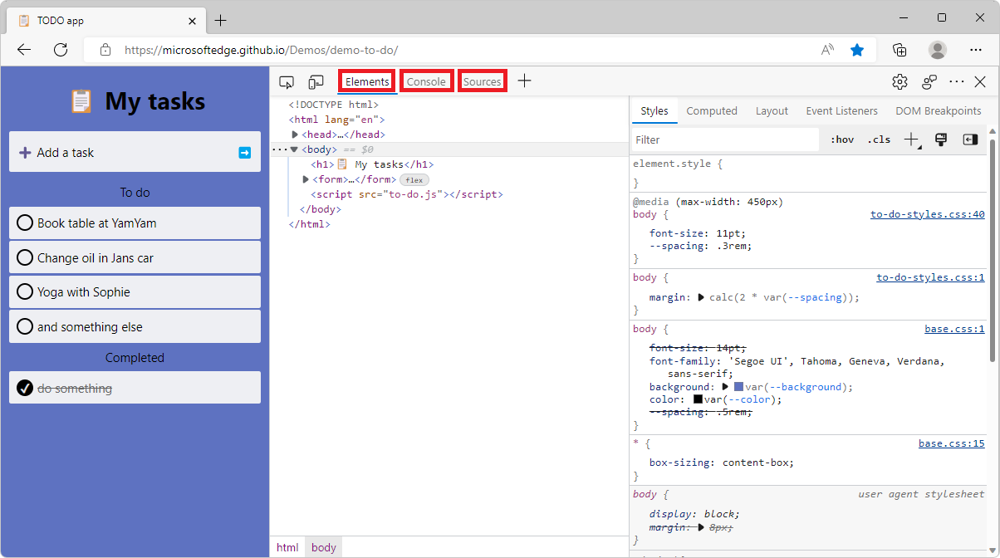
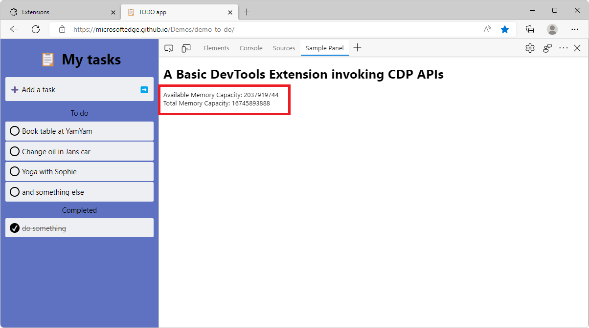
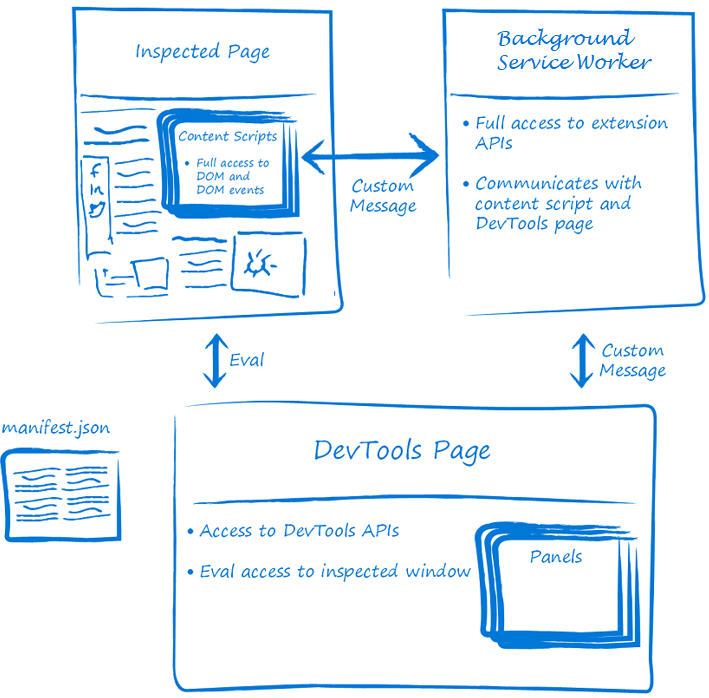

# Create a DevTools extension, adding a custom tool tab and panel

This article provides a sample and code walkthrough for a Microsoft Edge extension that adds a tool tab and panel in DevTools.

This article first shows how to install and run the provided DevTools extension sample, which adds a **Sample Panel** tool tab in DevTools within Microsoft Edge.  The sample is a working DevTools extension that creates its own panel, and interacts with the DevTools APIs.

This article then presents a tutorial that shows how you can optionally create that sample from scratch, and explains each step of developing the sample, and how the added code works.  These tutorial steps are a good way to experience everything that's needed for typical development.

See also:
* [Overview of DevTools](../../devtools/overview.md)


<!-- ====================================================================== -->
## Download, install, and run the DevTools extension sample

To download, install, run, and test the provided, finished DevTools extension sample:

1. Download the final extension code by clicking [Demos-main.zip](https://codeload.github.com/MicrosoftEdge/Demos/zip/refs/heads/main) and then extracting its content to a folder on your computer.

1. Open Microsoft Edge and go to `edge://extensions/`.

1. Turn on the  **Developer mode** toggle.

1. Click **Load unpacked** and navigate to the folder where you extracted the zip file.  In this folder, select **Demos-main** > **devtools-extension** > **sample 4**, and then click **Select Folder**.

   

   The DevTools extension is loaded.

1. In Microsoft Edge, open a new tab.

1. Open DevTools (**F12**).

1. Select the **Sample Panel** tool (tab).

   The **Sample Panel** tool opens:

   

1. Click the **Say Hello to the inspected page** button.

   An alert is displayed in the inspected page:

   

1. Click the **OK** button to close the alert.

1. Click anywhere in the inspected page.

   A message is displayed in the extension panel: **You clicked on position (199, 509) in the inspected page**:

   

1. Select the **Console** tool.

   A message appears in the **Console** tool: **Received response > _{xPosition: 199, yPosition: 509}_**:

   

You downloaded, installed, ran, and tested the provided, finished DevTools extension sample.  In the next steps, you create the same sample by starting from an empty directory.  The following sections explain how the code works.


<!-- ====================================================================== -->
## Step 1: Create a basic Microsoft Edge extension that has a DevTools webpage

If you want to create the files for each major step below, install a code editor such as [Visual Studio Code](https://code.visualstudio.com/), to follow the tutorial steps below to manually re-create the above sample DevTools extension.  You can read the code walkthrough below, presented as four major steps or phases.

A basic extension for Microsoft Edge consists of a manifest file (`manifest.json`).  Because this particular extension extends DevTools, this extension also includes a webpage file, `devtools.html`.  The two files are provided in the `Microsoft Edge / Demos` repo > [/devtools-extension/sample 1/](https://github.com/MicrosoftEdge/Demos/tree/main/devtools-extension/sample%201) directory.  The directory contains the files: 
* `devtools.html`
* `manifest.json`


<!-- ------------------------------ -->
#### manifest.json

`manifest.json` is a manifest file, containing key/value pairs.  The top-level keys are called _members_:

```json
{
    "name": "DevTools Sample Extension",
    "description": "A Basic DevTools Extension",
    "manifest_version": 3,
    "version": "1.0",
    "devtools_page": "devtools.html"
}
```

| Member | Description |
|----------|-------------|
| `name` | The name of the extension that will appear under `edge://extensions/`. |
| `description` | The description of the extension that will be displayed under the name of the extension. |
| `version` | The version of the extension that will appear next to the name of the extension. |
| `manifest_version` | Determines the set of features that the extension will be using, such as service workers or network request modification. The current version is version `3`. To learn more about this version and the differences with version `2`, see [Overview and timelines for migrating to Manifest V3](./manifest-v3.md). |
| `devtools_page` | The path to an HTML file that's run every time DevTools is opened, and loads the extension's JavaScript files.  This page isn't rendered in DevTools. |


<!-- ------------------------------ -->
#### devtools.html

`devtools.html` matches the `devtools_page` member in the manifest file:

```html
<!DOCTYPE html>
<html>
  <head>
    <meta charset="UTF-8" />
  </head>
  <body>
    A Basic DevTools Extension.
  </body>
</html>
```

In a later step, you'll add a `<script>` element in the above file, to load a JavaScript file.  This HTML file isn't displayed in DevTools.


<!-- ---------------------------------------------------------------------- -->
#### Install and test the basic Microsoft Edge extension

Loading and testing an Edge extension locally is sometimes called _sideloading_ an extension, as opposed to distributing an extension to users.

To load and test your basic extension locally in Microsoft Edge:

1. In Microsoft Edge, go to `edge://extensions/`.

1. Turn on the **Developer mode** toggle.

1. Click **Load unpacked**, navigate to the folder where you wrote the code for your extension, and then click the **Select folder** button.

   Your DevTools extension is loaded.

1. Open a new tab.

1. Open DevTools (**F12**).

Your extension is loaded, but isn't displayed in DevTools yet, because you haven't created a panel for the extension.

See also:
* [Sideload an extension to install and test it locally](../getting-started/extension-sideloading.md)


<!-- ====================================================================== -->
## Step 2: Add a custom tool in DevTools

In this step, you'll create a new panel (tool tab) in DevTools.  You can either:

* Copy and paste the code from the `Microsoft Edge / Demos` repo > [/devtools-extension/sample 2/](https://github.com/MicrosoftEdge/Demos/tree/main/devtools-extension/sample%202) directory.  That directory contains the following files:
   * `devtools.html`
   * `devtools.js` - Added in Step 2.
   * `manifest.json`
   * `panel.html` - Added in Step 2.

* Copy and paste the code from the code listings below.

A _panel_ is a tool tab in the main toolbar in DevTools, similar to the **Elements**, **Console**, and **Sources** tools shown below:




To create a basic DevTools extension with a sample panel:

1. Create a file named `devtools.js`.

1. Copy and paste the following code into `devtools.js`:

   ```javascript
   chrome.devtools.panels.create("Sample Panel", "icon.png", "panel.html", panel => {
       // code invoked on panel creation
   });
   ```

   The `create` method has the following signature:

   ```javascript
   chrome.devtools.panels.create(
       title: string, // Tool tab's label in Activity bar.
       iconPath: string, // Icon to display in tool's tab.
       pagePath: string, // Webpage to display in tool's panel.
       callback: function // Code to run when tool is opened.
   )
   ```
    
   Reference:
   * [chrome.devtools.panels](https://developer.chrome.com/docs/extensions/reference/api/devtools/panels)
      * [create()](https://developer.chrome.com/docs/extensions/reference/api/devtools/panels#method-create)


   **devtools.html:**

1. Create a file named `devtools.html`.

1. Copy and paste the following code into `devtools.html`:

   ```html
   <!DOCTYPE html>
   <html>
     <head>
       <meta charset="UTF-8" />
     </head>
     <body>
       <script src="devtools.js"></script>
     </body>
   </html>
   ```

   In the manifest file (`manifest.json`), the `devtools_page` field specifies the above file (`devtools.html`).  `devtools.html`, above, contains a `<script>` element that loads `devtools.js`.


   **panel.html:**

1. Create the `panel.html` file that you referenced in the previous `chrome.devtools.panels.create` method call.  This webpage will contain the user interface of the panel your extension is adding to DevTools.

   ```html
   <!DOCTYPE html>
   <html>
     <head>
       <meta charset="UTF-8" />
     </head>
     <body>
       <h1>A Basic DevTools Extension with Panel</h1>
     </body>
   </html>
   ```


<!-- ---------------------------------------------------------------------- -->
#### Reload and test the DevTools extension

To test your changes in Microsoft Edge, reload your extension from the `edge://extensions/` page:

1. Go to `edge://extensions/`.

1. Next to the DevTools extension sample that you installed before writing your own code, click **Reload**:

   

   The DevTools extension is reloaded, now using the files that you created above, rather than the provided sample that you downloaded.

1. Open a new tab in Microsoft Edge.

1. Open DevTools (**F12**).

1. In the **Activity Bar**, select the **Sample Panel** tool (tab):

   


<!-- ====================================================================== -->
## Step 3: Display memory information by calling extension APIs

In this step, you will use extension APIs to display memory information in your DevTools panel.  To do this, we will need to update the `permissions` in the manifest file, the panel interface, and the devtools script.  You can copy the source code files for this step from the `Microsoft Edge / Demos` repo > [/devtools-extension/sample 3/](https://github.com/MicrosoftEdge/Demos/tree/main/devtools-extension/sample%203) directory, or create the files yourself by following the instructions below.  The directory contains the files: 
* `devtools.html`
* `devtools.js` - Updated in Step 3.
* `manifest.json` - Updated in Step 3.
* `panel.html` - Updated in Step 3.

1. Use the `permissions` manifest member in your `manifest.json` file. This member defines which permissions your extension requires from the user. Some permissions are needed to use certain extension APIs.

    ```json
    "permissions": [
      "system.memory",
    ]
    ```

    The `system-memory` permission is required, in order to use the extension APIs that you'll use later in this tutorial.  To learn more about the available APIs and associated permissions, see [Reference](https://developer.chrome.com/docs/extensions/reference/) for extension APIs.


    **panel.html:**

1. Add the following to the body in the `panel.html` file to display the data in the panel.

    ```html
    <div>
      Available Memory Capacity: <span id="availableMemoryCapacity"></span>
    </div>
    <div>
      Total Memory Capacity: <span id="totalMemoryCapacity"></span>
    </div>
    ```


    **devtools.js:**

1. Update the `devtools.js` file with the following code.

    ```javascript
    let availableMemoryCapacity;
    let totalMemoryCapacity;

    chrome.devtools.panels.create("Sample Panel", "icon.png", "panel.html", panel => {
        // code invoked on panel creation
        panel.onShown.addListener((extPanelWindow) => {
            availableMemoryCapacity = extPanelWindow.document.querySelector('#availableMemoryCapacity');
            totalMemoryCapacity = extPanelWindow.document.querySelector('#totalMemoryCapacity');
        });
    });

    setInterval(() => {
        chrome.system.memory.getInfo((data) => {
            if (availableMemoryCapacity) {
                availableMemoryCapacity.innerHTML = data.availableCapacity;
            }
            if (totalMemoryCapacity) {
                totalMemoryCapacity.innerHTML = data.capacity;
            }
        });
    }, 1000);
    ```

The above code snippet does the following:

1. Creates a new panel `Sample Panel` in DevTools.

1. When the panel is displayed (`panel.onShown` listener), the `availableMemoryCapacity` and `totalMemoryCapacity` elements are retrieved from the DOM.

1. Sets a timer to run code every second after the panel is shown.

1. When the timer fires, the `chrome.system.memory.getInfo` method is used to retrieve the available and total memory capacity of the device and these values are displayed in the corresponding DOM elements.


<!-- ---------------------------------------------------------------------- -->
#### Reload and test the DevTools extension

To test your changes in Microsoft Edge, reload your extension from the `edge://extensions/` page:

1. Go to `edge://extensions/`.

1. Next to your DevTools extension, click **Reload**.

   Your DevTools extension is reloaded.

1. Open a new tab.

1. Open DevTools (**F12**).

1. Select the **Sample Panel** tool.

   Your DevTools extension shows the available and total memory capacities:

   

See also: 
* [Reference](https://developer.chrome.com/docs/extensions/reference/)


<!-- ====================================================================== -->
## Step 4: Interact between the webpage and DevTools

In this step of the tutorial, you will add code that interacts with the inspected webpage. That code will:

1. Listen to click events that happen on the webpage and log them into the DevTools **Console** tool.
1. Display the mouse click position in the DevTools extension panel.
1. When the user clicks a button in the DevTools extension panel, display a greeting alert in the inspected webpage.

You can copy the files that are the end result of this step from the `Microsoft Edge / Demos` repo > [/devtools-extension/sample 4/](https://github.com/MicrosoftEdge/Demos/tree/main/devtools-extension/sample%204) directory, or create the files yourself by following the instructions below.  The directory contains the files: 
* `background.js` - added in Step 4.
* `content_script.js` - added in Step 4.
* `devtools.html`
* `devtools.js` - updated in Step 4.
* `manifest.json` - updated in Step 4.
* `panel.html` - updated in Step 4.

The DevTools tool (panel) that you created so far doesn't have direct access to the inspected webpage, and doesn't run until DevTools is opened.  For this you will use a content script and a background service worker.

* A _content script_ runs in the context of the inspected webpage.  In the same way that other scripts are loaded by the webpage, a content script has have access to the DOM and can change it.
* A _background service worker_ is a script that the browser runs in a separate thread.  This script has access to the Microsoft Edge extension APIs.

The DevTools page, inspected page, content script, and background service worker fit together in an extension:



In this part of the tutorial, you'll detect the user clicks on a webpage by using a content script.  The content script will relay this info to the `devtools.js` file, where the data will be displayed in both the console and the DevTools extension panel.

1. Append the following code in the `manifest.json` file:

    ```json
    "content_scripts": [{
      "matches": [
        "http://*/*",
        "https://*/*"
      ],
      "run_at": "document_idle",
      "js": [
        "content_script.js"
      ]
    }],
    "background": {
        "service_worker": "background.js"
    }
    ```

    | Key | Value |
    |----------|-------|
    | `matches` | Specifies which pages this content script will be injected into. |
    | `run_at` | Indicates when the browser injects the script onto the page. |
    | `js` | The javascript files to be injected. |


    **content_script.js:**

1. Create a file named `content_script.js`.

1. Copy and paste the following code into `content_script.js`:

    ```javascript
    document.addEventListener("click", (event) => {
      chrome.runtime.sendMessage({
          click: true,
          xPosition: event.clientX + document.body.scrollLeft,
          yPosition: event.clientY + document.body.scrollTop
        },
        response => {
          console.log("Received response", response);
        }
      );
    });
    ```

    The above code snippet prints a message to the console when the script is injected in the page.  It also adds a click event listener to the page that will send a message with mouse click position in the inspected page by using the `chrome.runtime.sendMessage` API.


    **panel.html:**

1. In the `panel.html` file, add a `sayHello` button and a `youClickedOn` label, as follows:

    ```html
    <button id="sayHello">Say Hello to the inspected page!</button>
    <h2><span id="youClickedOn"></span></h2>
    ```

    The above two elements are used to demo the interaction between the inspected page, the DevTools panel, and the background service worker.  When the user clicks the `sayHello` button in the DevTools extension, it will display a greeting message in the inspected window.  When the user clicks anywhere in the inspected page, it will display a message to show the mouse click position in the DevTools extension panel.


    **devtools.js:**

1. In the `devtools.js` file (as shown below), use the `chrome.runtime.connect` method to create a connection to the background service worker, and then send the inspected window `tabId` to the service worker by using the `backgroundPageConnection.postMessage` method. Finally, add event listeners to the `sayHello` button and `youClickedOn` label that's defined in the `panel.html` file, as shown below:

    ```javascript
    let youClickedOn; 
    chrome.devtools.panels.create("Sample Panel", "icon.png", "panel.html", panel => {
        // code invoked on panel creation
        panel.onShown.addListener( (extPanelWindow) => {
            let sayHello = extPanelWindow.document.querySelector('#sayHello');
            youClickedOn = extPanelWindow.document.querySelector('#youClickedOn');
            sayHello.addEventListener("click", () => {
                // show a greeting alert in the inspected page
                chrome.devtools.inspectedWindow.eval('alert("Hello from the DevTools extension");');
            });             
        });
    });

    chrome.runtime.onMessage.addListener((request, sender, sendResponse) => {
        // Messages from content scripts should have sender.tab set
        if (sender.tab && request.click == true) {
            console.log('I am here!');
            if (youClickedOn) {
                youClickedOn.innerHTML = `You clicked on position (${request.xPosition}, ${request.yPosition}) in the inspected page.`;
            }
            sendResponse({
                xPosition: request.xPosition,
                yPosition: request.yPosition
            });
        }
    });

    // Create a connection to the background service worker
    const backgroundPageConnection = chrome.runtime.connect({
        name: "devtools-page"
    });

    // Relay the tab ID to the background service worker
    backgroundPageConnection.postMessage({
        name: 'init',
        tabId: chrome.devtools.inspectedWindow.tabId
    });
    ```

    When the user clicks the `sayHello` button, the DevTools extension will run a code snippet of `alert("Hello from the DevTools Extension");` in the inspected window by invoking the `eval()` method of the inspected window `chrome.devtools.inspectedWindow`.

    When the user clicks anywhere in the inspected window, the DevTools extension will receive a message, from the background service worker, with `request.click == true` and the mouse position information.


    **background.js:**

1. Create a file named `background.js`.

1. Copy and paste the following code into `background.js`:

    ```javascript
    let id = null;
    const connections = {};

    chrome.runtime.onConnect.addListener(devToolsConnection => {
        // Assign the listener function to a variable so we can remove it later
        let devToolsListener = (message, sender, sendResponse) => {
            if (message.name == "init") {
                id = message.tabId;
                connections[id] = devToolsConnection;
                // Send a message back to DevTools
                connections[id].postMessage("Connected!");
            }
        };

        // Listen to messages sent from the DevTools page
        devToolsConnection.onMessage.addListener(devToolsListener);

        devToolsConnection.onDisconnect.addListener(() => {
            devToolsConnection.onMessage.removeListener(devToolsListener);
        });
    });
    ```

    The above code connects the background service worker with the DevTools page.  It listens to when the DevTools page connects, saves the connection, and sends a response back to the DevTools page.

    This is useful when your background service worker is collecting data or performing tasks in the background that you want to be available in your DevTools extension.


<!-- ---------------------------------------------------------------------- -->
#### Reload and test the DevTools extension

To test the new `sayHello` button:

1. Go to `edge://extensions/`.

1. Find the unpacked extension entry that you loaded in Step 1.

1. Click the **Reload** button.

1. Open a new browser tab, open DevTools (**F12**), and then click the **Sample Panel** tool (tab).

1. Click the **Say Hello to The Inspected Page!** button.

    An alert is displayed in the inspected page:

    

1. Click the **OK** button to close the alert.

1. Click anywhere in the inspected page.

   A message is displayed in the extension panel: **You clicked on position (199, 509) in the inspected page**:

   

1. Select the **Console** tool.

   A message appears in the **Console** tool: **Received response > _{xPosition: 199, yPosition: 509}_**:

   

This completes the tutorial and code walkthrough for creating a DevTools extension that adds a tool tab and panel in DevTools in Microsoft Edge.

See also:
* [Content scripts](https://developer.chrome.com/docs/extensions/develop/concepts/content-scripts)


<!-- ====================================================================== -->
## See also
<!-- all links in article -->

* [Overview of DevTools](../../devtools/overview.md)
* [Samples for Microsoft Edge extensions](../samples/index.md)
* [Overview and timelines for migrating to Manifest V3](./manifest-v3.md)
* [Sideload an extension to install and test it locally](../getting-started/extension-sideloading.md)

developer.chrome.com:
* [Manifest V3](https://developer.chrome.com/docs/extensions/develop/migrate/what-is-mv3)
* [Extend DevTools](https://developer.chrome.com/docs/extensions/how-to/devtools/extend-devtools)
* [Content scripts](https://developer.chrome.com/docs/extensions/develop/concepts/content-scripts)
* [Reference](https://developer.chrome.com/docs/extensions/reference/)
   * [chrome.devtools.panels](https://developer.chrome.com/docs/extensions/reference/api/devtools/panels)
      * [create()](https://developer.chrome.com/docs/extensions/reference/api/devtools/panels#method-create)

GitHub:
* [Demos-main.zip](https://codeload.github.com/MicrosoftEdge/Demos/zip/refs/heads/main) - Downloads the **MicrosoftEdge > Demos** repo, rather than cloning it.
* [/devtools-extension/](https://github.com/MicrosoftEdge/Demos/tree/main/devtools-extension/) - Source code of the sample.
   * [/devtools-extension/sample 1/](https://github.com/MicrosoftEdge/Demos/tree/main/devtools-extension/sample%201) - Phase 1 of the sample.
   * [/devtools-extension/sample 2/](https://github.com/MicrosoftEdge/Demos/tree/main/devtools-extension/sample%202) - Phase 2 of the sample.
   * [/devtools-extension/sample 3/](https://github.com/MicrosoftEdge/Demos/tree/main/devtools-extension/sample%203) - Phase 3 of the sample.
   * [/devtools-extension/sample 4/](https://github.com/MicrosoftEdge/Demos/tree/main/devtools-extension/sample%204) - Phase 4 of the sample.
  
Tools:
* [Visual Studio Code](https://code.visualstudio.com)
