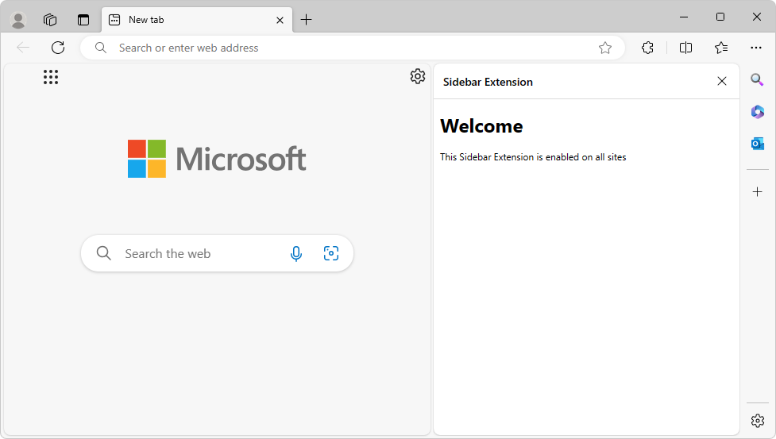
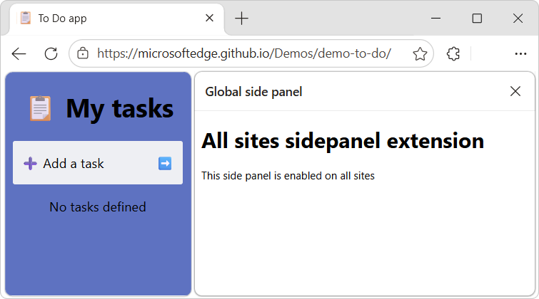
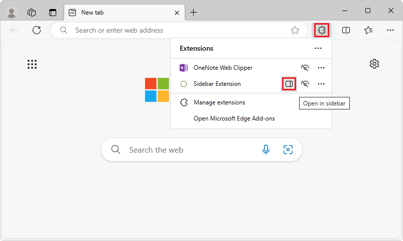
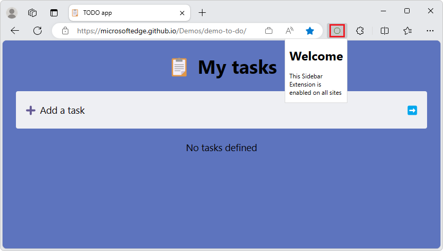
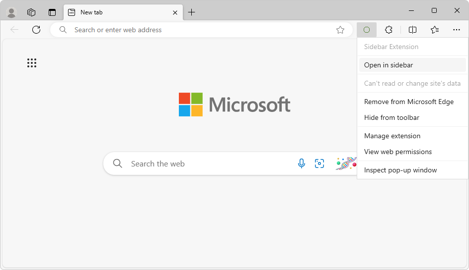
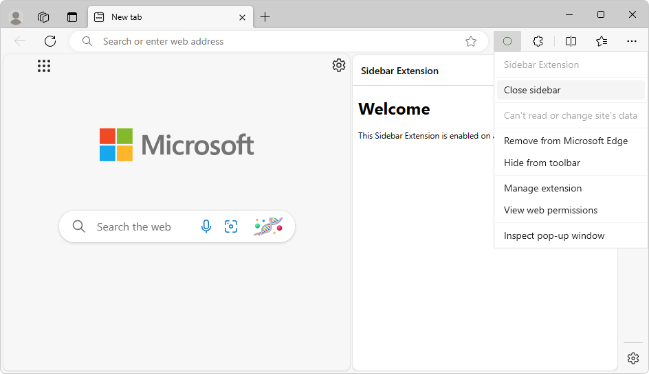

# Develop an extension for the Microsoft Edge sidebar
<!-- https://learn.microsoft.com/microsoft-edge/extensions/developer-guide/sidebar -->
<!-- upstream: https://developer.chrome.com/docs/extensions/reference/api/sidePanel -->

<!-- todo: does this article apply to Chrome as well as Edge? -->

<!-- lexicon:
the Side Panel API
-->

As a Microsoft Edge extension developer, you can make your new or existing Microsoft Edge extension appear in the sidebar.  Any extension can use the sidebar in addition to its other UI.

**Detailed contents:**
* [Introduction](#introduction)
   * [Terminology](#terminology)
* [Concepts and usage](#concepts-and-usage)
* [Add the sidePanel permission in the manifest file](#add-the-sidepanel-permission-in-the-manifest-file)
* [Use cases for the Side Panel API](#use-cases-for-the-side-panel-api)
   * [Display the same sidebar on every site](#display-the-same-sidebar-on-every-site)
   * [Enable a sidebar for a specific site only](#enable-a-sidebar-for-a-specific-site-only)
   * [Enable the extension's shortcut icon to open the sidebar](#enable-the-extensions-shortcut-icon-to-open-the-sidebar)
   * [Opening the sidebar upon user interaction](#opening-the-sidebar-upon-user-interaction)
   * [Switch to a different sidebar](#switch-to-a-different-sidebar)
* [Sidebar user experience](#sidebar-user-experience)
   * [Opening the extension in the sidebar](#opening-the-extension-in-the-sidebar)
      * [By clicking an icon](#by-clicking-an-icon)
      * [By right-clicking the extension's icon](#by-right-clicking-the-extensions-icon)
      * [By pressing a keyboard shortcut](#by-pressing-a-keyboard-shortcut)
      * [Open through a gesture](#open-through-a-gesture)
* [Extension samples](#extension-samples)
* [Types and methods](#types-and-methods)
* [See also](#see-also)


<!-- ====================================================================== -->
## Introduction
<!-- Description  https://developer.chrome.com/docs/extensions/reference/api/sidePanel#description -->

Use the `chrome.sidePanel` API to host content in the sidebar of Microsoft Edge alongside the main content of a webpage.

As a Microsoft Edge extension developer, you can make your new or existing Microsoft Edge extension appear in the sidebar.  Any extension can use the sidebar in addition to its other UI.



By using the Side Panel API, you can enhance the browsing experience by enabling users to view additional information alongside the main content of a webpage.

The _sidebar_ is a persistent pane that's located on the side of Microsoft Edge.  The sidebar pane coexists with the primary content of the browser.  The sidebar reduces the need to constantly switch between tabs, resulting in a more productive browsing experience.

An extension can optionally use the Side Panel API to show a custom UI in the Microsoft Edge sidebar.  Additionally, the extension can continue appearing in the Microsoft Edge toolbar along with a UI such as popups, and can inject scripts.


<!-- ------------------------------ -->
#### Terminology
<!-- not in upstream -->

| Term | Definition |
|---|---|
| _the Side Panel API_ | Name of the feature that you can use in your Microsoft Edge extensions.  The Chrome UI uses the term _side panel_. |
| `sidePanel` or `side_panel` | Name of the API and permission to enable any extension as a sidebar extension. |
| _sidebar extension_ | A Microsoft Edge extension that has a UI in the sidebar. |


<!-- ====================================================================== -->
## Concepts and usage
<!-- https://developer.chrome.com/docs/extensions/reference/api/sidePanel#concepts_and_usage -->

The Side Panel API allows an extension to display its own UI in the Microsoft Edge sidebar, enabling a persistent experience that complements the user's browsing journey.



<!-- para not in upstream: -->
As with other extension resources, the HTML page that's displayed in the sidebar runs in a trusted extension context on the extension's origin (`extension://<id>`).  The sidebar has the same API access as other trusted extension contexts.

All the existing extensions APIs are available for sidebar extensions, so you can leverage all current capabilities of the extensibility framework in your sidebar-enabled extension.

Some features of the sidebar include:

* The sidebar remains open while navigating between tabs.

   * Known issue: The sidebar is not automatically displayed again when the user switches to a tab in which the sidebar was previously open ([Issue #142](https://github.com/microsoft/MicrosoftEdge-Extensions/issues/142)).<!-- todo: update, instance 1 -->

* An extension in the sidebar can be made available for specific websites.

* An extension in the sidebar has access to all of the [Supported APIs for Microsoft Edge extensions](./api-support.md).

* In Microsoft Edge settings, the user can specify several sidebar settings.


<!-- ====================================================================== -->
## Add the sidePanel permission in the manifest file
<!-- Permissions  https://developer.chrome.com/docs/extensions/reference/api/sidePanel#permissions -->

To use the Side Panel API, add the `"sidePanel"` permission in the extension's manifest file (`manifest.json`):

```json
{
  ...
  "name": "My sidebar extension",
  ...
  "side_panel": {
    "default_path": "sidepanel.html"
  },
  "permissions": [
    "sidePanel"
  ]
   ...
}
```

Every extension for Microsoft Edge has a JSON-formatted manifest file, named `manifest.json`.  The manifest file is the blueprint of the extension.

A complete manifest file is included in each sample; see [Extension samples](#extension-samples), below.

See also:
* [Manifest file format for extensions](../getting-started/manifest-format.md)


<!-- ====================================================================== -->
## Use cases for the Side Panel API
<!-- Use cases  https://developer.chrome.com/docs/extensions/reference/api/sidePanel#use-cases -->

The following sections demonstrate some common use cases for the Side Panel API.

For complete extension examples, see [Extension samples](#extension-samples), below.


<!-- ------------------------------ -->
#### Display the same sidebar on every site
<!-- Display the same side panel on every site  https://developer.chrome.com/docs/extensions/reference/api/sidePanel#every-site -->

A sidebar can be set as the default, to show the same extension throughout all the open browser tabs.  Default values persist across browser sessions.

In `manifest.json`, define the `"default_path"` key, such as `"sidepanel.html"`:

```json
{
  "name": "My sidebar extension",
  ...
  "side_panel": {
    "default_path": "sidepanel.html"
  }
  ...
}
```

The file that you specified as the default, such as `sidepanel.html`, appears in all the open browser tabs:

```html
<!DOCTYPE html>
<html>
  <head>
    <title>Global side panel</title>
  </head>
  <body>
    <h1>All sites sidepanel extension</h1>
    <p>This side panel is enabled on all sites</p>
  </body>
</html>
```

See also:
* [Global side panel example](https://github.com/GoogleChrome/chrome-extensions-samples/tree/main/functional-samples/cookbook.sidepanel-global) in the **GoogleChrome / chrome-extensions-samples** repo.


<!-- ------------------------------ -->
#### Enable a sidebar for a specific site only
<!-- Enable a side panel on a specific site  https://developer.chrome.com/docs/extensions/reference/api/sidePanel#by-site -->

An extension can use [sidepanel.setOptions()](https://developer.chrome.com/docs/extensions/reference/sidePanel/#method-setOptions)<!-- chrome link ok, extension ref docs are there --> to enable a sidebar on a specific tab.  This can be a particular website, so the extension opens in the sidebar when the user goes to this website.

This example uses [chrome.tabs.onUpdated()](https://developer.chrome.com/docs/extensions/reference/tabs/#event-onUpdated)<!-- chrome link ok, extension ref docs are there --> to listen for any updates made to the tab.  It checks whether the URL is `www.bing.com` and if so, enables the sidebar.  Otherwise, it disables the sidebar.

`service-worker.js`:

```javascript
const BING_ORIGIN = 'https://www.bing.com';

chrome.tabs.onUpdated.addListener(async (tabId, info, tab) => {
  if (!tab.url) return;
  const url = new URL(tab.url);
  // Enables the sidebar when at bing.com
  if (url.origin === BING_ORIGIN) {
    await chrome.sidePanel.setOptions({
      tabId,
      path: 'sidepanel.html',
      enabled: true
    });
  } else {
    // Disables the sidebar when at other sites
    await chrome.sidePanel.setOptions({
      tabId,
      enabled: false
    });
  }
});
```

In `addListener()`, we do the following:
1. Test `url.origin` to see if it's the desired tab.
1. In `sidePanel.setOptions()`, set `enabled` to `true` or `false`.

When a user switches to a tab or site for which the sidebar is not enabled, the sidebar is hidden.

Known issue: The sidebar is not automatically displayed again when the user switches to a tab in which the sidebar was previously open ([Issue #142](https://github.com/microsoft/MicrosoftEdge-Extensions/issues/142)).<!-- todo: update, instance 2 -->

For a complete example, see [Site-specific side panel example](https://github.com/GoogleChrome/chrome-extensions-samples/tree/main/functional-samples/cookbook.sidepanel-site-specific).


<!-- ------------------------------ -->
#### Enable the extension's shortcut icon to open the sidebar
<!-- Open the side panel by clicking the toolbar icon  https://developer.chrome.com/docs/extensions/reference/api/sidePanel#open-action-icon -->

To allow users to open the sidebar by clicking the action toolbar icon, use [sidePanel.setPanelBehavior()](https://developer.chrome.com/docs/extensions/reference/sidePanel/#method-setPanelBehavior)<!-- chrome link ok, extension ref docs are there -->.  First, declare the `"action"` key in `manifest.json`:

```json
{
  "name": "My sidebar extension",
  ...
   "action": {
    "default_title": "Click to open sidebar"
  },
  ...
}
```

Then, add the following code to the `service-worker.js` code listing that's in [Enable a sidebar for a specific site only](#enable-a-sidebar-for-a-specific-site-only), above:

```javascript
// Allow users to open the sidebar by clicking the action toolbar icon
chrome.sidePanel
  .setPanelBehavior({ openPanelOnActionClick: true })
  .catch((error) => console.error(error));
```

<!-- todo: reveal link if sample covers the present section's code -->
<!-- See also: -->
<!-- * [Opening the side panel through a user interaction](https://github.com/GoogleChrome/chrome-extensions-samples/tree/main/functional-samples/cookbook.sidepanel-open) in the **GoogleChrome / chrome-extensions-samples** repo. -->


<!-- ------------------------------ -->
#### Opening the sidebar upon user interaction
<!-- Programmatically open the side panel on user interaction  https://developer.chrome.com/docs/extensions/reference/api/sidePanel#user-interaction -->

[sidePanel.open()](https://developer.chrome.com/docs/extensions/reference/sidePanel/#method-open)<!-- chrome link ok, extension ref docs are there --> allows extensions to open the sidebar through a user gesture, such as clicking the action icon, or through any user interaction on an extension page or content script, such as clicking a button.

The following code shows how to open a global sidebar on the current window when the user clicks on a context menu.  When using `sidePanel.open()`, choose the context in which the sidebar should open:
* Use `windowId` to open a global sidebar, as shown in the following example.
* Or, set the `tabId` to open the sidebar only on a specific tab.

```javascript
// service-worker.js:
chrome.runtime.onInstalled.addListener(() => {
  chrome.contextMenus.create({
    id: 'openSidePanel',
    title: 'Open sidebar',
    contexts: ['all']
  });
});

chrome.contextMenus.onClicked.addListener((info, tab) => {
  if (info.menuItemId === 'openSidePanel') {
    // Open the sidebar in all the tabs of the current window.
    chrome.sidePanel.open({ windowId: tab.windowId });
  }
});
```

For a complete demo, see [Opening the side panel through a user interaction](https://github.com/GoogleChrome/chrome-extensions-samples/tree/main/functional-samples/cookbook.sidepanel-open).


<!-- ------------------------------ -->
#### Switch to a different sidebar
<!-- Switch to a different panel  https://developer.chrome.com/docs/extensions/reference/api/sidePanel#multi-panels -->

An extension can use [sidepanel.getOptions()](https://developer.chrome.com/docs/extensions/reference/sidePanel/#method-getOptions)<!-- chrome link ok, extension ref docs are there --> to retrieve the current sidebar, and then enable a different sidebar for a specific tab.

This example sets a sidebar containing a welcome message on [runtime.onInstalled()](https://developer.chrome.com/docs/extensions/reference/runtime/#event-onInstalled)<!-- chrome link ok, extension ref docs are there -->.  When the user navigates to a different tab, the sidebar is replaced with the browser-level sidebar.

```javascript
// service-worker.js:
const welcomePage = 'sidebar/welcome-sb.html';
const mainPage = 'sidebar/main-sb.html';

chrome.runtime.onInstalled.addListener(() => {
  chrome.sidePanel.setOptions({ path: welcomePage });
});

chrome.tabs.onActivated.addListener(async ({ tabId }) => {
  const { path } = await chrome.sidePanel.getOptions({ tabId });
  if (path === welcomePage) {
    chrome.sidePanel.setOptions({ path: mainPage });
  }
});
```

For the full code, see [Multiple side panels example](https://github.com/GoogleChrome/chrome-extensions-samples/tree/main/functional-samples/cookbook.sidepanel-multiple).


<!-- ====================================================================== -->
## Sidebar user experience
<!-- Side panel user experience  https://developer.chrome.com/docs/extensions/reference/api/sidePanel#user-experience -->

Develop an extension for the Microsoft Edge sidebar have these user experience (UX) features.


<!-- ------------------------------ -->
#### Opening the extension in the sidebar
<!-- Open the side panel  https://developer.chrome.com/docs/extensions/reference/api/sidePanel#open -->

<!-- new from upstream: -->
To allow users to open the sidebar, do either of the following:

* Use an action icon in combination with [`sidePanel.setPanelBehavior()`](https://developer.chrome.com/docs/extensions/reference/api/sidePanel#open-action-icon).

* Make a call to [`sidePanel.open()`](https://developer.chrome.com/docs/extensions/reference/api/sidePanel#user-interaction) following a user interaction to open the extension in the sidebar, such as:

   * [By clicking an icon](#by-clicking-an-icon).
   * [By right-clicking the extension's icon](#by-right-clicking-the-extensions-icon).
   * [By pressing a keyboard shortcut](#by-pressing-a-keyboard-shortcut).
   * [Open through a gesture](#open-through-a-gesture).

Details are below.


<!-- ---------- -->
###### By clicking an icon
<!-- not in upstream -->

Users can click the **Open in sidebar** icon (), which is displayed next to the extension's name in the Extensions hub:



Or, users can click the extension's custom icon in the toolbar, if it's enabled.  This user experience requires that the extension has enabled the shortcut icon to open the sidebar, as described in [Enable the extension's shortcut icon to open the sidebar](#enable-the-extensions-shortcut-icon-to-open-the-sidebar), above.  In this example, the extension's custom icon is a circle ():



See also:
* [chrome.action](https://developer.chrome.com/docs/extensions/reference/api/action)


<!-- ---------- -->
###### By right-clicking the extension's icon
<!-- not in upstream -->

Users can right-click the extension's icon in the toolbar, and then select **Open in sidebar** or **Close sidebar**:





The extension's icon appears in the toolbar if the user has clicked the **Show in toolbar** () icon next to the extension's name in the Extensions hub.

See also:
* [chrome.contextMenus](https://developer.chrome.com/docs/extensions/reference/api/contextMenus)


<!-- ---------- -->
###### By pressing a keyboard shortcut
<!-- not in upstream -->

Users can press a keyboard shortcut, if the action command is enabled and the action icon is enabled to open the sidebar.

* To enable the action command, see [Action commands](https://developer.chrome.com/docs/extensions/reference/commands/#action-commands)<!-- chrome link ok, extension ref docs are there --> in _chrome.commands_ in API reference.
* To enable the action icon, see [Open the side panel by clicking the toolbar icon](https://developer.chrome.com/docs/extensions/reference/sidePanel/#open-action-icon)<!-- chrome link ok, extension ref docs are there --> in _chrome.sidePanel_ in API reference.

If the `openPanelOnActionClick()` property of the [PanelBehavior](https://developer.chrome.com/docs/extensions/reference/sidePanel/#type-PanelBehavior)<!-- chrome link ok, extension ref docs are there --> type is set to `true`, the user can open the sidebar by using a keyboard shortcut.  To enable this, you specify an action command in the manifest.

See also:
* [chrome.commands](https://developer.chrome.com/docs/extensions/reference/api/commands)


<!-- ---------- -->
###### Open through a gesture
<!-- not in upstream -->

The sidebar can also be opened through the following interactions:

* Open the sidebar by an extension user gesture, such as clicking the action icon.  This approach uses [sidePanel.open()](https://developer.chrome.com/docs/extensions/reference/sidePanel/#method-open)<!-- chrome link ok, extension ref docs are there -->.  See [Opening the sidebar upon user interaction](#opening-the-sidebar-upon-user-interaction), above.

* Open the sidebar by clicking the toolbar icon.  This approach uses [sidePanel.setPanelBehavior()](https://developer.chrome.com/docs/extensions/reference/sidePanel/#method-setPanelBehavior)<!-- chrome link ok, extension ref docs are there -->.  See [By clicking an icon](#by-clicking-an-icon) in section "Opening the extension in the sidebar", above.


<!-- ------------------------------ -->
<!-- #### Pin the side panel -->
<!-- https://developer.chrome.com/docs/extensions/reference/api/sidePanel#pin -->
<!-- todo: rewrite section per different ui in Edge -->

<!--  -->

<!-- The sidebar toolbar displays a pin icon when your sidebar is open.  Clicking the icon pins your extension's action icon. -->

<!-- Clicking the action icon after pinned will perform the default action for your action icon, and will only open the sidebar if this has been explicitly configured. -->


<!-- ====================================================================== -->
## Extension samples
<!-- Examples  https://developer.chrome.com/docs/extensions/reference/api/sidePanel#examples -->

For more Side Panel API extensions demos, explore any of the following extensions:

<!-- in article order: -->

* [Global side panel example](https://github.com/GoogleChrome/chrome-extensions-samples/tree/main/functional-samples/cookbook.sidepanel-global) - used for the section [Display the same sidebar on every site](#display-the-same-sidebar-on-every-site), above.

* [Site-specific side panel example](https://github.com/GoogleChrome/chrome-extensions-samples/tree/main/functional-samples/cookbook.sidepanel-site-specific) - used for the section [Enable a sidebar for a specific site only](#enable-a-sidebar-for-a-specific-site-only), above.

* [Dictionary side panel example](https://github.com/GoogleChrome/chrome-extensions-samples/tree/main/functional-samples/sample.sidepanel-dictionary) - comparable to the above two samples.

* [Opening the side panel through a user interaction](https://github.com/GoogleChrome/chrome-extensions-samples/tree/main/functional-samples/cookbook.sidepanel-open) - used for the section [Opening the sidebar upon user interaction](#opening-the-sidebar-upon-user-interaction), above.

* [Multiple side panels example](https://github.com/GoogleChrome/chrome-extensions-samples/tree/main/functional-samples/cookbook.sidepanel-multiple) - used for the section [Switch to a different sidebar](#switch-to-a-different-sidebar), above.

See also:
* [Samples for Microsoft Edge extensions](../samples/index.md)


<!-- ====================================================================== -->
## Types and methods
<!-- Types  https://developer.chrome.com/docs/extensions/reference/api/sidePanel#type -->
<!-- Methods  https://developer.chrome.com/docs/extensions/reference/api/sidePanel#method -->
<!-- upstream contains many API sections, linked to from here at a high level only -->

See [Types](https://developer.chrome.com/docs/extensions/reference/sidePanel/#type)<!-- chrome link ok, extension ref docs are there --> and [Methods](https://developer.chrome.com/docs/extensions/reference/sidePanel/#method)<!-- chrome link ok, extension ref docs are there --> in the _chrome.sidePanel_ API reference page at `developer.chrome.com`.


<!-- ====================================================================== -->
## See also
<!-- not in upstream -->

* [Supported APIs for Microsoft Edge extensions](../developer-guide/api-support.md)
* [Declare API permissions in the manifest](../developer-guide/declare-permissions.md)
* [Manifest file format for extensions](../getting-started/manifest-format.md)
* [Sample: Picture viewer pop-up webpage](../samples/picture-viewer-popup-webpage.md)
* [Sample: Picture inserter using content script](../samples/picture-inserter-content-script.md)


<!-- ====================================================================== -->
> [!NOTE]
> Portions of this page are modifications based on work created and [shared by Google](https://developers.google.com/terms/site-policies) and used according to terms described in the [Creative Commons Attribution 4.0 International License](https://creativecommons.org/licenses/by/4.0).
> The original page is found [here](https://developer.chrome.com/docs/extensions/reference/api/sidePanel).

[](https://creativecommons.org/licenses/by/4.0)
This work is licensed under a [Creative Commons Attribution 4.0 International License](https://creativecommons.org/licenses/by/4.0).
