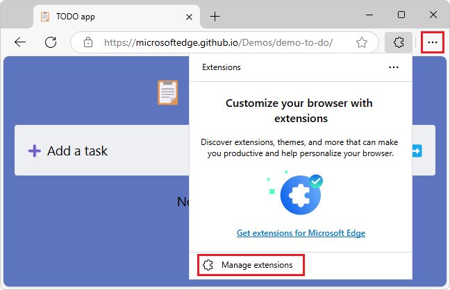
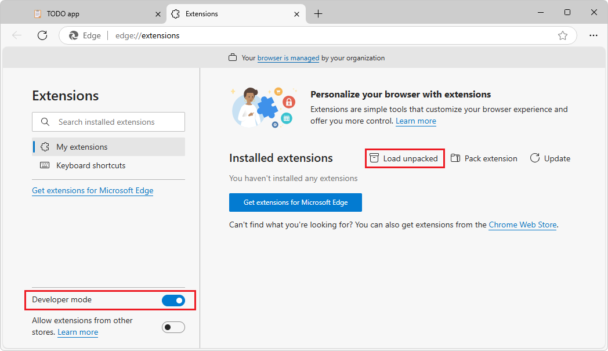
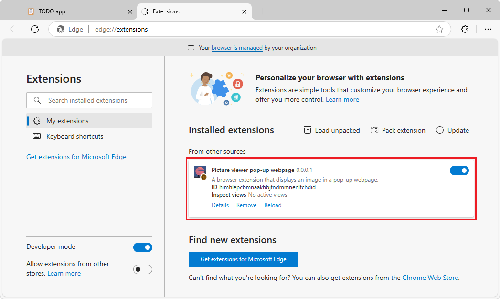
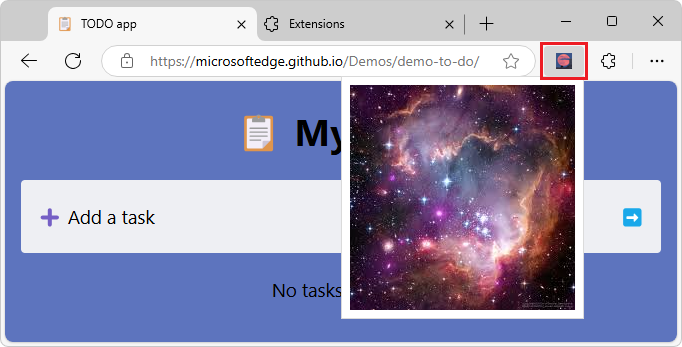

# Sideload an extension to install and test it locally

To test an extension quickly and safely, sideload the extension in your own copy of Microsoft Edge, which means locally installing the extension.  You can then run and test your extension without having to publish the extension at [Microsoft Edge Add-ons](https://microsoftedge.microsoft.com) and then install the extension from there.

<!-- ====================================================================== -->
## Prerequisite: Have an extension to install

This article assumes that your local drive contains an extension that you want to load, such as a sample from the [MicrosoftEdge-Extensions](https://github.com/microsoft/MicrosoftEdge-Extensions) repo.

To obtain the samples, see [Clone the MicrosoftEdge-Extensions repo](../samples/picture-viewer-popup-webpage.md#clone-the-microsoftedge-extensions-repo) in _Sample: Picture viewer pop-up webpage_.

<!-- ====================================================================== -->
## Locally installing and running an extension

To sideload an extension into Microsoft Edge, so that it's locally installed in your browser for testing:

1. Go to a webpage, such as [TODO app](https://microsoftedge.github.io/Demos/demo-to-do/), in a new window or tab.  For some samples, this step is optional and is just to match the screenshots below; some samples don't require a webpage to be open.

1. In Microsoft Edge to the right of the Address bar, if this icon is displayed, click the **Extensions** () button.  Or, select **Settings and more** () > **Extensions**.

   The **Extensions** pop-up opens:

   

1. Click **Manage extensions**.  The **Extensions** management page opens in a new tab:

   

1. Turn on the **Developer mode** toggle.

1. When installing your extension for the first time, click the **Load unpacked** () button.  The **Select the extension directory** dialog opens.

1. Select the directory that contains the extension's source files, such as `manifest.json`.

   Example paths resulting from cloning the **MicrosoftEdge-Extensions** repo:

   `C:\Users\localAccount\GitHub\MicrosoftEdge-Extensions\Extension-samples\picture-viewer-popup-webpage`
   `C:\Users\localAccount\GitHub\MicrosoftEdge-Extensions\Extension-samples\picture-inserter-content-script`

1. Click the **Select Folder** button.

   The **Select the extension directory** dialog closes.

   The extension is installed in your browser, similar to extensions that are installed from [Microsoft Edge Add-ons](https://microsoftedge.microsoft.com):

   

1. If the extension requires that a webpage is open, make sure a webpage is open, such as [TODO app](https://microsoftedge.github.io/Demos/demo-to-do/).

1. Refresh the webpage.  This is sometimes required after reloading an extension.

1. In Microsoft Edge to the right of the Address bar, click the **Extensions** () button.  Or, select **Settings and more** () > **Extensions**.

   The **Extensions** pop-up opens:

   

1. Click the extension's icon or name.  The extension opens, and the extension's icon is added next to the Address bar and **Extensions** () button:

   

<!-- ====================================================================== -->
## Locally updating an extension (Reload)

To update an extension that's been installed locally (sideloaded) in your browser:

1. Make changes to the extension's source code, and save those changes.

1. In Microsoft Edge, if the **Extensions** management tab is open, click it.

   Or, to the right of the Address bar, if this icon is displayed, click the **Extensions** () button.  The **Extensions** pop-up opens.  Click **Manage extensions**.

   Or, select **Settings and more** () > **Extensions** > **Manage extensions**.

   The **Extensions** management tab is displayed.

1. Click the **Reload** link in the extension's card.

1. Refresh the webpage.  This is sometimes required after reloading an extension.

<!-- ====================================================================== -->
## Locally removing an extension

To remove an extension that's been installed locally (sideloaded) in your browser:

1. In Microsoft Edge, if the **Extensions** management tab is open, click it.

   Or, to the right of the Address bar, if this icon is displayed, click the **Extensions** () button.  The **Extensions** pop-up opens.  Click **Manage extensions**.

   Or, select **Settings and more** () > **Extensions** > **Manage extensions**.

   The **Extensions** management tab is displayed.

1. Click the **Remove** link in the extension's card.

<!-- ====================================================================== -->
## Error reporting in the Extensions management page

If running an extension causes an error, in some cases, an **Error** link is added in the extension's card in the **Extensions** management page between the **Remove** and **Reload** links.

1. In Microsoft Edge, if the **Extensions** management tab is open, click it.

   Or, to the right of the Address bar, if this icon is displayed, click the **Extensions** () button.  The **Extensions** pop-up opens.  Click **Manage extensions**.

   Or, select **Settings and more** () > **Extensions** > **Manage extensions**.

   The **Extensions** management tab is displayed.

1. Click the **Error** link in the extension's card.

1. Fix the error in the extension's code.

1. In the **Extensions** management page, click the **Reload** link.

1. To make the **Error** link in the extension's card go away, in the **Extensions** management page, click the **Clear errors** button.

<!-- ====================================================================== -->
## See also
<!-- all links in article -->

* [Sample: Picture viewer pop-up webpage](../samples/picture-viewer-popup-webpage.md)
* [Sample: Picture inserter using content script](../samples/picture-inserter-content-script.md)
