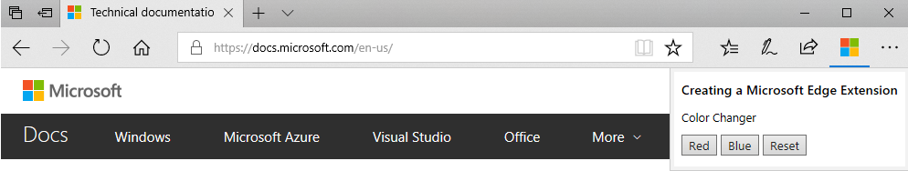
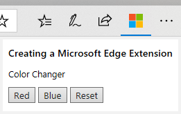
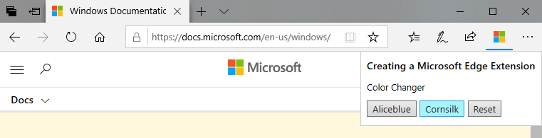

# Creating a Microsoft Edge extension  

[!INCLUDE [deprecation-note](../includes/deprecation-note.md)]  

In this guide, you will learn to create an extension for Microsoft Edge.  This example extension will allow you to manipulate specific CSS for [docs.microsoft.com](https://docs.microsoft.com) pages -- walking you through creation of a manifest file, the user interface, and background and content scripts.



This tutorial assumes you have basic understanding of what browser extensions are and how they work. Unfamiliar with the building blocks for extensions? Check out [*Anatomy of an extension*](https://developer.mozilla.org/Add-ons/WebExtensions/Anatomy_of_a_WebExtension).

The code for the full sample is here on [GitHub](https://github.com/MicrosoftEdge/MicrosoftEdge-Extensions-Demos/tree/master/color_changer).

 
## Building the manifest file

To begin, create a directory for your extension and name it "color-changer". 

Inside the "color-changer" folder, create a file named "manifest.json".  The "manifest.json" file is required for all extensions and provides important information for the extension, ranging from the extension name to its permissions.

> [!NOTE] 
> This guide will walk you through all the manifest keys you'll need for this tutorial, but for a list of all supported and recommended manifest keys, see [Supported manifest keys](../api-support/supported-manifest-keys.md). 

Inside "manifest.json", include the following code.

```json
{
  "name": "Color Changer",
  "author": "Microsoft Edge Extension Developer",
  "version": "1.0",
  "description": "Change the color of the body on docs.microsoft.com",
  "permissions": [
    "*://docs.microsoft.com/*",
    "tabs"
  ], 
  "browser_action": {
    "default_icon": {
      "20": "images/color-changer20.png",
      "40": "images/color-changer40.png"
    },
    "default_title": "Color Changer",
    "default_popup": "popup.html"
  }
}
```
**Manifest key definitions:**
* [`name`](https://developer.mozilla.org/Add-ons/WebExtensions/manifest.json/name): the name of the extension
* [`author`](https://developer.mozilla.org/Add-ons/WebExtensions/manifest.json/author): the author of the extension
* [`version`](https://developer.mozilla.org/Add-ons/WebExtensions/manifest.json/version): the extension version number
* [`description`](https://developer.mozilla.org/Add-ons/WebExtensions/manifest.json/description): a description of the extension displayed in the About section of the extension menu in Microsoft Edge
* [`permissions`](https://developer.mozilla.org/Add-ons/WebExtensions/manifest.json/permissions): an array of strings requesting permissions for the extension. For this extension, we're requesting permissions to see the websites visited ("`tabs`") and to read and change content on URLs matching "`*://docs.microsoft.com/*`".
* [`browser_action`](https://developer.mozilla.org/Add-ons/WebExtensions/manifest.json/browser_action): places an icon on the Microsoft Edge toolbar, to the right of the address bar
    * `default_icon`: specifies which icon is used in the toolbar
    * `default_title`: the text that is displayed when a user hovers over the icon in the toolbar
    * `default_popup`: The path to the HTML file for the popup

Now that we've created the manifest file, we need a user interface for the extension. 


## Creating the popup

For this extension, we will create a popup for the user interface, like below.



To do this, create a file called "popup.html" in the root of your "color-changer" folder. Paste the following code into "popup.html":

```html
<!DOCTYPE html>
<html>
  <head>
    <link rel="stylesheet" type="text/css" href="css/styles.css" />
  </head>
  <body>
    <h1>Creating a Microsoft Edge Extension</h1>
    <p>Color Changer</p>
    <input id="aliceblue" type="button" value="Aliceblue" />
    <input id="cornsilk" type="button" value="Cornsilk" />
    <input id="reset" type="button" value="Reset" />
    <script src="js/popup.js"></script>
  </body>
</html>
```

In "popup.html", we create a title, a paragraph, and three buttons (Aliceblue, Cornsilk, and Reset).

Now create a folder called "css" and inside create a file called "styles.css".  Add the styles below.

```css
/* main styles */
* {
    font-family: 'Segoe UI';
}

h1 {
    font-weight: 600;
    font-size: .9em;
}

p {
    font-weight: 500;
    font-size: .8em;
    margin-bottom: 10px;  
}
```

This CSS gives our extension some basic styles.  Feel free to add more styles to customize your extension. 

Next, we need to create the JavaScript file that interacts with the popup. Create a "js" folder and a file called "popup.js" inside. Update "popup.js" with the code below. 

```JavaScript
// get the buttons by id
let aliceblue = document.getElementById('aliceblue');
let cornsilk = document.getElementById('cornsilk');
let reset = document.getElementById('reset');

// use tabs.insertCSS to change header color on button click

// aliceblue
aliceblue.onclick = () => {
  browser.tabs.insertCSS({code: "body { background: aliceblue !important; }"});
};

// cornsilk
cornsilk.onclick = () => {
  browser.tabs.insertCSS({code: "body { background: cornsilk !important; }"});
};

// back to original
reset.onclick = () => {
  browser.tabs.insertCSS({code: "body { background: none !important; }"});
};
```

In "popup.js", the [tabs](https://developer.mozilla.org/Add-ons/WebExtensions/API/tabs) API allows us to interact with the browser's tabs and inject script and styles into their page content. Using the [`tabs.insertCSS()`](https://developer.mozilla.org/Add-ons/WebExtensions/API/tabs/insertCSS) method, we inject the specified CSS into the page which changes the header on [docs.microsoft.com](https://docs.microsoft.com) to a different color when the specified button is clicked.

Now that we have the basic popup functionality, let's add icons to the extension. 

## Adding icons

Icons are used to represent the extension in the browser toolbar, the extensions menu, and other places.  The icons you need for this extension are here on GitHub: [images](https://github.com/MicrosoftEdge/MicrosoftEdge-Extensions-Demos/tree/master/color_changer/images). Visit the [Design](./design.md#icons) guide to read more about extension icons in Microsoft Edge.

After you've downloaded the extension icons, save them in an "images" folder inside "color-changer". 

The icon that appears in the toolbar is set using `default_icon` inside of the [`browser_action`](https://developer.mozilla.org/Add-ons/WebExtensions/manifest.json/browser_action) key, which we already added to our manifest file in an earlier section.

The `icons` key defines which icons should be used in the Extensions settings menus. Below, we are specifying multiple icons with different sizes to account for different screen resolutions.  The name of the icons, "25" and "48" are the icons' heights in pixels. 

In ["manifest.json"](https://github.com/MicrosoftEdge/MicrosoftEdge-Extensions-Demos/blob/master/color_changer/manifest.json), include a top-level key for `icons`:

```json
  "icons": {
    "25": "images/color-changer25.png",
    "48": "images/color-changer48.png"
  }
```

**Key definitions:**
* [`icons`](https://developer.mozilla.org/Add-ons/WebExtensions/manifest.json/icons): specifies the icons for your extenion with key-value pairs of image size in `px` and image path relative to the root directory of the extension.

You'll noticed icons named "inactive##.png" included in the images folder -- we will use these later in this guide.

## Testing the extension

Now that we've added the user interface and created icons, let's test the extension. Walk through the steps for [Adding an extension](./adding-and-removing-extensions.md#adding-an-extension) to Microsoft Edge. Then, come back to this guide.

After you've added your extension, navigate to any [docs.microsoft.com](https://docs.microsoft.com/) page. You should see the following popup after clicking on the browser action. The color of the [docs.microsoft.com](https://docs.microsoft.com/) body should also change color.




If you encounter any errors or functionality that's not working, check out the [Debugging extensions](https://docs.microsoft.com/microsoft-edge/extensions/guides/debugging-extensions) guide or download the full sample here on [GitHub](https://github.com/MicrosoftEdge/MicrosoftEdge-Extensions-Demos/tree/master/color_changer).

## Adding content and background scripts 

Let's go one step further and add logic to disable the extension from working on pages outside the [docs.microsoft.com](https://docs.microsoft.com/) domain. 

To do this, we first need to create a [content script](https://developer.mozilla.org/Add-ons/WebExtensions/Content_scripts). Content scripts run in the context of a particular web page, can access the content of a web page, and can communicate with background scripts, which we will create shortly. Inside of your "js" directory, create a file called "content.js".  Add the following code. 

```JavaScript
// get the URL of the page
var url = document.location.href;

// if not on a docs.microsoft.com domain
if (url.indexOf("//docs.microsoft.com") === -1) {
    // send inactive icons
    browser.runtime.sendMessage({
        "iconPath20": "images/inactive20.png",
        "iconPath40": "images/inactive40.png"
    });
}
```

This script gets the URL of the current page through `document.location.href` and checks whether or not the current page is on a [docs.microsoft.com](https://docs.microsoft.com) domain. If the page is not on a [docs.microsoft.com](https://docs.microsoft.com) domain (e.g. [https://www.bing.com/](https://www.bing.com/)), the paths to the inactive icons (grayed out icons) are sent to the background script using [`runtime.sendMessage()`](https://developer.mozilla.org/Add-ons/WebExtensions/API/runtime/sendMessage).

You also need to update ["manifest.json"](https://github.com/MicrosoftEdge/MicrosoftEdge-Extensions-Demos/blob/master/color_changer/manifest.json) to include this `content_scripts` key:

```json
  "content_scripts": [{
    "matches": [
        "<all_urls>"
    ],
    "js": ["js/content.js"],
    "run_at": "document_end"
}]
```

**Key definitions:**
* [`content_scripts`](https://developer.mozilla.org/Add-ons/WebExtensions/manifest.json/content_scripts): specifies which content scripts the browser should load
   * `matches` (required): specifies the URL pattern to be matched in order for the content script to be loaded 
   * `js`: the script that should be loaded on matching URLs
   * `run_at`: specifies where the JavaScript files from the `js` key are injected

Next, we need to create a [background script](https://developer.mozilla.org/Add-ons/WebExtensions/Anatomy_of_a_WebExtension#Background_scripts). Background scripts run in the background of the browser, run independently of the lifetime of a web page or browser window, and can communicate with content scripts.

Inside of your "js" folder, create a file called "background.js" and add this code:

```JavaScript
// listen for sendMessage() from content script
browser.runtime.onMessage.addListener(
    function (request, sender, sendResponse) {
        // set the icon for the browser action from sendMessage() in content script
        browser.browserAction.setIcon({
            path: {
                "20": request.iconPath20,
                "40": request.iconPath40
            },
            tabId: sender.tab.id
        });
        // disable browser action for the current tab
        browser.browserAction.disable(sender.tab.id);
    });
```

 The [`runtime.onMessage`](https://developer.mozilla.org/Add-ons/WebExtensions/API/runtime/onmessage) method listens for [`runtime.sendMessage()`](https://developer.mozilla.org/Add-ons/WebExtensions/API/runtime/sendMessage) from the content script.  If the page's domain is not [docs.microsoft.com](https://docs.microsoft.com), then [`browserAction.setIcon()`](https://developer.mozilla.org/Add-ons/WebExtensions/API/browserAction/setIcon) sets the icon paths to the inactive images. 

This script also disables the browser action ([`browserAction.disable`](https://developer.mozilla.org/Add-ons/WebExtensions/API/browserAction/disable)), so that users cannot click on the browser action outside of a [docs.microsoft.com](https://docs.microsoft.com) page. 

We need to add the background script to ["manifest.json"](https://github.com/MicrosoftEdge/MicrosoftEdge-Extensions-Demos/blob/master/color_changer/manifest.json). Add the following `background` key to your manifest:

```json
"background": {
    "scripts": ["js/background.js"],
    "persistent": true
  }
```

**Key definitions:**
* [`background`](https://developer.mozilla.org/Add-ons/WebExtensions/manifest.json/background): specifies any background scripts
   * `scripts`: a path to a JavaScript file
   * `persistent` (required): This can be either set to `true` or `false`. If set as `true`, the background script will be loaded and continue to persist for the entire browsing section. If set as `false`, the background script will be **loaded with a delay** and will then persist for the browsing session. 

Reload your extension and test again. To reload your extension: click the "..." for settings and more in Microsoft Edge, click "Extensions", click on your extension, "Color Changer", and click "Reload extension".

Now, open a new tab or refresh an existing tab that's not a [docs.microsoft.com](https://docs.microsoft.com) page.  You should see the inactive icon and not be able to click on the browser action.

Congratulations! You've created an extension for Microsoft Edge! View the full sample here on [GitHub](https://github.com/MicrosoftEdge/MicrosoftEdge-Extensions-Demos/tree/master/color_changer).  Continue reading to learn more about extensions.

## Writing a more complex extension

Want to write a more complex extension? Take a look at MDN's Beastify extension in the article, [Your second extension](https://developer.mozilla.org/Add-ons/WebExtensions/Your_second_WebExtension). Microsoft Edge's extension model differs slightly from Firefox's, so we've adapted the Beasify extension created in [Your second extension](https://developer.mozilla.org/Add-ons/WebExtensions/Your_second_WebExtension) to function in Microsoft Edge.  Check it out on [GitHub](https://github.com/MicrosoftEdge/MicrosoftEdge-Extensions-Demos/tree/master/beastify_edge). 

While walking through MDN's article, [Your second extension](https://developer.mozilla.org/Add-ons/WebExtensions/Your_second_WebExtension), keep in mind the following sections. 

### APIs 
See the [Supported APIs](../api-support/supported-apis.md) page for a list of supported extensions APIs in Microsoft Edge.

### Icon sizes
Preferred extension icon sizes for Microsoft Edge are 20px, 25px, 30px, 40px. Other supported sizes are 19px, 35px, 38px. For more info on icon sizes and best practices, see the [Design](./design.md) guide.

### JavaScript
Microsoft Edge's extension model does not support JavaScript Promises.  Instead, use callbacks. For more examples of using callbacks in an extension, take a look at the  [Quick Print](https://github.com/MicrosoftEdge/MicrosoftEdge-Extensions-Demos/tree/master/quick_print) and [Text Swap](https://github.com/MicrosoftEdge/MicrosoftEdge-Extensions-Demos/tree/master/text_swap) demos.

You can walk through the [Quick Print](https://github.com/MicrosoftEdge/MicrosoftEdge-Extensions-Demos/tree/master/quick_print) example in the video below.  

> [!VIDEO https://channel9.msdn.com/Blogs/One-Dev-Minute/Adding-a-Background-Script-to-you-Edge-Extension/player]

### Manifest.json

* The `author` key is required in Microsoft Edge
* The `activeTab` key is not supported in Microsoft Edge

Head over to [MDN web docs](https://developer.mozilla.org/) for more information on [Browser Extensions](https://developer.mozilla.org/Add-ons/WebExtensions). 
