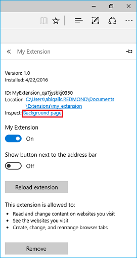
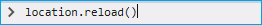
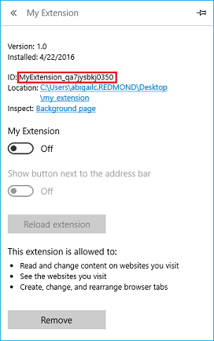
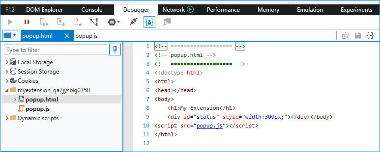

# Debugging extensions

You can debug your extensions in Microsoft Edge by using F12 Developer Tools.

The following video goes through a buggy Microsoft Edge extension, walking though each debugging scenario and fixing it up along the way. See the step-by-step instructions below for more info.

> [!VIDEO https://channel9.msdn.com/Blogs/One-Dev-Minute/Debugging-Microsoft-Edge-Extensions/player]

> [!NOTE]
> In order to take advantage of extension debugging with F12, you must first turn on developer features in about:flags. See [Adding and removing extensions](./../adding-and-removing-extensions.md) for details on how to do this.

## Background script debugging
To start debugging the background script of your extension:

1. Click on **More (...)** followed by **Extensions** to go into the extension pane.  
 
2. Click on the extension that you want to debug.
3. Click on the **Background page** link to bring up F12 for the background process.  
 
4. Select the **Debugger** tab in F12.
5. Navigate to and select your extension's background script.
6. Place breakpoints for debugging by clicking to the left of the source code line number.  
 
7. Select the **Console** tab and execute the command "`location.reload()`". This will re-execute the background script, allowing you to step through your code.  
 

## Content script debugging
To start debugging the content script of your extension:

1. Launch F12 by either navigating to the **More (...)** button and selecting **"F12 Developer Tools"** or by pressing F12 on your keyboard.
2. Navigate to and select your extension's content script. Content scripts for extensions currently running will be depicted by a different folder for each extension.

 >note Only running content scripts will appear.

3. Place breakpoints for debugging by clicking to the left of the source code line number.  
 
4. Refresh the browser tab to begin stepping though your code.

## Extension page debugging
To start debugging extension pages like the options page or the popup of your extension:

1. Obtain the Extension Unique ID. To do this, click on the **"More (...)"** button, select **"Extensions"**, and click your extension. From here, copy the ID field.  
 
2. Obtain the name of the HTML file for the page you want to debug. This is the file that is specified in the JSON manifest or, for the case of popups, via `browserAction.setPopup`/`pageAction.setPopup`.

3. Open your page in a browser tab by navigating a tab to the page. The URL of the page will be in the following format:  
`ms-browser-extension://<Extension Unique Id>/<my_page.html>` 
In this example for a popup, the URL is: `ms-browser-extension://MyExtension_qa7jysbkj0350/popup.html`.  This URL format is the same for any extension page.

4. Once the page is opened in a tab, you can launch F12 to debug the page similar to how you would debug a website by placing breakpoints and stepping through the code.  
 
