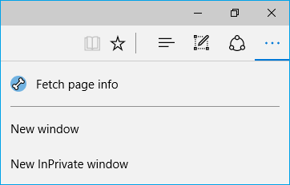
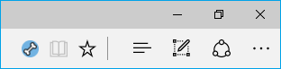

# Design guidelines for Microsoft Edge extensions  

[!INCLUDE [deprecation-note](../includes/deprecation-note.md)]  

The following page contains various design aspects and UI behavior to consider when creating Microsoft Edge extensions.

## Icons

It's recommended that you make the icons of your extension using a vector graphic. You'll need a few different sizes of your icon for your extension, and three additional sizes if you want to package your extension. Microsoft Edge extensions don't support .svg icons.

Before you create your extension icons, we recommend that you review the [accessibility](./accessibility.md) guide to ensure that your icons have high enough contrast and are visible in both the light and dark themes of Microsoft Edge.

While any webkit image format is supported, PNG is recommended for transparency support.  


### Icons for your extension

For your extension, you'll need one icon size for its browser action/page action, and one icon size for the extensions pane. More than one size for each can be provided to support high resolution displays.

An extension can either have a browser action or page action icon. The browser action and page action icons can be changed at runtime using [`browserAction.setIcon`](https://developer.mozilla.org/en-US/Add-ons/WebExtensions/API/browserAction/setIcon) or [`pageAction.setIcon`](https://developer.mozilla.org/en-US/Add-ons/WebExtensions/API/pageAction/setIcon).


**Browser action**

The preferred sizes for browser action and page action icons are 20px, 25px, 30px, 40px. Other supported sizes include 19px, 35px, 38px.

The following [JSON manifest](./../API-support/supported-manifest-keys.md) snippet shows a standard and high definition browser action icon being specified using the [`"browser_action"`](https://developer.mozilla.org/en-US/docs/Mozilla/Add-ons/WebExtensions/manifest.json/browser_action) field. The same syntax applies for [`"page_action"`](https://developer.mozilla.org/en-US/docs/Mozilla/Add-ons/WebExtensions/manifest.json/page_action):
```json
"browser_action": {
    "default_icon": {
        "20": "images/icon_20.png",
        "40": "images/icon_40.png"
    },
    "default_title": "Fetch page info",
    "default_popup": "popup.html"
}
```

If the browser action has been set by the extension, it will appear either in the Actions menu after selecting "More(...)",  or to the right of the address bar if "Show button next to the address bar" has been toggled on by the user.




**Page action**

[`"page_action"`](https://developer.mozilla.org/en-US/docs/Mozilla/Add-ons/WebExtensions/manifest.json/page_action) has the same JSON manifest syntax as [`"browser_action"`](https://developer.mozilla.org/en-US/docs/Mozilla/Add-ons/WebExtensions/manifest.json/browser_action). Page action also has the same icon size requirements as browser action.

If page action is specified in the [JSON manifest](./../API-support/supported-manifest-keys.md), it will appear within the address bar whenever [`pageAction.show`](https://developer.mozilla.org/en-US/Add-ons/WebExtensions/API/pageAction/show) is called.




**Management UI**

When users navigate to the extensions pane by going to the "More(...)" menu and selecting "Extensions", an icon will be displayed next to the name of the extension.

You should specify the following icon sizes:
- 48px - Icon for standard resolution displays
- 128px – Icon for high resolution displays
- 176px - Icon for even higher resolution displays


```json
"icons": {
    "48": "images/icon_48.png",
    "128": "images/icon_128.png",
    "176": "images/icon_176.png"
},
```


### Icons for packaging

Once your extension is ready to be packaged, you'll need to have three additional icon sizes ready:

- 44px - Used in the Windows UI (App List, Settings->System->Apps & features)
- 50px - Packaging requirement (not visible anywhere)
- 150px - Icon for the Microsoft Store


See either the [manual packaging guide](./packaging/creating-and-testing-extension-packages.md#assets-folder) or the [ManifoldJS packaging guide](./packaging/using-manifoldjs-to-package-extensions.md#packaging-with-manifoldjs) to determine where these icons will be placed. This will depend on which packaging method you choose.

#### Microsoft Store icon
If the 150px icon for the Microsoft Store has a transparent background, the accent color of the user's device will appear as the icon's background color.


For example, if the user has selected pink as their accent color, the transparent background of your store icon will appear as pink to them.


 If you want to pick your own background color for your Microsoft Store, you'll need to make the background opaque.


> [!NOTE]
> Submitting a Microsoft Edge extension to the Microsoft Store is currently a restricted capability. [Reach out to us](https://aka.ms/extension-request) with your requests to be a part of the Microsoft Store, and we’ll consider you for a future update.
