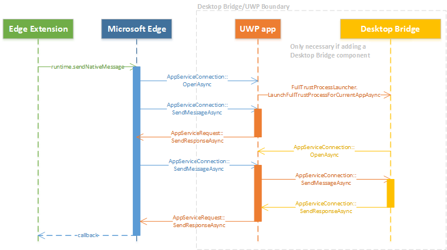
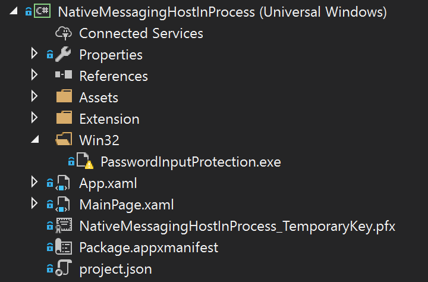

# Native messaging in Microsoft Edge
 
## Native messaging architecture overview

With the upcoming Windows 10 Creators Update, Edge extensions will be able to use native messaging to communicate with a companion Universal Windows Platform (UWP) app.  At a high level, Edge extensions use the same APIs for native messaging as Chrome and Firefox extensions. However, the native messaging host will need to be implemented using the Universal Windows Platform. 

 Edge’s native messaging architecture leverages the existing [`AppService`](https://msdn.microsoft.com/library/windows/apps/windows.applicationmodel.appservice.aspx) API as the underlying inter-process communication (IPC) infrastructure. UWP apps use the `AppService` API to communicate with one another. Because of this, Edge extensions can now communicate with UWP apps.




### When and when not to use native messaging

Native messaging adds a whole new layer to your extension. By implementing a UWP companion app for your extension, the following possibilities become available to you:

* Synchronize data (e.g. credentials) with a companion UWP app.
* Implement stronger encryption/decryption algorithms not available in web APIs.
* Access resources that are not accessible through web APIs, e.g. hardware or USB devices

There are a few instances where native messaging can't be used due to security or policy restrictions:

* Modifying user settings in either Edge or Windows, e.g. changing the default browser or search provider.
* Actions that violate Windows Store policies for both apps and extensions.
* Transferring data to remote endpoint via native message host.
* Allowing other apps to download content that changes extension behavior.

## Chrome vs Edge implementation

While Chrome goes the route of using message passing APIs for their extensions to communicate with apps, Edge utilizes the [`AppService`](https://msdn.microsoft.com/library/windows/apps/windows.applicationmodel.appservice.aspx) API which now enables Edge extensions and UWP apps to communicate.

This section details the differences between how Chrome and Edge handle native messaging implementation.

### Registration and host manifest
In order for your app to be recognized by your extension as a native messaging host, it will need to be registered.


For [Chrome native messaging ](https://developer.chrome.com/extensions/nativeMessaging) host registration, your app needs to install a manifest file anywhere in the Windows file system that defines the native messaging host configuration.

The following JSON is an example of how the config file can be set up:
```json
{
   "name": "com.my_company.my_application",
   "description": "My Application",
   "path": "C:\\ProgramFiles\\MyApplication\\chrome_native_messaging_host.exe",
   "type": "stdio",
   "allowed_origins": [
      "chrome-extension://knldjmfmopnpolahpmmgbagdohdnhkik/"
	]
}
```
To install this file, the app would need to:

1. Register the manifest file in a predefined location in the registry that defines the host configuration:
 - `HKEY_LOCAL_MACHINE\SOFTWARE\Google\Chrome\NativeMessagingHosts\com.my_company.my_application`

   	or
 - `HKEY_CURRENT_USER\SOFTWARE\Google\Chrome\NativeMessagingHosts\com.my_company.my_application`

2. Set the default value of that key to the full path to the manifest file, e.g.  `[HKEY_CURRENT_USER\Software\Google\Chrome\NativeMessagingHosts\com.my_company.my_application] @="C:\\path\\to\\nmh-manifest.json"`


For Edge, in order to register an [`AppService`](https://msdn.microsoft.com/library/windows/apps/windows.applicationmodel.appservice.aspx)(native messaging host) you'll need to include the UWP companion app in the same package as your extension and specify the [AppService extension](https://msdn.microsoft.com/windows/uwp/launch-resume/how-to-create-and-consume-an-app-service) in your project’s `Package.appxmanifest` file. The `EntryPoint` and `Name` attributes can be configured by you:
```xml
...
<Applications>    
	<Application Id="App"         
		<Extensions>        
			<uap:Extension Category="windows.appService" EntryPoint="MyAppService.Inventory">          
			<uap:AppService Name="com.microsoft.inventory"/>        
			</uap:Extension>      
		</Extensions>      
		...    
	</Application>
</Applications>
```


You'll also need to set which extension(s) are allowed to connect to the service. Because Edge doesn't have an equivilent `"allowed_origins"` manifest property in its AppxManifest, this will need to be determined and enforced at runtime by your UWP app. Since Edge will be establishing the connection on behalf of the extension, the app can look up the caller's Package Family Name to determine if they're being connected by Edge to control or authenticate the caller. E.g. 
```csharp
protected async override void
OnBackgroundActivated(BackgroundActivatedEventArgs args)
{
	IBackgroundTaskInstance taskInstance = args.TaskInstance;
	if (taskInstance.TriggerDetails is AppServiceTriggerDetails)
	{
		AppServiceTriggerDetails appService = taskInstance.TriggerDetails as AppServiceTriggerDetails;
		if (appService.CallerPackageFamilyName == EdgePFN)
		{
			// Establish the connection
		}
		else
		{
			// Reject the connection
		}
	}
}

```


### Message sending

For an app and an extension to communicate with one another, messages need to be sent to and from them.

Chrome extensions initiate a message using the [`runtime.sendNativeMessage`](https://developer.mozilla.org/Add-ons/WebExtensions/API/runtime/sendNativeMessage) API to deliver a message to the native host using a non-persistent channel. 

```javascript
chrome.runtime.sendNativeMessage(string application, object message, function responseCallback)
```

The first parameter is the name of the native host, which Chrome looks up in the registry for the manifest. The manifest specifies the .exe that Chrome will launch in a sandbox, and the message is sent using std i/o. 
Extensions can also establish a persistent channel using the `runtime.connectNative` API, which takes the name of the native host as the only parameter. 

Edge uses the same construct as Chrome’s native messaging API to allow Edge extensions to specify which app service to connect to. The first parameter in `runtime.sendNativeMessage` specifies the app service name. In the [Registration and host manifest](#registration-and-host-manifest) section, this is `"com.microsoft.inventory"`. The Edge extension platform restricts the native messaging host to being a UWP app that is packaged in the same AppX as the extension. This mitigates any security risks associated with malicious attacks that try to connect Edge with another Package Family Name by tampering with manifest entries. 

This means that Edge will use the same Package Family Name as the extension, in addition to the `AppService` name specified in the API, to uniquely identify the provider of the app service.  

> [!NOTE]
> This will not be easily converted by the [Microsoft Edge Extension Toolkit](./porting-chrome-extensions.md). Any extensions that specifies the `"nativeMessaging"` permission will be flagged as requiring manual conversion for this component.


### Communication protocol

Communication protocol for native messaging determines how messages are formatted before sending.

Chrome starts each native messaging host in a separate process and communicates with it using standard input and standard output. The same format is used to send messages in both directions: each message is serialized using JSON, UTF-8 encoded and is preceded with 32-bit message length in native byte order.


For Edge, the background task/main app that implements the app service will be started by the platform. On startup, the background task’s `Run` method will be invoked:  
```csharp
public void Run(IBackgroundTaskInstance taskInstance)    
{
	this.backgroundTaskDeferral = taskInstance.GetDeferral();
	// Get a deferral so that the service isn't terminated.
	taskInstance.Canceled += OnTaskCanceled;
	// Associate a cancellation handler with the background task.
	// Retrieve the app service connection and set up a listener for incoming app service requests.
	var details = taskInstance.TriggerDetails as AppServiceTriggerDetails;
	appServiceconnection = details.AppServiceConnection;
	appServiceconnection.RequestReceived += OnRequestReceived;
}
```
When your extension sends a message to your UWP app, the [`onRequestReceived`](https://msdn.microsoft.com/library/windows/apps/windows.applicationmodel.appservice.appserviceconnection.requestreceived) event will be raised. This JSON formatted message will then be stringified into the first KeyValue pair of a [`ValueSet`](https://msdn.microsoft.com/library/windows/apps/dn636131) object. :

```csharp
private async void OnRequestReceived(
AppServiceConnection sender,
AppServiceRequestReceivedEventArgs args)
{
	...
}
```

When your UWP app sends a response back to your extension, a [`KeyValuePair`](https://msdn.microsoft.com/en-us/library/windows/apps/5tbh8a42) will be added to the `ValueSet` object. The `Key` property will be ignored by Edge, but the `Value` property will contain a valid JSON string.

### Callback

For callbacks, Chrome uses [`runtime.sendNativeMessage`](https://developer.mozilla.org/Add-ons/WebExtensions/API/runtime/sendNativeMessage) which allows a callback function to handle any asynchronous response from sending a message.

Edge uses the [`AppServiceRequest`](https://msdn.microsoft.com/library/windows/apps/windows.applicationmodel.appservice.appservicerequest) object's [`SendResponseAsync`](https://msdn.microsoft.com/library/windows/apps/windows.applicationmodel.appservice.appservicerequest.sendresponseasync) method to let the app send a [`ValueSet`](https://msdn.microsoft.com/library/windows/apps/dn636131) object back to the extension.


### Message size limit
Messages that are sent back and forth between an extension and an app have different message size limitations in place for Chrome and Edge.

Chrome has the following message size limitations:
- Single message limit from native messaging host: 1 MB
- Single message limit sent to native messaging host: 4 GB

For Edge, while `AppService` has no limit on message size (dependent on memory), Edge protects itself against misbehaving native apps by imposing the following message size limits:
- Single message limit from UWP app to extension: 1 MB
- Single message limit from extension to UWP app: 100 MB


### Native messaging connections

There are two types of connections for native messaging; persistent and non-persistent.
A **persistent** connection is a connection that is kept running until the port is destroyed. A **non-persistent** connection is a connection that is opened for one message at a time and closes after delivery.

#### Persistent

For Chrome, a persistent connection is made by creating a messaging port using [`runtime.connectNative`](https://developer.mozilla.org/Add-ons/WebExtensions/API/runtime/connectNative). Once the port is made, Chrome starts a native messaging host process that keeps running until the port it destroyed.

For Edge, once a messaging port is created using `runtime.connectNative`, Edge starts the [`AppServiceConnection`](https://msdn.microsoft.com/library/windows/apps/windows.applicationmodel.appservice.appserviceconnection) and keeps it running until the port is destroyed. The following snippet shows how a persistent connection is established from within a UWP app. 

```csharp
this.inventoryService = new AppServiceConnection();  
// Here, we use the app service name provided via the runtime.connectNative API  
this.inventoryService.AppServiceName = "com.microsoft.inventory";  
// Use the same Package Family Name as the extension package
this.inventoryService.PackageFamilyName = "replace with the Package Family Name";  
var status = await
this.inventoryService.OpenAsync();
```

#### Non-persistent

When a message is sent using [`runtime.sendNativeMessage`](https://developer.mozilla.org/en-US/Add-ons/WebExtensions/API/runtime/sendNativeMessage) in Chrome, without creating a messaging port, Chrome starts a new native messaging host process for each message. The first message generated by the host process is handled as a response to the original request, and all other messages after it are ignored.

Edge will terminate the connection after every messages' response has been received. The following snippet shows a non-persistent connection that is established with `AppServiceConnection` that will then be terminated within the UWP app after a request has been received and stored as an [`AppServiceResponse`](https://msdn.microsoft.com/library/windows/apps/windows.applicationmodel.appservice.appserviceresponse).

```csharp
using (var connection = new AppServiceConnection())
{    
	//Set up a new app service connection
	connection.AppServiceName = "com.microsoft.randomnumbergenerator";
	connection.PackageFamilyName = "Microsoft.SDKSamples.AppServicesProvider.CS_8wekyb3d8bbwe";
	AppServiceConnectionStatus status = await connection.OpenAsync();
	AppServiceResponse response = await connection.SendMessageAsync(inputs);
}
```

### Permission

In order to enable native messaging use with your extension, for both Chrome and Edge you'll need to declare the `"nativeMessaging"` permission in you `manifest.json` file.


## App services
This section details the impact app services has on Edge native messaging performance and memory.

### Performance

App services are "sponsored" by the foreground app that calls them which for native messaging purposes is Edge. This means that app services can run as long as Edge is running.

In regards to latency, app services use named pipes that, after initial connection, allow two apps to directly communicate. This method of communication produces low latency. Devices with slow CPUs will experience some initial latency after starting up the process that hosts the app service (~80ms to startup the background task on some devices). After start-up, performance on slow CPU devices should be good. 


### Memory
The memory allocated to an app service is taken out of the quota allocated to Edge. This means that if Edge starts too many app services there is a possibility that they could run out of memory. The usual background task memory caps are enforced on app services. For instance, on a 512MB device an app service background task can be no larger than 16MB. This number goes up as the devices scale up.


## Creating an extension with native messaging

In order to test native messaging, your extension needs a Package Family Name. Edge uses this to determine the native message host identity, which means your extension should be packaged. See the [Packaging guide](./packaging.md) for info on how to do this.


To create your extension with native messaging in Visual Studio:

1. Create a UWP project in Visual Studio.
2. [Add `AppService` to your UWP app](https://msdn.microsoft.com/windows/uwp/launch-resume/how-to-create-and-consume-an-app-service).
 - You can optionally [configure `AppService` to be hosted in the main app](https://msdn.microsoft.com/windows/uwp/launch-resume/convert-app-service-in-process) instead of as a background task at this point.
3. Build and test your UWP project.
 - You can optionally add a [Desktop Bridge component](#desktop-bridge-component).
4. Create an Edge extension that uses native messaging to communicate with the UWP companion app.
5. Use the `AppService` name configured for the UWP in the native messaging APIs.
6. Deploy the UWP project (with the optional Desktop Bridge component)
7. Go to the UWP deployment folder. This is usually at `ProjectFolder\bin\x86\Release\AppX`.
8. Create an Extension folder.
9. Copy all your extension files into the Extension folder.
10. Modify the `AppXManifest` file in the AppX folder to include extension metadata and convert it to a headless app:

```xml
<Package
xmlns="http://schemas.microsoft.com/appx/manifest/foundation/windows10" 
xmlns:rescap="http://schemas.microsoft.com/appx/manifest/foundation/windows10/restrictedcapabilities" 
xmlns:mp="http://schemas.microsoft.com/appx/2014/phone/manifest" 
xmlns:uap="http://schemas.microsoft.com/appx/manifest/uap/windows10" 
xmlns:uap3="http://schemas.microsoft.com/appx/manifest/uap/windows10/3"
IgnorableNamespaces="uap uap3 mp rescap build" 
xmlns:build="http://schemas.microsoft.com/developer/appx/2015/build">
 
<Dependencies>
	<TargetDeviceFamily Name="Windows.Desktop" MinVersion="10.0.15002.0" MaxVersionTested="10.0.15002.0" />
</Dependencies>
 
   <Application Id="App" Executable="MessagingHost1.exe"
	EntryPoint="MessagingHost1.App">
      <uap:VisualElements AppListEntry="none" DisplayName="MessagingHost1"
	Square150x150Logo="Assets\Square150x150Logo.png" Square44x44Logo="Assets\Square44x44Logo.png" Description="MessagingHost1" BackgroundColor="transparent">
      </uap:VisualElements>
      <Extensions>
		<uap3:Extension Category="windows.appExtension">
			<uap3:AppExtension
				Name="com.microsoft.edge.extension"
				Id="EdgeExtension"
				PublicFolder="Extension"
				DisplayName="ms-resource:DisplayName">
			</uap3:AppExtension>
		</uap3:Extension>
      </Extensions>
</Application>
```
 
## Adding a Desktop Bridge component 
If you want to add a Desktop Bridge component to your package, you'll need to create and build your Win32 project in Visual Studio. For info on how to convert your win32 app to UWP, see [Prepare an app for conversion with the Desktop Bridge](https://msdn.microsoft.com/windows/uwp/porting/desktop-to-uwp-prepare). Once built in Visual Studio, you can add the Win32 executable to the package by doing the following steps:

1. Add the Win32 executable and UWP app to the folder where all the other components are laid out:

 

2. Modify appxmanifest.xml by adding the &lt;desktop:Extension&gt; element to the &lt;Extensions&gt; element:

```xml
<Extensions>
	<desktop:Extension Category="windows.fullTrustProcess"Executable="Centennial(Win32).exe"
	xmlns:desktop="http://schemas.microsoft.com/appx/manifest/desktop/windows10" />
</Extensions>
```

## Testing your extension

See the [Creating and testing extensions](./packaging/creating-and-testing-microsoft-edge-extension-packages.md#testing-an-appx-package) guide for info on how to test and deploy your packaged extension.
