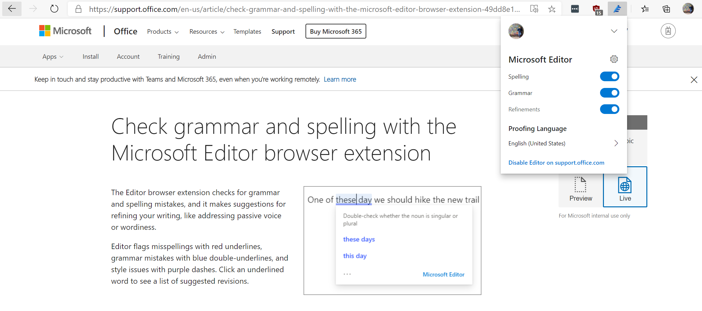
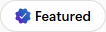
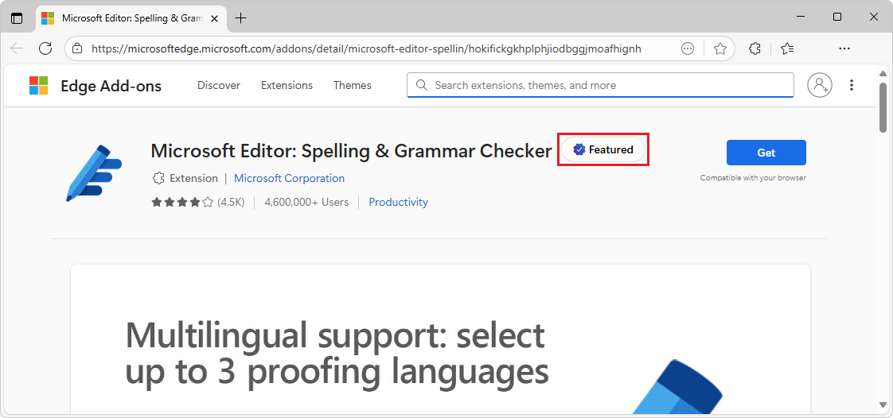

# Overview of Microsoft Edge extensions
<!-- https://aka.ms/AboutEdgeAddons -->

A Microsoft Edge _extension_ is a small app that a developer creates to add or modify features of Microsoft Edge, to extend the user experience (UX) for end-users in a specialized way.  An extension provides a niche experience or function that's important to a target audience.

Users browse and install extensions for Microsoft Edge from the [Microsoft Edge Add-ons](https://microsoftedge.microsoft.com) site.  _Add-ons_ include extensions and themes.

The present documentation is for extension developers, rather than end-users of Microsoft Edge extensions.  To use extensions for Microsoft Edge, see [User docs about Microsoft Edge extensions](./getting-started/user-docs.md).

**Detailed contents:**
* [Introduction](#introduction)
* [Basic guidance](#basic-guidance)
* [Benefits of Chromium extensions](#benefits-of-chromium-extensions)
* [Browser compatibility and extension testing](#browser-compatibility-and-extension-testing)
* [Publish your extension to browser stores](#publish-your-extension-to-browser-stores)
   * [Migrate an existing extension to Microsoft Edge](#migrate-an-existing-extension-to-microsoft-edge)
   * [Publish an extension at Microsoft Edge Add-ons](#publish-an-extension-at-microsoft-edge-add-ons)
* [The Featured badge](#the-featured-badge)
   * [What the Featured badge represents](#what-the-featured-badge-represents)
   * [Why the Featured badge might be revoked](#why-the-featured-badge-might-be-revoked)
* [See also](#see-also)

<!-- ====================================================================== -->
## Introduction

As a browser extension developer, you publish a Microsoft Edge extension (or theme) at [Microsoft Edge Add-ons](https://microsoftedge.microsoft.com).  In articles about Microsoft Edge extensions, and at Partner Center, the word _store_ includes the Microsoft Edge Add-ons site.

You can create a Microsoft Edge extension if you have an idea or product that is based upon either a specific web browser, or improvements to features of specific webpages.  Examples of _companion experiences_ include ad blockers and password managers.

An extension should include at least the following features:

*   An app manifest JSON file that contains basic platform information.
*   A JavaScript file that defines the function.
*   HTML and CSS files that define the user interface.

To work directly with a specific part of the browser, such as a window or tab, you must send API requests, and must often reference the browser by name.

A Microsoft Edge extension:

<!-- ====================================================================== -->
## Basic guidance

Great places to begin your extension development tutorials and documentation research are sites hosted by the browser organizations.  Some of the popular browsers to build extensions for include Microsoft Edge, Safari, Firefox, Chrome, Opera, and Brave. 

The following table isn't exhaustive or definitive; it's just a starting point for your research.

| Web browser | Chromium-based? | Extension development webpage |
|:--- |:--- |:--- |
| Safari | No | [Safari App Extensions](https://developer.apple.com/documentation/safariservices/safari_app_extensions) |
| Firefox | No | [Browser Extensions](https://developer.mozilla.org/docs/Mozilla/Add-ons/WebExtensions) |
| Chrome | Yes | [API Reference](https://developer.chrome.com/extensions) |
| Opera | Yes | [Extensions Documentation](https://dev.opera.com/extensions) |
| Brave | Yes | Uses [Chrome Web Store](https://chrome.google.com/webstore/category/extensions) |
| Microsoft Edge | Yes | [Microsoft Edge Add-ons Developer](https://developer.microsoft.com/microsoft-edge/extensions) |

> [!IMPORTANT]
> Many of the tutorials on these sites use browser-specific APIs that might not match the browser for the app you are developing.  In most cases, a Chromium extension works as-is in different Chromium browsers and the APIs work as expected.  Some less-common APIs might be browser-specific.  Links to the tutorials are in the [See also](#see-also) section, below.

<!-- ====================================================================== -->
## Benefits of Chromium extensions

If your goal is to publish your extension in the extensions store for each browser, your extension must be modified for each version to target and run in each distinct browser environment.  For example, [Safari extensions](https://developer.apple.com/documentation/safariservices/safari_app_extensions) can use both web and native code to communicate with counterpart native applications.

The last four browsers in the previous table use the same code package and minimize the need to maintain parallel versions.  These browsers are based on the [Chromium open-source project](https://www.chromium.org/Home).

Benefits of creating a Chromium extension: 
* Enables writing the fewest lines of code.
* Enables targeting the maximum number of extension stores and the maximum number of users who can find and acquire your extension.

The following content focuses mostly on Chromium extensions.

<!-- ====================================================================== -->
## Browser compatibility and extension testing

Occasionally, API parity doesn't exist between Chromium browsers.  For example, there are differences in the identity and payment APIs.  To make sure your extension meets customer expectations, review API status through the following official browser documentation:

*   [Chrome APIs](https://developer.chrome.com/extensions/api_index)
*   [Extension APIs supported in Opera](https://dev.opera.com/extensions/apis)
*   [Port Chrome extension to Microsoft Edge](developer-guide/port-chrome-extension.md)

The APIs that you require define the changes that you must make to address the differences between each browser.  You might need to create slightly different code packages with small differences for each browser extension store.

To test your extension in different environments before you submit the extension to a browser extension store, side-load the extension into your browser while you develop it.

See also:
* [Sideload an extension to install and test it locally](./getting-started/extension-sideloading.md)

<!-- ====================================================================== -->
## Publish your extension to browser stores

You can submit and seek browser extensions in the following browser extension stores.

*   [Microsoft Edge Add-ons](https://microsoftedge.microsoft.com)
*   [Chrome Web Store](https://chrome.google.com/webstore/category/extensions)
*   [Firefox Browser Add-ons](https://addons.mozilla.org/firefox/extensions)
*   [Opera addons](https://addons.opera.com/extensions)

Some browser extension stores allow you to download listed extensions from other browsers.  However, cross-browser access isn't guaranteed by every store.  To make sure your users find your extension in different browsers, you should maintain a listing on each store.

Users might need to install your extension in different browsers. In this scenario, you can migrate existing Chromium extensions from one browser to another.

<!-- ------------------------------ -->
#### Migrate an existing extension to Microsoft Edge

If you've already developed an extension for another Chromium-based browser, you can submit it at [Microsoft Edge Add-ons](https://microsoftedge.microsoft.com).  You don't need to rewrite your extension or verify that it works in Microsoft Edge.  However, when you migrate an existing Chromium extension to other Chromium browsers, make certain the same APIs or alternatives are available for your target browser.

For more information on porting your Chrome extension to Microsoft Edge, see [Port Chrome extensions to Microsoft Edge](developer-guide/port-chrome-extension.md). After you port your extension to the target browser, the next step is to publish it.

<!-- ------------------------------ -->
#### Publish an extension at Microsoft Edge Add-ons

You publish a Microsoft Edge extension at [Microsoft Edge Add-ons](https://microsoftedge.microsoft.com).

To start publishing a Microsoft Edge extension, you must [register for a developer account](https://developer.microsoft.com/registration) with a Microsoft account (MSA) email account to submit your extension listing at Microsoft Edge Add-ons.  The email address of a Microsoft account (MSA) includes `@outlook.com`, `@live.com`, or `@hotmail.com`.  

When you choose an email address to register, consider whether you must transfer or share ownership of the Microsoft Edge extension with other people in your organization.  After registration is complete, you can submit an extension listing.

To submit an extension at Microsoft Edge Add-ons, you need to provide the following items:

*   An archive (`.zip`) file that contains your code files.
*   All required visual assets, which include a logo and small promotional tile.
*   Optional promotional media, such as screenshots, promotional tiles, and a video URL.
*   Information that describes your extension such as the name, short description, and a privacy policy link.

Different stores might have different submission requirements.  The above list summarizes the requirements for publishing an extension for Microsoft Edge; for details, see [Publish a Microsoft Edge extension](./publish/publish-extension.md).

After you've successfully submitted your extension, your extension undergoes a review process and either passes or fails the certification process.  Owners are notified of the outcome and given next steps as required.  If you submit an extension _update_ at Microsoft Edge Add-ons, that begins a new review process.

<!-- ====================================================================== -->
## The Featured badge

At the [Microsoft Edge Add-ons](https://microsoftedge.microsoft.com) site, the **Featured** badge links to this section.  The present documentation is for extension developers, rather than end-users of Microsoft Edge extensions.  To use extensions for Microsoft Edge, see [User docs about Microsoft Edge extensions](./getting-started/user-docs.md).

Extensions are curated to help users discover trustworthy and high-performing extensions.  The **Featured** badge at [Microsoft Edge Add-ons](https://microsoftedge.microsoft.com) highlights extensions that meet a high bar of quality, security, and user experience.

The **Featured** badge is awarded to select extensions that align with [Best practices for extensions](./developer-guide/best-practices.md).  When you hover over the **Featured** badge, the tooltip reads: **This extension follows all of Microsoft's recommended practices and has been verified.**

For example, the [Microsoft Editor: Spelling & Grammar Checker](https://microsoftedge.microsoft.com/addons/detail/microsoft-editor-spellin/hokifickgkhplphjiodbggjmoafhignh) extension has a **Featured** badge:

<!-- ------------------------------ -->
#### What the Featured badge represents

The **Featured** badge indicates that:

* The extension aligns with Microsoft's best practices for security, privacy, performance, and user experience.

* The extension has been reviewed and selected through an automated system.

* The extension offers a reliable and high-quality experience for Microsoft Edge users. 

The **Featured** badge is not a judgment of safety.  An extension that doesn't have the **Featured** badge is not necessarily unsafe; the extension simply doesn't meet the current threshold for Featured status. 

<!-- ------------------------------ -->
#### Why the Featured badge might be revoked 

The **Featured** badge isn't permanent.  An extension might lose the **Featured** badge if the extension no longer meets the evolving standards, or if the extension's quality signals degrade over time. 

To maintain a high-quality ecosystem, Microsoft periodically re-evaluates all badged extensions.  A **Featured** badge might be removed due to: 

* Decline in user experience or performance metrics. 

* Outdated or incomplete store listing information. 

* Security or privacy concerns. 

* Changes in Microsoft's evaluation criteria. 

All decisions about the **Featured** badge are final and not subject to individual review.  There is no manual application or appeal process.  The **Featured** badge is awarded and revoked based on internal evaluation criteria and tooling. 

To improve your extension's quality and eligibility for the **Featured** badge, see [Best practices for extensions](./developer-guide/best-practices.md).

<!-- ====================================================================== -->
## See also
<!-- todo: copy of all links in the article -->

* [Best practices for extensions](./developer-guide/best-practices.md)
* [Extension concepts and architecture](./getting-started/index.md)
* [Manage Microsoft Edge extensions in the enterprise](/deployedge/microsoft-edge-manage-extensions)
* [Microsoft Edge Add-ons](https://microsoftedge.microsoft.com) - Browse and install extensions for Microsoft Edge.

End-user docs:
* [Everything to know about browser extensions](https://www.microsoft.com/edge/learning-center/everything-to-know-about-browser-extensions?form=MA13I2&msockid=3078d2dac55660f53e4ec6a8c4ec61bf) - introduction for users.
* [Add, turn off, or remove extensions in Microsoft Edge](https://support.microsoft.com/microsoft-edge/add-turn-off-or-remove-extensions-in-microsoft-edge-9c0ec68c-2fbc-2f2c-9ff0-bdc76f46b026) - support steps for users.

External:
* [Build a Safari App extension](https://developer.apple.com/documentation/safariservices/safari_app_extensions/building_a_safari_app_extension)
* [Your first extension (Firefox)](https://developer.mozilla.org/docs/Mozilla/Add-ons/WebExtensions/Your_first_WebExtension)
* [Extensions > Get started](https://developer.chrome.com/docs/extensions/get-started/)
* [Get started (Opera)](https://dev.opera.com/extensions/getting-started)
* [Port a Google Chrome extension](https://extensionworkshop.com/documentation/develop/porting-a-google-chrome-extension)

Extensions for Visual Studio Code:
* [Microsoft Edge DevTools extension for Visual Studio Code](../visual-studio-code/microsoft-edge-devtools-extension.md)
* [webhint extension for Visual Studio Code](../visual-studio-code/webhint.md)
