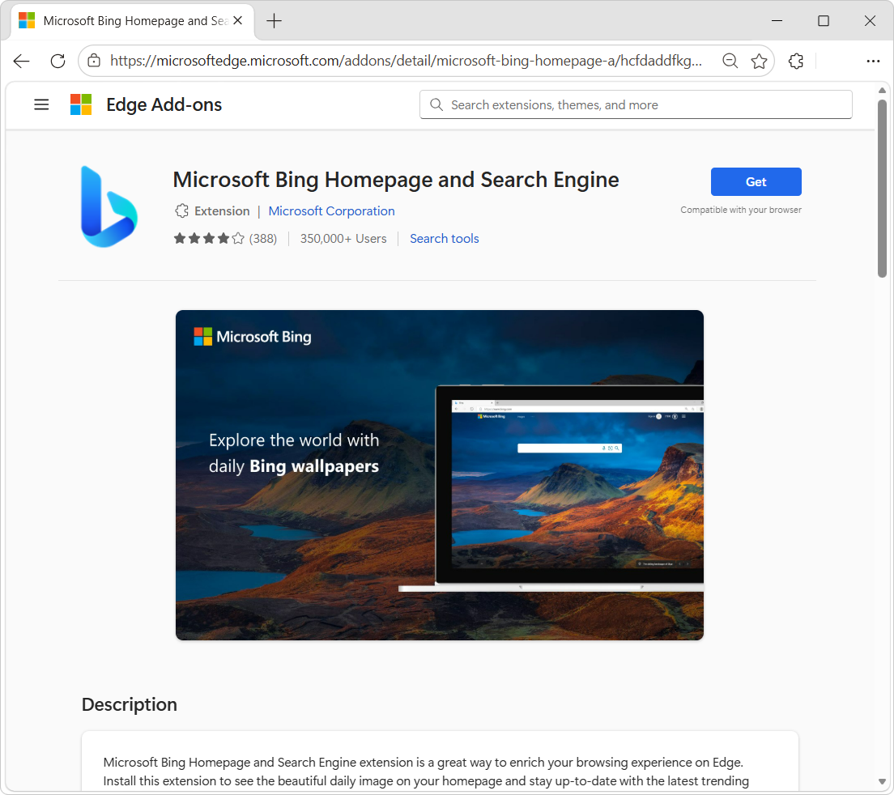
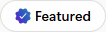
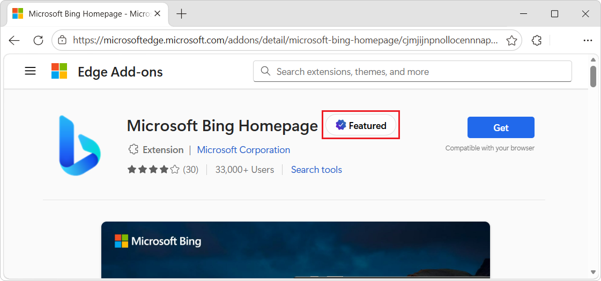

# Overview of Microsoft Edge extensions
<!-- https://aka.ms/AboutEdgeAddons -->

A Microsoft Edge _extension_ is a small app that a developer creates to add or modify features of Microsoft Edge, to extend the user experience (UX) for end-users in a specialized way.  An extension provides a niche experience or function that's important to a target audience.

Users browse and install extensions for Microsoft Edge from the [Microsoft Edge Add-ons](https://microsoftedge.microsoft.com) site.  _Add-ons_ include extensions and themes.

The present documentation is for extension developers, rather than end-users of Microsoft Edge extensions.  To use extensions for Microsoft Edge, see [User docs about Microsoft Edge extensions](./getting-started/user-docs.md).

<!-- omit See Also children at end -->
**Detailed contents:**
* [Introduction](#introduction)
* [Sites for extensions for various browsers](#sites-for-extensions-for-various-browsers)
* [Benefits of Chromium-based extensions](#benefits-of-chromium-based-extensions)
* [Browser compatibility and extension testing](#browser-compatibility-and-extension-testing)
   * [Browser-specific APIs](#browser-specific-apis)
* [Publish your extension to browser stores](#publish-your-extension-to-browser-stores)
   * [Migrate an existing extension to Microsoft Edge](#migrate-an-existing-extension-to-microsoft-edge)
   * [Publish an extension at Microsoft Edge Add-ons](#publish-an-extension-at-microsoft-edge-add-ons)
* [The Featured badge](#the-featured-badge)
   * [What the Featured badge represents](#what-the-featured-badge-represents)
   * [Reasons why the Featured badge could be revoked](#reasons-why-the-featured-badge-could-be-revoked)
* [See also](#see-also)

<!-- ====================================================================== -->
## Introduction

As a browser extension developer, you publish a Microsoft Edge extension (or theme) at [Microsoft Edge Add-ons](https://microsoftedge.microsoft.com).  In articles about Microsoft Edge extensions, and at Partner Center, the word _store_ includes the Microsoft Edge Add-ons site.

On the Microsoft Edge Add-ons site, you can enter various search terms in the **Search extensions, themes, and more** text box to find extensions and themes, such as the [Microsoft Bing Homepage and Search Engine](https://microsoftedge.microsoft.com/addons/detail/microsoft-bing-homepage-a/hcfdaddfkgbmekbgcepcnpfiopaigpnn) extension:
   

You can create a Microsoft Edge extension to add features to the browser, or improve the features of specific webpages by defining a companion experience.  _Companion experiences_ include ad blockers and password managers.

An extension should include at least the following features:

* An app manifest JSON file that contains basic platform information.
* A JavaScript file that defines the function.
* HTML and CSS files that define the user interface.

<!-- ====================================================================== -->
## Sites for extensions for various browsers

Great places to begin your extension development tutorials and documentation research are sites hosted by the browser organizations.

Some of the popular browsers to build extensions for are listed below.  This list isn't exhaustive or definitive; it's just a starting point for your research.

| Web browser | Chromium-based? | Extension development documentation |
|---|---|---|
| Microsoft Edge | Yes | [Microsoft Edge Add-ons Developer](https://developer.microsoft.com/microsoft-edge/extensions) |
| Google Chrome | Yes | [Chrome Extensions](https://developer.chrome.com/extensions) |
| Opera | Yes | [Extensions Documentation](https://dev.opera.com/extensions) |
| Brave | Yes | Uses [Chrome Web Store](https://chrome.google.com/webstore/category/extensions) |
| Apple Safari | No | [Safari app extensions](https://developer.apple.com/documentation/safariservices/safari_app_extensions) |
| Mozilla Firefox | No | [Browser extensions](https://developer.mozilla.org/docs/Mozilla/Add-ons/WebExtensions) |

For browser extension stores, end-user docs, and developer docs, see [See also](#see-also), below.

<!-- ====================================================================== -->
## Benefits of Chromium-based extensions

If your goal is to publish your extension in the extensions store for each browser, your extension must be modified for each version to target and run in each distinct browser environment.

Microsoft Edge is based on the [Chromium](https://www.chromium.org/Home) open-source browser project.  Other browsers are also based on Chromium, such as Google Chrome, Opera, and Brave.

Chromium-based browsers use the same extension APIs and the same way to package extensions.  This minimizes the need to maintain multiple, parallel versions of an extension.

By writing a Chromium extension, you write fewer lines of code and target more browsers.

<!-- ====================================================================== -->
## Browser compatibility and extension testing

Occasionally, API parity doesn't exist between Chromium browsers.  For example, there are differences in the identity and payment APIs.  To make sure your extension meets customer expectations, review API status through the following official browser documentation:

* [Chrome APIs](https://developer.chrome.com/extensions/api_index)
* [Extension APIs supported in Opera](https://dev.opera.com/extensions/apis)
* [Port a Chrome extension to Microsoft Edge](./developer-guide/port-chrome-extension.md)

The APIs that you require define the changes that you must make to address the differences between each browser.  You might need to create slightly different code packages with small differences for each browser extension store.

To test your extension in different environments before you submit the extension to a browser extension store, sideload the extension into your browser while you develop it.

See also:
* [Sideload an extension to install and test it locally](./getting-started/extension-sideloading.md)

<!-- ------------------------------ -->
#### Browser-specific APIs

In most cases, an extension that's designed for the Chromium browser engine works on the various Chromium-based browsers; the APIs work as expected.  Some less-common APIs might be browser-specific.

Some tutorials for browser-specific extension store sites use browser-specific APIs, which might not match the browser for the app that you're developing.  Links to the tutorials are in the [See also](#see-also) section, below.

<!-- ====================================================================== -->
## Publish your extension to browser stores

You can submit and seek browser extensions in the following browser extension stores.

* [Microsoft Edge Add-ons](https://microsoftedge.microsoft.com)
* [Chrome Web Store](https://chrome.google.com/webstore/category/extensions)
* [Opera addons](https://addons.opera.com/extensions)
* [Apple App Store](https://apps.apple.com)
* [Firefox Browser Add-ons](https://addons.mozilla.org/firefox/extensions)

Some browser extension stores allow you to download listed extensions from other browsers.  However, cross-browser access isn't guaranteed by every store.  To make sure your users find your extension in different browsers, you should maintain a listing on each store.

To make sure your users find your extension in Microsoft Edge, publish your extension on the Microsoft Edge Add-ons site.  See [Publish an extension at Microsoft Edge Add-ons](#publish-an-extension-at-microsoft-edge-add-ons), below.

Users might need to install your extension in different browsers. In this scenario, you can migrate existing Chromium extensions from one browser to another.

<!-- ------------------------------ -->
#### Migrate an existing extension to Microsoft Edge

If you've already developed an extension for another Chromium-based browser, you can submit it at [Microsoft Edge Add-ons](https://microsoftedge.microsoft.com).  You don't need to rewrite your extension or verify that it works in Microsoft Edge.  However, when you migrate an existing Chromium extension to other Chromium browsers, make certain the same APIs or alternatives are available for your target browser.

For more information on porting your Chrome extension to Microsoft Edge, see [Port a Chrome extension to Microsoft Edge](./developer-guide/port-chrome-extension.md).  After you port your extension to the target browser, the next step is to publish it.

<!-- ------------------------------ -->
#### Publish an extension at Microsoft Edge Add-ons

You publish a Microsoft Edge extension at [Microsoft Edge Add-ons](https://microsoftedge.microsoft.com).

To start publishing a Microsoft Edge extension, you must [register for a developer account](https://developer.microsoft.com/registration) with a Microsoft account (MSA) email account to submit your extension listing at Microsoft Edge Add-ons.  The email address of a Microsoft account (MSA) includes `@outlook.com`, `@live.com`, or `@hotmail.com`.  

When you choose an email address to register, consider whether you must transfer or share ownership of the Microsoft Edge extension with other people in your organization.  After registration is complete, you can submit an extension listing.

To submit an extension at Microsoft Edge Add-ons, you need to provide the following items:

* An archive (`.zip`) file that contains your code files.
* All required visual assets, which include a logo and small promotional tile.
* Optional promotional media, such as screenshots, promotional tiles, and a video URL.
* Information that describes your extension such as the name, short description, and a privacy policy link.

Different stores might have different submission requirements.  The above list summarizes the requirements for publishing an extension for Microsoft Edge; for details, see [Publish a Microsoft Edge extension](./publish/publish-extension.md).

After you've successfully submitted your extension, your extension undergoes a review process and either passes or fails the certification process.  You're notified of the outcome and given next steps as required.  If you submit an extension _update_ at Microsoft Edge Add-ons, that begins a new review process.

<!-- ====================================================================== -->
## The Featured badge

At the [Microsoft Edge Add-ons](https://microsoftedge.microsoft.com) site, the **Featured** badge links to this section.  The present documentation is for extension developers, rather than end-users of Microsoft Edge extensions.  To use extensions for Microsoft Edge, see [User docs about Microsoft Edge extensions](./getting-started/user-docs.md).

Extensions are curated to help users discover trustworthy and high-performing extensions.  The **Featured** badge at [Microsoft Edge Add-ons](https://microsoftedge.microsoft.com) highlights extensions that meet a high bar of quality, security, and user experience.

The **Featured** badge is awarded to select extensions that align with [Best practices for extensions](./developer-guide/best-practices.md).  When you hover over the **Featured** badge, the tooltip reads: **This extension follows all of Microsoft's recommended practices and has been verified.**

For example, the [Microsoft Bing Homepage](https://microsoftedge.microsoft.com/addons/detail/microsoft-bing-homepage/cjmjijnpnollocennnapedpaeecninea) extension has a **Featured** badge, to the right of the extension name:

<!-- ------------------------------ -->
#### What the Featured badge represents

The **Featured** badge indicates that:

* The extension aligns with Microsoft's best practices for security, privacy, performance, and user experience.

* The extension has been reviewed and selected through an automated system.

* The extension offers a reliable and high-quality experience for Microsoft Edge users. 

The **Featured** badge is not a judgment of safety.  An extension that doesn't have the **Featured** badge is not necessarily unsafe; the extension simply doesn't meet the current threshold for Featured status. 

<!-- ------------------------------ -->
#### Reasons why the Featured badge could be revoked

The **Featured** badge isn't permanent.  An extension might lose the **Featured** badge if the extension no longer meets the evolving standards, or if the extension's quality signals degrade over time. 

To maintain a high-quality ecosystem, Microsoft periodically re-evaluates all badged extensions.  A **Featured** badge might be removed due to: 

* Decline in user experience or performance metrics. 

* Outdated or incomplete store listing information. 

* Security or privacy concerns. 

* Changes in Microsoft's evaluation criteria. 

All decisions about the **Featured** badge are final and not subject to individual review.  There is no manual application or appeal process.  The **Featured** badge is awarded and revoked based on internal evaluation criteria and tooling. 

To improve your extension's quality and eligibility for the **Featured** badge, see [Best practices for extensions](./developer-guide/best-practices.md).

<!-- ====================================================================== -->
## See also
<!-- all links in the article -->

<!-- todo: update local toc -->

<!-- ------------------------------ -->
#### Microsoft Edge

<!-- ---------- -->
###### Store

* [Microsoft Edge Add-ons](https://microsoftedge.microsoft.com)
   * [Microsoft Corporation](https://microsoftedge.microsoft.com/addons/search/microsoft%20corporation) - Extensions or themes by Microsoft.
   * [Microsoft Bing Homepage and Search Engine](https://microsoftedge.microsoft.com/addons/detail/microsoft-bing-homepage-a/hcfdaddfkgbmekbgcepcnpfiopaigpnn) extension.
   * [Microsoft Bing Homepage](https://microsoftedge.microsoft.com/addons/detail/microsoft-bing-homepage/cjmjijnpnollocennnapedpaeecninea) extension.

<!-- ---------- -->
###### End-user docs

* [User docs about Microsoft Edge extensions](./getting-started/user-docs.md)<!-- toc bucket 0 -->
* [Everything to know about browser extensions](https://www.microsoft.com/edge/learning-center/everything-to-know-about-browser-extensions?form=MA13I2&msockid=3078d2dac55660f53e4ec6a8c4ec61bf)<!-- link not in article -->
* [Add, turn off, or remove extensions in Microsoft Edge](https://support.microsoft.com/microsoft-edge/add-turn-off-or-remove-extensions-in-microsoft-edge-9c0ec68c-2fbc-2f2c-9ff0-bdc76f46b026)<!-- link not in article -->

<!-- ---------- -->
###### Development

<!-- toc order -->
* [Extension concepts and architecture](./getting-started/index.md)<!-- link not in article --><!-- toc bucket 2.1 -->
* [Sideload an extension to install and test it locally](./getting-started/extension-sideloading.md)<!-- toc bucket 2.2 -->
* [Port a Chrome extension to Microsoft Edge](./developer-guide/port-chrome-extension.md)<!-- toc bucket 4 -->
* [Publish a Microsoft Edge extension](./publish/publish-extension.md)<!-- toc bucket 7 -->
* [Best practices for extensions](./developer-guide/best-practices.md)<!-- toc bucket 10 -->

External:
* [Microsoft Edge Add-ons Developer](https://developer.microsoft.com/microsoft-edge/extensions)
* [Manage Microsoft Edge extensions in the enterprise](/deployedge/microsoft-edge-manage-extensions)<!-- link not in article -->
* [Register for a developer account](https://developer.microsoft.com/registration) at Microsoft Partner Center.

<!-- ------------------------------ -->
#### Google Chrome, or Chromium browser engine

<!-- ---------- -->
###### Store

* [Chrome Web Store](https://chrome.google.com/webstore/category/extensions)

<!-- ---------- -->
###### Development

* [Chrome Extensions](https://developer.chrome.com/extensions)
   * [Chrome Extensions > Get started](https://developer.chrome.com/docs/extensions/get-started/)<!-- link not in article -->
* [Chromium open-source project](https://www.chromium.org/Home)
* [Chrome APIs](https://developer.chrome.com/extensions/api_index)

<!-- ------------------------------ -->
#### Opera

<!-- ---------- -->
###### Store

* [Opera addons](https://addons.opera.com/extensions)

<!-- ---------- -->
###### Development

* [Extensions Documentation](https://dev.opera.com/extensions)
   * [Getting Started](https://dev.opera.com/extensions/getting-started)<!-- link not in article -->
   * [Extension APIs Supported in Opera](https://dev.opera.com/extensions/apis)

<!-- ------------------------------ -->
#### Brave

<!-- ---------- -->
###### Store

* [Chrome Web Store](https://chrome.google.com/webstore/category/extensions) - store for Brave extensions.

<!-- ---------- -->
###### End-user docs

* [How can I add extensions to Brave?](https://support.brave.app/hc/en-us/articles/360017909112-How-can-I-add-extensions-to-Brave)
* [Browser Extensions](https://brave.com/learn/category/browser-extensions/)

<!-- ---------- -->
###### Development

* [Web search: Develop a Brave browser extension](https://www.bing.com/search?q=Develop+a+Brave+browser+extension)

<!-- ------------------------------ -->
#### Apple Safari

<!-- ---------- -->
###### Store

* [Apple App Store](https://apps.apple.com)
   * [The Best Safari Extensions](https://apps.apple.com/us/story/id1377753262)

<!-- ---------- -->
###### Development

* [Safari app extensions](https://developer.apple.com/documentation/safariservices/safari_app_extensions)

<!-- ------------------------------ -->
#### Mozilla Firefox

<!-- ---------- -->
###### Store

* [Firefox Browser Add-ons](https://addons.mozilla.org/firefox/extensions)

<!-- ---------- -->
###### Development

* [Browser extensions](https://developer.mozilla.org/docs/Mozilla/Add-ons/WebExtensions)
* [Porting a Google Chrome extension](https://extensionworkshop.com/documentation/develop/porting-a-google-chrome-extension)<!-- link not in article --> (to Firefox).
