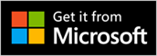

# Use the Microsoft Edge Add-ons badge to promote your add-on
<!-- upstream:
Microsoft Store marketing guidelines for apps
https://learn.microsoft.com/windows/apps/publish/app-marketing-guidelines
https://web.archive.org/web/20250727064821/https://learn.microsoft.com/en-us/windows/apps/publish/app-marketing-guidelines
not in TOC
docset: Windows > App development
-->

To promote your Microsoft Edge extension, theme, or web app, use the Microsoft Edge Add-ons badge in your websites, documentation, tutorials, and other services or integrations.  This ensures consistent, accessible, and compliant representation of the Microsoft Edge Add-ons brand.

The Microsoft Edge Add-ons badge is a visual asset designed to help you promote your Microsoft Edge add-on and build user trust.

The Microsoft Edge Add-ons badge reads **Get it from Microsoft Edge Add-ons**, and shows the Microsoft Edge logo:

The Microsoft Edge Add-ons badge appears in full color with a dark background, and includes a gray border and transparent corners.  The badge `.png` files are provided in 41 languages.

The Microsoft Edge Add-ons badge lets you showcase your Microsoft Edge add-on with Microsoft Edge-specific branding.  To prevent confusion with the broader [Microsoft Store](https://apps.microsoft.com), the Microsoft Edge Add-ons badge is intended exclusively for promoting add-ons that are available for Microsoft Edge.  This badge helps users clearly identify content that is built specifically for the Microsoft Edge browser.

The generic Microsoft Store badge reads **Get it from Microsoft**, and shows the Microsoft logo:

Unlike the generic Microsoft Store badge, the Microsoft Edge Add-ons badge provides a distinct, trusted visual cue that connects your Microsoft Edge add-on directly to the Microsoft Edge ecosystem.

The Microsoft Edge Add-ons badge is not the same as the Microsoft brand logo, and they cannot be used interchangeably.

<!-- ====================================================================== -->
## Download the badge image files

Download the complete set of `.png` files: 

* [Microsoft_Edge_Add-ons_badge_image_files.zip](https://github.com/microsoft/MicrosoftEdge-Extensions/blob/main/assets/Microsoft_Edge_Add-ons_badge_image_files.zip) (from the [MicrosoftEdge-Extensions](https://github.com/microsoft/MicrosoftEdge-Extensions) repo).
<!-- todo:
1. remove hidden macOS dir from the .zip file
2. upload the .zip file to either:
   * https://github.com/microsoft/MicrosoftEdge-Extensions/pull/365
   * download.microsoft.com (www.microsoft.com/download)
3. update the url above
-->

<!-- ====================================================================== -->
## Badge usage guidelines

Follow the required specifications for image usage, fonts, and color palette.  For detailed usage examples and guidelines, download and read [Microsoft_Edge_Add-ons_badge_guidelines.pdf](https://github.com/microsoft/MicrosoftEdge-Extensions/blob/main/assets/Microsoft_Store_Badge_Guidelines.pdf) (from the [MicrosoftEdge-Extensions](https://github.com/microsoft/MicrosoftEdge-Extensions) repo).
<!-- todo:
1. upload the .pdf file to either:
   * https://github.com/microsoft/MicrosoftEdge-Extensions/pull/365
   * download.microsoft.com (www.microsoft.com/download)
2. update the url above
-->

For example, the PDF includes the following guidelines:

* Always use the official badge artwork provided by Microsoft.

* Do not create your own version, alter the text color, extract the Microsoft Edge logo, or modify the badge in any way.

* Do not animate, rotate, tilt, stretch, compress, or apply gradients or shadows to the badge.

* Do not use the badge as a decorative element in any context.

* The badge must always be an active, clickable link that directs users to your product detail page at [Microsoft Edge Add-ons](https://microsoftedge.microsoft.com).

* Do not use the badge in static marketing materials, such as posters, flyers, or non-clickable images in presentations or videos.

* The badge is intended solely to facilitate direct access to your add-ons at [Microsoft Edge Add-ons](https://microsoftedge.microsoft.com).

<!-- ------------------------------ -->
#### Minimum size for badges

To ensure that the badge text remains readable, display it at a minimum size of 32px.  Avoid using smaller sizes.

When scaling the badge, always maintain its aspect ratio; do not stretch or compress the badge image.  This helps preserve visual quality and reinforces your product's credibility.

<!-- ====================================================================== -->
## License for Microsoft Marks
<!-- upstream:
License to Microsoft Marks
https://learn.microsoft.com/windows/apps/publish/app-marketing-guidelines#license-to-microsoft-marks
https://web.archive.org/web/20250727064821/https://learn.microsoft.com/en-us/windows/apps/publish/app-marketing-guidelines#license-to-microsoft-marks
-->

_Microsoft Marks_ means the Microsoft Edge Add-ons badge and Microsoft Edge logos.  To use these assets:

* Your product or content must reference Microsoft Edge or its features.

* You must follow the logo usage specifications described in the Microsoft Edge Add-ons badge guidelines.

* Microsoft reserves the right to revoke usage of the Microsoft Edge Add-ons badge at any time.

Microsoft is the sole owner of the Microsoft Marks and associated goodwill, and the sole beneficiary of the goodwill associated with your use of the Microsoft Marks.  Microsoft may revoke this license at any time and at its sole discretion.

<!-- ====================================================================== -->
## See also

* [Microsoft Edge Add-ons](https://microsoftedge.microsoft.com) - site includes extensions, themes, and web apps.
