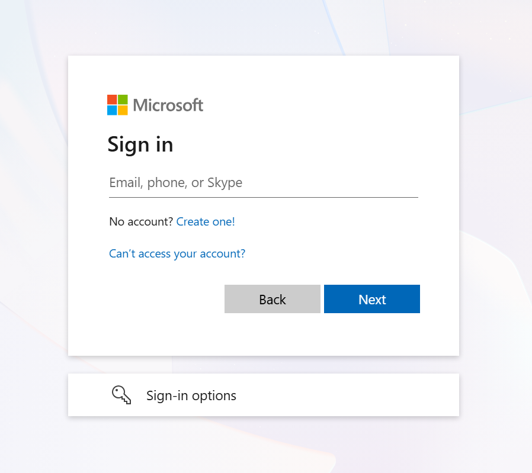
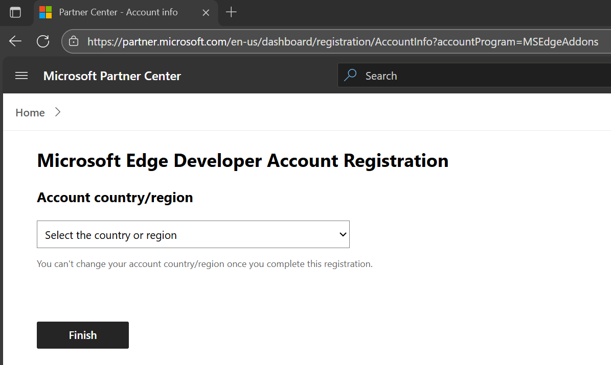
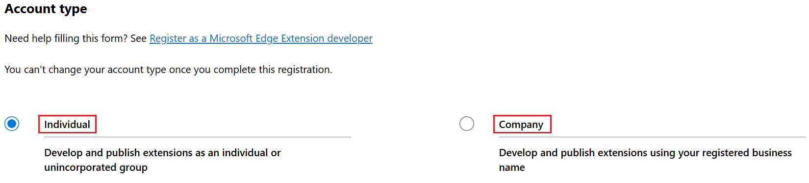
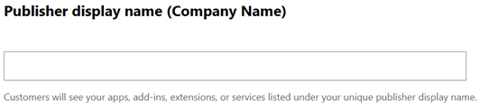
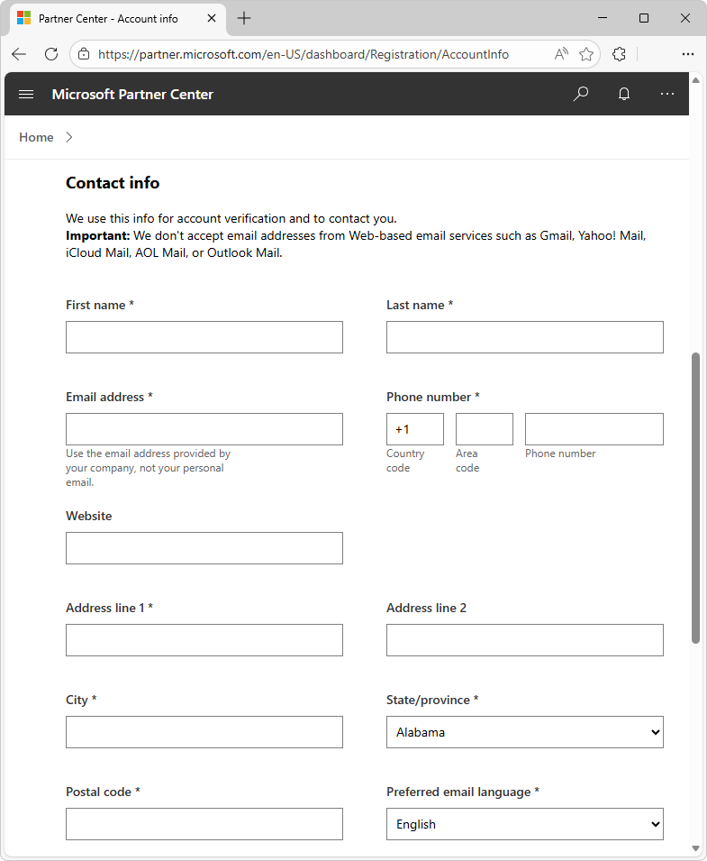
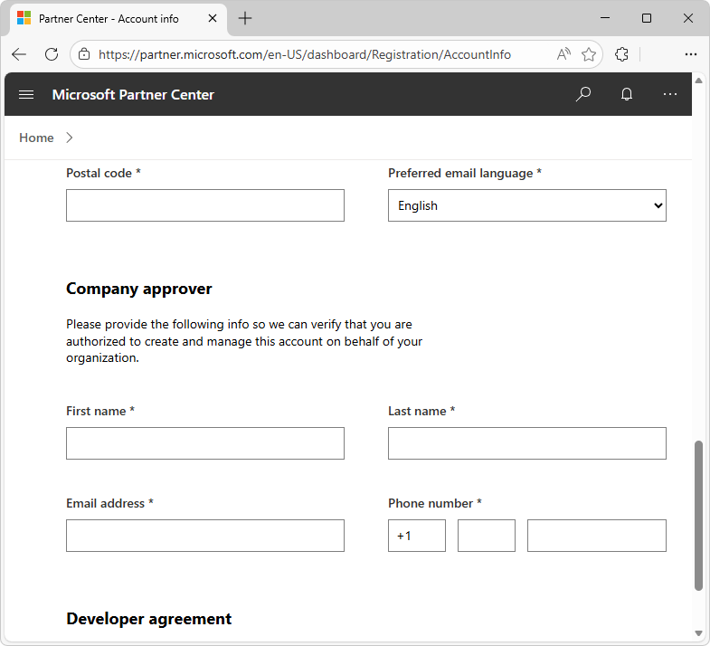
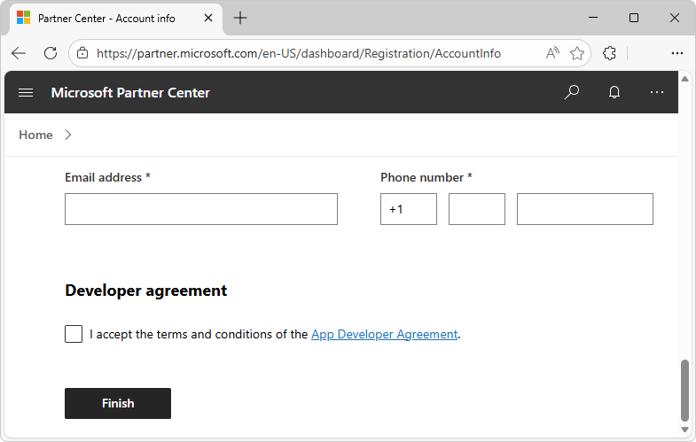
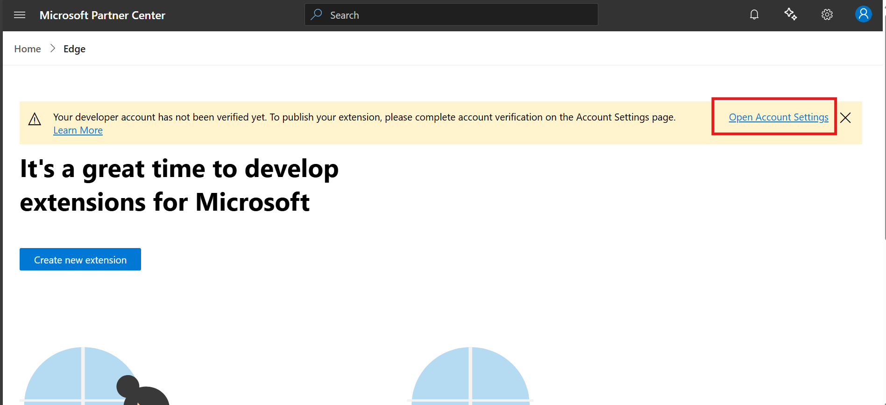

# Register as a Microsoft Edge extension developer
<!-- https://learn.microsoft.com/microsoft-edge/extensions/publish/create-dev-account -->

To submit an extension at [Microsoft Edge Add-ons](https://microsoftedge.microsoft.com), you must be registered as a developer with the Microsoft Edge program.  You register for the Microsoft Edge program at [Partner Center](https://partner.microsoft.com/dashboard/microsoftedge/public/login), as described below.

**Detailed contents:**
* [Introduction](#introduction)
* [Types of accounts related to publishing Microsoft Edge extensions](#types-of-accounts-related-to-publishing-microsoft-edge-extensions)
* [Step 1: Create a Microsoft account (MSA)](#step-1-create-a-microsoft-account-msa)
* [Step 2: Fill in the Edge Developer Account Registration form](#step-2-fill-in-the-edge-developer-account-registration-form)
   * [Account country/region](#account-countryregion)
   * [Account type](#account-type)
      * [Individual account](#individual-account)
      * [Company account](#company-account)
   * [Publisher display name (Company name)](#publisher-display-name-company-name)
   * [Contact info](#contact-info)
   * [Company approver](#company-approver)
   * [Developer agreement](#developer-agreement)
   * [Resolve any Partner Center errors](#resolve-any-partner-center-errors)
* [Step 4: Check enrollment verification status](#step-4-check-enrollment-verification-status)
   * [If account verification is delayed](#if-account-verification-is-delayed)
* [Step 5: Add users to the account](#step-5-add-users-to-the-account)
* [See also](#see-also)

<!-- ====================================================================== -->
## Introduction

There is no registration fee for submitting extensions to the Microsoft Edge program.

To register for the Microsoft Edge program, you need a Microsoft account (MSA).  This article helps you create a Partner Center account that you can use to submit a Microsoft Edge extension at [Microsoft Edge Add-ons](https://microsoftedge.microsoft.com).  This article covers company accounts (for enterprise developers), and individual accounts (for individual developers), as described in [Account type](#account-type), below.

If you have a Partner Center account, but the Primary Owner of the account isn't a Microsoft account (MSA), this article helps you create and link to a suitable account.  You'll learn:
* How to create a Microsoft account (MSA), if you don't have one.
* How to link the MSA to your Partner Center account.

To add and manage users in the Microsoft Edge program to manage extensions, you can associate your Partner Center account with your organization's Microsoft Entra tenant.

<!-- ====================================================================== -->
## Types of accounts related to publishing Microsoft Edge extensions

To publish a Microsoft Edge extension, you need a Partner Center developer account that has a Microsoft account (MSA) as the Primary Owner.

Supported account types:

| Type of account | Description |
|---|---|
| _Microsoft account (MSA)_ | An Outlook.com, Live.com, or Hotmail.com account. |
| _GitHub account_ | A user account at GitHub.com.  You can use your personal GitHub account to sign in to Partner Center — a Microsoft account (MSA) will be created for you. |
| _Partner Center account_, _Partner Center developer account_ | A _Partner Center account_ is an account on partner.microsoft.com.  To submit Microsoft Edge extensions, you need a _Partner Center developer account_, which is a Partner Center account that has a Microsoft account (MSA) as the Primary Owner. |
| _Microsoft Edge Program account_ | Enables multiple users to work with Microsoft Edge extensions at Partner Center. |
| _Microsoft Entra ID_ | A Microsoft Entra ID account; see [What is Microsoft Entra?](/entra/fundamentals/whatis) |
| _Microsoft Entra tenant_ | A _tenant_ represents an organization.  A tenant is a dedicated instance of Microsoft Entra ID that an organization or app developer receives at the beginning of a relationship with Microsoft.  See [Set up a new Microsoft Entra tenant](/azure/active-directory/develop/quickstart-create-new-tenant). |

<!-- ====================================================================== -->
## Step 1: Create a Microsoft account (MSA)

To register for the Microsoft Edge program, you need a Microsoft account (MSA).  A _Microsoft account_ (MSA) is an Outlook.com, Live.com, or Hotmail.com account.

If you don't have a Partner Center account, or you have a Partner Center account but its Primary Owner isn't an MSA, you must either:

*  Use an existing MSA to register with the Microsoft Edge program.

*  Create a new MSA.

If you don't have an MSA:

1. Decide if you want to use your existing GitHub account to create an MSA.  See [Register and sign in to Partner Center using a GitHub account](./github.md).

1. If you aren't using your GitHub account to create the MSA, go to [Microsoft account](https://account.microsoft.com/account).

   1. At the bottom of the page, click **Create a Microsoft account**.
   1. Complete the registration steps.

If you have a Partner Center account for which the Primary Owner is an MSA, use that account to sign into your Partner Center account.  Then enroll in the Microsoft Edge program.

The Microsoft Edge program doesn't support registering with a work or school account.  You must register using a Microsoft account (MSA) and then link your Microsoft Entra tenants with that account, to be able to manage extensions.

<!-- ====================================================================== -->
## Step 2: Fill in the Edge Developer Account Registration form

To enroll in the Microsoft Edge program on Partner Center:

1. Go to [Partner Center](https://partner.microsoft.com/dashboard/microsoftedge/public/login).

1. If you have an existing Microsoft account (MSA) or you created a new MSA, use it to sign into Partner Center:

   

   The **Microsoft Edge Developer Account Registration** form might immediately appear.  If not:

1. In Partner Center, navigate to [Account settings | Programs](https://partner.microsoft.com/dashboard/account/v3/settings/programs), and then in the **Microsoft Edge** card, click the **Get started** link.

   The **Microsoft Edge Developer Account Registration** form opens in a new tab, showing the **Account country/region** dropdown list and a **Finish** button.

<!-- ------------------------------ -->
#### Account country/region
<!-- depending how/when you enter into the form page: -->
<!-- https://partner.microsoft.com/en-US/dashboard/Registration/AccountInfo -->
<!-- https://partner.microsoft.com/en-US/dashboard/Registration/AccountInfo?accountProgram=MSEdgeAddons -->

In the **Account country/region** dropdown list, select either where you live, or where your business is located.  **Important:** After enrollment, the value of this field is read-only.

Additional sections are added below the dropdown list, and the **Finish** button is pushed down out of view.

<!-- ------------------------------ -->
#### Account type

In the **Account type** section, select the **Individual** or **Company** option button.  **Important:** After enrollment, the value of this field can't be changed.

The Microsoft Edge program in [Partner Center](https://partner.microsoft.com/dashboard/microsoftedge/public/login) offers both individual and company accounts, described below.  Both account types enable you to publish an extension at [Microsoft Edge Add-ons](https://microsoftedge.microsoft.com).

<!-- ---------- -->
###### Individual account

Develop and publish extensions as an individual or unincorporated group.

An individual account is appropriate for a developer who isn't associated with a company.  The account verification process is shorter, and involves verifying that the publisher display name is available.

<!-- ---------- -->
###### Company account

Develop and publish extensions using your registered business name.

A company account is associated with an organization or business.  The account verification process is longer, and involves confirmation that you're authorized to create the account for your company.  The duration of the process can range from a few days to a few weeks.  Your company might receive phone calls from Microsoft verification partners.

For a company account, it's crucial to verify your Microsoft Edge program information when you enroll into a new Partner Center program.  This verification is needed to publish an extension at [Microsoft Edge Add-ons](https://microsoftedge.microsoft.com).  See [Verify your company account information](./verify-microsoft-edge-program.md).

<!-- ------------------------------ -->
#### Publisher display name (Company name)

In the **Publisher display name (Company name)** text box, enter the company name to display at [Microsoft Edge Add-ons](https://microsoftedge.microsoft.com):

To use a particular name, that name must be available, and you must have the rights to use it.  For a company account, this must be the registered business name of your organization.

The maximum length for this field is fifty (50) characters.

<!-- ------------------------------ -->
#### Contact info

In the **Contact info** section, enter contact information that Microsoft will use to contact you about any account issues:

For a company account, you must use the registered email address that's associated with your organization.

After registration is complete, you receive a confirmation email.  

<!-- ------------------------------ -->
#### Company approver

For a company account, you must provide the contact information of your company approver.  If you selected the **Company** option button in the **Account type** section, the **Company approver** section appears:

The contact information includes name, email address, and phone number.  As a part of the account verification process, Microsoft contacts the specified company approver, to verify that you are authorized to create and manage this account on behalf of your organization.

<!-- ------------------------------ -->
#### Developer agreement

1. In the **Developer agreement** section, click the **App Developer Agreement** link, and then read the [Microsoft Store App Developer Agreement](https://go.microsoft.com/fwlink/?linkid=528905).

   

1. In the **Microsoft Edge Developer Account Registration** form, select the **I accept the terms and conditions** checkbox.

1. Click the **Finish** button.

You've now registered as a developer.  Microsoft verifies your account enrollment, and then sends you a confirmation email.

<!-- ------------------------------ -->
#### Resolve any Partner Center errors

After submitting the form, Partner Center might display an error in the **Properties** page, such as "Something went wrong.  Please try again. correlationId : undefined".

For such errors, try the following fixes:

* Clear the browser cache and cookies.

* Try using InPrivate mode in Microsoft Edge, or Incognito mode in Google Chrome.

* Try another browser, such as Microsoft Edge, Google Chrome, or Firefox.

<!-- ====================================================================== -->
## Step 4: Check enrollment verification status

To check the verification status of your account enrollment, go to [Partner Center](https://partner.microsoft.com/dashboard/microsoftedge/public/login) and then click the **Open Account Settings** link:

While you wait for the account verification process to complete, you can continue to develop, test, and prepare your Microsoft Edge extension.  See [Step 1: Prepare the extension to be submitted](./publish-extension.md#step-1-prepare-the-extension-to-be-submitted) in _Publish a Microsoft Edge extension_.

<!-- ------------------------------ -->
#### If account verification is delayed

If your company account enrollment is stuck in "Pending" or "Action Required" status, try the following fixes.

Ensure that all documents (such as utility bills, DUNS ID, or government records) are:
* Clear, complete, and match your legal business profile.
* Uploaded in the correct section at Partner Center, under [Account settings | Legal info](https://partner.microsoft.com/dashboard/account/v3/organization/legalinfo).

If your application was rejected: 
* In the **Legal Info** tab, click **Fix now**.
* Re-upload documents with comments explaining your appeal.

Switching from a company to an individual account is not supported.

<!-- ====================================================================== -->
## Step 5: Add users to the account

After account verification is complete, you can add users to the Edge program.

See [Add users to the Microsoft Edge program](./aad-account.md).

<!-- ====================================================================== -->
## See also
<!-- all links in article -->

* [Register and sign in to Partner Center using a GitHub account](./github.md)
* [Verify your company account information](./verify-microsoft-edge-program.md)
* [Step 1: Prepare the extension to be submitted](./publish-extension.md#step-1-prepare-the-extension-to-be-submitted) in _Publish a Microsoft Edge extension_.
* [Add users to the Microsoft Edge program](./aad-account.md)

Policies:
* [Microsoft Store App Developer Agreement](https://go.microsoft.com/fwlink/?linkid=528905)

Entra:
* [What is Microsoft Entra?](/entra/fundamentals/whatis)
* [Set up a new Microsoft Entra tenant](/azure/active-directory/develop/quickstart-create-new-tenant)

Other Microsoft.com sites:
* [Partner Center](https://partner.microsoft.com/dashboard/microsoftedge/public/login)
* [account.microsoft.com](https://account.microsoft.com/account)
* [Microsoft Edge Add-ons](https://microsoftedge.microsoft.com)
