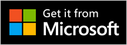

<!-- todo: in desc above, web app ok? -->
# Use the Get it from Microsoft Edge badge to promote your extension
<!-- todo: note title of upstream article, toc bucket/nav, & docset name  https://learn.microsoft.com/windows/apps/publish/app-marketing-guidelines -->

<!-- todo: in this article, globally delete "add-ons" -->

To promote your Microsoft Edge extension, theme, or web app, use the Get it from Microsoft Edge badge in your websites, documentation, tutorials, and other services or integrations.  This ensures consistent, accessible, and compliant representation of the Microsoft Edge Add-ons brand.

The Get it from Microsoft Edge badge is a visual asset designed to help you promote your Microsoft Edge add-ons and build user trust.

The Get it from Microsoft Edge badge appears in full color with a dark background, and includes a gray border and transparent corners.  The badge `.png` files are provided in 41 languages.

The Get it from Microsoft Edge badge lets you showcase your Microsoft Edge add-ons with Microsoft Edge-specific branding.  To prevent confusion with the broader [Microsoft Store](https://apps.microsoft.com), the Get it from Microsoft Edge badge is intended exclusively for promoting add-ons that are available for Microsoft Edge.  This badge helps users clearly identify content that is built specifically for the Microsoft Edge browser.

The generic Microsoft Store badge reads **Get it from Microsoft**:

Unlike generic Microsoft [Store badges](/windows/apps/publish/app-marketing-guidelines#store-badges),<!-- todo: png showing "generic" Microsoft Store badge --> the Get it from Microsoft Edge badge provides a distinct, trusted visual cue (adding the words **Edge Add-ons**) that connects your Edge add-ons directly to the Microsoft Edge ecosystem.

The Get it from Microsoft Edge badge is not the same as the Microsoft brand logo, and they cannot be used interchangeably.

<!-- ====================================================================== -->
## Download the badge image files

Download the complete set of badge `.png` files.

<!-- todo: upload the .zip file to either:
download.microsoft.com (www.microsoft.com/download)
https://github.com/microsoft/MicrosoftEdge-Extensions/pull/365
-->
<!-- todo: 404 --> **All badge images**

<!-- ====================================================================== -->
## Badge usage guidelines

Follow the required specifications for image usage, fonts, and color palette.  Detailed usage examples and guidelines are available in the downloadable PDF:

 **Microsoft Store Badge Guidelines (PDF, English)**

For example, here are some of the guidelines from the PDF:

* Always use the official badge artwork provided by Microsoft.

* Do not create your own version, alter the text color, extract the Microsoft Edge logo, or modify the badge in any way.

* Do not animate, rotate, tilt, stretch, compress, or apply gradients or shadows to the badge.

* Do not use the badge as a decorative element in any context.

* The badge must always be an active, clickable link that directs users to your product detail page at [Microsoft Edge Add-ons](https://microsoftedge.microsoft.com).

* Do not use the badge in static marketing materials, such as posters, flyers, or non-clickable images in presentations or videos.

* The badge is intended solely to facilitate direct access to your Edge add-ons at [Microsoft Edge Add-ons](https://microsoftedge.microsoft.com).

<!-- ------------------------------ -->
#### Minimum size for badges

To ensure that the badge text remains readable, display it at a minimum size of 32px.  Avoid using smaller sizes.

When scaling the badge, always maintain its aspect ratio; do not stretch or compress the badge image.  This helps preserve visual quality and reinforces your product's credibility.

<!-- ====================================================================== -->
## License for Microsoft Marks
<!-- https://learn.microsoft.com/windows/apps/publish/app-marketing-guidelines#license-to-microsoft-marks -->

_Microsoft Marks_ means the Get it from Microsoft Edge badge and Microsoft Edge logos.  To use these assets:
* Your product or content must reference Microsoft Edge or its features.
* You must follow the logo usage specifications described in the [Microsoft Store Badge Guidelines](https://download.microsoft.com/download/0/7/D/07DF43D4-B1A8-4D38-BC02-4903BB36CEE8/Microsoft_Store_Badge_Guidelines.pdf).
* Microsoft reserves the right to revoke usage at any time.

Microsoft is the sole owner of the Microsoft Marks and associated goodwill, and the sole beneficiary of the goodwill associated with your use of the Microsoft Marks.  Microsoft may revoke this license at any time and at its sole discretion.

<!-- ====================================================================== -->
## See also

* [Microsoft Edge Add-ons](https://microsoftedge.microsoft.com) - site includes extensions, themes, and web apps.<!-- todo: web apps ok? -->
