# Publish a Microsoft Edge extension

After you develop and test your Microsoft Edge extension, you're ready to distribute your extension at [Microsoft Edge Add-ons](https://microsoftedge.microsoft.com).  To increase the extension's reach and make it available to other Microsoft Edge users, publish the extension at Microsoft Edge Add-ons, through Partner Center.

If you have an existing Chrome extension and you want to release it for Microsoft Edge users, first see [Port a Chrome extension to Microsoft Edge](../developer-guide/port-chrome-extension.md).

**Detailed contents:**
<!-- https://github.com/captainbrosset/WebToc -->
* [Step 1: Prepare the extension to be submitted](#step-1-prepare-the-extension-to-be-submitted)
   * [Have a working prototype of the extension](#have-a-working-prototype-of-the-extension)
   * [Create a developer account](#create-a-developer-account)
   * [Create a .zip file for the extension package](#create-a-zip-file-for-the-extension-package)
   * [Review manifest field values](#review-manifest-field-values)
* [Step 2: Start a new submission at Partner Center](#step-2-start-a-new-submission-at-partner-center)
* [Step 3: Upload the extension package](#step-3-upload-the-extension-package)
* [Step 4: Provide availability information](#step-4-provide-availability-information)
   * [Visibility](#visibility)
   * [Markets](#markets)
* [Step 5: Enter properties describing the extension](#step-5-enter-properties-describing-the-extension)
* [Step 6: Add store listing details for each language](#step-6-add-store-listing-details-for-each-language)
   * [Enter properties for a language](#enter-properties-for-a-language)
   * [Generate the description with AI](#generate-the-description-with-ai)
   * [Add or remove a language](#add-or-remove-a-language)
   * [Duplicate an asset from one language to the other languages](#duplicate-an-asset-from-one-language-to-the-other-languages)
   * [Provide a YouTube video](#provide-a-youtube-video)
   * [Enter search terms for the extension](#enter-search-terms-for-the-extension)
   * [Fix any form field errors](#fix-any-form-field-errors)
* [Step 7: Provide testing notes and submit the extension](#step-7-provide-testing-notes-and-submit-the-extension)
* [Resolve any Partner Center errors](#resolve-any-partner-center-errors)
* [If the extension is flagged as potentially malware](#if-the-extension-is-flagged-as-potentially-malware)
* [Support](#support)
* [See also](#see-also)

<!-- ========================================================================== -->
## Step 1: Prepare the extension to be submitted

To prepare an extension to be submitted via Partner Center, to be published at [Microsoft Edge Add-ons](https://microsoftedge.microsoft.com), do the following steps.

<!-- ---------------------------------- -->
#### Have a working prototype of the extension

Before publishing your extension, you should have a working prototype of the extension ready.  For information on how to create an extension, see [Extension concepts and architecture](../getting-started/index.md).

<!-- ---------------------------------- -->
#### Create a developer account

To get started, visit [Partner Center](https://partner.microsoft.com/dashboard/microsoftedge/public/login?ref=dd).  This is where every developer (new or existing) must go to publish or manage their extensions.

Use your active developer account to submit the extension at [Microsoft Edge Add-ons](https://microsoftedge.microsoft.com).  If you don't have a developer account, create a new developer account.  To open a new developer account and register for the Microsoft Edge program, see [Register as a Microsoft Edge extension developer](./create-dev-account.md).

<!-- ---------------------------------- -->
#### Create a .zip file for the extension package

Create a `.zip` file that's your extension package.  The extension package must include the following files:

* The extension manifest that specifies details such as the name of the extension, short description, permissions, and default language.

* Images and other files required by the extension.

<!-- ---------------------------------- -->
#### Review manifest field values

In articles about Microsoft Edge extensions, and at Partner Center, the word _store_ includes [Microsoft Edge Add-ons](https://microsoftedge.microsoft.com).

Before uploading your package to Partner Center, inspect the manifest file to make sure that the field values match your preferred display on the **Store Listings** page, as follows.

The following fields in the manifest file are automatically included in your extension's product listing at Microsoft Edge Add-ons.  The fields are read-only on the **Store Listings** page, which is described below.

*  The `Name` field, which populates the **Extension name** on the **Details for \<Language\>** page.

*  The `Description` field, which populates the **Description** on the **Details for \<Language\>** page.
   
   Fill in the `Description` field, to explicitly provide a catchy description that will be displayed at the top of the listing for the extension.

   * If you include a `short description` in the extension manifest file, that short description is displayed in your store listing.

   * If you don't include a `short description` in the manifest file, the first few lines of the `Description` are displayed in your store listing.  We recommend providing a `short description`, to avoid content repetition on your store listing page.

Later, after you upload your package, you'll have an opportunity to modify some fields at Partner Center.

<!-- ========================================================================== -->
## Step 2: Start a new submission at Partner Center

1. Go to the [developer dashboard](https://partner.microsoft.com/dashboard/microsoftedge/public/login?ref=dd) at Partner Center.

   The **Overview** page opens:

   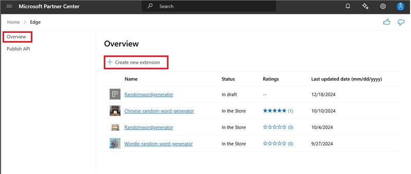

1. Click **Create new extension**.

<!-- ========================================================================== -->
## Step 3: Upload the extension package

The **Extension overview** page shows information for a specific extension:

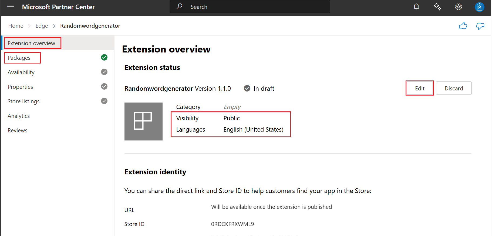

To upload the extension package:

1. On the left, click **Packages**.  The **Packages** page opens.

   You can only upload one package at a time. Your submitted extension is blocked if the package upload isn't successful on the **Packages** page.

1. To upload your package, drag the `.zip` file onto the **Drag your package here (.zip)** section of the page. Or you can select **Browse your files** to open a dialog to select the package to upload.

   After your package is uploaded, it's validated. If there's a validation error, resolve the issue and try uploading your package again.

1. When validation succeeds, review the extension details.

1. Click the **Continue** button.

   The **Availability** page opens.

<!-- ========================================================================== -->
## Step 4: Provide availability information

On the **Availability** page for the extension, fill in the **Visibility** and **Markets** sections as follows.

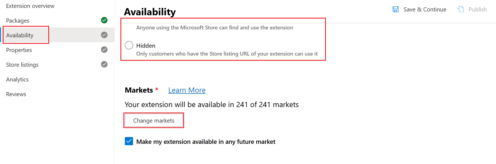

<!-- ------------------------------ -->
#### Visibility

Select one of the following visibility options to define whether your extension is discoverable at [Microsoft Edge Add-ons](https://microsoftedge.microsoft.com):

* `Public` (default) - Allows everyone to discover your extension through search, browsing at Microsoft Edge Add-ons, or using the listing URL for your extension at Microsoft Edge Add-ons.  The listing URL is available on your Partner Center dashboard on the Extension **Overview** page.

* `Hidden` - Removes an extension from search results or browsing at Microsoft Edge Add-ons.  To distribute a hidden extension at Microsoft Edge Add-ons, you must share the listing URL to the extension with your customers.

You can change the visibility of your extension from **Public** to **Hidden**.  Users who installed your extension while the visibility was set to **Public** retain access to your extension and receive any updates you make available at Microsoft Edge Add-ons.

<!-- ------------------------------ -->
#### Markets

Define the specific markets in which you plan to offer your extension.  The default setting for markets is all markets and that includes any future markets that are added later.

1. To choose specific markets, click the **Change markets** button.

1. Toggle individual markets to exclude each one or select **Unselect all** and then add individual markets of your choice.

   You can change the markets where your extension is offered.  A user who installs your extension while it's available in the user's market retains access to your extension.  However, the user doesn't have access to any future updates that are submitted at [Microsoft Edge Add-ons](https://microsoftedge.microsoft.com).

1. Click the **Save & Continue** button.

   The **Properties** page opens.

<!-- ========================================================================== -->
## Step 5: Enter properties describing the extension

1. On the left, click **Properties**.

   The **Properties** page for the extension opens.

1. Fill in the properties, as follows:

   | Property name | Required? | Description |
   |---|---|---|
   | **Category** | Required | The category that best describes the extension.  Listing the extension in the right category helps users find the extension easily and understand more about it.  |
   | **Privacy policy requirements** | Required | Specify whether the extension accesses, collects, or transmits any personal information.  If you select **No** but it's later determined that the extension does handle personal information, the certification process might fail.  If you select **Yes**, you must provide a Privacy policy URL, because this is a required field and submitting the extension won't be allowed without it. |
   | **Privacy policy URL** | Required if the extension collects any privacy information | A valid privacy policy URL to communicate how the extension follows privacy laws and regulations.  You're responsible for ensuring that the extension follows privacy laws and regulations.  You're also responsible for providing a privacy policy URL if any personal information is being accessed, transmitted, or collected by the extension.  To determine if the extension requires a privacy policy, see [Microsoft Store App Developer Agreement](https://go.microsoft.com/fwlink/?linkid=528905) and [Developer policies for the Microsoft Edge Add-ons store](/legal/microsoft-edge/extensions/developer-policies). |
   | **Website URL** | Optional | A webpage that provides additional information about the extension.  The `Website URL` must point to a webpage on your own website, not the web listing for the extension at Microsoft Edge Add-ons.  The `Website URL` helps users learn more about the extension, its features, and any other relevant information. |
   | **Support contact details** | Optional | The URL to your support webpage, or the email address to contact your support team. |
   | **Mature content** | Optional | Checkbox to specify whether the extension includes mature content.  This extension rating helps determine the appropriate age group of the target audience of the extension.  To help determine whether the extension has _mature content_, see [Developer policies for the Microsoft Edge Add-ons store](/legal/microsoft-edge/extensions/developer-policies). |
   
   The properties are displayed to users at [Microsoft Edge Add-ons](https://microsoftedge.microsoft.com).  Your developer/organization name, **Website URL**, and **Support contact details** that you submitted during registration are displayed to users at Microsoft Edge Add-ons.

1. Click the **Save & Continue** button.

   The **Store Listings** page opens.

<!-- ========================================================================== -->
## Step 6: Add store listing details for each language

In one or more **Details for \<Language\>** pages, fill in the properties.

<!-- ------------------------------ -->
#### Enter properties for a language

1. In Partner Center, on the left, click **Store listings**.

   The **Store Listings** page opens:

   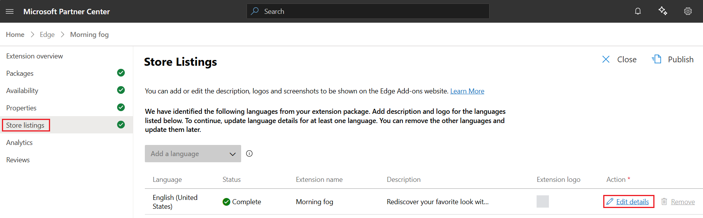

1. In the row for a language, click the  **Edit details** button.

   The **Details for \<Language\>** page opens:

   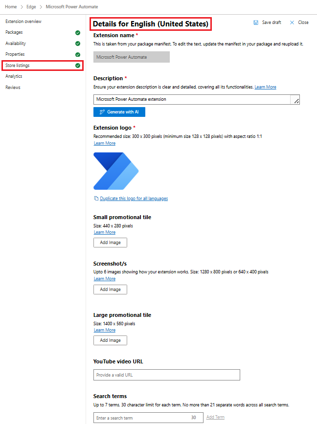

1. Fill in the properties, as follows.

   This information is displayed to users who view the extension's listing at [Microsoft Edge Add-ons](https://microsoftedge.microsoft.com).  Even though some fields are optional, you should provide as much information as possible.

   | Property name | Required? | Description |
   |---|---|---|
   | **Extension name** | Required for at least one language | The name of the extension, as specified in the manifest file of the extension.  To change the extension name after submission, you can update the name in the manifest file, create a new extension package, and then re-upload the package. |
   | **Description** | Required for each language | Explains what the extension does, why users should install it, and any other relevant information users need to know.   * **Length:** Minimum 250 characters, maximum 10,000 characters.   * **Clarity:** Must clearly describe the full functionality of the extension.   * **Completeness:** Should be thorough and include all important details.   * **Appropriateness:** Must not contain any misleading or inappropriate content.   You can use the [Generate with AI](#generate-the-description-with-ai) button. |
   | **Extension logo** | Required for each language | An image (one per language) that represents your company or extension logo, with an aspect ratio of 1:1 and a recommended size of 300 x 300 pixels, with a minimum size of 128 x 128 pixels.  You can copy the logo from one language to all other languages by using the **Duplicate** option, which is displayed below the field after you upload the logo. |
   | **Small promotional tile** | Optional | The image (one per language) that's used to display the extension alongside other extensions at Microsoft Edge Add-ons.  The size of the image must be 440 x 280 pixels.  You can copy the tile from one language to all other languages by using the **Duplicate** option, which is displayed below the field after you upload the tile. |
   | **Large promotional tile** | Optional | The image (one per language) that's used to display the extension more prominently at Microsoft Edge Add-ons.  The image, if submitted, is visible to users.  The size of the PNG files must be 1400 x 560 pixels.  You can copy the tile from one language to all other languages by using the **Duplicate** option, which is displayed below the field after you upload the tile. |
   | **Screenshots** | Optional | You can submit a maximum of 6 screenshots describing the functionality of the extension in detail.  The size of the screenshots must be either 640 x 480 pixels or 1280 x 800 pixels.  You can copy a screenshot from one language to all other languages by using the **Duplicate** option, which is displayed below the field after you upload at least one screenshot. |
   | **YouTube video URL** | Optional | You can include a promotional YouTube video of the extension.  The URL and thumbnail of the YouTube video is displayed on the extension's store listing page. |
   | **Short description** | Required for at least one language | To edit the short description, you must update the description field in the manifest file of the extension package, and then re-upload the package. |
   | **Search terms** | Optional | Single words or phrases that help users discover the extension when searching at Microsoft Edge Add-ons.  The search terms aren't displayed to users. |

   The following Required properties must be provided for _each_ language (such as U.S. English; `en-US`) that's listed in the extension's `.zip` package:
   * **Description**
   * **Extension logo**

   The following Required properties must be filled in for _at least one_ of the languages that's listed in the extension's `.zip` package:
   * **Extension name**
   * **Short description**

1. Click **Save draft** in the upper right.

The extension's `.zip` package contains the manifest file; to re-upload the manifest, you must re-upload the extension's `.zip` package.  All the other items (such as logo or tiles) are uploaded separately, by using the **Details for \<Language\>** page.

<!-- ------------------------------ -->
#### Generate the description with AI

To help you create a high-quality, detailed, and accurate description of your extension, Partner Center offers an AI-powered description generation feature.  This capability helps ensure that your extension listing is clear, complete, and informative, improving discoverability and user trust.

To generate the description by using AI:

1. On a **Details for \<Language\>** page, below the **Description** text box, click the **Generate with AI** button.

   The **Generate description using AI** pane opens on the right:

   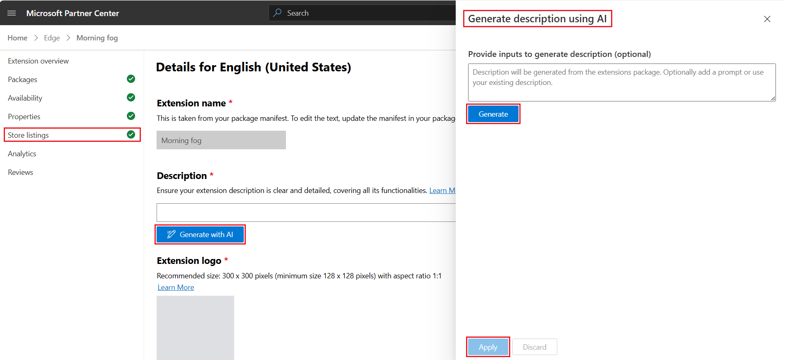

1. In the **Provide inputs to generate description (optional)** text box, you can enter AI prompt text, such as:

   * Key features.
   * The intended audience.
   * A previous description.
   * Additional details.

1. Click the **Generate** button.

   The AI model analyzes the uploaded extension package, to describe its functionality.  The generated description combines insights from this package analysis and any input that you provide.

1. If you want to try again, to get a better result:

   1. Click the **Discard** button.

   1. In the **Provide inputs to generate description (optional)** text box, modify your prompt text, and then click the **Generate** button again.

1. When the result is close to what you want, click the **Apply** button.

   The side pane closes, and the generated content is displayed in the **Description** text box on the **Details for \<Language\>** page.

1. In the **Description** text box, edit the description as needed.

   You can modify the AI-generated description, to ensure accuracy and alignment with your extension's purpose.

   You're responsible for the quality and accuracy of the final description.  Make sure that the description is valid, before submitting the extension.

You can generate descriptions up to 10 times per hour.  If you exceed this limit, an error message appears, and you can retry later:

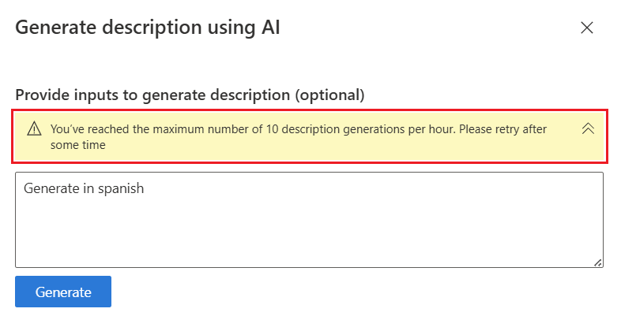

If generation fails, an error message is displayed, such as "Something went wrong while generating your description.  Try again":
 
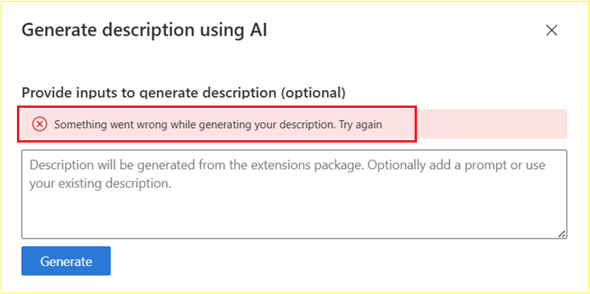

<!-- ------------------------------ -->
#### Add or remove a language

To add a language in your store listing:

1. In Partner Center, go to the **Store Listings** page:

   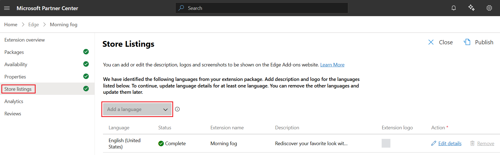

1. In the **Add a language** dropdown list, select a language.

   A new **Details for \<Language\>** page opens, for the selected language.

To remove a language from your store listing:

1. In Partner Center, go to the **Store Listings** page.

1. In the row for a language, click **Remove**.

To support multiple languages in your extension's code, you can use the internationalization API ([chrome.i18n](https://go.microsoft.com/fwlink/?linkid=2167478)).

<!-- ------------------------------ -->
#### Duplicate an asset from one language to the other languages

You can duplicate an asset (such as a logo, tile, or snapshot) from one language to all the other languages that you've added.

To duplicate an asset across languages:

1. At Partner Center, go to the **Store Listings** page.

1. In a row for a language that already has the asset, click the  **Edit details** button.

   The **Details for \<Language\>** page opens:

   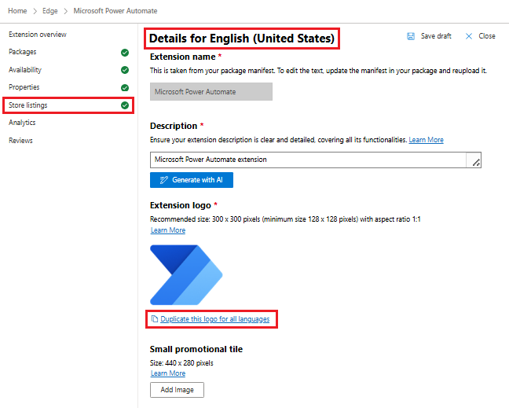

1. Click the **Duplicate** option that's under an asset such as:

   * **Extension logo**
   * **Small promotional tile**
   * **Large promotional tile**
   * **Screenshots**

   For example, click **Duplicate this logo for all languages**.

<!-- ------------------------------ -->
#### Provide a YouTube video

If you are linking to a video, make sure your video meets the following requirements:

* Verify that the content of the YouTube video follows the [Developer policies for the Microsoft Edge Add-ons store](/legal/microsoft-edge/extensions/developer-policies).

* Turn off advertisements on your video.  For more information, see [YouTube advertising formats](https://support.google.com/youtube/answer/2467968?ref_topic=7072227) and [Ads on embedded videos](https://support.google.com/youtube/answer/132596).

To enter the URL of your YouTube video:

1. On YouTube, locate the video that you want to add to your store listing page.

1. Under the video, click the **Share** button, and then click the **Copy** button to copy the URL for the video.

1. On the store listing details page, paste the URL in the **YouTube video URL** field:

   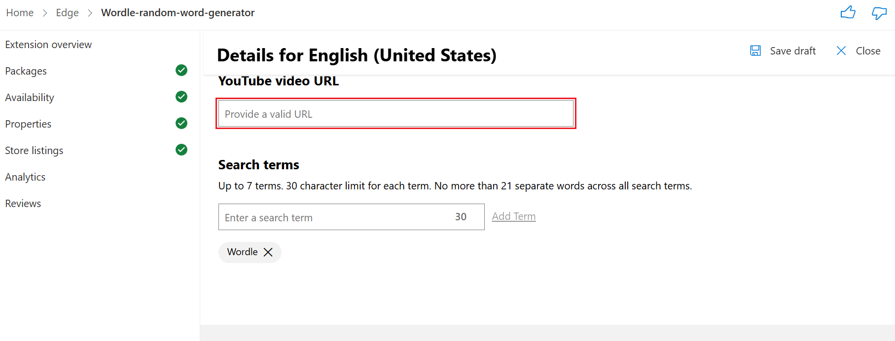

<!-- ------------------------------ -->
#### Enter search terms for the extension

Providing search terms for your extension is optional.  Each **Details for \<Language\>** page can specify different, localized search terms.

To provide search terms:

1. In a **Details for \<Language\>** page, in the **Search terms** text box, enter search terms for that language:

   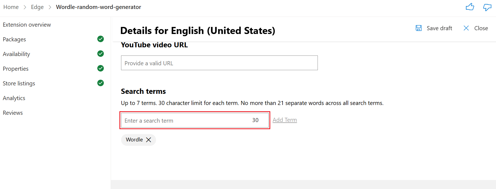

   Search terms must meet the following requirements:

   * You can enter search terms to use up to a maximum of 21 words.  Whether used as single words, phrases, or a combination of both, you're only allowed a maximum of 21 words.

   * Up to a maximum of seven search terms (single word or phrases).  Each search term has a character limit of 30 characters.

1. Click the **Close** button.  

   The **Store listing** page reappears.

<!-- ------------------------------ -->
#### Fix any form field errors

In the **Details for \<Language\>** page, a message might say "Fields require your attention".  Scroll down to the fields that are flagged with an X in a circle:

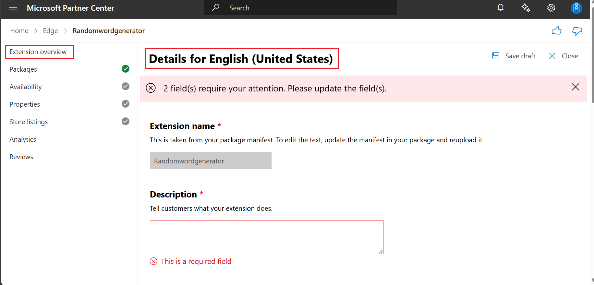

<!-- ========================================================================== -->
## Step 7: Provide testing notes and submit the extension

On the **Submit your extension** page, you can optionally add notes for certification to help test the extension.  When you submit the extension, use the **Notes for certification** text box to provide additional information to the certification testers.

The additional information helps ensure that the extension is tested correctly.  If the extension isn't fully tested, it might not pass certification.

To add notes for certification:

1. Click the **Submit** button.

   The **Submit your extension** page opens:

   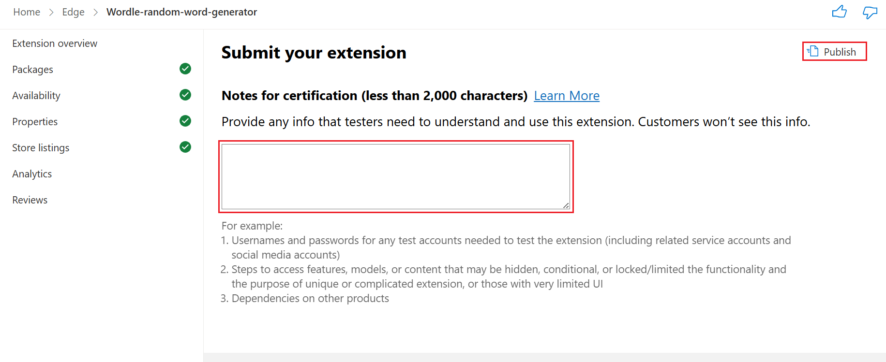

1. Fill in the **Notes for certification** text box.

   You can compose and save your notes in a text editor, such as Visual Studio Code, and then paste the notes into the text box.  Include any needed information, such as:

   * Usernames and passwords for test accounts.

   * Steps to access hidden or locked features.

   * Expected differences in functionality based on region or other user settings.

   * If your submitted extension is an update to an existing extension, include information about the changes made to the extension.

   * Any additional information that testers must understand about your submitted extension.

 1. Click the **Publish** button, in the upper right.

   The extension is submitted at [Microsoft Edge Add-ons](https://microsoftedge.microsoft.com).

   The submission then proceeds to the certification step.  The certification process can take up to seven business days after you submit the extension.

   After the extension passes certification, the extension is published at Microsoft Edge Add-ons.  The status of the extension in the Partner Center dashboard changes to **In the Store**.

<!-- ========================================================================== -->
## Resolve any Partner Center errors

After submitting the form, Partner Center might display an error in the **Properties** page, such as "Something went wrong.  Please try again. correlationId : undefined".

For such errors, try the following fixes:

* Clear the browser cache and cookies.

* Try using InPrivate mode in Microsoft Edge, or Incognito mode in Google Chrome.

* Try another browser, such as Microsoft Edge, Google Chrome, or Firefox.

<!-- ========================================================================== -->
## If the extension is flagged as potentially malware

If the extension is flagged as malware or a potentially unwanted application (PUA), review [1.2.2 Unwanted and malicious software](/legal/microsoft-edge/extensions/developer-policies#122-unwanted-and-malicious-software) in _Developer policies for the Microsoft Edge Add-ons store_.

Make sure that your extension's code and functionality complies with all requirements and guidelines.  For security reasons, Microsoft doesn't disclose exact triggers.

<!-- ========================================================================== -->
## Support

If you experience issues when registering as an extension developer or when submitting an extension, you can:

* Enter a support ticket through [Extensions New Support Request](https://support.microsoft.com/supportrequestform/e7a381be-9c9a-fafb-ed76-262bc93fd9e4).

* [Contact the Microsoft Edge extensions team](../contact.md).

<!-- ========================================================================== -->
## See also
<!-- all links in article -->

* [Port a Chrome extension to Microsoft Edge](../developer-guide/port-chrome-extension.md)
* [Extension concepts and architecture](../getting-started/index.md)
* [Register as a Microsoft Edge extension developer](./create-dev-account.md)
* [Contact the Microsoft Edge extensions team](../contact.md)

Partner Center:
* [Partner Center developer dashboard](https://partner.microsoft.com/dashboard/microsoftedge/public/login?ref=dd)

Microsoft Edge extensions:
* [Microsoft Edge Add-ons](https://microsoftedge.microsoft.com)

Developer Agreement & Legal:
* [Microsoft Store App Developer Agreement](https://go.microsoft.com/fwlink/?linkid=528905)
* [Developer policies for the Microsoft Edge Add-ons store](/legal/microsoft-edge/extensions/developer-policies)

Support.microsoft.com:
* [Extensions New Support Request](https://support.microsoft.com/supportrequestform/e7a381be-9c9a-fafb-ed76-262bc93fd9e4) 

Support.google.com:
* [YouTube advertising formats](https://support.google.com/youtube/answer/2467968?ref_topic=7072227)
* [Ads on embedded videos](https://support.google.com/youtube/answer/132596)

Extensions Reference:
* [chrome.i18n](https://go.microsoft.com/fwlink/?linkid=2167478) - Chrome Extensions > Reference > API.
