# Publish a Microsoft Edge extension
<!-- https://learn.microsoft.com/microsoft-edge/extensions/publish/publish-extension -->

<!-- Left Nav items at Partner Center for an extension:
Extension overview
checkmark phases:
   Packages
   Availability
   Properties
   Privacy
   Store listings
out of scope:
   Analytics
   Reviews
-->

After you develop and test your Microsoft Edge extension, you're ready to distribute your extension at [Microsoft Edge Add-ons](https://microsoftedge.microsoft.com).  To increase the extension's reach and make it available to other Microsoft Edge users, publish the extension at Microsoft Edge Add-ons, through Partner Center.

Users browse and install extensions for Microsoft Edge from [Microsoft Edge Add-ons](https://microsoftedge.microsoft.com).

If you have an existing Chrome extension and you want to release it for Microsoft Edge users, first see [Port a Chrome extension to Microsoft Edge](../developer-guide/port-chrome-extension.md).

**Detailed contents:**
<!-- https://github.com/captainbrosset/WebToc -->
* [Step 1: Prepare the extension to be submitted](#step-1-prepare-the-extension-to-be-submitted)
   * [Have a working prototype of the extension](#have-a-working-prototype-of-the-extension)
   * [Create a developer account](#create-a-developer-account)
   * [Create a .zip file for the extension package](#create-a-zip-file-for-the-extension-package)
   * [Review manifest field values](#review-manifest-field-values)
* [Step 2: Create a new extension at Partner Center](#step-2-create-a-new-extension-at-partner-center)
* [Step 3: Upload the package for the extension](#step-3-upload-the-package-for-the-extension)
* [Step 4: Enter availability information](#step-4-enter-availability-information)
   * [Visibility](#visibility)
   * [Markets](#markets)
* [Step 5: Enter properties describing the extension](#step-5-enter-properties-describing-the-extension)
* [Step 6: Enter privacy information](#step-6-enter-privacy-information)
   * [State the extension's purpose](#state-the-extensions-purpose)
   * [Justify any permissions](#justify-any-permissions)
   * [Declare any use of remote code](#declare-any-use-of-remote-code)
   * [Certify your data usage practices](#certify-your-data-usage-practices)
   * [Set a privacy policy](#set-a-privacy-policy)
* [Step 7: Enter store listing details for each language](#step-7-enter-store-listing-details-for-each-language)
   * [Enter properties for a language](#enter-properties-for-a-language)
   * [Generate the description with AI](#generate-the-description-with-ai)
   * [Add or remove a language](#add-or-remove-a-language)
   * [Duplicate an asset from one language to the other languages](#duplicate-an-asset-from-one-language-to-the-other-languages)
   * [Provide a YouTube video](#provide-a-youtube-video)
   * [Enter search terms for the extension](#enter-search-terms-for-the-extension)
   * [Fix any form field errors](#fix-any-form-field-errors)
* [Step 8: Enter certification testing notes and submit the extension](#step-8-enter-certification-testing-notes-and-submit-the-extension)
* [Resolve any Partner Center errors](#resolve-any-partner-center-errors)
* [If a single locale appears, but the package includes multiple languages](#if-a-single-locale-appears-but-the-package-includes-multiple-languages)
* [If the extension is flagged as potentially malware](#if-the-extension-is-flagged-as-potentially-malware)
* [Responsible AI for the AI-generated description of an extension](#responsible-ai-for-the-ai-generated-description-of-an-extension)
   * [Process of using the AI-generated description feature](#process-of-using-the-ai-generated-description-feature)
   * [Inputs used for the AI-generated description](#inputs-used-for-the-ai-generated-description)
   * [How the AI-generated description feature was evaluated](#how-the-ai-generated-description-feature-was-evaluated)
   * [Safeguards for the AI-generated description](#safeguards-for-the-ai-generated-description)
* [Support](#support)
* [See also](#see-also)


<!-- ========================================================================== -->
## Step 1: Prepare the extension to be submitted

To prepare an extension to be submitted via Partner Center, to be published at [Microsoft Edge Add-ons](https://microsoftedge.microsoft.com), do the following steps.


<!-- ---------------------------------- -->
#### Have a working prototype of the extension

Before publishing your extension, you must have a working prototype of the extension ready.  For information on how to create an extension, see [Extension concepts and architecture](../getting-started/index.md).


<!-- ---------------------------------- -->
#### Create a developer account

To get started, visit [Partner Center](https://partner.microsoft.com/dashboard/microsoftedge/public/login?ref=dd).  This is where every developer (new or existing) must go to publish or manage their extensions.

Use your active developer account to submit the extension at [Microsoft Edge Add-ons](https://microsoftedge.microsoft.com).  If you don't have a developer account, create a new developer account.  To open a new developer account and register for the Microsoft Edge program, see [Register as a Microsoft Edge extension developer](./create-dev-account.md).


<!-- ---------------------------------- -->
#### Create a .zip file for the extension package

Create a `.zip` file that's your extension package.  The extension package must include the following files:

* The extension manifest that specifies details such as the name of the extension, short description, permissions, and default language.

* Images and other files required by the extension.


<!-- ---------------------------------- -->
#### Review manifest field values

In articles about Microsoft Edge extensions, and at Partner Center, the word _store_ includes the [Microsoft Edge Add-ons](https://microsoftedge.microsoft.com) site.

Before uploading your package to Partner Center, inspect the manifest file to make sure that the field values match your preferred display on the **Store Listings** page, as follows.

The following fields in the manifest file are automatically included in your extension's product listing at Microsoft Edge Add-ons:

*  The `Name` field, which populates the **Extension name** on the **Details for \<language\>** page.

*  The `Description` field, which populates the **Description** on the **Details for \<language\>** page.
   
   Fill in the `Description` field, to explicitly provide a catchy description that will be displayed at the top of the listing for the extension.

   * If you include a `short description` in the extension manifest file, that short description is displayed in your store listing.

   * If you don't include a `short description` in the manifest file, the first few lines of the `Description` are displayed in your store listing.  We recommend providing a `short description`, to avoid content repetition on your store listing page.

Later, after you upload your package, you'll have an opportunity to modify some fields at Partner Center.  However, the above fields are read-only on the extension's **Store Listings** page at Partner Center, which is described in [Step 7: Enter store listing details for each language](#step-7-enter-store-listing-details-for-each-language), below.

See also:
* [Manifest file format for extensions](../getting-started/manifest-format.md)


<!-- ========================================================================== -->
## Step 2: Create a new extension at Partner Center

1. Go to the [developer dashboard](https://partner.microsoft.com/dashboard/microsoftedge/public/login?ref=dd) at Partner Center.

   Or, at Partner Center, click **Home** in the upper left.  The **Home** page opens.  In the **Workspaces** section, click the **Edge** card.

   The **Overview** page opens:

   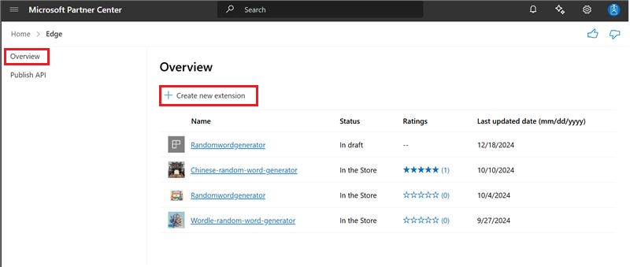

1. Click  **Create new extension**.

   The **Upload package (.zip file)** page opens:

   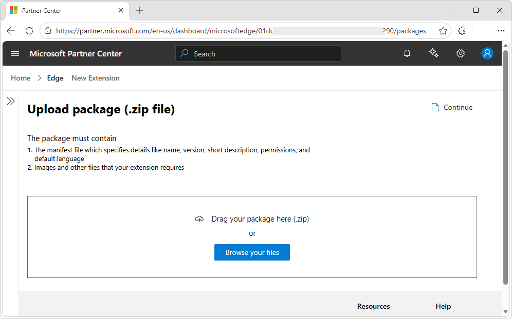<!-- todo: replace png, to show Privacy in left nav -->


<!-- ========================================================================== -->
## Step 3: Upload the package for the extension

To upload a package for the extension:

1. Do the steps in the previous section, so that the **Upload package (.zip file)** page is open.

1. Drag the extension's `.zip` file from your drive onto the **Drag your package here (.zip)** section of the page.

   Or, click the **Browse your files** button, to open a dialog to select the package to upload.

   The package is verified, and then the package is listed in the **Upload package (.zip file)** page:

   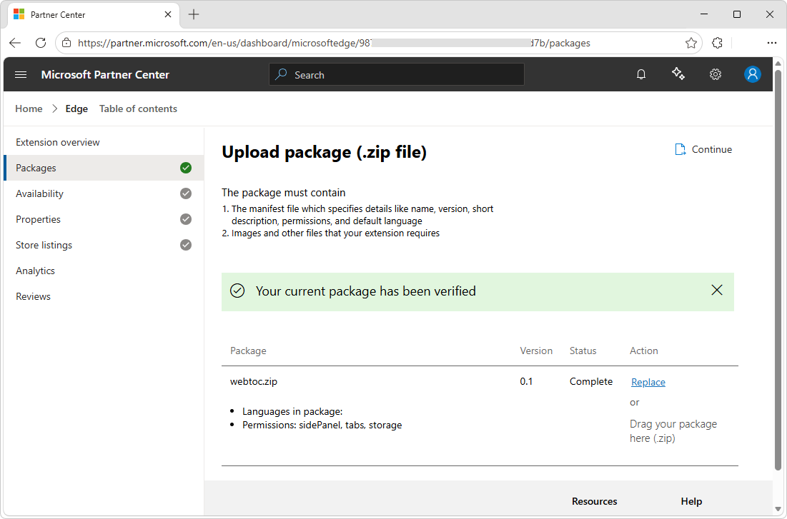

   If there's a validation error, resolve the issue, and then upload the package again.

1. Review the details in the **Upload package (.zip file)** page.

1. On the left, select **Extension overview**.

   The **Extension overview** page opens:

   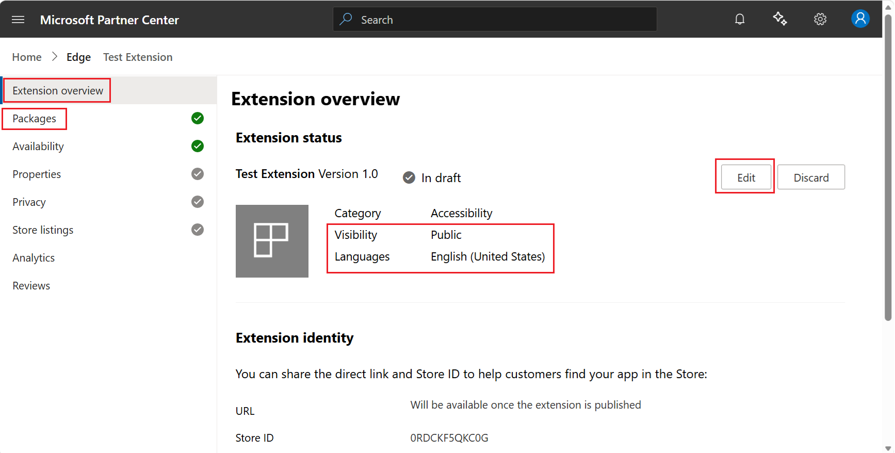

1. Review the details in the **Extension overview** page.

1. On the left, select **Packages**.

   The **Upload package (.zip file)** page opens.

1. Click the **Continue** button.

   The **Availability** page opens.


<!-- ========================================================================== -->
## Step 4: Enter availability information

1. In Partner Center, on the left, click **Availability**.

   The **Availability** page opens:

   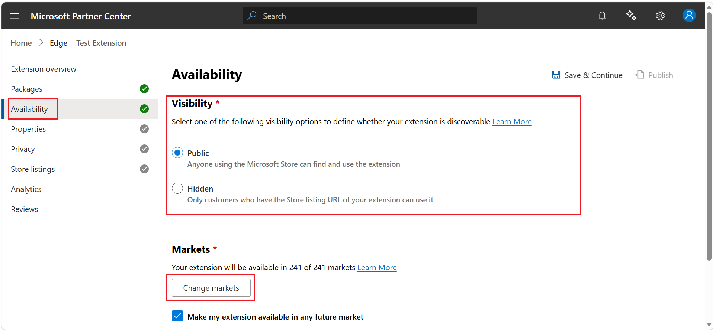

Fill in the **Visibility** and **Markets** sections as follows.


<!-- ------------------------------ -->
#### Visibility

Select one of the following visibility options to define whether your extension is discoverable at [Microsoft Edge Add-ons](https://microsoftedge.microsoft.com):

* `Public` (default) - Allows everyone to discover your extension through search, browsing at Microsoft Edge Add-ons, or using the listing URL for your extension at Microsoft Edge Add-ons.  The listing URL is available on your Partner Center dashboard on the Extension **Overview** page.

* `Hidden` - Removes an extension from search results or browsing at Microsoft Edge Add-ons.  To distribute a hidden extension at Microsoft Edge Add-ons, you must share the listing URL to the extension with your customers.

You can change the visibility of your extension from **Public** to **Hidden**.  Users who installed your extension while the visibility was set to **Public** retain access to your extension and receive any updates you make available at Microsoft Edge Add-ons.


<!-- ------------------------------ -->
#### Markets

Define the specific markets in which you plan to offer your extension.  The default setting for markets is all markets and that includes any future markets that are added later.

1. To choose specific markets, click the **Change markets** button.

1. Select or clear the checkbox for each market.

   Or, select **Unselect all**, and then select individual markets.

   You can change the markets where your extension is offered.  A user who installs your extension while it's available in the user's market retains access to your extension.  However, the user doesn't have access to any future updates that are submitted at [Microsoft Edge Add-ons](https://microsoftedge.microsoft.com).

   You have now filled in the **Availability** page for the extension at Partner Center.

1. Click  **Save & Continue** in the upper right.

   The **Properties** page opens.


<!-- ========================================================================== -->
## Step 5: Enter properties describing the extension

1. In the extension's entry at Partner Center, on the left, click **Properties**.

   The **Properties** page for the extension opens:

   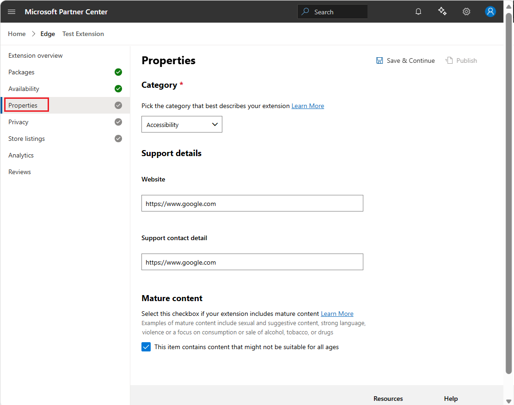

1. Fill in the properties, as follows:

   | Property name | Required? | Description |
   |---|---|---|
   | **Category** | Required | The category that best describes the extension.  Listing the extension in the right category helps users find the extension easily and understand more about it.  |
   | **Website** | Optional | A webpage that provides additional information about the extension.  The website URL must point to a webpage on your own website, not the web listing for the extension at Microsoft Edge Add-ons.  The **Website** URL helps users learn more about the extension, its features, and any other relevant information. |
   | **Support contact detail** | Optional | The URL to your support webpage, or the email address to contact your support team. |
   | **Mature content** | Optional | Checkbox to specify whether the extension includes mature content.  This extension rating helps determine the appropriate age group of the target audience of the extension.  To help determine whether the extension has _mature content_, see [Developer policies for the Microsoft Edge Add-ons store](/legal/microsoft-edge/extensions/developer-policies). |
   
   The properties are displayed to users at [Microsoft Edge Add-ons](https://microsoftedge.microsoft.com).  Your developer/organization name, **Website** URL, and **Support contact detail** that you submitted during registration are displayed to users at the Microsoft Edge Add-ons site.

   <!-- start of temp content: -->

1. If the following text boxes are in the **Properties** page, fill them in as follows.

   | Property name | Required? | Description |
   |---|---|---|
   | **Privacy policy requirements** | Required | Specify whether the extension accesses, collects, or transmits any personal information.  If you select **No** but it's later determined that the extension does handle personal information, the certification process might fail.  If you select **Yes**, you must provide a Privacy policy URL, because this is a required field and submitting the extension won't be allowed without it. |
   | **Privacy policy URL** | Required if the extension collects any privacy information | A valid privacy policy URL to communicate how the extension follows privacy laws and regulations.  You're responsible for ensuring that the extension follows privacy laws and regulations.  You're also responsible for providing a privacy policy URL if any personal information is being accessed, transmitted, or collected by the extension.  To determine if the extension requires a privacy policy, see [Microsoft Store App Developer Agreement](https://go.microsoft.com/fwlink/?linkid=528905) and [Developer policies for the Microsoft Edge Add-ons store](/legal/microsoft-edge/extensions/developer-policies). |

   <!-- / end of temp content -->

   You have now filled in the **Policies** page for the extension at Partner Center.

1. Click  **Save & Continue** in the upper right.

   The **Privacy** page opens.

   <!-- start of temp content: -->

   Or, if you don't yet have the new UI that shows **Privacy** in the sequence on the left, the **Store listings** page opens.  In that case, make sure the **Privacy** fields are filled in as appropriate in the **Properties** page, and then proceed to [Step 7: Enter store listing details for each language](#step-7-enter-store-listing-details-for-each-language), below.

   <!-- / end of temp content -->


<!-- ========================================================================== -->
## Step 6: Enter privacy information

<!-- start of temp content: -->
**Note:** At Partner Center, privacy information is now entered in a dedicated **Privacy** page in the flow for submitting an extension, rather than as a **Privacy policy requirements** text box and a **Privacy policy URL** text box in the **Properties** page.  This update is being rolled out in phases, and is planned to be available to all developers by the end of May 2026.
<!-- / end of temp content -->

In the extension's **Privacy** page at Partner Center, declare the extension's purpose, permissions, and data practices:

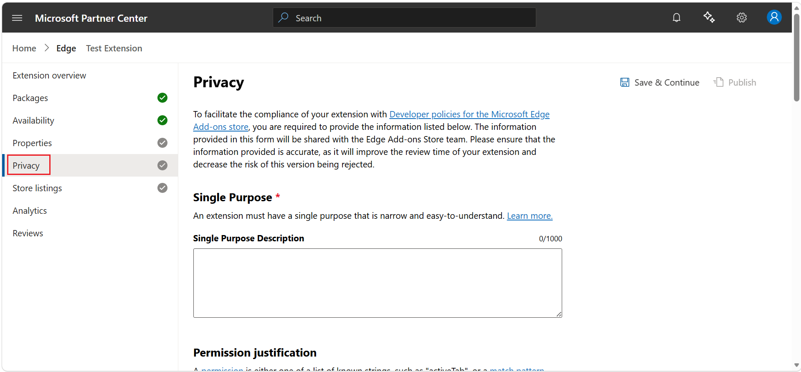

Providing accurate and complete information in these fields helps streamline the review process and ensures transparency for users.

To enter **Privacy** information about the extension:

1. In the extension's entry at Partner Center, on the left, click **Privacy**.

   The **Privacy** page for the extension opens.  The **Privacy** page contains the following sections:

   | Privacy page section | Article section |
   |---|---|
   | **Single Purpose** | [State the extension's purpose](#state-the-extensions-purpose) |
   | **Permission justification** | [Justify any permissions](#justify-any-permissions) |
   | **Are you using remote code?** | [Declare any use of remote code](#declare-any-use-of-remote-code) |
   | **Data usage** | [Certify your data usage practices](#certify-your-data-usage-practices) |
   | **Privacy policy** | [Set a privacy policy](#set-a-privacy-policy) |

1. Fill in the fields in the sections of the **Privacy** page, as described below.

**Important:** All information in the **Privacy** page must be complete, accurate, and consistent with the extension's behavior and metadata.  Any incomplete, misleading, or inaccurate disclosures may be considered a violation of [Developer policies for the Microsoft Edge Add-ons store](/legal/microsoft-edge/extensions/developer-policies), and can result in additional review, delayed certification, or rejection of the submitted extension.


<!-- ------------------------------ -->
#### State the extension's purpose

The **Single Purpose** section of the **Privacy** page:

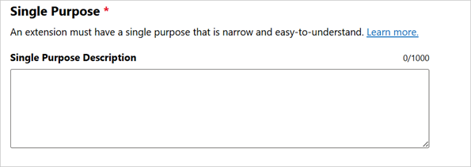

1. In the **Single Purpose Description** text box, enter a concise description that helps reviewers understand the core functionality of the extension.

   An extension must have a clear, narrow, and well-defined purpose.  Make sure this field accurately reflects what your extension does and why it exists.

   Avoid a vague or overly broad description.

1. Continue to the next section.

See also:
* [Best practices for extensions](../developer-guide/best-practices.md)


<!-- ------------------------------ -->
#### Justify any permissions

The **Permission justification** section of the **Privacy** page:

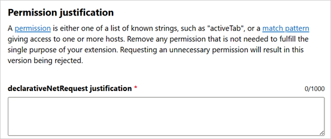

<!-- clarifies example screenshot vs. what user sees: -->
The **Permission justification** section contains a list of permissions that your extension uses (as declared in your manifest), with a field for you to state the justification for each permission.  The above example shows a text box for justification of using the `declarativeNetRequest` permission.

1. If there are permissions listed here that the extension doesn't require, before continuing, remove them from the manifest, and then upload a new version of the extension, per [Step 3: Upload the package for the extension](#step-3-upload-the-package-for-the-extension), above.

1. In each permission text box, specify why the extension needs to use the permission.

The extension must request only the minimum permissions that are necessary to deliver its functionality.  Avoid requesting excessive or unrelated permissions.

This information helps reviewers validate that the extension adheres to least-privilege principles.

See also:
* [Best practices for extensions](../developer-guide/best-practices.md)


<!-- ------------------------------ -->
#### Declare any use of remote code

The **Are you using remote code?** section of the **Privacy** page:

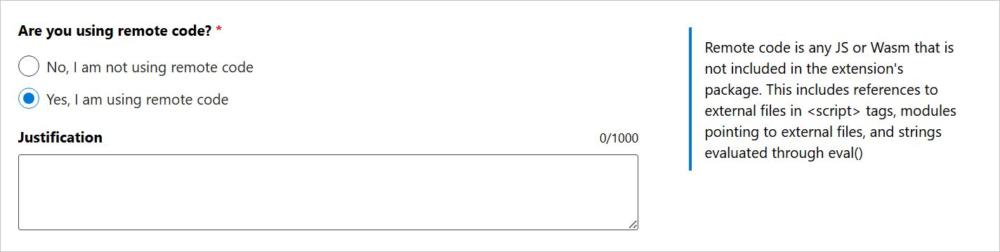

Remote code is only supported for Manifest V2, not Manifest V3.  In Manifest V3, loading and executing remotely hosted code is not permitted.

If the extension doesn't need to execute remote code:

1. Make sure that the extension doesn't use any remote code.

1. Select the option button **No, I am not using remote code**.

If the extension executes remote code:

1. Select the option button **Yes, I am using remote code**.

1. In the **Justification** text box, state why the extension needs to use remote code.

The extension should avoid the use of remote code unless absolutely necessary.  Remote code requires additional review, and might increase certification time.

See also:
* [Overview of changes in Manifest V3](../developer-guide/manifest-v3.md#overview-of-changes-in-manifest-v3), in _Overview and timelines for migrating to Manifest V3_.
* [Remove remotely hosted code](https://developer.chrome.com/docs/extensions/develop/migrate/improve-security#remove-remote-code) in _Improve extension security_, in Chrome docs.


<!-- ------------------------------ -->
#### Certify your data usage practices

The **Data usage** section of the **Privacy** page:

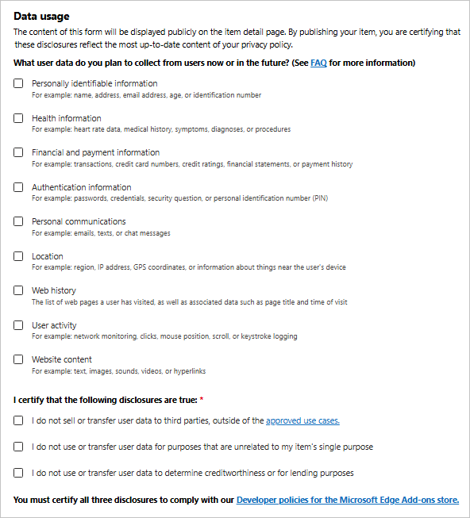

1. In the section **What user data do you plan to collect from users now or in the future?**, select the checkboxes that apply.

   This discloses which types of data the extension collects.

1. In the section **I certify that the following disclosures are true**, select the checkboxes.

   This certifies that you comply with each of the disclosure statements.

   All of these disclosures must be consistent with the policies that are at the **Privacy Policy URL**, which is described in the next section.

You must disclose how the extension collects and uses user data, including:

* The types of user data that the extension collects.

* Certification that the extension complies with data usage and limited-use policies.

These disclosures are displayed to Microsoft Edge users.  This information improves transparency and enables users to understand how their data is handled.


<!-- ------------------------------ -->
#### Set a privacy policy

The **Privacy policy** section of the **Privacy** page:

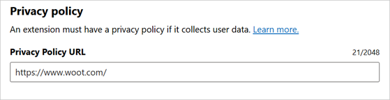

1. In the **Privacy Policy URL** text box, add a link to the privacy policy for your extension.

1. Ensure that the policy URL can be accessed.

1. Ensure that the policy content is up-to-date.

   This policy is displayed to users in the extension's listing at the Microsoft Edge Add-ons site.

   A privacy policy and its URL is required if the extension collects any privacy information.  This is a valid privacy policy URL to communicate how the extension follows privacy laws and regulations.

   The privacy policy must include how data is collected, used, and disclosed.

   You're responsible for ensuring that the extension follows privacy laws and regulations.  You're also responsible for providing a privacy policy URL if any personal information is being accessed, transmitted, or collected by the extension.

   To determine if the extension requires a privacy policy, see:
   * [Microsoft Store App Developer Agreement](https://go.microsoft.com/fwlink/?linkid=528905)
   * [Developer policies for the Microsoft Edge Add-ons store](/legal/microsoft-edge/extensions/developer-policies)

   You have now filled in the sections of the **Privacy** page for the extension at Partner Center.

1. Click  **Save & Continue** in the upper right.

   The **Store Listings** page opens.

See also:
* [Best practices for extensions](../developer-guide/best-practices.md)


<!-- ========================================================================== -->
## Step 7: Enter store listing details for each language

The **Store listings** page for the extension contains a table.  Each row in the table leads to a different **Details for \<language\>** page.

In one or more **Details for \<language\>** pages, fill in the properties.


<!-- ------------------------------ -->
#### Enter properties for a language

1. In Partner Center, on the left, click **Store listings**.

   The **Store Listings** page opens:

   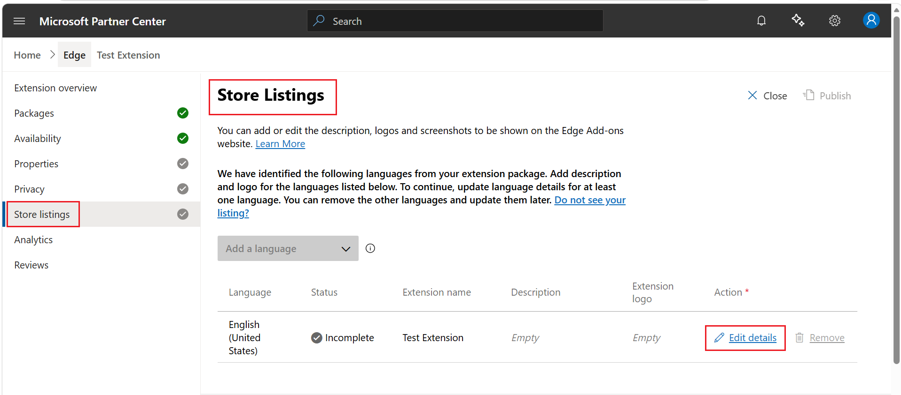

1. In the row for a language, click the  **Edit details** button.

   The **Details for \<language\>** page opens:

   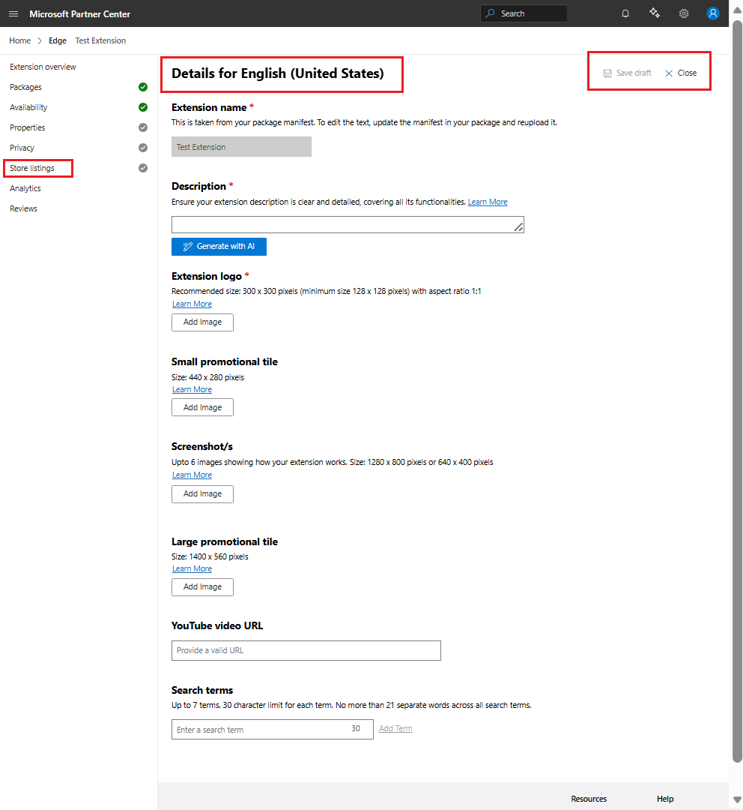

1. Fill in the properties, as follows.

   This information is displayed to users who view the extension's listing at [Microsoft Edge Add-ons](https://microsoftedge.microsoft.com).  Even though some fields are optional, you should provide as much information as possible.

   | Property name | Required? | Description |
   |---|---|---|
   | **Extension name** | Required for at least one language | The name of the extension, as specified in the manifest file of the extension.  To change the extension name after submitting the extension, you can update the name in the manifest file, create a new extension package, and then re-upload the package. |
   | **Description** | Required for each language | Explains what the extension does, why users should install it, and any other relevant information users need to know.  <br/>* **Length:** Minimum 250 characters, maximum 10,000 characters.  <br/>* **Clarity:** Must clearly describe the full functionality of the extension.  <br/>* **Completeness:** Must be thorough and include all important details.  <br/>* **Appropriateness:** Must not contain any misleading or inappropriate content.  <br/>You can use the [Generate with AI](#generate-the-description-with-ai) button. |
   | **Extension logo** | Required for each language | An image (one per language) that represents your company or extension logo, with an aspect ratio of 1:1 and a recommended size of 300 x 300 pixels, with a minimum size of 128 x 128 pixels.  You can copy the logo from one language to all other languages by using the **Duplicate** option, which is displayed below the field after you upload the logo. |
   | **Small promotional tile** | Optional | The image (one per language) that's used to display the extension alongside other extensions at Microsoft Edge Add-ons.  The size of the image must be 440 x 280 pixels.  You can copy the tile from one language to all other languages by using the **Duplicate** option, which is displayed below the field after you upload the tile. |
   | **Large promotional tile** | Optional | The image (one per language) that's used to display the extension more prominently at Microsoft Edge Add-ons.  The image, if submitted, is visible to users.  The size of the PNG files must be 1400 x 560 pixels.  You can copy the tile from one language to all other languages by using the **Duplicate** option, which is displayed below the field after you upload the tile. |
   | **Screenshots** | Optional | You can submit a maximum of 6 screenshots describing the functionality of the extension in detail.  The size of the screenshots must be either 640 x 480 pixels or 1280 x 800 pixels.  You can copy a screenshot from one language to all other languages by using the **Duplicate** option, which is displayed below the field after you upload at least one screenshot. |
   | **YouTube video URL** | Optional | You can include a promotional YouTube video of the extension.  The URL and thumbnail of the YouTube video is displayed on the extension's store listing page. |
   | **Short description** | Required for at least one language | To edit the short description, you must update the description field in the manifest file of the extension package, and then re-upload the package. |
   | **Search terms** | Optional | Single words or phrases that help users discover the extension when searching at Microsoft Edge Add-ons.  The search terms aren't displayed to users. |

   The following Required properties must be provided for _each_ language (such as U.S. English; `en-US`) that's listed in the extension's `.zip` package:
   * **Description**
   * **Extension logo**

   The following Required properties must be filled in for _at least one_ of the languages that's listed in the extension's `.zip` package:
   * **Extension name**
   * **Short description**

1. Click  **Save draft** in the upper right.

The extension's `.zip` package contains the manifest file; to re-upload the manifest, you must re-upload the extension's `.zip` package.  All the other items (such as logo or tiles) are uploaded separately, by using the **Details for \<language\>** page.


<!-- ------------------------------ -->
#### Generate the description with AI

To help you create a high-quality, detailed, and accurate description of your extension, Partner Center offers an optional AI-powered description generation feature.  This capability helps ensure that your extension listing is clear, complete, and informative, improving discoverability and user trust.

See also [Responsible AI for the AI-generated description of an extension](#responsible-ai-for-the-ai-generated-description-of-an-extension), below.

To generate the description by using AI:

1. On a **Details for \<language\>** page, below the **Description** text box, click the **Generate with AI** button.

   The **Generate description using AI** pane opens on the right:

   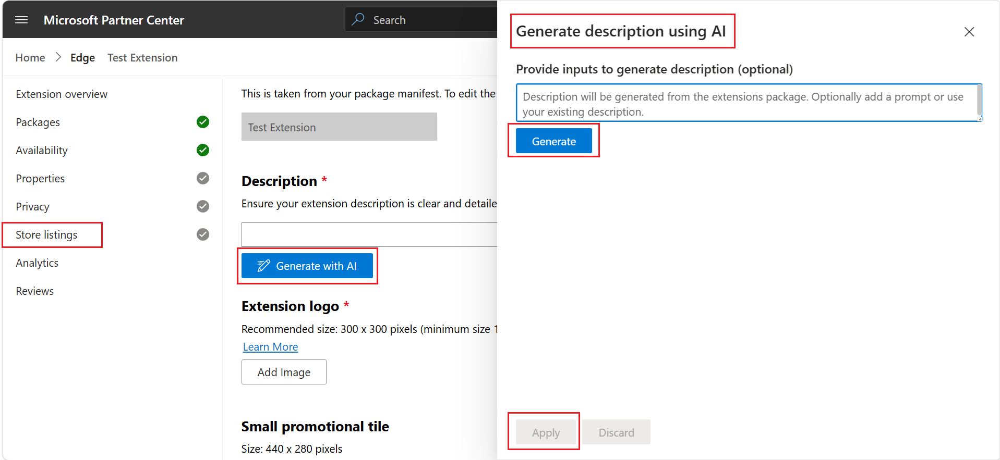

1. In the **Provide inputs to generate description (optional)** text box, you can enter AI prompt text, such as:

   * Key features.
   * The intended audience.
   * A previous description.
   * Additional details.

1. Click the **Generate** button.

   The AI model analyzes the uploaded extension package, to describe its functionality.  The generated description combines insights from analyzing:

   * The uploaded extension package, including the manifest, code files, and image files.
   * Any screenshots of the running extension that you've uploaded via the **Details for \<language\>** page.
   * Any input prompt text that you provide.

1. If you want to try again, to get a better result:

   1. Click the **Discard** button.

   1. In the **Provide inputs to generate description (optional)** text box, modify your prompt text, and then click the **Generate** button again.

1. When the result is close to what you want, click the **Apply** button.

   The side pane closes, and the generated content is displayed in the **Description** text box on the **Details for \<language\>** page.

1. In the **Description** text box, edit the description as needed.

   You can modify the AI-generated description, to ensure accuracy and alignment with your extension's purpose.

   You're responsible for the quality and accuracy of the final description.  Make sure that the description is valid, before submitting the extension.

You can generate descriptions up to 10 times per hour.  If you exceed this limit, an error message appears, and you can retry later:

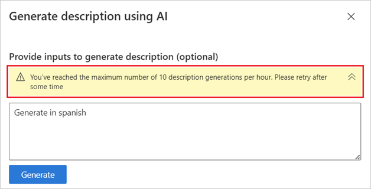

If generation fails, an error message is displayed, such as "Something went wrong while generating your description.  Try again":
 
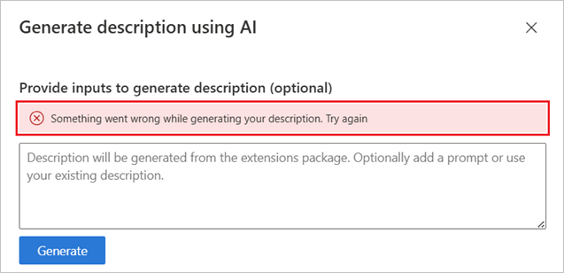


<!-- ------------------------------ -->
#### Add or remove a language

To add a language in your store listing:

1. In Partner Center, go to the **Store Listings** page:

   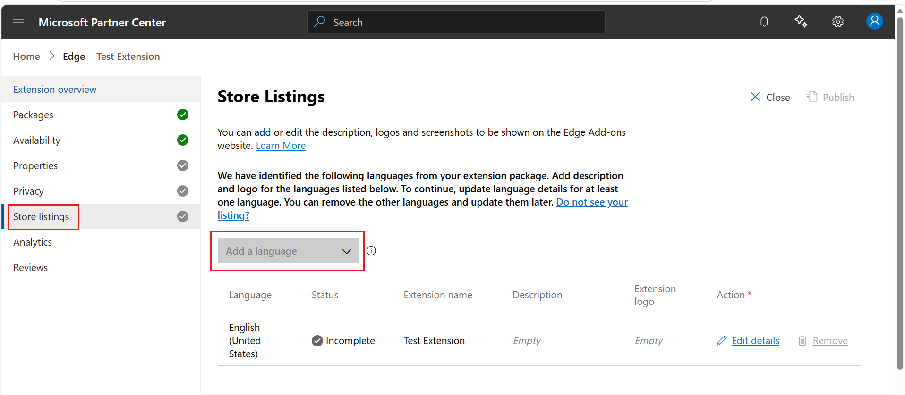

1. In the **Add a language** dropdown list, select a language.

   A new **Details for \<language\>** page opens, for the selected language.


To remove a language from your store listing:

1. In Partner Center, go to the **Store Listings** page.

1. In the row for a language, click **Remove**.

To support multiple languages in your extension's code, you can use the internationalization API ([chrome.i18n](https://developer.chrome.com/docs/extensions/reference/api/i18n)).


<!-- ------------------------------ -->
#### Duplicate an asset from one language to the other languages

You can duplicate an asset (such as a logo, tile, or snapshot) from one language to all the other languages that you've added.

To duplicate an asset across languages:

1. At Partner Center, go to the **Store Listings** page.

1. In a row for a language that already has the asset, click the  **Edit details** button.

   The **Details for \<language\>** page opens:

   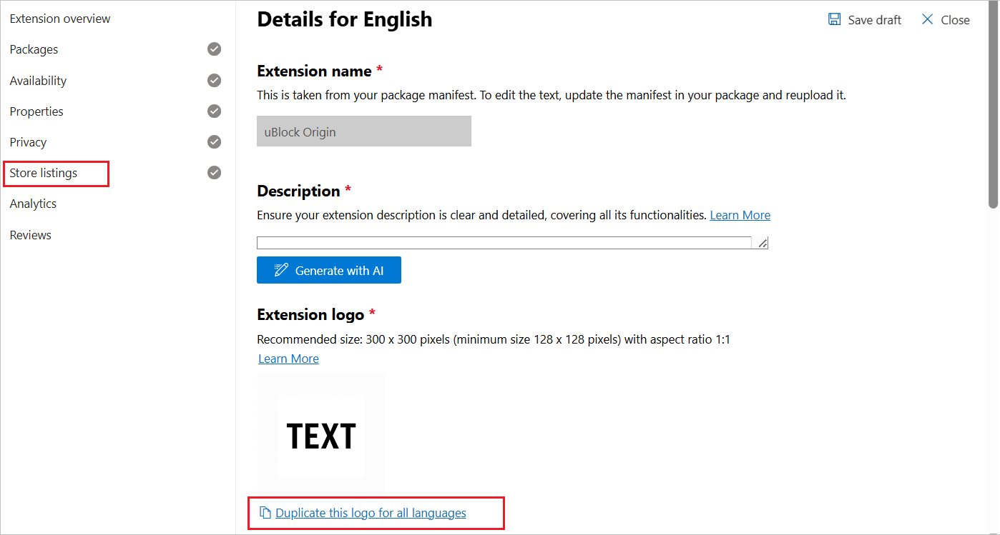

1. Click the **Duplicate** option that's under an asset such as:

   * **Extension logo**
   * **Small promotional tile**
   * **Large promotional tile**
   * **Screenshots**

   For example, click **Duplicate this logo for all languages**.


<!-- ------------------------------ -->
#### Provide a YouTube video

If you are linking to a video, make sure your video meets the following requirements:

* Verify that the content of the YouTube video follows the [Developer policies for the Microsoft Edge Add-ons store](/legal/microsoft-edge/extensions/developer-policies).

* Turn off advertisements on your video.  For more information, see [YouTube advertising formats](https://support.google.com/youtube/answer/2467968?ref_topic=7072227) and [Ads on embedded videos](https://support.google.com/youtube/answer/132596).

To enter the URL of your YouTube video:

1. On YouTube, locate the video that you want to add to your store listing page.

1. Under the video, click the **Share** button, and then click the **Copy** button to copy the URL for the video.

1. On the store listing details page, paste the URL in the **YouTube video URL** field:

   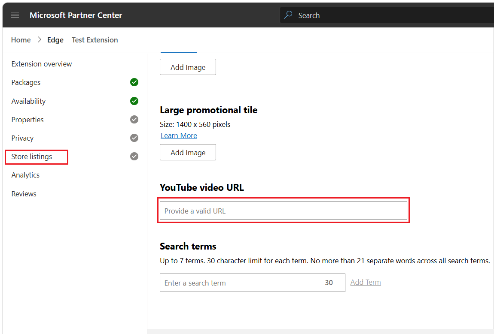


<!-- ------------------------------ -->
#### Enter search terms for the extension

Providing search terms for your extension is optional.  Each **Details for \<language\>** page can specify different, localized search terms.

To provide search terms:

1. In a **Details for \<language\>** page, in the **Search terms** text box, enter search terms for that language:

   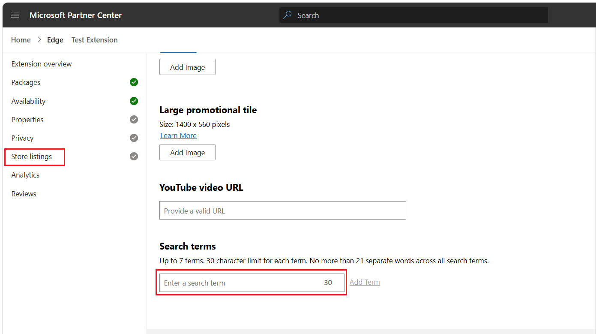

   Search terms must meet the following requirements:

   * You can enter search terms to use up to a maximum of 21 words.  Whether used as single words, phrases, or a combination of both, you're only allowed a maximum of 21 words.

   * Up to a maximum of seven search terms (single word or phrases).  Each search term has a character limit of 30 characters.

1. In the upper right of the **Details for \<language\>** page, click the **Close** button.

   The **Store listing** page reappears.


<!-- ------------------------------ -->
#### Fix any form field errors

In the **Details for \<language\>** page, a message might say "Fields require your attention".  Scroll down to the fields that are flagged with an X in a circle:

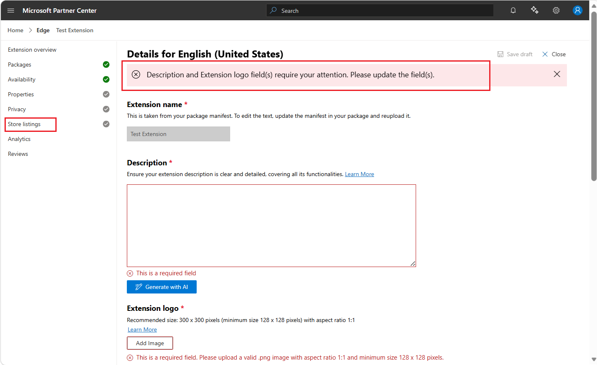


<!-- ========================================================================== -->
## Step 8: Enter certification testing notes and submit the extension

On the **Submit your extension** page, you can optionally add notes for certification to help test the extension.  When you submit the extension, use the **Notes for certification** text box to provide additional information to the certification testers.

The additional information helps ensure that the extension is tested correctly.  If the extension isn't fully tested, it might not pass certification.

To add notes for certification:

1. In Partner Center, on the left, click **Store listings**.

   The extension's **Store Listings** page opens.  The **Status** column for each language row now says **Complete**, and the  **Publish** button is no longer grayed out:

   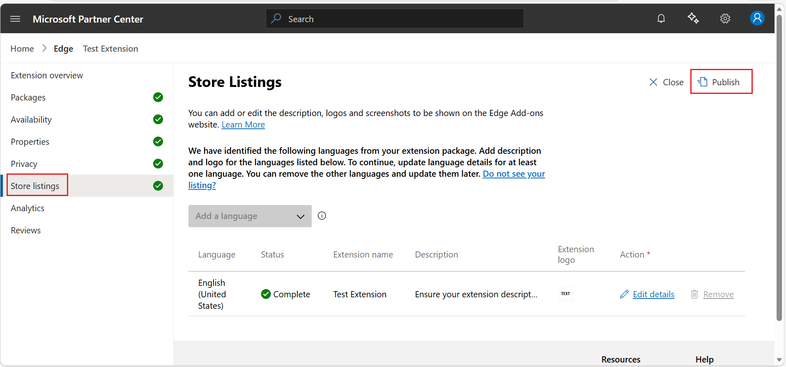

1. Click the  **Publish** button in the upper right.

   The **Submit your extension** page opens:

   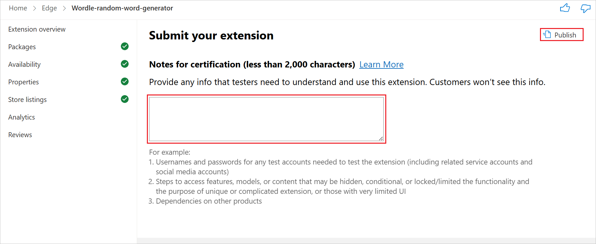

1. Fill in the **Notes for certification** text box.

   You can compose and save your notes in a text editor, such as Visual Studio Code, and then paste the notes into the text box.  Include any needed information, such as:

   * Usernames and passwords for test accounts.

   * Steps to access hidden or locked features.

   * Expected differences in functionality based on region or other user settings.

   * If your submitted extension is an update to an existing extension, include information about the changes made to the extension.

   * Any additional information that testers must understand about your submitted extension.

1. Click the  **Publish** button in the upper right.

   The extension proceeds to the certification step.  The certification process can take up to seven business days after you submit the extension.

   After the extension passes certification, the extension is published at the [Microsoft Edge Add-ons](https://microsoftedge.microsoft.com) site, and the status of the extension in the Partner Center dashboard changes to **In the Store**.


<!-- ========================================================================== -->
## Resolve any Partner Center errors

After submitting the form, Partner Center might display an error in the **Properties** page, such as "Something went wrong.  Please try again. correlationId : undefined".

For such errors, try the following fixes:

* Clear the browser cache and cookies.

* Try using InPrivate mode in Microsoft Edge, or Incognito mode in Google Chrome.

* Try another browser, such as Microsoft Edge, Google Chrome, or Firefox.


<!-- ========================================================================== -->
## If a single locale appears, but the package includes multiple languages

Sometimes only one locale appears in the **Store Listings** tab at Partner Center, even though an extension's package includes multiple languages.  This happens when the manifest file uses hardcoded strings instead of localized message references.

To ensure that all supported locales are detected:

* Update your `manifest.json` file by replacing the `name` and `description` fields with i18n placeholders:

   ```
   {
      "manifest_version": 3,
      "name": "__MSG_extensionName__",
      "description": "__MSG_extensionDescription__"
   }
   ```

* Include a `default_locale` in your manifest, such as `"default_locale": "en"`.

* Make sure your `_locales` folder contains a properly structured `messages.json` file for each language.  Partner Center uses these message references to identify available languages.  If these message references are missing, the language will be skipped.

   The message references are the i18n `"name"` and `"description"` keys in each `/_locales/messages.json` file.  These message references (i18n keys) correspond to the `"__MSG_extensionName__"` and `"__MSG_extensionDescription__"` placeholders that are used in the `"name"` and `"description"` fields of the `manifest.json` file.  Partner Center uses these message references to determine which languages are available.

See also:
* [chrome.i18n](https://developer.chrome.com/docs/extensions/reference/api/i18n) - API to implement internationalization throughout an app or extension.
* [Manifest file format for extensions](../getting-started/manifest-format.md)
   * [Manifest file format](https://developer.chrome.com/docs/extensions/reference/manifest) in Chrome docs.


<!-- ========================================================================== -->
## If the extension is flagged as potentially malware

If the extension is flagged as malware or a potentially unwanted application (PUA), review [1.2.2 Unwanted and malicious software](/legal/microsoft-edge/extensions/developer-policies#122-unwanted-and-malicious-software) in _Developer policies for the Microsoft Edge Add-ons store_.

Make sure that your extension's code and functionality complies with all requirements and guidelines.  For security reasons, Microsoft doesn't disclose exact triggers.


<!-- ========================================================================== -->
## Responsible AI for the AI-generated description of an extension

The description of your extension at [Microsoft Edge Add-ons](https://microsoftedge.microsoft.com) can optionally be generated by using AI.  You can compose the description manually, or you can use AI to help generate the description.  This AI-generated description feature uses responsible AI, as described below.


<!-- ---------------------------------- -->
#### Process of using the AI-generated description feature

To use AI to help generate a description of the extension for a particular language, you provide prompt input text, generate a description, and then edit the resulting AI-generated description.  The steps are detailed in [Generate the description with AI](#generate-the-description-with-ai), above.

As a Microsoft Edge extension developer, you use Microsoft Partner Center to make your extension available to users at [Microsoft Edge Add-ons](https://microsoftedge.microsoft.com).  To submit an extension, you provide data for the extension's listing page, including the extension name, description, and screenshots.

A high-quality description for the extension is important, for the users to understand the features and functionality of the extension, and to make an informed decision whether to install the extension.

* The AI-generated description is a feature powered by Azure OpenAI, which recommends a description, for you to inspect and edit as needed.  This AI feature uses the extension package (including the manifest, code files, and image files), uploaded screenshots, and optional prompt text to generate a high-quality and policy-compliant description.

* You can apply, edit, or discard the generated text before submitting the extension.  It is strongly recommended that you verify the AI-generated description, editing it as needed, before publishing the description for users.

* The description can be generated for multiple languages (one at a time, individually).

This process ensures transparency, and compliance with [Microsoft Responsible AI Principles and Approach](https://www.microsoft.com/ai/principles-and-approach), while helping you craft an accurate and user-friendly description.  However, AI-generated content might be inaccurate sometimes, and it's strongly recommended that you verify the description, and edit it as needed, before publishing the extension.


<!-- ---------------------------------- -->
#### Inputs used for the AI-generated description

The AI-generated description is based on the following inputs for the AI model:

* The uploaded extension package, including the manifest, code files, and image files.  These image files are part of the extension.

* Any screenshots of the running extension that you've uploaded via the **Details for \<language\>** page.  These screenshots are displayed at the Microsoft Edge Add-ons site.

* Any input prompt text that you enter.

* The language, such as English.


<!-- ---------------------------------- -->
#### How the AI-generated description feature was evaluated

The AI-generated description feature has undergone substantial testing, to identify failure modes and scenarios that might cause AI-generated keywords to do or say things outside of the feature's intended uses or that don't support the principles at [Responsible AI at Microsoft: Ethical policies and practices](https://www.microsoft.com/ai/responsible-ai).


<!-- ---------------------------------- -->
#### Safeguards for the AI-generated description

The following safeguards are in place for the AI-generated description:

* The AI-generated description is based exclusively on the extension package, uploaded screenshots, and any prompt text that you provide.  See [Inputs used for the AI-generated description](#inputs-used-for-the-ai-generated-description), above.

* Providing input prompt text is optional.

* The inputs are sent to the AI model, which then generates a description.

* You have full control over the AI-generated description, and can choose to use it as-is, edit it, or discard it.


<!-- ========================================================================== -->
## Support

If you experience issues when registering as an extension developer or when submitting an extension, you can:

* Enter a support ticket through [Extensions New Support Request](https://support.microsoft.com/supportrequestform/e7a381be-9c9a-fafb-ed76-262bc93fd9e4).

* [Contact the Microsoft Edge extensions team](../contact.md).


<!-- ========================================================================== -->
## See also
<!-- all links in article -->

* [Extension concepts and architecture](../getting-started/index.md)<!-- bucket 2 -->
* [Port a Chrome extension to Microsoft Edge](../developer-guide/port-chrome-extension.md)<!-- bucket 4 -->
* [Manifest file format for extensions](../getting-started/manifest-format.md)<!-- bucket 5 top -->
   * [Overview of changes in Manifest V3](../developer-guide/manifest-v3.md#overview-of-changes-in-manifest-v3), in _Overview and timelines for migrating to Manifest V3_.<!-- bucket 5 -->
* [Register as a Microsoft Edge extension developer](./create-dev-account.md)<!-- bucket 6 -->
* [Best practices for extensions](../developer-guide/best-practices.md)<!-- bucket 10 -->
* [Contact the Microsoft Edge extensions team](../contact.md)<!-- bottom -->

Partner Center:
* [Partner Center developer dashboard](https://partner.microsoft.com/dashboard/microsoftedge/public/login?ref=dd)

Microsoft Edge extensions:
* [Microsoft Edge Add-ons](https://microsoftedge.microsoft.com) - Browse and install extensions for Microsoft Edge.

Developer Agreement & Legal:
* [Microsoft Store App Developer Agreement](https://go.microsoft.com/fwlink/?linkid=528905)
* [Developer policies for the Microsoft Edge Add-ons store](/legal/microsoft-edge/extensions/developer-policies)

Support.microsoft.com:
* [Extensions New Support Request](https://support.microsoft.com/supportrequestform/e7a381be-9c9a-fafb-ed76-262bc93fd9e4) 

Support.google.com:
* [YouTube advertising formats](https://support.google.com/youtube/answer/2467968?ref_topic=7072227)
* [Ads on embedded videos](https://support.google.com/youtube/answer/132596)

Chrome docs:
* [chrome.i18n](https://developer.chrome.com/docs/extensions/reference/api/i18n) - API Reference.
* [Remove remotely hosted code](https://developer.chrome.com/docs/extensions/develop/migrate/improve-security#remove-remote-code) in _Improve extension security_.
