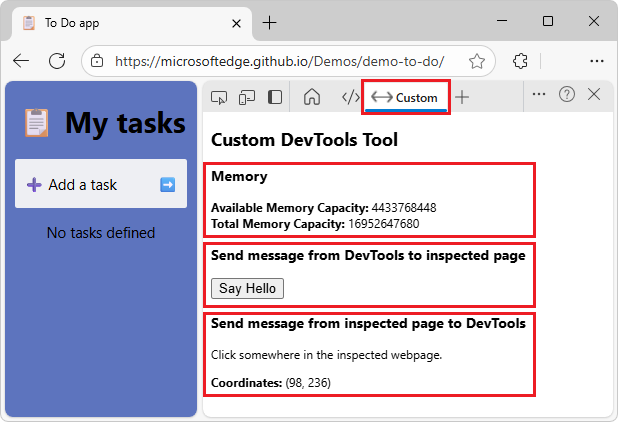
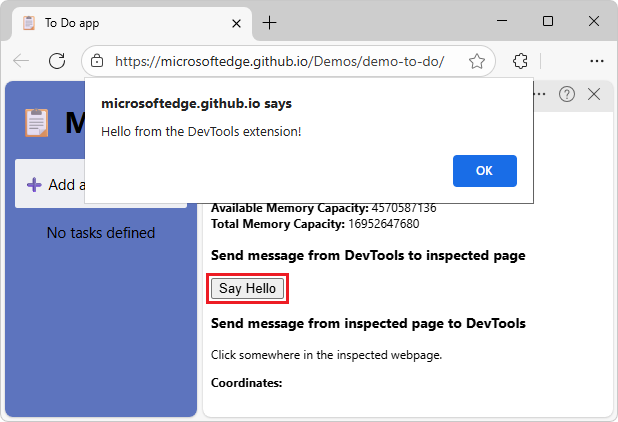
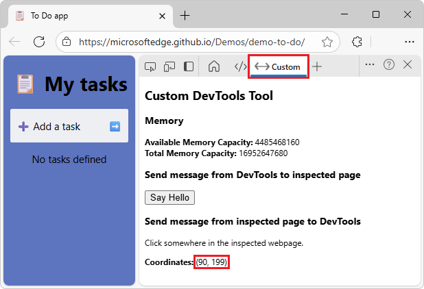
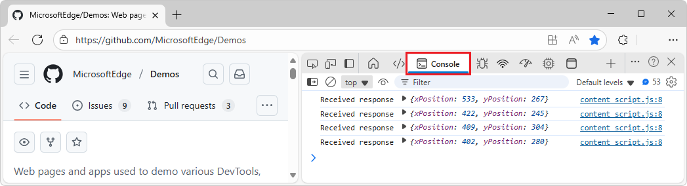
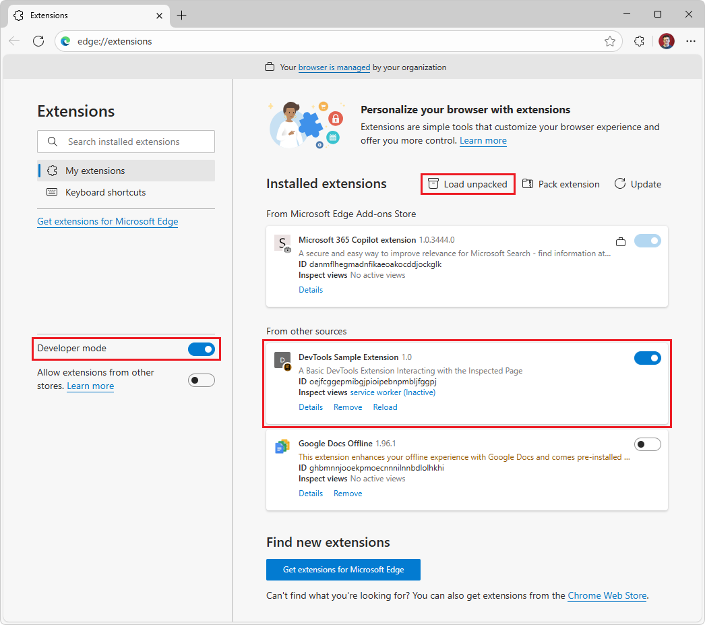
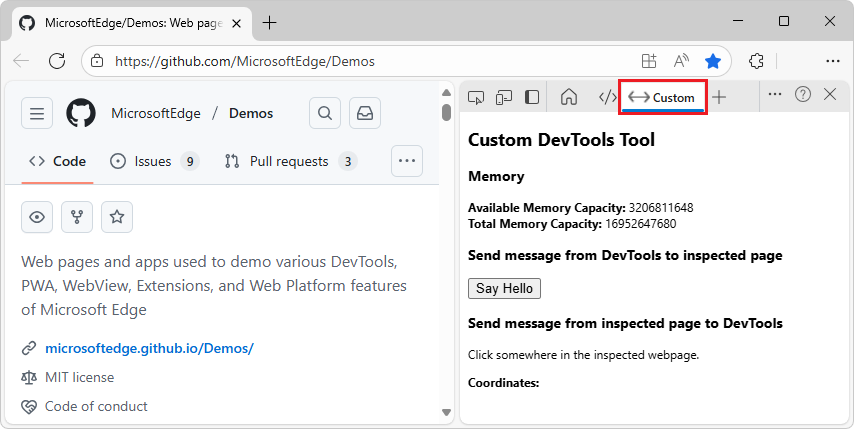
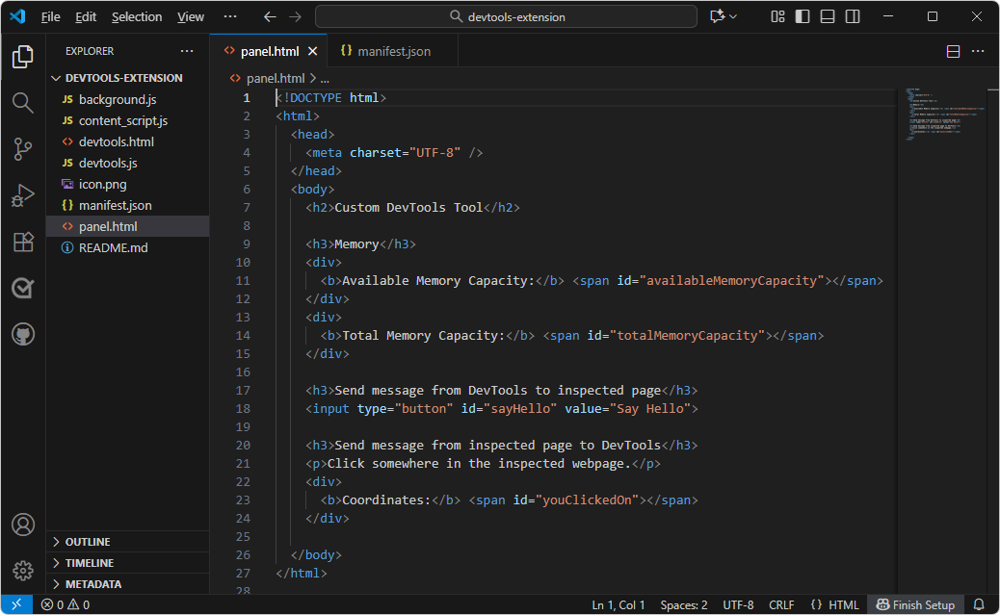
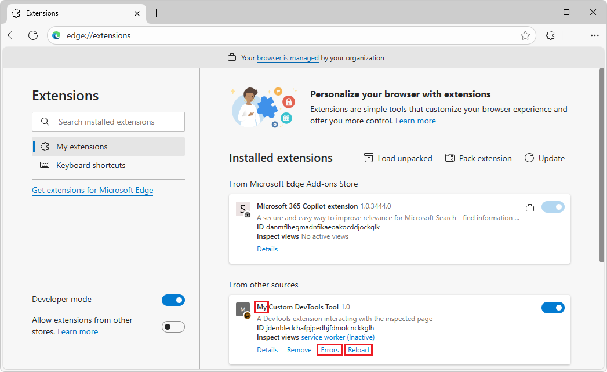
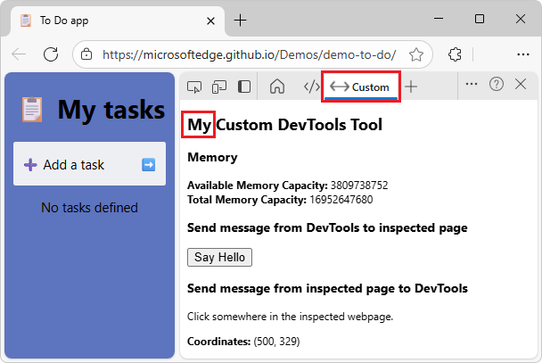

# Sample: Custom DevTools tool

The DevTools Extension sample is a Microsoft Edge extension that adds a **Custom** tool in Microsoft Edge DevTools, including a tab in the **Activity Bar**, and a panel below the tab.

* The **Custom** DevTools tool calls the DevTools API to display memory information.

* The webpage under inspection, and the **Custom** DevTools tool, send messages back and forth, in two-way communication.

See also:
* [Overview of DevTools](../../devtools/overview.md)<!-- long jump -->
* [Create a DevTools extension, adding a custom tool tab and panel](../developer-guide/devtools-extension.md)
* [Code for Custom DevTools tool](../samples/custom-devtools-tool-code.md)


<!-- ====================================================================== -->
## Preview of the sample

The "DevTools Extension" sample adds a **Custom** tool tab and panel in DevTools within Microsoft Edge:




<!-- ------------------------------ -->
#### Display memory information

The **Custom** tool calls the DevTools API (`chrome.system.memory.getInfo((data)`) to retrieve and display memory information.


<!-- ------------------------------ -->
#### Send message from DevTools to inspected page

The **Custom** tool in DevTools has a button that sends a message to the inspected webpage.  The inspected webpage then displays a JavaScript alert dialog:




<!-- ------------------------------ -->
#### Send message from inspected page to DevTools

Clicking around within the inspected webpage sends a message to DevTools.  The sample uses a content script to send a message (the clicked coordinates) from the inspected webpage (any webpage) to the **Custom** DevTools tool and the **Console** tool in DevTools.

The **Custom** tool displays the coordinates information from the message:



The **Console** tool displays the coordinates information from the message:



Download, install, use, and modify the sample, per the below sections.


<!-- ====================================================================== -->
## Step 1: Download the sample

If not done yet, download the "main" branch of the Demos repo, or clone (or fork and clone) the repo.  Downloading the repo is simplest, and is described below.

Download the "main" branch of the Demos repo, as follows:

1. In Microsoft Edge, go to the [MicrosoftEdge / Demos](https://github.com/MicrosoftEdge/Demos) repo.

1. Click the down arrow in the **Code** button, and then select **Download ZIP**.

1. In Microsoft Edge, the **Downloads** dialog shows `Demos-main.zip`.  "-main" is added, meaning a static snapshot of the "main" branch of the repo.

1. Hover to the right of `Demos-main.zip`, and then click the **Show in folder**  button.

   File Explorer opens, displaying the **Downloads** folder.

1. Right-click `Demos-main.zip`, and then select **Extract all**.

   The **Extract Compressed (Zipped) Folders** dialog opens.

1. Click the **Extract** button.

   The **% complete** dialog opens, and then finishes.

1. Move the `Demos-main` folder to a GitHub repos location, such as `C:\Users\localAccount\GitHub`.


<!-- ====================================================================== -->
## Step 2: Install the extension to add the tool in DevTools

1. In Microsoft Edge, select **Settings and more** (), hover over **Extensions**, and then select **Manage extensions**.

   The **Extensions** tab and page opens (`edge://extensions`).

1. Click  **Load unpacked**.

   The **Select the extension directory** dialog opens.

1. Navigate to the `/Demos-main/devtools-extension` folder, such as `C:\Users\localAccount\GitHub\Demos-main\devtools-extension\`, and then click the **Select Folder** button.<!-- actually used forked cloned /Demos/ dir, a working branch, which has latest version of sample -->

   The **Custom DevTools Tool** card is displayed:

   


<!-- ====================================================================== -->
## Step 3: Select the Custom tool in DevTools

1. In Microsoft Edge, go to a webpage, such as the [To Do app](https://microsoftedge.github.io/Demos/demo-to-do/), in a new window or tab.

   The **Custom** DevTools tool requires a webpage, not an empty tab.

1. Right-click the webpage, and then select **Inspect**.

   DevTools opens.

1. In the **Activity Bar** of DevTools, click the **Custom** () tool's tab.

   The **Custom** tool tab and panel are displayed:

   

   If the **Custom** () tool's tab isn't visible, do any of the following:

   * Click the **More tools** () button, and then select  **Custom**.

   * Make DevTools wider, and then click the **Custom** () tool's tab.

   The custom DevTools page has several sections:

   * Memory display information.
   * A button to send a message from DevTools to the inspected webpage, to make the page display a JavaScript `alert` dialog.
   * A **Coordinates** display area, to send a message from the inspected webpage to the DevTools **Console** and **Custom** tools.


<!-- ====================================================================== -->
## Step 4: View memory information from a DevTools API call

* In the **Custom** tool, next to **Available Memory Capacity**, observe the once-per-second updating of the value.


<!-- ====================================================================== -->
## Step 5: Send message from DevTools to inspected page

1. Click the **Say Hello** button.

   A JavaScript `alert` dialog opens, with message: "Hello from the DevTools extension!"

   

   DevTools sends a message to the inspected webpage, causing JavaScript to display an alert.

1. Click the **OK** button.

   The dialog closes.


<!-- ====================================================================== -->
## Step 6: Send message from inspected page to DevTools

1. In the inspected webpage, click various spots.

   In the **Custom** DevTools tool, in the **Coordinates** section, the coordinates are displayed and updated while you click around:

   

1. In DevTools, in the **Activity Bar**, select the **Console** tool.

   


<!-- ====================================================================== -->
## Step 7: Modify the Custom tool

1. If not done already, install [Visual Studio Code](https://code.visualstudio.com).

1. Open Visual Studio Code.

1. Click the **File** menu, and then click **Open Folder**.

   The **Open Folder** dialog opens.

1. Navigate to the `/Demos-main/devtools-extension/` folder, such as `C:\Users\localAccount\GitHub\Demos-main\devtools-extension\`, and then click the **Select Folder** button.<!-- actually used forked cloned /Demos/ dir, a working branch, which has latest version of sample -->

   A dialog opens, asking whether to open the repo in the parent folder.

1. Click the **Yes** button.

   In the **Explorer** pane, the `/devtools-extension/` folder is displayed.

1. Click `panel.html`.

   `panel.html` is opened for editing:

   

1. Add "My" to the `<h2>` heading; change from:

   ```html
   <h2>Custom DevTools Tool</h2>
   ```

   to:  

   ```html
   <h2>My Custom DevTools Tool</h2>
   ```

1. Save the file.

1. In the **Explorer** pane, click `manifest.json`.

   `manifest.json` is opened for editing.

1. Add "My" to the `name`; change from:

   ```json
   "name": "Custom DevTools Tool",
   ```

   to:  

   ```json
   "name": "My Custom DevTools Tool",
   ```

1. Save the file.


<!-- ====================================================================== -->
## Step 8: Reload the modified Custom tool

1. In Microsoft Edge, select **Settings and more** (), hover over **Extensions**, and then select **Manage extensions**.

   The **Extensions** tab and page opens (`edge://extensions`).

1. In the **Custom DevTools Tool** card (or **My Custom DevTools Tool** card), click the **Reload** link:

   

   An **Errors** link might appear in the card, displaying "Uncaught Error: Extension context invalidated", because the sample was modified while still in use.  If you want to prevent this, you can click **Remove** in the **Custom DevTools Tool** card, and then click **Load unpacked**.


<!-- ====================================================================== -->
## Step 9: Use the modified Custom tool

1. Go to a webpage, such as the [To Do app](https://microsoftedge.github.io/Demos/demo-to-do/), in a new window or tab.

   The **Custom** DevTools tool requires a webpage, not an empty tab.

1. Right-click the webpage, and then select **Inspect**.

   DevTools opens.

1. In the **Activity Bar** of DevTools, click the **Custom** () tool's tab.

   The **Custom** tool is displayed, with the word **My** added to the heading in the panel:

   

   If the title still says **Custom DevTools Tool** instead of **My Custom DevTools Tool**, close and reopen DevTools.

   If the **Custom** () tool's tab isn't visible, do any of the following:

   * Click the **More tools** () button, and then select  **Custom**.

   * Make DevTools wider, and then click the **Custom** () tool's tab.

This is the end of the steps to use and modify the DevTools Extension sample.  Next, you can study [Code for Custom DevTools tool](../samples/custom-devtools-tool-code.md).


<!-- ====================================================================== -->
## See also
<!-- all links in article -->

* [Overview of DevTools](../../devtools/overview.md)
* [Create a DevTools extension, adding a custom tool tab and panel](../developer-guide/devtools-extension.md)
* [Code for Custom DevTools tool](../samples/custom-devtools-tool-code.md)

GitHub:
* [MicrosoftEdge / Demos](https://github.com/MicrosoftEdge/Demos) repo.
* [To Do app](https://microsoftedge.github.io/Demos/demo-to-do/)

Tools:
* [Visual Studio Code](https://code.visualstudio.com)
