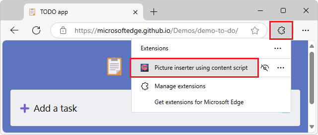
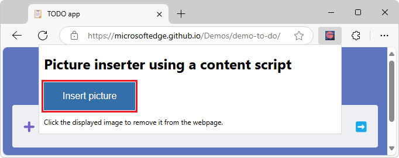
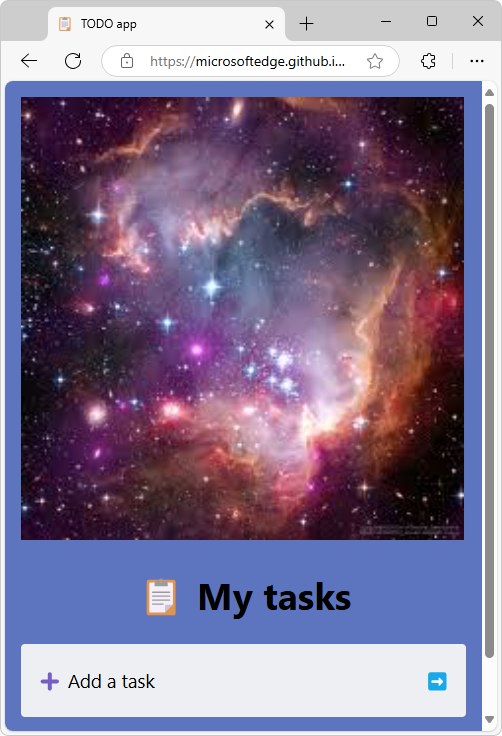
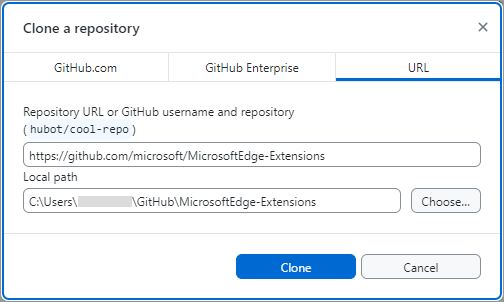
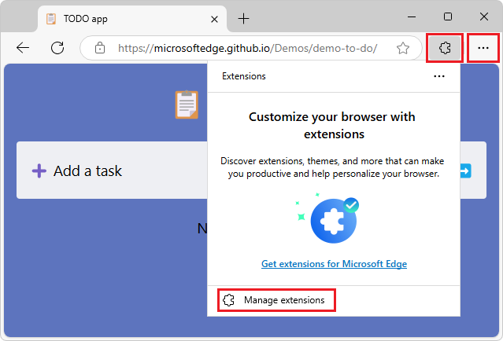
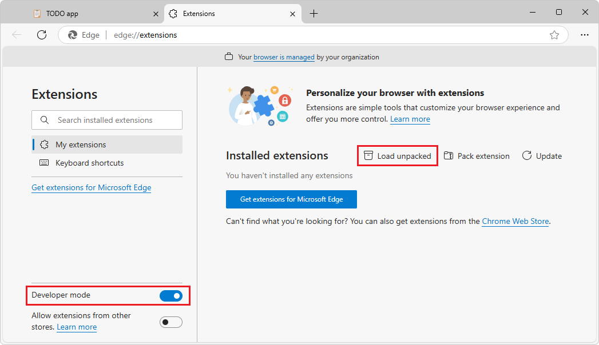
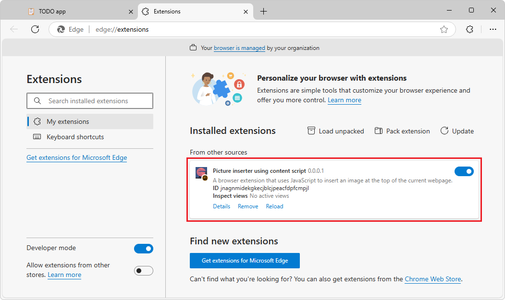

# Sample: Picture inserter using content script
<!-- 
longer name would get truncated in Extensions pop-up:
"name": "Picture inserter using a content scr...",
-->

<!-- lexicon usage:
popup - use in code & filenames
pop-up - use in English text sentences
-->

This sample uses JavaScript code to insert the `stars.jpeg` image at the top of the current webpage, inside the `<body>` element.  The extension's pop-up contains a title and an HTML button that's labelled **Insert picture**.  When you click the **Insert picture** button, the extension's JavaScript code sends a message from the extension icon's pop-up, and dynamically inserts JavaScript that runs in the browser tab.

This sample demonstrates the following extension features:

*  Injecting JavaScript libraries into an extension.
*  Exposing extension assets to browser tabs.
*  Including content webpages in existing browser tabs.
*  Having content webpages listen for messages from pop-ups and respond.


<!-- ====================================================================== -->
## Preview of the sample

You'll install the extension sample by using the browser's **Manage Extensions** tab, click the **Extensions** () button to show the list of installed extensions, and then click this sample extension:



The extension displays a small HTML webpage in a pop-up, containing a title, an **Insert picture** button, and instructions:



When you click the **Insert picture** button, JavaScript code temporarily inserts `stars.jpeg` at the top of the current webpage, pushing down the content of the webpage to below the image.  The injected content sets the image element to display the static image `stars.jpeg` in the top of the current webpage:



When you click the image, the injected JavaScript removes the image from the DOM tree and webpage.

Obtain, install, and run the sample as follows.


<!-- main location of this section for copying to multiple articles: [Clone the MicrosoftEdge-Extensions repo](./picture-viewer-popup-webpage.md#clone-the-microsoftedge-extensions-repo) in _Sample: Picture viewer pop-up webpage_ -->
<!-- ====================================================================== -->
## Clone the MicrosoftEdge-Extensions repo

You can use various tools to clone a GitHub repo.  You can download a selected directory, or clone the entire repo.

Clone the **MicrosoftEdge-Extensions** repo to your local drive, and then switch to a working branch, as follows.


##### [git bash command prompt](#tab/gitbash)

1. In a command prompt, enter `git` to check whether git is installed.

1. If not done yet, [download git](https://git-scm.com/downloads) and install it.

1. If not done yet, start a command prompt where git is installed.

1. Change to the directory where you want to clone the **MicrosoftEdge-Extensions** repo to.  For example:

   ```bash
   cd C:/Users/localAccount/GitHub/
   ```

1. In Microsoft Edge, go to the [MicrosoftEdge-Extensions](https://github.com/microsoft/MicrosoftEdge-Extensions) repo.

1. Click the down-arrow on the right side of the green **Code** button, and then in the **Clone using the web URL** section, click the **Copy url to clipboard** button next to `https://github.com/microsoft/MicrosoftEdge-Extensions.git`.

1. In the command prompt window, enter the command:

   ```bash
   git clone https://github.com/microsoft/MicrosoftEdge-Extensions.git
   ```

   The `/MicrosoftEdge-Extensions/` directory is added within the directory that you specified.


<!-- ------------------------------ -->
#### Create a working branch and switch to it

1. Check the list of directories:

   ```console
   ls
   ```

   The `/MicrosoftEdge-Extensions/` directory is listed.

1. Switch to the new directory:

   ```console
   cd MicrosoftEdge-Extensions
   ```

1. Create a working branch:

   ```console
   git branch test
   ```

1. Switch to the working branch:

   ```console
   git switch test
   ```

   Returns: `Switched to branch 'test'`

You are now free to modify the code in your working branch, without altering the code that's in the "main" branch of the repo.  Later you might want to switch back to the "main" branch, or create a different branch based off the "main" branch.


##### [GitHub Desktop](#tab/githubdesktop)

1. If not done already, install GitHub desktop: go to [https://github.com/apps/desktop](https://github.com/apps/desktop), and then click the **Download now** button.

1. Go to the [MicrosoftEdge-Extensions](https://github.com/microsoft/MicrosoftEdge-Extensions) repo.

1. Click the **Code** button, and then select **Open with GitHub Desktop**.

   A dialog opens, saying **This site is trying to open GitHubDesktop.exe.**

1. Click the **Open** button.

   GitHub Desktop opens, with the **MicrosoftEdge-Extensions** repo selected in the upper left dropdown list.

   Or, in GitHub Desktop, the **Clone a repository** dialog opens: 

   

1. Specify the local drive path to place the cloned repo directory into; for example: `C:\Users\accountname\GitHub\`.

1. Click the **Clone** button.


<!-- ------------------------------ -->
#### Create a working branch and switch to it

1. In GitHub Desktop, make sure that in the upper left of GitHub desktop, **Current repository** is **MicrosoftEdge-Extensions**.

   In the **Current branch** drop-down list, it says **main**.

1. In the **Current branch** drop-down list, click the **Branches** tab, and then click the **New branch** button.

   The **Create a branch** dialog opens.

1. In the **Name** text box, enter a branch name, such as **test**, and then click the **Create branch** button.

   In the upper middle and lower left of GitHub Desktop, the current branch is shown, such as **test**.

You are now free to modify the code in your working branch, without altering the code that's in the "main" branch of the repo.  Later you might want to switch back to the "main" branch, or create a different branch based off the "main" branch.

---


<!--
See also:
* [Step 2: Create a branch](https://docs.github.com/en/get-started/start-your-journey/hello-world#step-2-create-a-branch) in _Hello World_ in GitHub Docs.
-->

<!-- / end of section for copying to multiple articles -->


<!-- ====================================================================== -->
## Install the sample locally

Instead of installing the sample from [Microsoft Edge Add-ons](https://microsoftedge.microsoft.com), you'll install the sample locally, so that you can possibly modify it and quickly test the changes.  Installing locally is sometimes called _sideloading_ an extension.

1. In Microsoft Edge, click the **Extensions** () button, next to the Address bar, if this icon is displayed.  Or, select **Settings and more** () >  **Extensions**.  The **Extensions** pop-up opens:

   

1. Click **Manage extensions**.  The **Extensions** management page opens in a new tab:

   

1. Turn on the **Developer mode** toggle.

1. When installing the sample extension for the first time, click the **Load unpacked** () button.  The **Select the extension directory** dialog opens.

1. Select the directory that contains the extension's source files, such as `manifest.json`.

   Example path:

   `C:\Users\localAccount\GitHub\MicrosoftEdge-Extensions\Extension-samples\picture-inserter-content-script`

1. Click the **Select Folder** button.

   The **Select the extension directory** dialog closes.

   The extension is installed in the browser, similar to an extension that's installed from Microsoft Edge Add-ons:

   


<!-- ====================================================================== -->
## Run the sample

1. Go to a webpage, such as [TODO app](https://microsoftedge.github.io/Demos/demo-to-do/)<!-- https://github.com/MicrosoftEdge/Demos/tree/main/demo-to-do -->, in a new window or tab.  The tab must not be empty, and must not be the Manage Extensions page, because this sample inserts content into the current webpage.

1. Refresh the webpage.  This is sometimes required after reloading an extension.

1. In Microsoft Edge to the right of the Address bar, if this icon is displayed, click the **Extensions** () button.  Or, select **Settings and more** () > **Extensions**.

   The **Extensions** pop-up opens:

   

1. Click the extension's icon or name (**Picture inserter using content script**).

   The extension opens, and the extension's icon is added next to the Address bar and **Extensions** () icon.

   A pop-up opens, containing a small HTML webpage with a title, an **Insert picture** button, and instructions:

   

1. Click the **Insert picture** button.  `stars.jpeg` is inserted into the top of the current webpage in the current tab, pushing the webpage's content down below the image:

   

1. Click the `stars.jpeg` image that's filling the top of the webpage.  That image element is removed from the DOM tree and webpage, and the current webpage is restored, shifting its content back up to the top of the tab.

The extension sends a message from the extension icon's pop-up, and dynamically inserts JavaScript running as content in the browser tab.  The injected content sets the image element to display `stars.jpeg` in the top of the current webpage, and then removes the image when you click the image.

See also:
* [Sideload an extension to install and test it locally](../getting-started/extension-sideloading.md)


<!-- ====================================================================== -->
## Study the sample

In the following sections, you study the sample.  After that, to develop your own Microsoft Edge extension, you can copy and modify the sample's directory, and install and test the resulting extension.


<!-- ====================================================================== -->
## Files and directories

The sample has the following directory structure and files.

Example path for the sample:

`C:\Users\localAccount\GitHub\MicrosoftEdge-Extensions\Extension-samples\picture-inserter-content-script`

Directories and files in the `/picture-inserter-content-script/` directory:

```
/content-scripts/
   content.js
/icons/
   extension-icon16x16.png
   extension-icon32x32.png
   extension-icon48x48.png
   extension-icon128x128.png
/images/
   stars.jpeg
/popup/
   popup.html
   popup.js
manifest.json
```

* The `/content-scripts/` directory contains `content.js`, which is the script that's injected into the current webpage.
* The `/icons/` directory contains versions of a `.png` file that's used to represent the extension near the browser's Address bar, in the **Extensions** pop-up, and in the **Extensions** management page.
* The `/images/` directory contains `stars.jpeg`, which is displayed in the extension's pop-up.
* The `/popup/` directory contains the files:
   * `popup.html` defines the content in the extension's initial pop-up webpage (a title, button, and instructions).
   * `popup.js` for the initial pop-up webpage sends a message to the content script (`content.js`) that's running on the tab page, specifying which image file to display.
* `manifest.json` contains basic information about the extension.


<!-- ====================================================================== -->
## Strategy to update the webpage to insert the image at the top (`stars.jpeg`)

This sample includes a content script that's injected into the webpage that's loaded in the current browser tab.

1. When you run the extension sample, the initial pop-up HTML page is displayed (`popup.html`), showing a title, instructions, and the **Insert picture** button.

1. When you click the **Insert picture** button, the JavaScript (`popup.js`) for the initial pop-up page sends a message to the content script (`content.js`) that's running on the tab page.  The message specifies which image file to display.

1. The content script (`content.js`) running on the tab page receives the message, and displays the specified image file (`stars.jpeg`).


<!-- ====================================================================== -->
## The initial pop-up webpage (`popup.html`)

`/popup/popup.html` is specified in the manifest file as the webpage to display in the extension's initial pop-up.  The manifest file contains the key field `"default_popup": "popup/popup.html"`.  This sample's `popup.html` file is a small webpage that contains a title, an **Insert picture** button, and instructions.

`popup.html`:

```html
<!DOCTYPE html>
<html>
    <head>
        <meta charset="utf-8" />
        <style>
            body {
                width: 500px;
            }
            button {
                background-color: #336dab;
                border: none;
                color: white;
                padding: 15px 32px;
                text-align: center;
                font-size: 16px;
            }
        </style>
    </head>
    <body>
        <h1>Picture inserter using a content script</h1>
        <button id="sendmessageid">Insert picture</button>
        <script src="popup.js"></script>
        <p>Click the displayed image to remove it from the webpage.</p>
    </body>
</html>
```


<!-- ====================================================================== -->
## JavaScript (`popup.js`) for the initial pop-up page, to send a message to the injected JavaScript

`/popup/popup.js` sends a message to the content script (`content.js`) that's temporarily injected into the browser tab.  To do that, `popup.js` adds an `onclick` event to the pop-up webpage's **Insert picture** button, which has the ID `sendmessageid`:

`popup.js` (portion):

```javascript
const sendMessageId = document.getElementById("sendmessageid");
if (sendMessageId) {
    sendMessageId.onclick = function() {
        ...
    };
}
```

In `popup.js`, `chrome.tabs.query` finds the current browser tab, and then `chrome.tabs.sendMessage` sends a message to that tab.  The sample passes in the current tab's ID.  The message must include the URL for the image that will be displayed.

You must send a unique ID to assign to the inserted image, in order to find the image element again later and delete it.  To send a unique ID to assign to the inserted image, the unique ID is generated in `popup.js` and passed to the content script.

`popup.js` (complete):

```javascript
const sendMessageId = document.getElementById("sendmessageid");
if (sendMessageId) {
    sendMessageId.onclick = function() {
        chrome.tabs.query({ active: true, currentWindow: true }, function(tabs) {
            chrome.tabs.sendMessage(
                tabs[0].id,
                {
                    url: chrome.runtime.getURL("images/stars.jpeg"),
                    imageDivId: crypto.randomUUID(),
                    tabId: tabs[0].id
                },
                function(response) {
                    window.close();
                }
            );
        });
    };
}
```


<!-- ====================================================================== -->
## The content script message listener (`content.js`)

Here's the `content-scripts\content.js` file that gets injected into every browser tab page.  This file is listed in the `content-scripts` section in `manifest.json`.

`content.js` (complete):

```javascript
chrome.runtime.onMessage.addListener(function(request, sender, sendResponse) {
  const img = document.createElement("img");
  img.id = request.imageDivId;
  img.src = request.url;
  img.style = "height: auto; width: 90vw;";
  document.body.prepend(img);

  img.addEventListener("click", () => {
      img.remove();
  }, { once: true });

  sendResponse({ fromcontent: "This message is from content.js" });
});
```

`content.js` registers a listener by using the `chrome.runtime.onMessage.addListener` Extension API method.  This listener waits for the message that's sent when `popup.js` calls `chrome.tabs.sendMessage`.

In `content.js`, the `addListener` method takes a single parameter that's a function.  That function's first parameter, `request`, contains the details of the message that's being passed in.

In `content.js`, when an event is processed by the listener, the listener function that's passed into `addListener` is run.  The first parameter of the passed-in listener function is a `request` object that has attributes as assigned by `sendMessage`.  

In `popup.js`, for the `chrome.tabs.sendMessage` method call, the attributes of the second parameter for `sendMessage` are `url`, `imageDivId`, and `tabId`.

Here's the isolated listener function that's passed into `addListener`:

`content.js` (portion)

```javascript
function(request, sender, sendResponse) {
  const img = document.createElement("img");
  img.id = request.imageDivId;
  img.src = request.url;
  img.style = "height: auto; width: 90vw;";
  document.body.prepend(img);

  img.addEventListener("click", () => {
      img.remove();
  }, { once: true });

  sendResponse({ fromcontent: "This message is from content.js" });
}
```

The first five lines in the listener function append an `img` element immediately below the `body` element in the browser tab.

The second line in the listener function, `img.id = request.imageDivId;`, sets the ID of the `img` element to the `imageDivId` of the passed-in request.

In the listener function, the `addEventListener` call adds a `click` event listener function that covers the entire image, allowing the user to click anywhere on the image.  When you click the inserted image, the image is removed from the current webpage by the line `img.remove();`, and the event listener is also removed, by specifying `{ once: true }`.


<!-- ====================================================================== -->
## How `stars.jpeg` is made available from any browser tab

To make `images/stars.jpeg` available from any browser tab:
* `popup.js` (above) uses the `chrome.runtime.getURL` API.
* The manifest (below) specifies that `web_accessible_resources` of type `.jpeg` match all URLs.

The sample injects the image by using the `src` attribute of the `img` element into the content page.  The content page is running on a unique thread that isn't the same as the thread running the extension.  The static image file must be exposed as a web asset, for it to work correctly.

Another entry is added in the `manifest.json` file to declare that the image is available to all browser tabs:

`/manifest.json` (portion):

```json
"web_accessible_resources": [
    {
      "resources": ["images/*.jpeg"],
      "matches": ["<all_urls>"]
    }
  ]
```

The code in the `popup.js` file sends a message to the content page that's embedded in the current active tab page.


<!-- ====================================================================== -->
## How resources are listed in the manifest (`manifest.json`)

The sample creates and inject the content page that's embedded on the current active tab page.  `manifest.json` includes the `content-scripts` and `web_accessible_resources`, as follows:

`/manifest.json` (complete):

```json
{
    "name": "Picture inserter using content script",
    "version": "0.0.0.1",
    "manifest_version": 3,
    "description": "A browser extension that uses JavaScript to insert an image at the top of the current webpage.",
    "icons": {
        "16": "icons/extension-icon16x16.png",
        "32": "icons/extension-icon32x32.png",
        "48": "icons/extension-icon48x48.png",
        "128": "icons/extension-icon128x128.png"
    },
    "action": {
        "default_popup": "popup/popup.html"
    },
    "content_scripts": [
        {
            "matches": [
              "<all_urls>"
            ],
            "js": ["content-scripts/content.js"]
        }
    ],
    "web_accessible_resources": [
        {
            "resources": ["images/*.jpeg"],
            "matches": ["<all_urls>"]
        }
    ]
}
```


<!-- ====================================================================== -->
## The manifest's `content_scripts` section injects JavaScript into all browser tabs

In the `content_scripts` key section of the manifest file, the `matches` attribute is set to `<all_urls>`, which means that `.js` (or `.css`) files that are specified in the `content_scripts` key section are injected into all browser tab pages when each tab is loaded.  The allowed files types that can be injected are JavaScript (`.js`) and CSS (`.css`).

This sample's manifest specifies a single content script, `content-scripts/content.js`.


<!-- ====================================================================== -->
## Each content script runs in its own thread, sandboxed

Each tab page (and extension) runs in its own thread.  Even if the browser tab contains a webpage that runs JavaScript code, the `content.js` script that's injected in that browser tab by the extension doesn't have access to that JavaScript code.  The injected content script only has access to the DOM of the webpage.


<!-- ====================================================================== -->
## Next steps

To develop your own Microsoft Edge extension, you can copy and modify the sample's directory, and install and test the resulting extension.


<!-- ====================================================================== -->
## See also
<!-- all links in article -->

* [Sample: Picture viewer pop-up webpage](./picture-viewer-popup-webpage.md)
* [Sideload an extension to install and test it locally](../getting-started/extension-sideloading.md)
* [Samples for Microsoft Edge extensions](../samples/index.md)

GitHub:
* [MicrosoftEdge-Extensions](https://github.com/microsoft/MicrosoftEdge-Extensions) repo.
   * [/picture-inserter-content-script/](https://github.com/microsoft/MicrosoftEdge-Extensions/tree/main/Extension-samples/picture-inserter-content-script) - source code of this sample.
