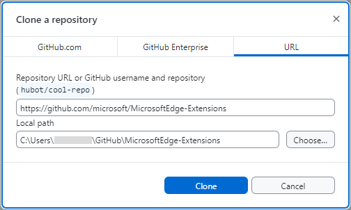
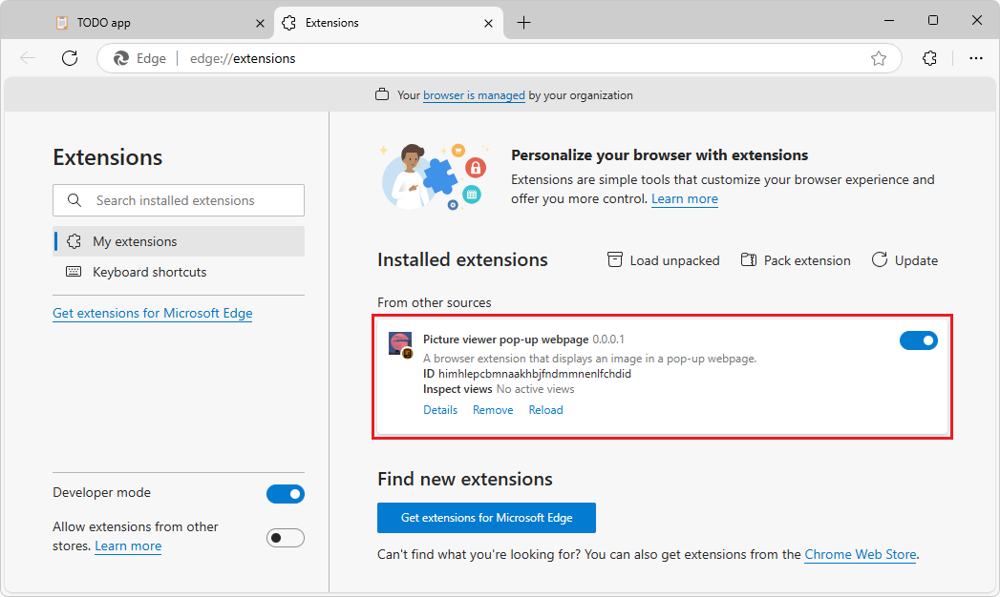

# Sample: Picture viewer pop-up webpage
<!--
sample name in manifest:
"name": "Picture viewer pop-up webpage",
-->

<!-- lexicon usage:
popup - use in code & filenames
pop-up - use in English text sentences
-->

This sample is a browser extension, without JavaScript, that displays the `stars.jpeg` image in a small webpage in a pop-up in any Microsoft Edge tab:

<!-- 1st use of this png -->


<!-- main location of this section for copying to multiple articles: [Clone the MicrosoftEdge-Extensions repo](./picture-viewer-popup-webpage.md#clone-the-microsoftedge-extensions-repo) in _Sample: Picture viewer pop-up webpage_ -->
<!-- ====================================================================== -->
## Clone the MicrosoftEdge-Extensions repo

You can use various tools to clone a GitHub repo.  You can download a selected directory, or clone the entire repo.

Clone the **MicrosoftEdge-Extensions** repo to your local drive, and then switch to a working branch, as follows.


##### [git bash command prompt](#tab/gitbash)

1. In a command prompt, enter `git` to check whether git is installed.

1. If not done yet, [download git](https://git-scm.com/downloads) and install it.

1. If not done yet, start a command prompt where git is installed.

1. Change to the directory where you want to clone the **MicrosoftEdge-Extensions** repo to.  For example:

   ```bash
   cd C:/Users/localAccount/GitHub/
   ```

1. In Microsoft Edge, go to the [MicrosoftEdge-Extensions](https://github.com/microsoft/MicrosoftEdge-Extensions) repo.

1. Click the down-arrow on the right side of the green **Code** button, and then in the **Clone using the web URL** section, click the **Copy url to clipboard** button next to `https://github.com/microsoft/MicrosoftEdge-Extensions.git`.

1. In the command prompt window, enter the command:

   ```bash
   git clone https://github.com/microsoft/MicrosoftEdge-Extensions.git
   ```

   The `/MicrosoftEdge-Extensions/` directory is added within the directory that you specified.


<!-- ------------------------------ -->
#### Create a working branch and switch to it

1. Check the list of directories:

   ```console
   ls
   ```

   The `/MicrosoftEdge-Extensions/` directory is listed.

1. Switch to the new directory:

   ```console
   cd MicrosoftEdge-Extensions
   ```

1. Create a working branch:

   ```console
   git branch test
   ```

1. Switch to the working branch:

   ```console
   git switch test
   ```

   Returns: `Switched to branch 'test'`

You are now free to modify the code in your working branch, without altering the code that's in the "main" branch of the repo.  Later you might want to switch back to the "main" branch, or create a different branch based off the "main" branch.


##### [GitHub Desktop](#tab/githubdesktop)

1. If not done already, install GitHub desktop: go to [https://github.com/apps/desktop](https://github.com/apps/desktop), and then click the **Download now** button.

1. Go to the [MicrosoftEdge-Extensions](https://github.com/microsoft/MicrosoftEdge-Extensions) repo.

1. Click the **Code** button, and then select **Open with GitHub Desktop**.

   A dialog opens, saying **This site is trying to open GitHubDesktop.exe.**

1. Click the **Open** button.

   GitHub Desktop opens, with the **MicrosoftEdge-Extensions** repo selected in the upper left dropdown list.

   Or, in GitHub Desktop, the **Clone a repository** dialog opens: 

   

1. Specify the local drive path to place the cloned repo directory into; for example: `C:\Users\accountname\GitHub\`.

1. Click the **Clone** button.


<!-- ------------------------------ -->
#### Create a working branch and switch to it

1. In GitHub Desktop, make sure that in the upper left of GitHub desktop, **Current repository** is **MicrosoftEdge-Extensions**.

   In the **Current branch** drop-down list, it says **main**.

1. In the **Current branch** drop-down list, click the **Branches** tab, and then click the **New branch** button.

   The **Create a branch** dialog opens.

1. In the **Name** text box, enter a branch name, such as **test**, and then click the **Create branch** button.

   In the upper middle and lower left of GitHub Desktop, the current branch is shown, such as **test**.

You are now free to modify the code in your working branch, without altering the code that's in the "main" branch of the repo.  Later you might want to switch back to the "main" branch, or create a different branch based off the "main" branch.

---


<!--
See also:
* [Step 2: Create a branch](https://docs.github.com/en/get-started/start-your-journey/hello-world#step-2-create-a-branch) in _Hello World_ in GitHub Docs.
-->

<!-- / end of section for copying to multiple articles -->


<!-- ====================================================================== -->
## Install the sample locally

Instead of installing the sample from [Microsoft Edge Add-ons](https://microsoftedge.microsoft.com), you'll install the sample locally, so that you can possibly modify it and quickly test the changes.  Installing locally is sometimes called _sideloading_ an extension.

1. In Microsoft Edge, click the **Extensions** () button, next to the Address bar, if this icon is displayed.  Or, select **Settings and more** () > **Extensions**.  The **Extensions** pop-up opens:

   

1. Click **Manage extensions**.  The **Extensions** management page opens in a new tab:

   

1. Turn on the **Developer mode** toggle.

1. When installing your extension for the first time, click the **Load unpacked** () button.  The **Select the extension directory** dialog opens.

1. Select the directory that contains the extension's source files, such as `manifest.json`.

   Example path:

   `C:\Users\localAccount\GitHub\MicrosoftEdge-Extensions\Extension-samples\picture-viewer-popup-webpage`

1. Click the **Select Folder** button.

   The **Select the extension directory** dialog closes.

   The extension is installed in the browser, similar to an extension that's installed from Microsoft Edge Add-ons:

   


<!-- ====================================================================== -->
## Run the sample

1. Go to a webpage, such as [TODO app](https://microsoftedge.github.io/Demos/demo-to-do/)<!-- https://github.com/MicrosoftEdge/Demos/tree/main/demo-to-do -->, in a new window or tab.  For this sample, this step is optional and is just to match the screenshots; this sample doesn't require a webpage to be open.

1. Refresh the webpage.  This is sometimes required after reloading an extension.

1. In Microsoft Edge to the right of the Address bar, if this icon is displayed, click the **Extensions** () button.  Or, select **Settings and more** () > **Extensions**.

   The **Extensions** pop-up opens:

   

1. Click the extension's icon or name (**Picture viewer pop-up webpage**).

   The extension opens, and the extension's icon is added next to the Address bar and **Extensions** () icon.  The extension displays `popup.html`, containing `stars.jpeg`, in a pop-up:

   <!-- 2nd use of this png -->

1. Click the extension's button next to the Address bar.  The pop-up window closes.

See also:
* [Sideload an extension to install and test it locally](../getting-started/extension-sideloading.md)


<!-- ====================================================================== -->
## Study the sample

In the following sections, you study the sample.  After that, to develop your own Microsoft Edge extension, you can copy and modify the sample's directory, and install and test the resulting extension.


<!-- ====================================================================== -->
## Files and directories

The sample has the following directory structure:

Example path for the sample:

`C:\Users\localAccount\GitHub\MicrosoftEdge-Extensions\Extension-samples\picture-viewer-popup-webpage`

Directories and files in the `/picture-viewer-popup-webpage/` directory:

```
/icons/
   extension-icon16x16.png
   extension-icon32x32.png
   extension-icon48x48.png
   extension-icon128x128.png
/images/
   stars.jpeg
/popup/
   popup.html
manifest.json
```

* The `/icons/` directory contains versions of a `.png` file that's used to represent the extension near the browser's Address bar.
* The `/images/` directory contains `stars.jpeg`, which is displayed in the extension's pop-up.
* The `/popup/` directory contains `popup.html`, which defines the webpage content that's displayed in the extension's pop-up.
* `manifest.json` contains basic information about the extension.


<!-- ====================================================================== -->
## The manifest file (`manifest.json`)

Every extension package must have a `manifest.json` file at the root.  The manifest provides details of your extension, the extension package version, and the extension name and description.

`manifest.json` contains the following lines:

```json
{
  "name": "Picture viewer pop-up webpage",
  "version": "0.0.0.1",
  "manifest_version": 3,
  "description": "A browser extension that displays an image in a pop-up webpage.",
  "icons": {
      "16": "icons/extension-icon16x16.png",
      "32": "icons/extension-icon32x32.png",
      "48": "icons/extension-icon48x48.png",
      "128": "icons/extension-icon128x128.png"
  },
  "action": {
      "default_popup": "popup/popup.html"
  }
}
```


<!-- ====================================================================== -->
## Icons for launching the extension

The `/icons/` directory contains the icon image files.  The icons are used as the background image for the button that you click to launch the extension:


When the extension is running, one of the icons is displayed on the toolbar, next to the Address bar:


To close the extension, click the extension's icon on the toolbar, or click the **Extensions** () button.

Recommendations for icons:
* Use `PNG` format, but you can also use `BMP`, `GIF`, `ICO` or `JPEG` formats.
* If you provide a single icon file, use 128 x 128 px, which can be resized by the browser if necessary.


<!-- ====================================================================== -->
## The pop-up dialog (`popup.html`)

`popup.html` in the `/popup/` directory runs when you launch the extension.  When you click the icon to launch the extension, this file is displayed as a modal dialog.

`popup.html` contains the following code, to display a title and the stars image:

```html
<html lang="en">
    <head>
        <meta charset="UTF-8" />
        <title>Picture viewer pop-up webpage</title>
    </head>
    <body>
        <div>
            
        </div>
    </body>
</html>
```

The pop-up webpage (`popup.html`) is registered as the `"default_popup"` in `manifest.json`, in the `action` key section:

`manifest.json` (portion)

```json
{
    "action": {
        "default_popup": "popup/popup.html"
    }
}
```


<!-- ====================================================================== -->
## Next steps

To develop your own Microsoft Edge extension, you can copy and modify the sample's directory, and install and test the resulting extension.

After running and testing this extension sample, you can continue on to [Sample: Picture inserter using content script](./picture-inserter-content-script.md), which dynamically inserts JavaScript running as content in the browser tab.


<!-- ====================================================================== -->
## See also
<!-- all links in article -->

* [Sideload an extension to install and test it locally](../getting-started/extension-sideloading.md)
* [Sample: Picture inserter using content script](./picture-inserter-content-script.md)
* [Samples for Microsoft Edge extensions](../samples/index.md)

GitHub:
* [MicrosoftEdge-Extensions](https://github.com/microsoft/MicrosoftEdge-Extensions) repo.
   * [/picture-viewer-popup-webpage/](https://github.com/microsoft/MicrosoftEdge-Extensions/tree/main/Extension-samples/picture-viewer-popup-webpage) - source code of this sample.
