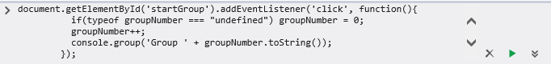

# Console Tool

Use the **Console** tool to view errors and other messages, send debug output, inspect JavaScript objects and XML nodes, and to run JavaScript in the context of the selected window or frame.

## A window into your code

The primary use for the **Console** tool is to communicate into and out of running webpages.


*In the image above, as the JavaScript command to reload the page is entered in, the IntelliSense auto code completion pops up. Once the reload method is selected, the page reloads and the console sends JavaScript debugging messages out.*

   - **In:** Run JavaScript to view and change values in running webpages, add functions to running code, and run debug code on the fly, all while taking advantage of the Microsoft Edge [IntelliSense](https://msdn.microsoft.com/library/hcw1s69b.aspx) auto code completion.

   - **Out:** Microsoft Edge and JavaScript code deliver status, error, and debug messages to developers, including inspectable JavaScript objects and DOM Nodes. For more on how to send debug information and other messages to the console from your code, read up on [Using the Console API](./console/using-the-console-api.md).

### Messages Microsoft Edge sends to the console

The Console has three categories:
   - **Error:** Critical errors that cause code not to run. For more info, see a list of [error codes](./console/console-error-and-status-codes.md) used in the console.
   - **Warning:** Possible errors in your webpage that don't necessarily break it, but may cause unexpected behavior.
   - **Information:** Non-critical information you might want to know.


These messages can be filtered out of the Console output. The icons for each message type at the top of the Console pane act as toggles. Click one to remove its associated message type, then again to return it. You can also right-click in the Console output and find check boxes for each type in the context menu.

When you click the file name that follows a message, you open the **[Debugger](./debugger.md)** tool and load the file in the script pane.

When the **Clear on navigate** icon is highlighted, the console clears every time the browser navigates to a new webpage. When it isn't highlighted, the browser preserves the contents of the **Console**, but messages from prior webpages are grayed out to better visually indicate they are not from the current page.

### Selecting your execution target
The **Console** has a **Target** drop-down menu just above the **Console** output pane. If the webpage you're viewing has an [iframe element]() in it, select the iframe from the **Target** menu to run **Console** commands solely in the scope of the iframe. If your webpage has no iframes, the only selection will be "_top."


*In the image above, the Target iframe is selected, then the page reloads to output only Error messages, the file name is clicked to follow the error to the script file where it is located in the Debugger. Returning to the Console, the Error Code itself is clicked, opening the documentation page for that error code.*

### Sending JavaScript into the Console
The console not only displays output from code, but provides an interface to execute code as well. Just enter any valid JavaScript at the bottom of the Console, in the command line pane.


Generally, all script entered in the command line executes in the [global scope](https://msdn.microsoft.com/library/bzt2dkta.aspx) of the currently selected window. However, if your script is currently paused (for instance, because you set a breakpoint), script executes in the [local scope](https://msdn.microsoft.com/library/bzt2dkta.aspx) of the current function within the call stack.


If your webpage is built with a **[frameset](https://msdn.microsoft.com/library/ms535251.aspx)** or **[iframes](https://msdn.microsoft.com/library/ms535258.aspx)**, those frames load their own documents in their own windows.

To target the window of a frameset frame or an iframe, use the `cd()` command, with the frame/iframe's name or ID attribute as the argument. For example, you have a frame with the name microsoftFrame and you're loading the Microsoft homepage in it.

   **JavaScript**
   ```js
   cd(microsoftFrame);
   ```
   ```
   Current window: www.microsoft.com/default.aspx
   ```

**Important**  Note that there were no quotes around the name of the frame. Only pass the unquoted name or ID value as the parameter.
To return to the top level window, use `cd()` with no argument.

### Selecting elements in the Console
Console selectors provide simple shorthands for quickly selecting elements in your DOM structure. They are:

   - **$()** is a shorthand for [**`document.querySelector()`**](https://msdn.microsoft.com/library/cc288169.aspx).
   - **$$()** is a shorthand for [**`document.querySelectorAll()`**](https://msdn.microsoft.com/library/cc304115.aspx).
   - **$_()** is a shorthand for the last selected element or object.
   - **$0, $1, $2, $3, $4** return the last items selected in the [**DOM Explorer tool**](./dom-explorer.md).

**Important**  If code in a webpage assigns a function to **$** or **$$**, that function overrides the console selector functions while the console is interacting with that page or its frames.

### The multiline command line

Sending in single line commands is useful, but some tasks require executing longer scripts. Click the double up-arrow symbol to expand the command line. In multiline mode, enter as many lines as you need, then click the green arrow symbol to execute it in the console.



## Related topics

[Microsoft Edge Developer Tools on Twitter: Find helpful F12 hints and news updates](https://twitter.com/EdgeDevTools)

[Using the Console API](./console/using-the-console-api.md)

