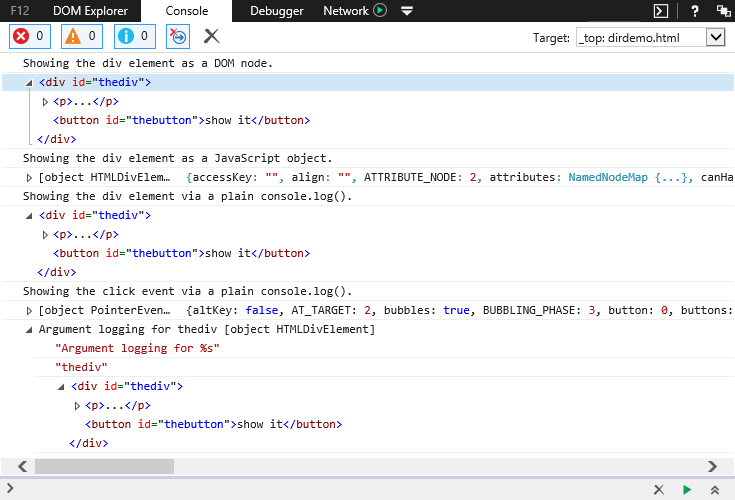

# Using the Console API

The Console API provides methods for developers to send meaningful information to the Console from within their applications and to obtain diagnostic information from within the Console tool.

## Reporting out from your code
The [Console Debugging API](https://msdn.microsoft.com/library/hh772173.aspx) gives you methods for sending info out from your code to the console. The info breaks down into these types:

  - [Custom messages](#custom-messages)
  - [Inspectable objects and nodes](#inspectable-objects-and-nodes)
  - [Counters](#counters)
  - [Timers](#timers)
  - [Assertions](#assertions)
  - [Traces](#traces-and-profiles)

### Custom messages
You have four options for custom messages. Three use the format of system messages: [`console.info()`](https://msdn.microsoft.com/library/hh772178.aspx) for information messages, [`console.warn()`](https://msdn.microsoft.com/library/hh772181.aspx) for warnings, and [`console.error()`](https://msdn.microsoft.com/library/hh772176.aspx) for errors. The fourth, [`console.log()`](https://msdn.microsoft.com/library/hh772179.aspx) presents plain text with no alert icon. All four take the same forms of argument for the message.

**Just text:**

```JavaScript
console.log('This is some text');
```
>`This is some text`


**Just a variable:**

```javascript
var mytext = 'This is some text';
console.log(mytext);
```
>`This is some text`

**Mixed text and variables:**

```javascript
var mytext = 'pieces';
var myval = 0;
console.log("The number of " + mytext + " is " + myval);
```
>`The number of pieces is 0`

**Variable Substitution:**

```javascript
var mytext = 'pieces';
var myval = 5;
console.log("The number of %s is %d", mytext, myval);
```
>`The number of pieces is 5`

Variable substitution has five variable types:
  - %**s** - string
  - %**d** - integer
  - %**i** - integer
  - %**f** - float
  - %**o** - object
  - %**b** - binary
  - %**x** - hexadecimal
  - %**e** - exponent

The variable types control how the variable is presented. For example, a float value represented by an integer variable type is displayed as an integer.

### Inspectable objects and nodes
Inspectable objects appear in the console in a collapsed tree format with expandable nodes. The console detects whether you are sending a DOM node like a div or a JavaScript object like an event and displays them as the detected type automatically. You can, however, force the mode using specific methods.

To display an inspectable JavaScript object, send it to the console using [`console.dir()`](https://msdn.microsoft.com/library/jj152132.aspx)

To display an inspectable DOM node, send it to the console using [`console.dirxml()`](https://msdn.microsoft.com/library/dn265067.aspx)

Open the F12 tools for this page, then click the "show it" button in the codepen sample below to display both objects and nodes in the console.

<div class="codepen-wrap"><p data-height="325" data-theme-id="23761" data-slug-hash="PNEKQX?editors=1010" data-default-tab="result" data-user="MicrosoftEdgeDocumentation" data-embed-version="2" data-editable="true" class="codepen">See this example by <a href="https://codepen.io/MicrosoftEdgeDocumentation">Microsoft Edge Docs</a> on <a href="https://codepen.io/MicrosoftEdgeDocumentation/pen/PNEKQX?editors=1010">CodePen</a>.</p></div><script async src="//assets.codepen.io/assets/embed/ei.js"></script>

Use the arrows to the left to expand objects and nodes as seen in the console image below.



Right-clicking DOM nodes provide an **Evaluate as Object** option in the context menu. If you select that option, you send the node to the console as an object. Similarly, JavaScript objects that represent DOM nodes offer an **Evaluate as HTML** option in their context menus.

### Counters
While setting up a counter in code is relatively easy, it's also a repetitive task. To speed up developer workflow, the Console Debugging API provides a simple shorthand.

Use [`console.count()`](https://msdn.microsoft.com/library/dn265064.aspx) with a string containing a counter label as its argument. The first use with a specific label establishes a counter in the Console output. Subsequent uses of `console.count()` with the same label increment the counter. To reset the counter to zero, use `console.countReset()` with the label.

```javascript
console.count('mylabel');
for(var i = 0; i < 10; i++){
  console.count('mylabel');
}
```
>`mylabel:         11`

### Timers
Like creating counters, creating a timer within code is relatively easy, but the [Console Debugging API](https://msdn.microsoft.com/library/hh772173.aspx) provides a simple shorthand that makes it even easier.

Use [`console.time()`](https://msdn.microsoft.com/library/dn265071.aspx) anywhere in your code to begin a timer and [`console.timeEnd()`](https://msdn.microsoft.com/library/dn265072.aspx) to end the timer and send the result to the console. If you want to label your timer or need more than one timer, pass a string with a unique label as the argument for both the `console.time()` and `console.timeEnd()` methods. If you don't pass an argument, the methods use "default" as the label.

The `console.timeStamp()` shows you the age of a page, so to speak. It will output a timestamp to the console, showing the number of milliseconds since the current webpage loaded. If you put a number or string as the method's parameter, it will be used as a label, overriding the default label of "timestamp." When you use it during a **UI Responsiveness** profiling session, in addition to its console output, it will add a user mark to the session timeline with the time since the session was initiated.

### Assertions
Assertions are another shorthand for speeding up developer workflow. If the first argument used with [`console.assert()`](https://msdn.microsoft.com/library/hh772171.aspx) evaluates to false, it runs [`console.error()`](https://msdn.microsoft.com/library/hh772176.aspx), using the assertion's additional arguments for the error message.

Use this one line of code:

`console.assert(f < 25, 'f is not less than %d, but is instead %o', 25, f);`

And it's equivalent to writing:

```javascript
if(!(f < 25)){
  console.error('f is not less than %d, but is instead %o', 25, f)
}
```

In the example code, we used `%o` to output the variable. Because the evaluation above will fail if the variable's value isn't a number, using `%o` makes it possible to see the variable as it is instead of cast into a specific type.

### Traces and profiles
Understanding where your code is being called from, what code is running, and how long that execution takes can be useful in analyzing slowness or unexpected behavior.

A stack trace shows you the execution path your code took to reach it, from the trace request upward through the path. Use [`console.trace()`](https://msdn.microsoft.com/library/hh772176.aspx) in your code to show a stack trace.

This code...

```javascript
function a(){
  c();
}
function b(){
  c();
}
function c(){
  console.trace()
}
function d(){
  b();
}

a();
d();
```

...displays this output in the console.

```javascript
console.trace()
at c (http://www.contoso.com/trace.html:24:3)
at a (http://www.contoso.com/trace.html:18:3)
at Global code (http://www.contoso.com/trace.html:30:1)
console.trace()
at c (http://www.contoso.com/trace.html:24:3)
at b (http://www.contoso.com/trace.html:21:3)
at d (http://www.contoso.com/trace.html:27:3)
at Global code (http://www.contoso.com/trace.html:31:1)
```

### Managing messages for readability
**Organizing messages into groups.**

With all the types of messages and content that get sent to the console, keeping track of them can be difficult. Use the following commands to keep things more orderly:

  - [`console.group()`](https://msdn.microsoft.com/library/dn265068.aspx) begins a collapsible group in an expanded state. Every message sent to the console after this command is placed in the group until the `console.groupEnd()` method is used. If a string is provided as the first argument for the method, the string is used as a label for the group.
  - [`console.groupCollapsed()`](https://msdn.microsoft.com/library/dn265069.aspx) begins a collapsible group in a collapsed state. In all other respects, it behaves like `console.group()`.
  - [`console.groupEnd()`](https://msdn.microsoft.com/library/dn265068.aspx) closes the most recently opened group.
  - [`console.clear()`](https://msdn.microsoft.com/library/jj152131.aspx) deletes all messages currently displayed in the console.

Groups can be nested within one another for more detailed levels of grouping.

To turn different types of messages on and off, use filtering.

At the top of the **Console tool** are icons for error, warning, and informational messages with a count of each type next to them. Click an icon to toggle the display of that message type on or off. When toggled off, that type of message is hidden, but not deleted, and can be restored by toggling that message type on again.

Right-clicking within the console output displays a context menu with check box toggles for the three main message types plus messages sent using `console.log()`.

Sometimes, though, you just need to manage it by wiping it clear. **CTRL + L** is a quick keyboard shortcut to clear all the messages and output in the **Console tool**.
