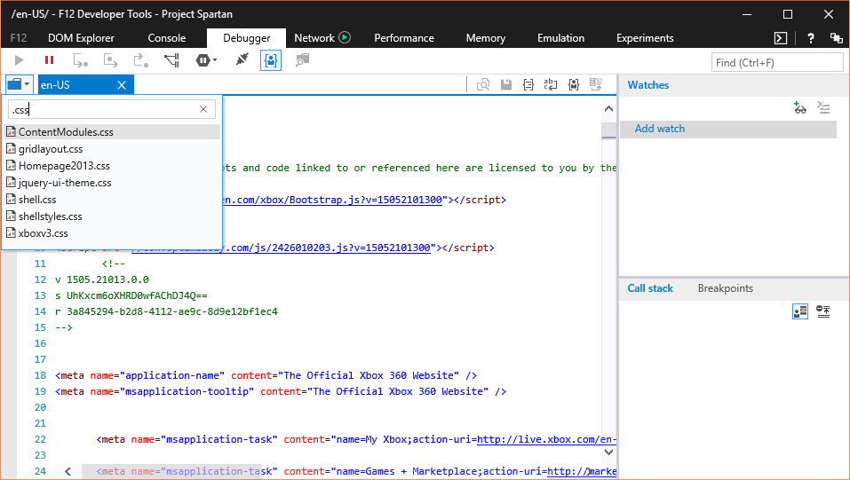

# Editing CSS in the Debugger

The [**Debugger tool**](../) enables you to edit your page styles by enabling CSS files to be accessed in the file picker by clicking the folder icon or pressing CTRL + O.

Selecting a file allows you to edit directly on the Debugger's text editor. New style changes can be applied via the save button or CTRL + S. 

 

## Editing a Sass file with the Debugger

