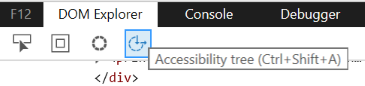
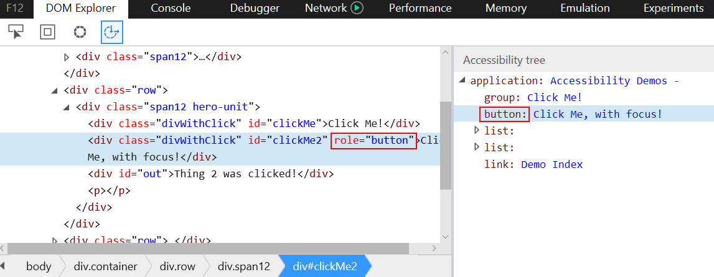
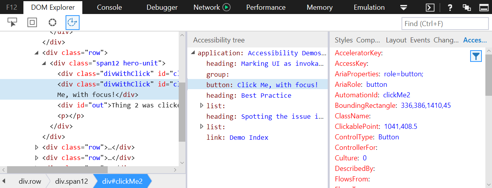

# Accessibility Tools

The new accessibility tools within the **DOM Explorer** tool are designed to help you verify and test the accessibility of your website. 

## Accessibility tree
Use the **Accessibility tree** to view how your website is interpreted by assistive technologies, like screen readers, and what data it’s providing to assistive technologies. To view the **Accessibility tree**, select the **DOM Explorer** tool and click the **Accessibility tree** icon, or press CTRL + SHIFT + A.

The **Accessibility tree** works side-by-side with the **DOM tree**.  As you select elements on your website with the **Select element** tool or in the **DOM tree**, they are also selected in the **Accessibility tree**.  The **Accessibility tree** helps you, for example, verify that a `div` element with a `role="button"` attribute will be correctly interpreted as a button by assistive technologies. 

## Accessibility tab

Use the **Accessibility tab** to view all the properties that relate to accessibility on the selected element. To view the **Accessibility tab**, select the **DOM Explorer** tool, and select Accessibility in the **Styles pane**. Inside the **Accessibility tab**, you can hover over a property name for a description of the property. 

