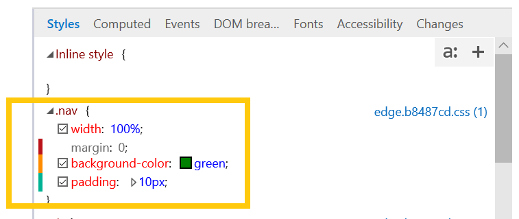
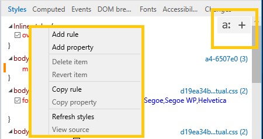
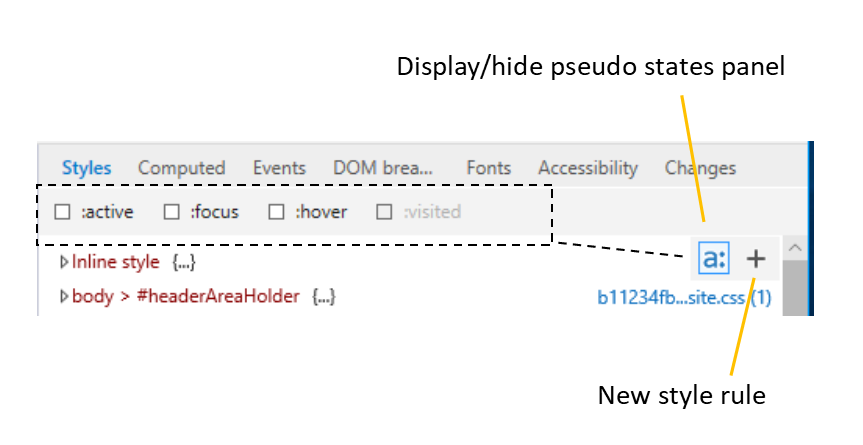

# Elements

The **Elements** panel helps you to:

* [Identify and edit elements in the HTML tree](#elements) of the current page
* [Inspect and modify CSS](#styles) on the page, including pseudo-states and pseudo-elements
* [Understand the CSS layout and style cascade](#computed) happening on the page
* [Track down rogue event handlers](#events) so you can debug them
* [Set debugging breakpoints for visual changes to your UI](#dom-breakpoints) to jump into the code causing your page to break
* [Get detailed information about the fonts used on the page](#fonts) and where they're loading from
* [View your page from a screen reader's point of view](#accessibility) to verify and test accessibility 
* [Review a running diff of the CSS changes](#changes) you make as you debug the UI of your page

1. Use the **Select element** (`Ctrl+B`) tool to locate an element in the **HTML tree view** by clicking on it in the page.

2. Use the **Element higlighting** (Ctrl+Shift+L`) tool to locate an element on the page by hovering over it in the **HTML tree view**.

3. Open the **Color picker** (`Ctrl+K`) tool to see a list of the colors in use on the current page. Clicking on a color on the list will provide further details (Hue, Saturation, Lightness, Alpha). The *Color picker* also opens when you click on the colored square next to a color value in the **Styles** pane, allowing you to edit the color of a page element and immediately see the results.

4. The **Accessibility tree** (`Ctrl+Shift+A`) button will open the [Accessibility tree* pane showing the structure of your page as it would appear to an assistive technology, such as the [Windows Narrator](https://support.microsoft.com/en-us/help/22798/windows-10-narrator-get-started) screenreader. Clicking on a node in the *Accessibility tree* view will also select it in the *HTML tree* view, and vice-versa. Selecting an accessible element from either the *HTML* or *Accessibility* tree views will also populate further accessibility property details in the [**Accessibility**](#accessibility) tool pane. 

5. You can also **Find** (`Ctrl+F`) an element in the HTML tree view by searching by its tag name, attributes, or text content.

## Editing elements

You can edit an element by right-clicking on it within the HTML tree view and selecting **Edit as HTML** from the context menu. The context menu also provides options to delete, cut, copy, paste, set CSS pseudo-classes (*:active*, *:focus*, *:hover*, *:visited*) and add attributes. Another way to edit an attribute and/or its value is to double-click it from the HTML tree view.

> [!NOTE]
> Editing the HTML tree does not affect the underlying source markup. Refreshing the page will revert your changes and render only the layout determined by the page source. You can **Copy** your modified HTML to the clipboard by right-clicking the desired element (or the global `html` element, if you want the entire page) to open up the context menu. (**Cut** and **Paste** options are also available).

From the [Styles](#styles) pane you can also add/delete/edit CSS pseudo-states and pseudo-elements.

## Tool Panes

Once you have selected a page element of interest, you can use the tool panes to further inspect its different styles and accessibility properties, view its event listeners, and set DOM mutation breakpoints.

1. [**Styles**](#styles): Currently applied styles organized by stylesheet

2. [**Computed**](#computed): Currently applied styles organized by CSS attributes

3. [**Events**](#events): Event listeners registered on the current element and ancestor elements

4. [**DOM breakpoints**](#dom-breakpoints): DOM Mutation Breakpoints 

5. [**Fonts**](#fonts): Currently applied fonts for a selected element

6. [**Accessibility**](#accessibility):  Accessibility properties

7. [**Changes**](#changes): CSS changes made during diagnostic session  

### Styles
View and edit the currently applied styles, organized by stylesheet.  As you make changes to your properties, a colored indicator bar will appear for changed (yellow), added (green), and deleted (red) properties.

You can display the pseudo states panel by clicking the "**a:**" button. Define a new style rule by clicking the "**+**" button or right-clicking anywhere in the **Styles** pane to open the context menu.

#### Editing pseudo-elements

Use the [Styles](#styles) pane to add, edit, and delete pseudo-elements and pseudo states. To apply a CSS pseudo-state to the selected element, open the *Pseudo states panel* (**a:** button) and tick the desired class.

To add a pseudo-element, click the **+** (*New style rule*) button and edit as you would a regular stylesheet.

Pseudo elements are grouped under their own headings in the *Styles* pane.

### Computed
See a box model diagram (width, padding, border, margin and offset values) of the selected element. If you turn on the **Element highlighting** tool (`Ctrl+Shift+L`), the same colored regions in the diagram (for width, padding, etc.) that will overlay the rendered element when you select it on the page. You can edit any value in the diagram by clicking it. 

Below the box model diagram is a filterable and editable list of computed style properties. Turning off a currently active property activates the next property in the cascade, if one exists. You can view your changes in the [**Changes**](#changes) pane.

The **Display user styles only** button is on by default. Depressing the button will include styles from the *default stylesheet* of Microsoft Edge in the computed styles list.

### Events 

View the event listeners registered on the selected element and (optionally, using the checkbox toggle) its ancestors. This is useful for tracking down rogue event listeners. 

You can group the event listeners by either **Event** or **Element**. Clicking the blue hyperlink next to the event handler name will open the debugger to the location of that function.

### DOM breakpoints

Manage your DOM mutation breakpoints from this pane, including disabling, deleting and rebinding them.

You can use DOM mutation breakpoints to break into the debugger whenever a selected element node changes. This is helpful for tracking down the code responsible for causing visual glitches with your UI. 

To set a DOM breakpoint, right-click on any element in the **Elements** panel *HTML tree view* to open the context menu.

You can set any of the following breakpoints:

 - **Break on Node removed**: Break into the debugger when the selected element is removed from the document (DOM tree).

 - **Break on Subtree modified**: Break into the debugger when any of the descendants of the selected element are changed (added, removed, or their subtrees are modified). This will not break when attributes are modified (see the next option for that).

 - **Break on Attribute modified**: Break into the debugger when an attribute of the selected element is added, removed or changed in value.

The **DOM breakpoints** pane will then list the selected element (by generating a selector describing its location in the DOM) and the types of breakpoints you have set (*Node removed, Subtree modified, Attribute modified*). From here, you can also *rebind*, *disable*, or *delete* your breakpoints, individually (from the rt-click context menu) or all at once (using the buttons).

When the page is reloaded or the DevTools are closed and reopened, F12 DevTools will attempt to rebind your breakpoints to their associated elements. If there are no elements to match the selector, you can wait to rebind the element manually (using the **Rebind breakpoint** button and/or context menu option) once a corresponding element appears in the DOM (and the breakpoint icon no longer shows the warning indicator).

In addition to this *DOM breakpoints* pane, you can also manage your [DOM breakpoints](./debugger#dom-breakpoints) from within the **Debugger**.

### Fonts

View information about your CSS `@font-face` rules, including where fonts are being loaded (*Local* or *Network*) and how many characters on the page are using them.

For fonts loaded from the network, F12 DevTools will display the rule that imported it along with alias and font type.

### Accessibility
View the accessible properties assigned to the selected element. Hover over any of the property names for a description of how its used by assistive technologies. You can also right-click any property to copy its value to the clipboard.

Here are further resources on [Accessibility with Microsoft Edge](../accessibility.md).

### Changes
View the CSS changes you made during your F12 DevTools diagnostic session (from the [Styles](#styles) and [Computed](#computed) CSS editing panes). Similar to the conventions of other diffing tools, deleted lines appear in red and added lines are green.

You can also (from the right-click context menu) copy  your changes to the clipboard, revert your changes, or jump to their source location.

## Shortcuts

Action | Shortcut
:------------ | :-------------
Elements panel | Ctrl+1
DOM Element highlighting | Ctrl+Shift+L
Select element | Ctrl+B
Open/close Color Picker tool  | Ctrl+K
Accessibility tree | Ctrl+Shift+A