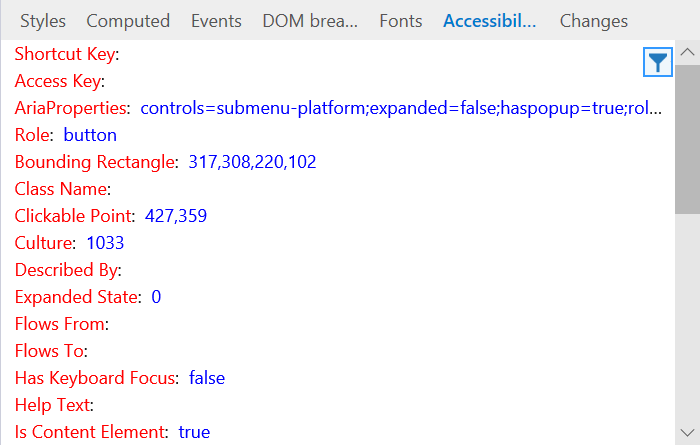
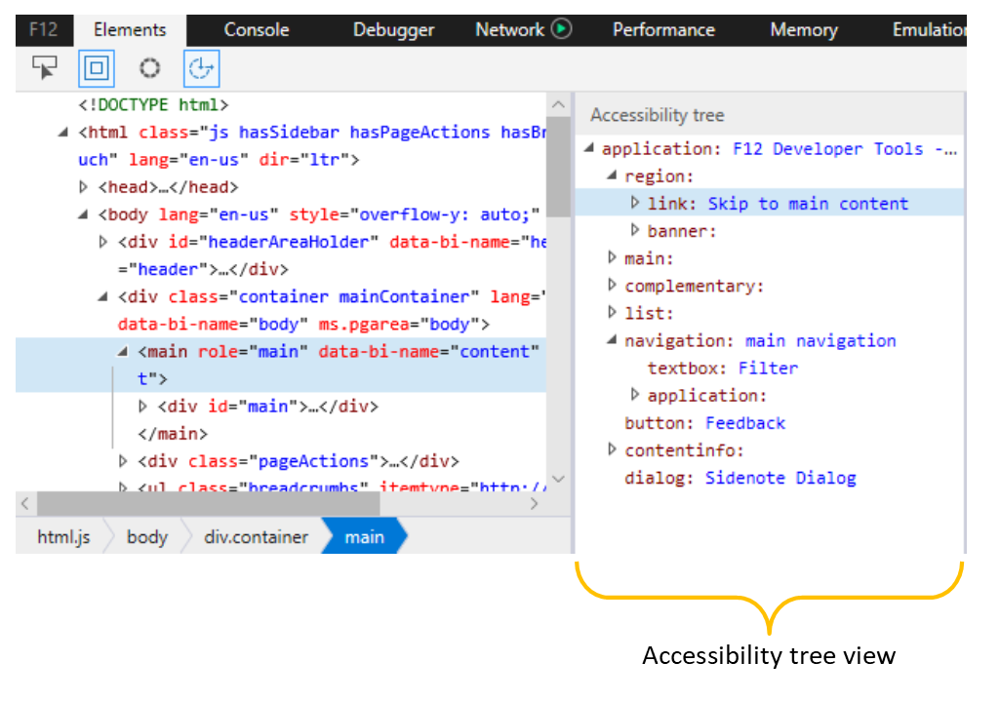

# Accessibility
View the accessible properties assigned to the selected element. Hover over any of the property names for a description of how its used by assistive technologies. You can also right-click any property to copy its value to the clipboard.

Its useful to open the [Accessibility tree](#accessibility-tree) to navigate around your page as a screenreader would, and then use the *Accessibility* pane to inspect details about accessibility properties of interest.

## Accessibility tree
The **Accessibility tree** pane shows the structure of your page as it would appear to an assistive technology, such as the [Windows Narrator](https://support.microsoft.com/en-us/help/22798/windows-10-narrator-get-started) screenreader.

Clicking on a node in the tree view will also select it in the [**HTML tree**](../elements.md#html-tree-view), and vice-versa. Selecting an accessible element from either the *HTML* or *Accessibility* tree views will also populate further accessibility property details in the [**Accessibility**](#accessibility) tool pane. 

Here are further resources on [Accessibility with Microsoft Edge](../../accessibility.md).