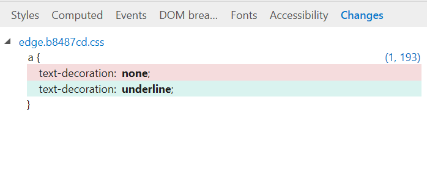

# Changes
View the CSS changes you made during your F12 DevTools diagnostic session (from the [Styles](./styles.md) and [Computed](./computed.md) CSS editing panes). Similar to the conventions of other diffing tools, deleted lines appear in red and added lines are green.

You can also (from the right-click context menu) copy  your changes to the clipboard, revert your changes, or jump to their source location.