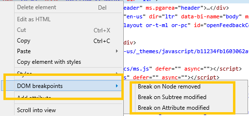
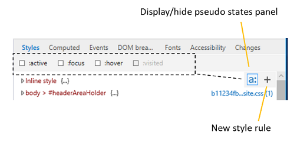

# DOM breakpoints

Manage your DOM mutation breakpoints from this pane, including disabling, deleting and rebinding them.

You can use DOM mutation breakpoints to break into the debugger whenever a selected element node changes. This is helpful for tracking down the code responsible for causing visual glitches with your UI. 

To set a DOM breakpoint, right-click on any element in the **Elements** panel *HTML tree view* to open the context menu.

You can set any of the following breakpoints:

 - **Break on Node removed**: Break into the debugger when the selected element is removed from the document (DOM tree).

 - **Break on Subtree modified**: Break into the debugger when any of the descendants of the selected element are changed (added, removed, or their subtrees are modified). This will not break when attributes are modified (see the next option for that).

 - **Break on Attribute modified**: Break into the debugger when an attribute of the selected element is added, removed or changed in value.

The **DOM breakpoints** pane will then list the selected element (by generating a selector describing its location in the DOM) and the types of breakpoints you have set (*Node removed, Subtree modified, Attribute modified*). From here, you can also *rebind*, *disable*, or *delete* your breakpoints, individually (from the rt-click context menu) or all at once (using the buttons).

When the page is reloaded or the DevTools are closed and reopened, F12 DevTools will attempt to rebind your breakpoints to their associated elements. If there are no elements to match the selector, you can wait to rebind the element manually (using the **Rebind breakpoint** button and/or context menu option) once a corresponding element appears in the DOM (and the breakpoint icon no longer shows the warning indicator).

In addition to this *DOM breakpoints* pane, you can also manage your [DOM breakpoints](../debugger.md#dom-breakpoints) from within the **Debugger**.
