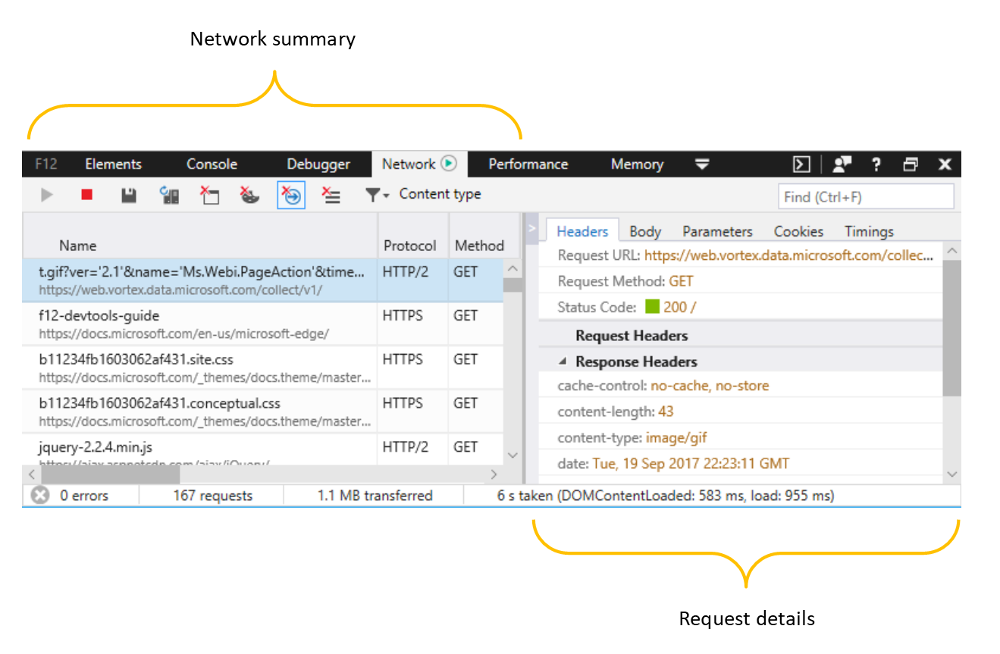
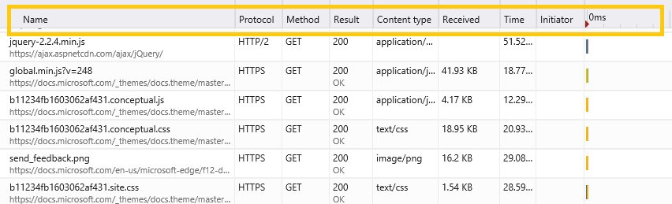
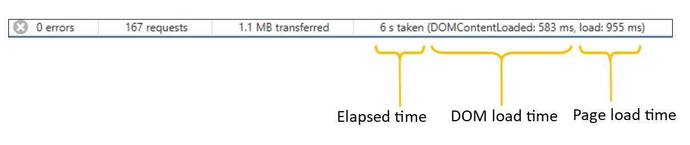

# Network

Use the **Network** panel to monitor and profile the requests and responses sent over the wire. With it, you can:

 - (#network-summary) toolbar
 - (#network-summary) list
 - (#network-summary) summary
 - (#request-details) headers
 - (#request-details) body
 - (#request-details) parameters
 - (#request-details) cookies
 - (#request-details) timings

 ## Network summary

When you open F12 DevTools, network profiling is turned on by default. All the network traffic from your active browser tab is recorded in the network profiler list, even while you are working in a different F12 DevTools panel than *Network*.

### Toolbar

The toolbar provides controls for profiling and filtering the network activity of your page. 

1. **Start / Stop profiling session**: By default, network profiling is turned on, and network traffic will be logged in the [**Network profiler**](#network-profiler) list. You can turn off network capture with the **Stop** (`Ctrl+E`) button.

2. **Export as HAR**: You can save the current network profiling session (`Ctrl+S`) as a JSON-formatted [HTTP Archive (HAR)](https://dvcs.w3.org/hg/webperf/raw-file/tip/specs/HAR/Overview.html) file. 

3. **Content type filter**: Filter the network request list by specific content requests (*Documents, Style sheets, Images, Scripts, Media, Fonts, XHR, Other*). By default all content types are shown.

4. **Find**: Filter (`Ctrl+F`) the network request list by entry names (resource paths) containing a specified search string.

5. **Always refresh from server**: Depressing this button will force page resources to load from the network rather than the browser cache. You can also refresh the page from  network by pressing `Ctrl+F5`.

6. Clear buttons

   - **Clear cache**: Removes all resources stored in the browser cache.
   - **Clear cookies**: Removes all cookies stored in the browser.
   - **Clear entries on navigate**: Recorded traffic is cleared upon page navigation. This is turned on by default.
   - **Clear session**: Clears all network request entries from the **Network request list**.

### Network request list

All network traffic is recorded to a list (until cleared upon navigation, manually cleared, or F12 DevTools are closed). Clicking on any entry will open a more [detailed view of the request](#request-details).

The network request list includes the following info: 

Column | Description 
:------------ | :------------- 
**Name** | Name and URL path of the request
**Protocol** |	Type of protocol for the request
**Method** |	HTTP method used for the request
**Result** |	HTTP status code
**Content type** |	Request type
**Received** | Total size of the response as delivered by the server
**Time** |	Total time taken to load the response
**Initiator** |	Subsystem responsible for initiating the request (such as *Parser, Redirect, Script, Other*)
**Timeline** | Visual timeline for the network events of the request (such as *Stalled, Resolving(DNS), Connecting(TCP), SSL, Sending, Waiting(TTFB), Downloading*). See [Timings](#timings) for more details.

 ### Summary bar

The bar at the bottom of **Network** panel summarizes the total number of HTTP network errors, requests, data transfered, and load times during the network profiling session (i.e., since F12 DevTools were opened and recording network traffic).

**Elapsed time** means the time between the start of the profiling session and when the last resource was downloaded from the network. Resources fetched from the browser cache do not accrue time to this number. 

**DOM load time** means the time between the start of the profiling session and when the [DOMContentLoaded](https://developer.mozilla.org/en-US/docs/Web/Events/DOMContentLoaded) event was fired to indicate that the structure of the page document has been loaded and parsed (though not necessarily any stylesheets, images or subframes).

**Page load time** time means the time between the start of the profiling session and when the [load](https://developer.mozilla.org/en-US/docs/Web/Events/load) event was fired to indicate that the page document (and all its resources) has been fully loaded.

 ## Request details

 ### Headers
Displays the request headers that are sent to the server and the response headers received from the server.

 ### Body
Indicates the body data sent to and received from the server. If the response data is an image, the image is shown. If the response is binary, a link to save the content to disk is shown. Otherwise, the response text is shown in a scrollable text area.

 ### Parameters
The query string parameters of GET requests. While POST requests put the parameters in the headers, GET requests include them in the URL. They're broken out here for easier reading.

 ### Cookies
Indicates the cookies that are sent or received. There are eight columns in the Cookies tab. 

Column header |	Details
:------------ | :------------- 
**Direction**  |	The cookie that is sent or received.	
**Key**  |	The identifier of the Key-Value pair.	
**Value**  |	The value of the Key-Value pair.	
**Expires**  |	The cookie expiry date.	
**Domain**  |	The cookie domain.	
**Path**  |	The cookie path.	
**Secure**  |	Indicates if the cookie is accessible only through Secure Hypertext Transfer Protocol (HTTPS) connections.	
**HTTP Only**  |	Indicates if the cookie is accessible only through HTTP (not JavaScript). </table>

 ### Timings
Lists events and their corresponding times that are relevant to the request. The timing info is displayed as table and a graphical timeline. The following events are captured: Wait, Start, Request, Response, Gap, DOMContentLoaded, and Load. Clicking an event in the table or the timeline highlights it and shows an explanation of the event type.

 ## Shortcuts

 Action | Shortcut
:------------ | :-------------
Start / Stop profiling session  | `Ctrl` + `E`
Export as HAR | `Ctrl` + `S`
Find | `Ctrl` + `F`
Copy | `Ctrl` + `C`
